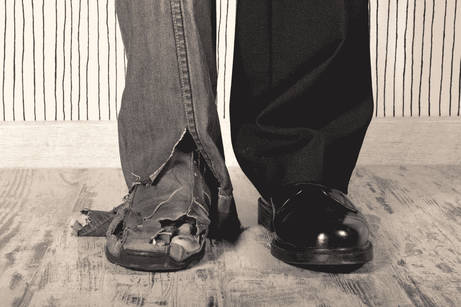

# 我父亲创建了一个价值数百万的企业:我学到的 8 个教训

> 原文：<https://medium.datadriveninvestor.com/my-father-created-a-business-worth-millions-7-lessons-ive-learnt-18fc065b2c6e?source=collection_archive---------10----------------------->

*从贫穷到富有*

Dare and Conquer

# 这是一个梦想，它成为一个愿景，并演变成一个使命。

我父亲 22 岁时，从土耳其移民到德国。他**第一次踏上德国土地时一无所有**，但凭着心中的**愿景、勤奋、坚毅、**和尝试的**勇气，他将自己的**梦想/愿景**变成了**现实**。**

这是我从他身上学到的 8 条经验:

1.  **如果你能梦想，你就能做到:**这是我看过很多的一句话，但我的父亲是**我的活生生的例子**这句话。当我父亲从土耳其移民到德国时，除了他的梦想 T21，他一无所有。他的梦想是制造机器。他不会说德语，对他将要生活 40 年的国家一无所知。他带着**无语**和**兜里没钱**走了，但他心里有一个**大梦想**。每个人都嘲笑他的梦想。“你不会成功的”，他们对他说。但是他**给每个评论家**上了一堂**课**。今天，他实现了制造机器和拥有价值数百万美元的企业的梦想。
2.  你做任何事情的方式就是你做任何事情的方式:我父亲的第一份工作是在他最好的朋友的农舍里。他会清理猪圈的粪便。他**并不**认为**自己太适合这个工作**。他会尽全力去做。它总是关于你对某件事的态度，这件事要么让你成功，要么让你失败。他教我永远不要半心半意地做任何工作。他总是对我说: ***“要想成功，就得做自己讨厌的事，这样才能做自己喜欢的事”*** 。我父亲热爱他所做的事情，这就是为什么他的事业蒸蒸日上。
3.  不妥协的职业道德:为了让**收支平衡**，我父亲会同时做**很多工作**。他清理了德国富人的房子。当他的德语学得足够好时，他会**填写**所得税申报表，他会**送报纸**，他会**出售**缝纫机。我记得他有时会一天工作 16 个小时。我几乎见不到他，但这是值得的。他拥有一家他 22 岁时梦想的公司。
4.  不可动摇的信念:每次谈到自己的成功之路，他都会说:“我就知道有一天我会成功的。”相信自己是大多数人认为幼稚的事情，但我父亲不只是相信。他疯狂地工作着。他过去和现在都有一种永不枯竭的动力，这是我一直钦佩的。他没有周末**和无休止的夜班**，作为一个家庭，我们会抱怨很多(有时仍然如此)；但是回过头来看，所有这些**牺牲都有了结果，都是值得的。******
5.  ******管好自己的事:** *永远不要看别人做什么*。我父亲是最后一个移民到德国的人。他的亲戚已经在那里住了很多年，所以他们比我爸爸在 T42 过得更好。最终，他们有了更多的奢侈品。每个人都有电视、暖气和汽车，但我们没有。我们的公寓里甚至没有浴室(我们必须走出前门，上楼去上厕所)。我爸爸对此感到难过，但他会说他永远不会因为每个人都做某件事就去做。*“我看我的生活，我的境遇，还有我的钱包！他会说，我过上最美好生活的时候会到来。*****
6.  ****文凭不等于成功: *世界上没有文凭能保证你成功。我父亲 T4 从未上过大学，但他是我认识的最成功的人之一。他的梦想是制造机器，但他从未有机会学习工程学。他可能不是工程师，但他让工程师为他工作。他有**想法**，有**诀窍**，有**愿景**，他的工程师们让其他事情都发生了。在我十几岁的时候，当我不知道我父亲的成功时，我认为成功是一张文凭可以保证的事情。我大错特错了！在这一课中，我的父亲是我最好的榜样，但是你们知道很多大学辍学者，比尔·盖茨、史蒂夫·乔布斯、奥普拉、马克·扎克伯格、艾伦·德杰尼勒斯，他们都非常成功。它是关于你拥有的视野，而不是一张确认你教育状况的纸。*****
7.  ****无论如何都要去做:我父亲讨厌旅行，但他还是去做了。他讨厌参加那么多的商务旅行，但他还是去了。如果你有梦想，没有借口，没有糟糕的一天，没有失败会让你质疑自己的所作所为。如果你的 ***为什么*** 是**不够强大**，每一次失败，每一个借口都强大到**让你退出**。我父亲确切地知道*他为什么做他所做的事。*****
8.  *****尝试的勇气:在制造机器并实现他的梦想之前，我父亲尝试了许多不同的事情，但都没有如他所愿。在旅途中，他甚至失去了很多钱，但他从未放弃。他**尝试又失败**，一次又一次尝试又失败**。谈到生意，他总是有正确的思维方式。他的哲学是:“如果你不愿意尝试和失败，你永远不会进步或成功。”*******

*******希望你也能为自己找到一些有价值的教训。*******

*******感谢阅读:-)。*******

*******哈蒂斯*******