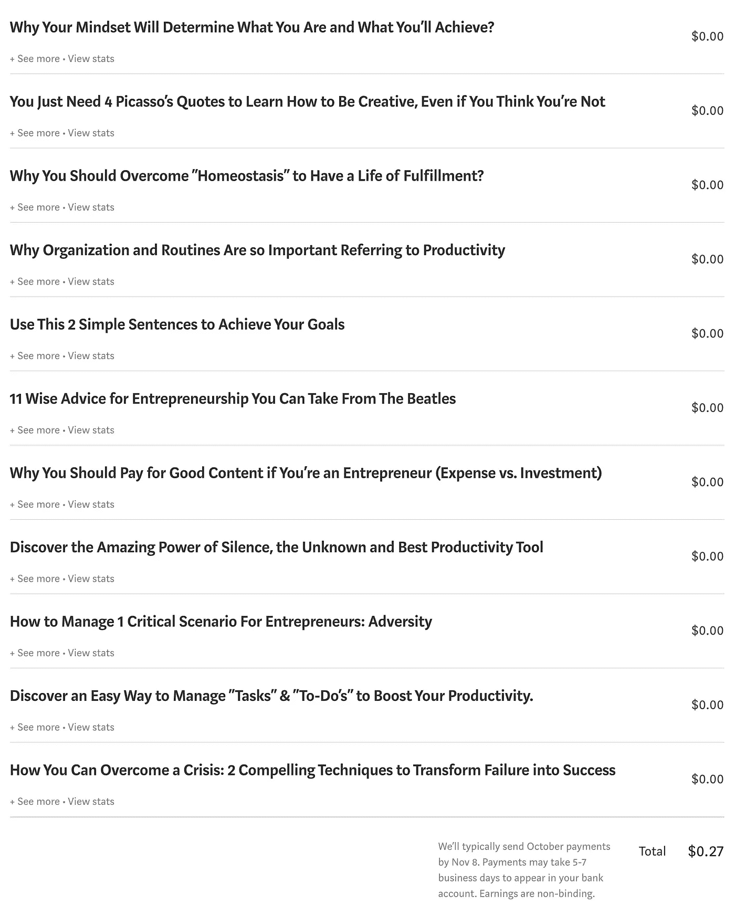
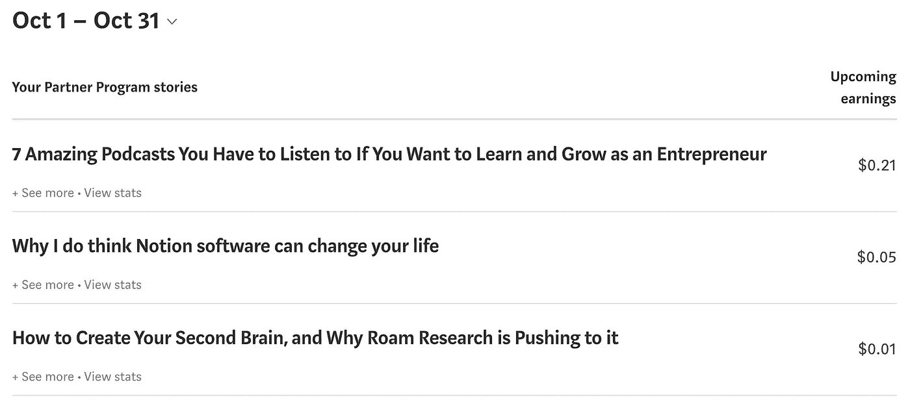
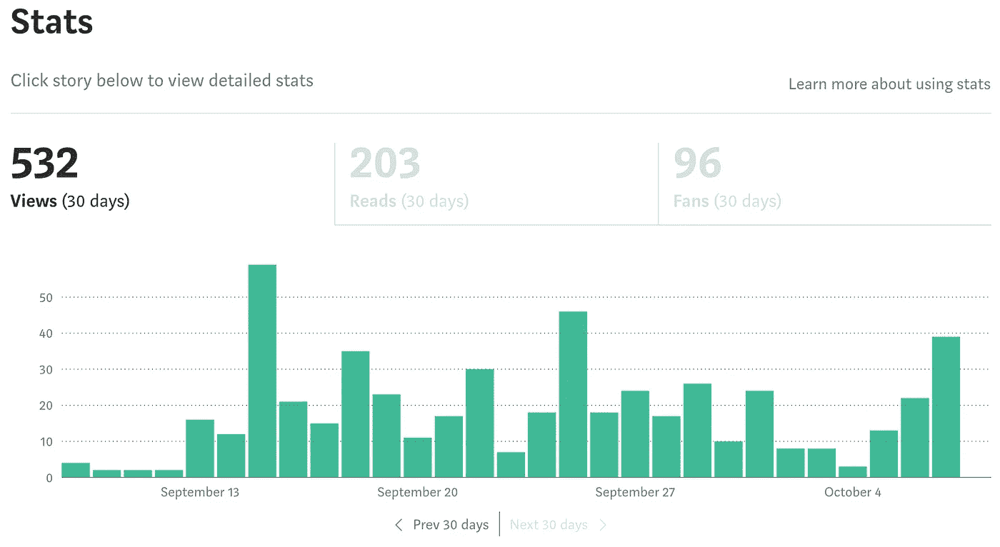

# 我在 Medium 上的第一笔 0.27 美元收入。你是企业家吗？永远不要忽视这些重要的里程碑！

> 原文：<https://medium.datadriveninvestor.com/my-first-0-27-earnings-on-medium-are-you-an-entrepreneur-never-neglect-these-vital-milestones-8253aae0df31?source=collection_archive---------26----------------------->

## 它们是成功的关键

Photo by [Aline de Nadai](https://unsplash.com/@alinedenadai?utm_source=unsplash&utm_medium=referral&utm_content=creditCopyText) on [Unsplash](https://unsplash.com/s/photos/goal-achievement?utm_source=unsplash&utm_medium=referral&utm_content=creditCopyText)

# 我把我的生活建立在目标实现的基础上。

我认为这是开启充实生活之路的关键，它不可避免地以我们都在寻求的幸福感而告终。

> 如果我们在街上问任何人他想成为什么，答案是“快乐”。当我们问任何父母他们希望他们的孩子有什么时，“幸福”再次成为答案。他们从来不说“富有”、“强壮”、“高大”、“美丽”或“聪明”。

这是一件奇怪的事情…

古代的哲学家一生都在疑惑幸福的意义，你可以找到各种各样的答案。

对我来说，**“目标达成”是对的。**

*   那个让我的生活有意义的人。
*   激励我做事，将分散的目标转化为日常行动项目，将我带向我在脑海中创造的命运。
*   带我去感受幸福的人是如此美好和渴望。

我决定开始用媒介写作，因为写作是我一生的梦想。我喜欢它。迟早，你应该开始为你的梦想而努力。除了你没有人会做这件事。

正如我在这篇文章的标题中所说的，我今天已经在 Medium 上赚到了我的第一个 27 美分。

“The irrefutable evidence” — Photo by Author

> 我猜这对你来说没什么意义(我希望并祝愿你的生活中有比这个“愚蠢”的问题更令人兴奋的事情)，但我想分享一个想法，我会努力对你有用。

“The 3 culprits” — Photo by Author

我从来不想浪费人们的时间，而你，作为一个读者，值得我所有的尊重(和感激)，仅仅因为你读了像我这样一个普通人能告诉你的东西。

这就是为什么我总是试图分享有用和务实的想法、想法、行为和对我至关重要的东西，当然，这对我很有用。

让我们开始吧！

 [## 不见面就做交易？风投和企业家的 5 个指南|数据驱动…

### 自从 covid 六个月前登陆美国以来，全球的风险投资家和企业家都不得不适应新的现实…

www.datadriveninvestor.com](https://www.datadriveninvestor.com/2020/09/20/doing-deals-without-meeting-in-person-5-guidelines-for-vcs-and-entrepreneurs/) 

2020 年 9 月 8 日开始在 Medium 上写作。是的，就在一个月前。

过去几周，我创建了一个银行账户，就像生活中经常发生的那样，没有什么是容易的。我出了点事，耽误了整个过程。

最后，就像通常发生的一样(仅仅是时间的流逝用来解决生活中的一切)，我在几天前激活了我的账户。

> 我加入了 MPP(中型合作伙伴计划),并通过 Stripe 连接了我的“受损”银行帐户。成功了！感谢中，感谢条纹，为什么不，感谢“亲爱的”银行！

然后我把我所有的文章(22 篇)都移到了 Medium 的付费墙后面。

> 我只需要等待…我们这些新手是多么的天真…

以防你像我一样是个新手，这些是我 30 天的数据。

“My first month’s stats” — Photo by Author

感谢两家刊物对我的关照:[创新](https://medium.com/u/9527aff174ba?source=post_page-----8253aae0df31--------------------------------)(感谢，[埃萨特阿图格](https://medium.com/u/98075caf09f?source=post_page-----8253aae0df31--------------------------------))和[数据驱动投资人](https://medium.com/u/de42e9af1960?source=post_page-----8253aae0df31--------------------------------)(感谢，[陈良](https://medium.com/u/82fff5e79458?source=post_page-----8253aae0df31--------------------------------)和[伊尔沙德艾哈迈德](https://medium.com/u/e31842601383?source=post_page-----8253aae0df31--------------------------------))。令人印象深刻的是，这两个出版物正在帮助新作家“传播我们的话语”。

**两天后的今天，钟声响起。**

# 一共是 27 美分。

这种感觉把我带回了大约 20 年前，当时我在自己创建的第一家公司出售了我的第一项服务。这是一项 2 小时的空中小姐服务:50 欧元。

> 20 年后，当我们拥有 3 家不同的企业，40 多名员工，每年产生 7 位数的收入时，这听起来可能很滑稽。

但事实并非如此。

> 如你所见，我仍然记得那 50 欧元。

它们是一切的开始，主要是因为在此之前，我已经连续工作了 6 个月，每天工作 16 个小时，却没有挣到一分钱。

我几乎在考虑离开我的项目，开始在任何其他公司寻找新的工作。我的“企业家精神”实际上已经死亡。

> 这就是为什么，作为一个企业家，你不应该忽视这些时刻。

这些里程碑是美丽的，激励人心的，重要的。如果你只关注钱，它们比你想象的要重要得多。

> 金钱本身永远不应该是目标。钱是努力工作、坚韧不拔的结果，主要是，嗯，在正确的方向上，倾听市场，每天都在进步，一步一步变得更好。

如果你这样做了，钱会来的只是时间问题。

钱只是你表现如何的一个 KPI(关键绩效指标)。不要“关注”它。它与客户满意度、产品质量或你可能想到的任何其他东西处于同一水平。

> 无论何时你收到任何人的付款，这意味着你给市场带来了真正的附加值，不管这个数字有多大。

如果有人为你的产品或服务支付一分钱，这意味着它是值得的。尤其是在这个时代，你似乎可以免费拥有一切。

# 那 27 美分就是这个意思。

现在，我可能会连续三年每个月只赚那么多钱，但这并不重要。

总有一天，事情会成功的。

> 如果你继续工作，注意改变你做事的方式，学习，询问那些知道故事如何发展的人，阅读，完善你的过程，多样化，培训，分享…你可以做很多事情，最终取得成功。

> 长期总是有回报的。

这就是我的动力。在路上，你会进步，你会成长，你会变得更好。

我们通常不是傻瓜。

迟早，我们会学会如何做事。只是时间问题。如果你有长期的心态，时间总是站在你这边的。

> “我无知但不傻，这样才能学习。”
> 
> ——杰弗里·麦道夫。

所以，如果你是一个企业家，请注意市场向你发出的这些小信号。它们是你表现的指标。

他们会告诉你方向是否正确。如果你的产品或服务被要求、被需要或被重视。

> 关注这些信号就是你如何计划你的动作，如何设计你的策略，如何实施它，以及如何采取行动。

# 行动意味着运动。

如果你朝着正确的方向前进，成功会在路的尽头等着你。每天集中精力做正确的事情，不要停下来。

继续测试。不断进步。继续成长。

最后但同样重要的是:**享受你的旅程**。那是真正的自我实现所在，也是你会找到幸福的地方。

所有这些，只需要 27 美分。

## 获得专家视图— [订阅 DDI 英特尔](https://datadriveninvestor.com/ddi-intel)