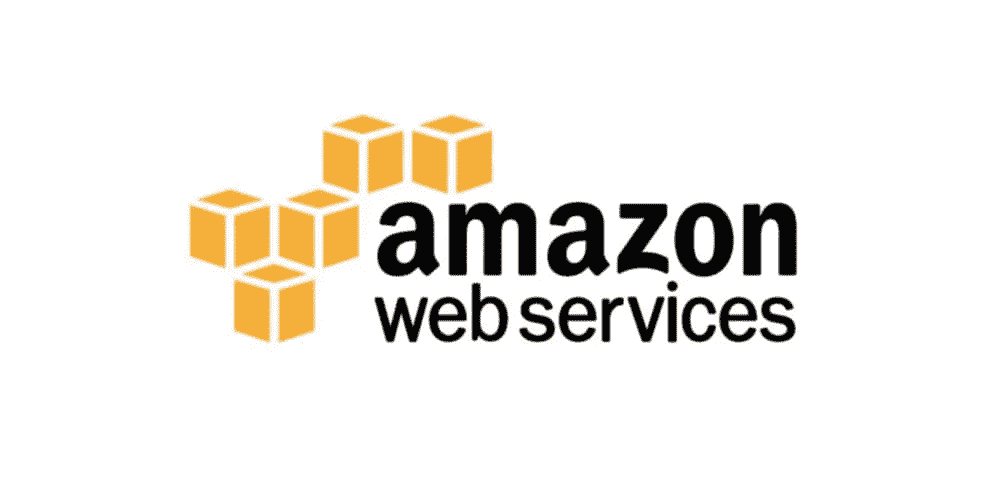
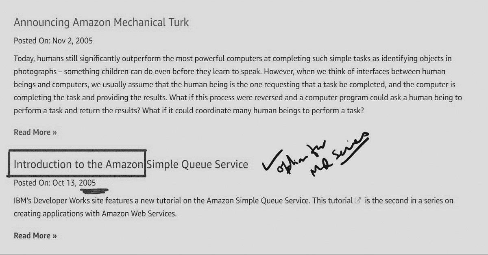

# 我第一次接触 AWS 云

> 原文：<https://medium.datadriveninvestor.com/my-first-date-with-cloud-e237aa8f8d7e?source=collection_archive---------6----------------------->

## 我的故事我是如何在 2006 年偶然接触到云的

# 只需要一件事就能改变我们的方向。这发生在我身上，我只见过一个人，我称他为真正的疯子。

Amazon Web Services (AWS)

> 最好的人经常在最奇怪的地方遇见

那是 2006 年的圣诞节，我在一家美国汽车工业公司为 EMEA 公司工作。在一个相当大的计划中，我们必须集成不同国家的几个关键业务流程系统。

领导团队、业务和 IT 团队都在现场。它采用新技术实现比利时、法国、英国和美国系统的实时集成。

在我们的第一次试播中，我们遇到了一个主要的路障。由于这项技术是新的，而且是一项创新，因此也没有多少成功的故事。由于集成不同技术的两个不同组织的异构性，我们在比利时和英国的两个系统引起了业务问题。系统不可靠，经常停机，所以我们的关联收入

我们在步行，把一切弄清楚。

在我的团队中，我们有一个实习生，他也是仓库团队中职位最低的人。他几乎没有一个月的全部经验。

在一次讨论中，实习生被要求为入口做手工数据。我忘不了午餐时间他来找我，彬彬有礼地说“为什么不把我们的系统分成几部分，加入美国的大系统”
搞什么鬼！我忽略了。IT 系统是我最不想和没有商业知识或技术的人讨论的。

第二天，他重复了同样的话。他很坚定地给了我一张印有他笔迹的纸。

***“有一家名为“亚马逊”的公司将系统安装到位。”***

我就是这样被介绍有云的！这次相遇在项目的后期和我的职业生涯中带来了更大的成功。从 2006 年到今天，我一直在使用 AWS，我从来没有停下来向任何需要帮助的人解释它。

欢迎来到云端。

 [## LinkedIn 上的 satyen Kumar:# get hired # technology # Jobs | 17 条评论

### 我只见过一个我称之为真正疯狂的人。那是 2006 年，圣诞节——一个被淹没的圣诞节！在商业活动中…

www.linkedin.com](https://www.linkedin.com/posts/sayten_gethired-technology-jobs-activity-6702052932973559808-TAHn) 

𝗖𝗟𝗢𝗨𝗗𝗶𝘀𝘁𝗵𝗲𝗳𝘂𝘁𝘂𝗿𝗲
𝘐𝘯𝘵𝘳𝘰𝘥𝘶𝘤𝘦𝘊𝘭𝘰𝘶𝘥𝘵𝘰𝘺𝘰𝘶𝘳𝘵𝘦𝘦𝘯𝘢𝘨𝘦𝘳𝘴𝘰𝘳𝘵𝘰𝘺𝘰𝘶𝘳𝘴𝘦𝘭𝘧.在 Wipro Limited，我们正在改变企业体验云的方式

 [## 通过我的推荐链接加入 Medium-Satyen Kumar

### 作为一个媒体会员，你的会员费的一部分会给你阅读的作家，你可以完全接触到每一个故事…

satyenkumar.medium.com](https://satyenkumar.medium.com/membership)