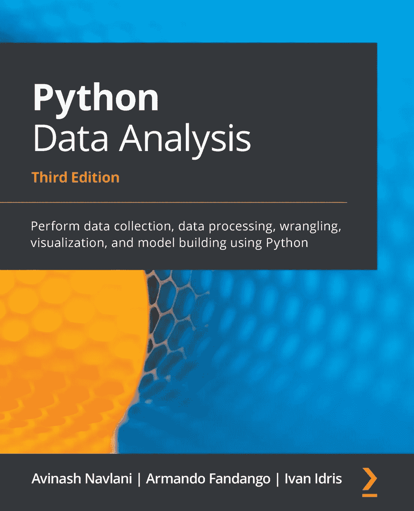

# 我写数据科学书籍的第一次经历

> 原文：<https://medium.datadriveninvestor.com/my-first-experience-of-writing-a-data-science-book-9334908e10ab?source=collection_archive---------18----------------------->

查看我的第一本书写作经历( [Python 数据分析，第三版](https://www.amazon.com/gp/mpc/A2YIXWQG8DNPYU))并获得预购折扣券。

[https://www.amazon.com/gp/mpc/A2YIXWQG8DNPYU](https://www.amazon.com/gp/mpc/A2YIXWQG8DNPYU)

# 我的工作经历对我有什么帮助？

写一本技术书籍需要对该学科所有主题的概念有非常清楚的了解。幸运的是，就我而言，我在研究、学术界和工业界的经历对我帮助很大。我的研究经历教会了我如何写研究论文，我的教学经历帮助我如何简单易懂地解释事情。我的行业经验帮助我学会了如何用数据科学知识解决行业问题。这种不同体验的整体组合将使我的书更具优势，因为它拥有个人在开始数据科学之旅时需要知道的一切。

# 使用 publisher 的经验

如果说从 Packt 来的出版团队，整个团队都很牛逼。他们总是在我身边，给我 100%的支持。我要特别感谢他们，因为没有他们不断的反馈和建议是不可能的。

# 我的奋斗

这个过程中的主要斗争是每天投入 2 小时，全力以赴地写作、编码、设计图片、开发示例，并持续跟踪一年的变化。这整个过程包括大量的思考、分析，以及将多件事情放在一起。这次旅行令人紧张。除了写作，在数据科学书籍中放什么也是一个挑战。设计一个初始大纲，并在发布时使其相关，因为这个数据科学世界正在快速变化，每天我们都在获得一些新的工具和 python 库。

# 写这本书时我记在心里的事情

*   这本书的大部分内容要么只触及皮毛，要么太难理解其中的概念。所以我确保它从零开始，并逐渐将读者的学习曲线提升到一个更高的水平。
*   简单明了的机器学习概念解释。
*   它应该有足够的例子来解释数据科学和机器学习概念。
*   此外，提供分析数据的实践机会。
*   技术书籍本质上是冗长乏味的，所以我需要在不损害概念知识的情况下保持节奏。
*   这本书应该组织良好，结构严谨。这将有助于吸引读者。

# 最终的出版草案

但是当你看到你最终完成的草稿时，你会忘记写作过程中所面临的所有问题和困难。当你看到来自你所爱的人、学生的最美好的祝愿，以及来自读者的不断的评论，它会给你巨大的快乐和满足。最后，它鼓励并激励你继续前进，继续写作。

我希望这能启发你写你自己的数据科学书籍，那些已经写了技术书籍的人可以与我的经验相关联。如果你想开始你的数据科学之旅，那么这本书很适合你，因为它可以帮助你使用 Python 进行数据收集、数据处理、辩论、可视化和模型构建。

感谢你阅读这篇文章，如果你想购买我的书，这里是预购折扣链接:[https://www.amazon.com/gp/mpc/A2YIXWQG8DNPYU](https://www.amazon.com/gp/mpc/A2YIXWQG8DNPYU)

折扣代码:25AN(有效期至 2 月 14 日)

在 Linkedin 上联系我:[T3【https://www.linkedin.com/in/avinash-navlani/】](https://www.linkedin.com/in/avinash-navlani/)

最新文章请访问:[https://machinelearninggeek.com/](https://machinelearninggeek.com/)