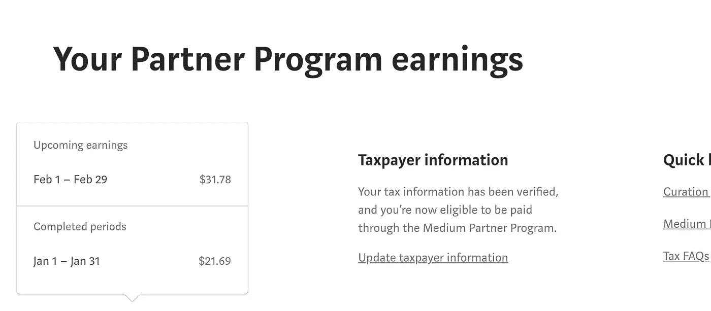
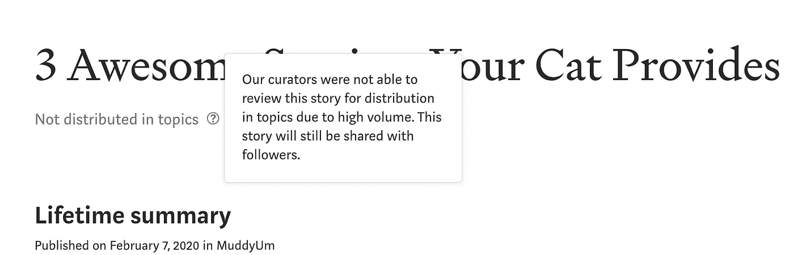
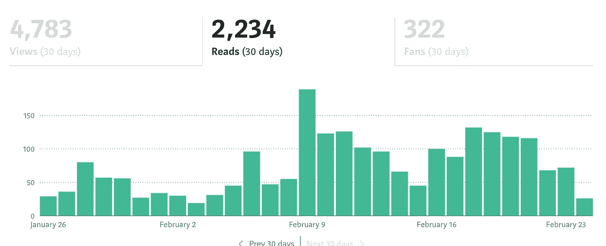
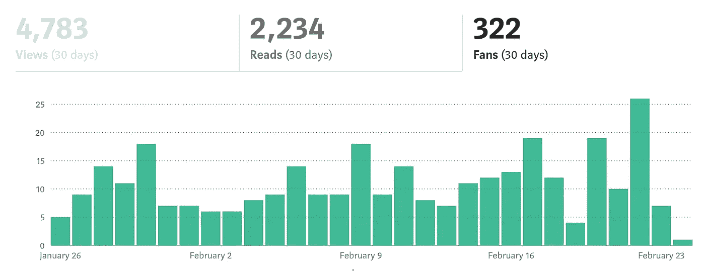

# 我在 Medium 的第一个月以 53 美元、另类统计和监管监狱结束

> 原文：<https://medium.datadriveninvestor.com/my-first-month-on-medium-ended-with-53-alternative-statistics-and-curation-jail-a10dd88e6c38?source=collection_archive---------2----------------------->

## 我在 2020 年 1 月 22 日发布了我的第一个故事，以下是之后发生的事情。

Photo by [Daria Nepriakhina](https://unsplash.com/@epicantus?utm_source=medium&utm_medium=referral) on [Unsplash](https://unsplash.com?utm_source=medium&utm_medium=referral)

2020 年 1 月 22 日，我在 Medium 上撰写并自行发表了第一篇文章。一个月后，在 2 月 21 日，我赚了 53，47 美元。
对于一个新手来说，这是个不错的数字。

Own pic, obviously

# 高调收场:监管监狱

但是我的兴奋被我在第一个月的最后一天被关进监管监狱的事实浇灭了。我为什么在那里着陆？完全不知道。

*   我严格遵守策展规则。
*   我的一个帖子是在 20 号入狱前一天策划的，所以媒体编辑会认为我写的是关于相关内容的像样的帖子。
*   我的帖子大部分都加到了大中型刊物上。

尽管如此，我还是收到了每个媒体作家都害怕的信息，媒体的冠状病毒:

my pic

> “由于数量太大，我们的策展人无法审查这个故事以进行主题分发。”

有传言说，媒体编辑现在不会审查我的任何帖子，直到…嗯...我不太确定。再发一个帖子(5 个帖子？20 个帖子？)在大型刊物上？发布 100 篇优秀帖子？我不知道。

 [## 精疲力竭耗尽了简单的答案|数据驱动的投资者

### “大多数卫生专业人员知道如何照顾病人，但不知道如何照顾自己。”医疗保健…

www.datadriveninvestor.com](https://www.datadriveninvestor.com/2019/01/15/burnout-exhausts-easy-answers/) 

谣言滋生妄想症，所以我想知道我是否因为敢于在脸书上抱怨，并在给媒体团队的电子邮件中抱怨缓慢的策展过程而被关进策展监狱。监管监狱可能是也可能不是对直言不讳的报复。但这只是 Medium 在更透明的监管系统下会做得更好的原因之一。

更新:我在同一天发表的另一篇文章分为两个主题。
这是什么意思？大概是*而不是*我做了一些不同的事情，突然被释放出狱。更有可能的是，当提交量*非常高*时，Medium 的编辑也使用短语“由于高量”,并且他们没有抽出时间来看你的帖子，而你的帖子现在已经两周了。因为旧帖子不会出现在媒体网页、电子邮件和其他媒体发布渠道的顶部，所以管理旧帖子可能没有什么意义。因此，过一段时间后，媒体编辑可能会不看邮报就放过它。

也就是说，我的一些旧帖子已经在我发布后的几周内被策划在第二个主题中，并且在它们被策划在一个主题中之后。我听说过一些帖子在发布几个月后就被策划了。再一次，在媒介上策展的奥秘。

# 常规统计和替代统计

我从 0 个追随者开始，到 2 月 21 日已经有了 247 个追随者。

我写了 **18** 个帖子。

8 个帖子被**策划**，其中 4 个策划发生在 1 月的 10 天，另外 4 个发生在 2 月的 21 天。

我最短的帖子是一分钟阅读(一首诗，仍在处理中，但因为我在策展监狱，我预计它很快会变成“未策展”)，我最长的帖子是 12 分钟阅读(未策展)。

**在**刊物上发表了 16 篇**帖子。** 100 关注者以下刊物 3 篇，
2-3k 关注者酒馆 3 篇，
4 篇，4-6k 关注者酒馆 4 篇，
10k-30k 关注者酒馆 2 篇，
100-200k 关注者酒馆 1 篇，
500k 关注者以上刊物 3 篇。没有一篇发表在中型出版物上——我没有耐心等两个星期左右。

**4 个**帖子被**策划**在**两个不同的话题**中，4 个帖子被策划在一个话题中。
以下是我策划的帖子的主题:
语言 2、
幽默 1、
宠物 1、
心理健康 1、
写作 2、
教育 1、
女性 1、
哲学 1、
创造力 1。这是一个折衷的组合，但它是有意义的，因为我写了各种各样的东西。我还没准备好定位它。

# 排名前三的帖子

这些是我在**视图**中看到的前三篇帖子:

 [## 5 个令人捧腹的德语习语及其令人惊讶的含义

### 英语中有一些令人愉快的令人费解的习语。一个简单的任务是一片甜点——一块蛋糕；一个…

medium.com](https://medium.com/the-haven/5-hilarious-german-idioms-and-their-surprising-meanings-dca2916cf569)  [## 我在为失去宠物而悲伤时学到的 5 个教训

### 悲伤以一种其他方式无法打开你的心扉

medium.com](https://medium.com/tenderlymag/5-lessons-i-learned-while-grieving-the-loss-of-my-pet-3b403bfa3fc5)  [## 用这 7 个难以发音的德语单词来折磨你的朋友

### 每年的这个时候——太冷太暗，大自然一片死寂。我们需要一些能让我们振作起来的东西，甚至是…

medium.com](https://medium.com/the-haven/torture-your-friends-with-these-7-hard-to-pronounce-german-words-f98a05e5c7b9) 

帖子 1 的浏览量刚刚超过 700 次，几乎是帖子 3 的两倍。
**三个**帖子都是**策划**并在**中型酒馆**发布的。这三本书都是在一月的最后十天写的。

看着**上写着**，第一名和第二名和上面一样，但是这个排在第三名:

 [## 在早晨的第一个小时做这 5 件事

### 简单而有效的方法来充分利用一天中宝贵的第一个小时。

medium.com](https://medium.com/swlh/do-these-5-things-during-the-first-hour-of-your-morning-b948a6dbba2d) 

my own picture

我今天才拍的截图，所以没有显示我的第一个月，也就是 1 月 22 日到 2 月 21 日。但是在最初的几天没有发生什么大的事情，所以数字非常接近。

拥有最高**读者阅读率**的帖子是:

 [## 当你情绪低落时，能让你立刻感觉好起来的 5 件事

### 今天情绪低落吗？以下是一些不需要脑细胞或意志就能自我提升的事情。

medium.com](https://medium.com/invisible-illness/5-things-that-will-instantly-make-you-feel-better-when-youre-down-6d9a075bd972)  [## 在早晨的第一个小时做这 5 件事

### 简单而有效的方法来充分利用一天中宝贵的第一个小时。

medium.com](https://medium.com/swlh/do-these-5-things-during-the-first-hour-of-your-morning-b948a6dbba2d)  [## 您的猫提供的 3 项出色服务

### 放松放松。凯蒂是来帮忙的。

medium.com](https://medium.com/muddyum/3-awesome-services-your-cat-provides-6a55c0f1e34f) 

这些人中没有一个是由 T2 策划的。最后一个是没有用“由于高音量”策展的帖子——注意——通知我在策展监狱。

以下是拥有最多**粉丝的帖子:**

 [## 我在为失去宠物而悲伤时学到的 5 个教训

### 悲伤以一种其他方式无法打开你的心扉

medium.com](https://medium.com/tenderlymag/5-lessons-i-learned-while-grieving-the-loss-of-my-pet-3b403bfa3fc5)  [## 5 个令人捧腹的德语习语及其令人惊讶的含义

### 英语中有一些令人愉快的令人费解的习语。一个简单的任务是一片甜点——一块蛋糕；一个…

medium.com](https://medium.com/the-haven/5-hilarious-german-idioms-and-their-surprising-meanings-dca2916cf569)  [## 如何让享乐主义成为你的人生哲学，作为一个人不吸

### 哲学上的快乐主义并不像你想象的那样自私、轻浮和“优柔寡断”

medium.com](https://medium.com/concepts-for-growth/hedonism-as-a-life-philosophy-not-as-bad-as-its-reputation-aad9c4928bf4) 

最后一个是在我入狱前一天策划的。
**他们所有的**都被**始乱终弃**。
**两篇**分别发表在**中型酒馆**，**一篇**一篇**小型**一篇(我自己的*成长理念*)。

 [## 增长的概念

### 重要的概念和想法——对于个人发展，对于社会变革，对于分享经验。学习新的…

medium.com](https://medium.com/concepts-for-growth) 

my pic

显然，在这个月的最后一天(21 日)，我从脸书的媒体同仁那里得到了一些可爱的支持，他们帮助我突破了 50 美元大关——谢谢大家，你们是最棒的！

这是获得**最少浏览量、最少阅读量、最低读者阅读率和最少粉丝数**的帖子:

 [## 如何避免学生时代让你的教授烦恼的 12 个错误

### 通过避免这十二个失误来改善你和教授的关系。

medium.com](https://medium.com/university-surviving-and-thriving/how-to-avoid-12-mistakes-as-a-student-that-annoy-your-professor-9d9da715c239) 

它还在“挂着”，我在自己的刊物上发表了:

 [## 大学的生存和发展

### 一个阅读和写作高等教育的地方。大学生和教授分享技巧、建议和…

medium.com](https://medium.com/university-surviving-and-thriving) 

我认为有一些人对如何通过媒体在大学里取得好成绩的帖子感兴趣，但这不是大规模的，没有专门针对它的出版物，没有经过策划的帖子曝光率很低。看到这个变化就好了。

获胜者是…

哪些帖子赚了最多的钱，哪些失败了？

 [## 5 个令人捧腹的德语习语及其令人惊讶的含义

### 英语中有一些令人愉快的令人费解的习语。一个简单的任务是一片甜点——一块蛋糕；一个…

medium.com](https://medium.com/the-haven/5-hilarious-german-idioms-and-their-surprising-meanings-dca2916cf569) 

制造: **$15.48**

 [## 我在为失去宠物而悲伤时学到的 5 个教训

### 悲伤以一种其他方式无法打开你的心扉

medium.com](https://medium.com/tenderlymag/5-lessons-i-learned-while-grieving-the-loss-of-my-pet-3b403bfa3fc5) 

制造: **$10.65**

 [## 用这 7 个难以发音的德语单词来折磨你的朋友

### 每年的这个时候——太冷太暗，大自然一片死寂。我们需要一些能让我们振作起来的东西，甚至是…

medium.com](https://medium.com/the-haven/torture-your-friends-with-these-7-hard-to-pronounce-german-words-f98a05e5c7b9) 

制造日期: **$8.57**

这三篇文章都是策划好的，都是我在 Medium 上写作的前五天内写的。

金钱上的输家是…

 [## 心脏废品商

### 一首心碎的诗

medium.com](https://medium.com/@alexandrasol/heart-junk-dealer-d0cfa7ef0297) 

制造: **$0.07**

它仍然“挂着”，不在任何出版物上，阅读时间为 1 分钟。

# 令人惊讶的时间统计

好了，下面是一些让我震惊的统计数据。
我记录我花在写作、阅读媒体上的其他帖子、推广我自己的帖子或学习更多关于媒体写作、检查媒体统计数据和头脑风暴想法上的任何时间。

*   上个月我花了 **8 小时 18 分钟**检查我的**中统计**(WTF？？！？！)
*   我花了 **23 小时 25 分钟** **在 Medium 上看别人的帖子**，包括鼓掌和评论。
*   我花了 **47 小时 10 分钟写帖子**，这意味着我平均花了 157 分钟，或者说 **2 小时 37 分钟**写一篇**帖子**。
*   我**为 **56 分钟**集思广益**出主意。我有很多，所以这很容易。

好吧，不用说，花 8 个多小时检查统计数据近乎病态的痴迷。

好消息是:在头 30 天之后，你再也看不到你的总体统计数据，而只能看到在过去 30 天里有多少人阅读、浏览了你的帖子。所以，它变得不那么有趣了，因为数字并没有稳步上升。你不会像在第一个月看到数字上升时一样兴奋，所以享受它吧！(我明显过度放纵了！)

# 一条道德建议

我不认为我是给刚起步的人任何建议的合适人选。我让数据说话。也许可以从中推断出一些东西。或者不是。我在金钱方面做得很好(那是我的第一个月)，但是我也对这一点上的策展系统感到完全困惑和非常沮丧。

我*能*建议媒介上的新写手做的是这样的:
**说句公道话，说声“谢谢”。**

我没有发布任何我在酒吧发布的帖子，只是为了在另一家酒吧或我自己的酒吧发布。出版物将被告知你已撤回帖子。他们可能会对此感到恼火，这是可以理解的，特别是如果他们编辑了帖子并纠正了拼写和语法错误。如果我以后想发帖子，我会先问酒吧他们是否同意，如果他们不同意，我就不发了。当我还是个新手的时候，他们支持我，这是公平的，我应该表现出一些感激，而不是逃避。

我关注很多人，通常是如果我喜欢他们写的帖子，或者他们为我写的帖子鼓掌——作为“感谢”。

我不会为了增加我的人数而不关注那些我已经关注过的人。
我在几篇帖子里读到了这条建议——关注-不关注。
但我认为这是不道德的，嗯，简直是低劣的。
(甚至有更多关于媒体的帖子，作者都认为它很糟糕。)

我感谢那些为我的帖子鼓掌和/或通过关注我的帖子留下更长的建设性回复的人。我也试着阅读那些为我的东西鼓掌的人的帖子，但是我在这方面有点落后。
这与激励无关，而是与尊重有关。对我来说，这是一种向其他人展示我看到他们的方式，那个对我很好的人。

如果你是一条小鱼，跟一个人对你来说不是什么大事。
如果你是一条大鱼，跟着一个人对你来说不是什么大事。
如果你是条大鱼，被人跟踪对你来说不是什么大事。但是如果你是一条小鱼，被人跟踪的感觉肯定很好。

你应该从这个计算中得出的结论是:

> 追随那些为你的作品鼓掌或积极参与其中的人——不管你在媒体上有多重要。