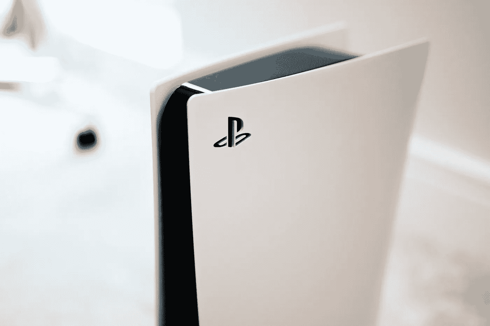

# 我在 PlayStation 5 的第一个月

> 原文：<https://medium.datadriveninvestor.com/my-first-month-with-the-playstation-5-a79ed65ced10?source=collection_archive---------18----------------------->

当索尼宣布 PS5 将于 11 月推出时，我决定是时候[和我的旧 Xbox 360](https://geekonrecord.com/2020/11/09/dedusting-my-old-xbox-360-in-2020/) 说再见了。我读了很多关于之前发布的预购失败的报道，甚至更多关于作为下一代游戏机早期采用者的风险，但我没有让任何阅读阻止我。

Photo by [Charles Sims](https://unsplash.com/@1charlessims?utm_source=unsplash&utm_medium=referral&utm_content=creditCopyText) on [Unsplash](https://unsplash.com/s/photos/playstation-5?utm_source=unsplash&utm_medium=referral&utm_content=creditCopyText)

我放弃购买新的 Xbox Series X 主要是因为我很期待玩的游戏列表，比如《漫威的蜘蛛侠:迈尔斯·莫拉莱斯》、《我们最后的人(下)》或《地平线:禁忌西部》。

PS5 的预订开始于 9 月，伴随着[重大问题](https://www.theverge.com/2020/9/16/21440721/sony-ps5-pre-orders-day-one-mess)和长期粉丝的沮丧；零售商提前发布了发售日期，黄牛购买了他们能买到的任何 PS5 机器人，造成了严重的稀缺问题。索尼甚至[道歉了](https://twitter.com/playstation/status/1307364082341740544)，但问题依然存在，几乎两个月后，几乎不可能找到有 PS5 库存的零售商。即使在经历了所有这些挣扎之后，索尼仍然设法在头四周售出了 340 万台 PS5，预计 2021 年将生产 1800 万台。

我很幸运地在百思买买到了一部，我的感恩节周末过得非常愉快，像蜘蛛侠一样在纽约的建筑间跳跃。由于 PS5 是我的第一台 PlayStation 游戏机，我进入 Reddit 了解其他人如何使用他们的新游戏机，并看看我可以学习哪些最佳实践。我发现的是一片沮丧的早期用户的海洋。人们的游戏机有 GPU 问题，游戏到处崩溃。每隔几分钟，就会有人发布他们的游戏如何崩溃的消息。或者他们的控制台在连接外部驱动器后如何停止工作。或者他们的电视如何出现视觉伪像，可能是由有故障的 GPU 造成的。或者他们如何在将游戏机置于休息模式(PlayStation 的一种暂停状态)后弄坏它。我不断告诉自己，我听到的唯一声音是那些烦恼和不安的人，还有更多快乐的人拥有一台功能完美的 PS5，他们在玩游戏时没有任何问题，也没有想到在 Reddit 上写下来。

尽管如此，这让我充满了怀疑和偏执。为了避免任何问题，我在玩完游戏后主动关闭游戏，我不敢使用休息模式。游戏故障的视频充斥着我的 PS5 新闻，与此同时，我的体验很愉快，我的主机工作得完美无缺。

PS5 DualSense 控制器也成为我的旧 Xbox 360 控制器的一个相当大的升级。玩支持触觉反馈的视频游戏时，触觉反馈增加了许多感觉:按下按钮、扣动扳机或投掷蜘蛛网都会提供不同的感觉。然而，似乎有些人已经[在这个问题上遇到了麻烦](https://screenrant.com/ps5-adaptive-triggers-break-dualsense-controller/)，因为阻力对一些用户不起作用了。其中一些用户报告说弹簧断裂是他们控制器问题的罪魁祸首，尽管至少这不是一个普遍的问题。

到目前为止我看过的每一个游戏都给我留下了惊人的图形印象。玩《漫威的蜘蛛侠》或《神秘海域 4》感觉就像在参与一部互动电影，而《红色死亡救赎 2》感觉就像在荒野中度假。观看实时光线追踪的游戏令人着迷，当结合 60 FPS 时，它真的令人惊叹。[这个视频](https://youtu.be/crjbA-_SoFg)很好地解释了为什么光线追踪在新一代游戏机上如此重要。

不幸的是，目前很少有专门针对 PS5 开发的游戏。很少有游戏充分利用光线追踪、控制器触觉或高帧率图形。漫威的《蜘蛛侠》就是其中之一，于 2018 年发布，并在 2020 年的重拍中升级，将 PS5 推向了极限。当然，对于像我这样的人来说，向后兼容是一个很好的功能，因为我现在可以享受多年前错过的所有 PlayStation 4 独家游戏。这些游戏大多运行良好，但与 PS4 专业版相比没有任何显著差异。

出于这个原因，开发者还不急于拥抱这些下一代游戏机。宣布将于 2021 年推出的大多数 AAA 视频游戏也将在 PS4 上发布。鉴于 PlayStation 截至 2020 年 8 月在全球拥有[1 . 13 亿活跃用户](https://www.statista.com/statistics/272639/number-of-registered-accounts-of-playstation-network/)，这是不可能的。这是一个不可忽视的大市场，这意味着我们应该期待 PS4 仍有几年的活跃期。这也意味着游戏的发布成本可能会更高，因为开发者将专注于生产 PS4 版本和增强版 PS5。

游戏版本的这种二分法已经开始让一些游戏发行商头疼了。热门系列游戏《巫师》的开发商 CD Projekt Red 最近因其对最新游戏《赛博朋克 2077》发布的处理方式而受到抨击。这款游戏于 2020 年 12 月初作为 PS4/Xbox One 游戏推出(计划于 2021 年推出 PS5/Xbox Series X 版本)，但由于漏洞太多，索尼决定将这款游戏从其数字商店下架；有趣的是，PS4 游戏在 PS5 上的表现比在 PS4 上要好。

现在看来很清楚的是，PS5 没有任何一致的硬件问题(至少不像 [Xbox 360 的“红色死亡之环”问题](https://www.businessinsider.com/red-ring-of-death-recall-2016-4))。所有已知事件都属于我们对任何大规模产品发布的预期。

从我开始使用 PS5 到现在已经一个多月了，鉴于以上所述，我认为它是一台成功的机器。简而言之，没有一台 500 美元以下的 PC 能达到 PlayStation 5 或 Xbox Series X 那样的游戏性能和视觉保真度，因此下一代游戏机肯定会让游戏大众化。

由于我们距离完全转向专注于下一代游戏机还有几年的时间，这意味着 PS5 可能会在整个十年内都有意义，远远超过 2026 年左右宣布的 PlayStation 6。我们还有很多比赛要打，对此我非常高兴。

**你喜欢这篇文章吗？** [**订阅**](https://geekonrecord.com/subscribe/) **通过邮件获取新帖。**

*原载于*[*geekonrecord.com*](https://geekonrecord.com/2020/12/30/my-first-month-with-the-playstation-5/)

*照片由* [*凯德塞弗林*](https://www.pexels.com/@kseverin?utm_content=attributionCopyText&utm_medium=referral&utm_source=pexels)T22【从 [*Pexels*](https://www.pexels.com/photo/connection-technology-computer-sony-5961235/?utm_content=attributionCopyText&utm_medium=referral&utm_source=pexels)

**访问专家视图—** [**订阅 DDI 英特尔**](https://datadriveninvestor.com/ddi-intel)