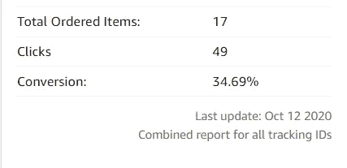

# 我的朋友从联盟营销中赚了 1000 多美元，并告诉了我这个秘密。

> 原文：<https://medium.datadriveninvestor.com/my-friend-earned-more-than-1-000-from-affiliate-marketing-and-told-me-the-secret-be4f7a9bf90a?source=collection_archive---------7----------------------->

## 学习如何通过向目标受众推荐真实产品来增加自己的被动收入。

Photo by [Viacheslav Bublyk](https://unsplash.com/@s1winner?utm_source=medium&utm_medium=referral) on [Unsplash](https://unsplash.com?utm_source=medium&utm_medium=referral)

我知道你们中的许多人都读过很多这样的故事，但它肯定会有所不同，我对此非常肯定，这是一次与专业联盟营销人员的对话。所以开始吧。

我是一个天真的人，对技术及其流动性一无所知，想要从中获利是我的梦想之一，也是你们许多人的梦想之一。我想要一个想法来理解它，一周后，我想，为什么不开个博客呢？一个问题出现在我的脑海里，并开始用力捏我。我不知道，我其实可以从我的博客赚钱，当我听说托管和域名他们的价格和他们的比较卡住了我。Hostinger、SiteGround、Bluehost 等等。

这不是一个好主意，我想，如果我甚至不能赚到我已经投入的钱，托管和域名的钱和时间。我告诉过你我很天真，只是希望得到一个新的想法，然后日日夜夜浪费在这上面。经历了一周的挫折和沮丧，我才决定，顺其自然，去做吧。

就这样，我的博客之旅开始了。

# 我现在有三个疑惑。

网站创建，它的主机，和域名。又花了一个星期去寻找最佳的方法。和我们 60%的人一样，我选择 WordPress 来创建一个网站。现在是时候购买主机和域名了，我选择了 Hostinger 或 SiteGround，因为我真的很喜欢它们的功能、支持等等。

基于它们巨大的功能，我很难选择其中一个，甚至我不能两个都买。我选择 [Hostinger](https://www.hostg.xyz/SH4Ou) 只是因为它在当时对我来说是实惠的。我知道这是个荒谬的决定，但我还是做了。

# 是时候成为百万富翁了。

根据我过去的经验，我知道，我能为读者写出更好的内容，这是我的信念。甚至我从学校开始就有阅读和写作的习惯。有几个星期，通常是 4、5 个星期后，它的浏览量有限，Google Adsense 不太适合我成为百万富翁。

所以我决定尝试其他方式，我开始在媒体、minds 和许多其他平台上推广我的内容。我对自己的表现不满意。然后我开始了联盟营销。

# 现在开始为初学者进行联盟营销

网上赚钱是许多人想要的，但我们中的许多人无法从青少年变成大亨，因为缺乏战略，错误的实施，以及选择不正确的平台开始。在我的博客之旅**之后，我了解到我的一个朋友这个月赚了 1000 多美元，我想从他那里知道策略。**于是我直接去了他家，想了解一下他真正的成功。

我想要完整的知识，他准备在我面前打开他的书，因为他是我最好的朋友之一，也是一个沉默的企业家。

> 这个过程开始了，如下所述。

# 什么是联盟营销？

联盟营销是一个逐步的过程，通过从一个公司向特定的受众推广特定的产品、交易、优惠和服务来赚取佣金。简单地说，当你销售另一家公司的产品时，你从中获得一些佣金。

最好的部分是你不必为用户创造先进的产品或服务。现在是时候开门见山，按照下面的指导，成为一个真正的商业人士。

# 不要只是注册你不知道的分支机构。

许多不了解产品的初学者，只是注册任何代销商服务，破坏了他们的代销商业务。不知道代销商不仅仅是一个复制粘贴的链接，它远不止于此。撰写关于产品的评论，向目标受众推荐是非常重要的，我们在选择代销商之前必须考虑这一点。

假设你是一个网页开发者，像推荐时尚产品一样推荐亚马逊产品，这是很可笑的。相信我，它永远不会给你带来每月 1000 美元甚至更多的收入。

在向你的朋友和追随者推荐产品之前，你必须非常自信。

# 你需要一个网站或 Youtube 频道

虽然我有一个网站之前，他告诉我，这将是必要的。阅读[网站开发流程](https://medium.com/@nitinfab/website-development-process-explained-in-5-minutes-e55b3cd185cd)了解该阶段的详细步骤。Youtube 频道也非常适合它。

想一想推广一个产品没有一个合适的平台就像没有房子住一样。是的，你可以使用 WordPress 轻松高效地创建一个网站。

# 推广优质产品

在你的帖子里贴一个链接如果不太适合就不会很棒。最好的产品是你使用或了解的产品。

1.  你知道产品，它们的质量。
2.  你的帖子将足够真实。
3.  既然你知道这些，你就不需要经常练习。
4.  你的帖子会很深入。

我听说过像 ClickBank、ShareASale 这样的各种联盟计划，但由于缺乏知识，我没有尝试过。我甚至建议你不要尝试你不知道的联盟计划(如果它能给你更好的佣金，你可能会尝试)。

# 我现在选择哪一个加盟计划？

从亚马逊联盟到点击银行，世界上有很多联盟项目。有些支付很少的佣金，而有些甚至更多。

这取决于你属于什么专业，你擅长什么。例如，如果你是一个技术人员，那么你可以推广虚拟主机和域名联盟，技术相关的最佳书籍，甚至类似的书籍。

# 为你的读者提供一些额外的免费内容

> 今天的世界在每个方面都想要一些额外的东西，而实现它的方法就是给别人一些额外的东西。

没有人想读一个无聊的故事，也不会写一个无聊的故事。一个有趣的故事，深入的信息，调查，事实，证据，最重要的是额外的部分(奖金)将引导你的目标。

> 免费付出 90%的作品，只用 10%的作品来赚。

我不想说出来，但这是事实。人们会信任你，并愿意在将来帮助你。

# 不要欺骗你的追随者

是的，质量对你的故事/帖子很重要。它可以吸引观众阅读更多，甚至购买并为你提供佣金。但是如果你的博客中有贪婪、虚伪、虚假的氛围，那就没用了。

为了赚，推荐没用的产品也会白搭。它会让你赚一点钱，但不是在那之后。

最后但并非最不重要的一点，不要在你的故事中充满附属链接，这不会让读者满意。

> 专注于转化而不是点击。

他告诉我他想指导我的一切，当我离开时，他告诉我要专注于转换而不是点击。他在那个月赚了 10000 多美元，并指导了我，现在是我继续前进的时候了。

# 最后，我到目前为止的所得。

经过大建议，我上了亚马逊附属，推荐了我读过的书像[*2020 年改变我人生的 5 本书！*](https://medium.com/illumination/5-books-that-changed-my-life-in-2020-7ecf35c8411e) 与此相似。我得到了巨大的反响。

仅仅第一个月就有 34.69%的转化率让我彻底震惊了。我非常确定我已经努力工作了，也许我已经做到了。

# 除此之外！

当我在一个联盟项目中获得成功后，我选择了另一个，那是来自另外两家公司的，一旦我在这两家公司都获得成功，我会更新它们。

# 深入查看网站背景评论。

 [## 一个完整的网站托管审查。

### 虚拟主机可以提高或降低你的网站性能。

medium.com](https://medium.com/dev-genius/best-web-hosting-for-your-website-a83a549b2971) 

## 访问专家视图— [订阅 DDI 英特尔](https://datadriveninvestor.com/ddi-intel)