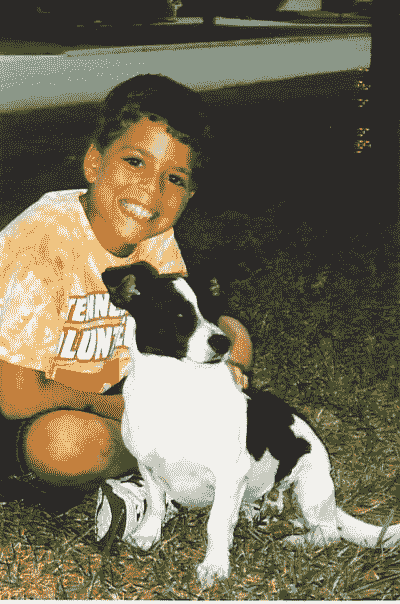
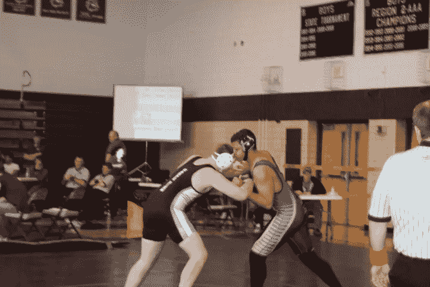
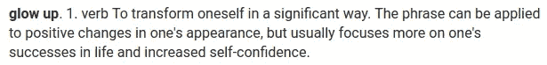
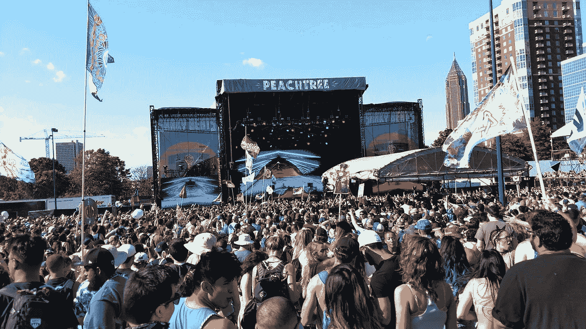
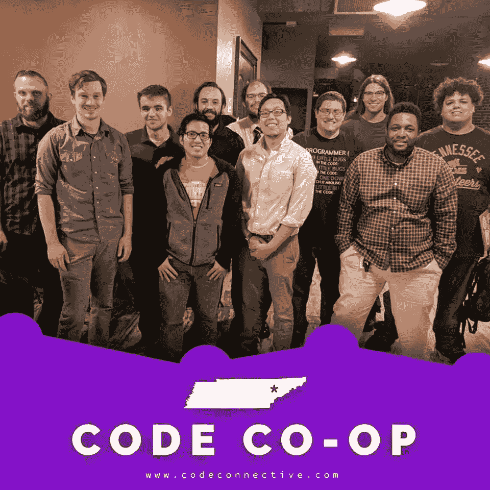

# 作为一个自闭症患者，我的科技(和生活)之旅

> 原文：<https://medium.datadriveninvestor.com/my-journey-in-tech-and-in-life-as-a-person-on-the-autism-spectrum-dcb9973889d6?source=collection_archive---------5----------------------->

# 介绍

今天我要告诉你一些我的个人经历，作为一个自闭症患者，我一直在世界各地旅行。当我 22 岁接受诊断时，我的自闭症诊断成为我身份的一个主要部分，直到今天我才真正分享了它。尝试新事物时在世界中导航总是很难，无论你是神经典型还是像我这样难以处理情绪和与他人互动的人。

# 一.早期阶段

我的故事是(公平？)对于我这种诊断结果的人来说，这是很典型的，为了开始理解这与我的科技之旅有什么关系，我必须深入了解一下我的历史。我有一个非常正常的童年，所以我们可以快进到我的青少年时期。

I can’t remember how old I was here. RIP Sammie :(

我的父母总是知道我在某些方面与众不同，回想起来，他们总是我最大的支持者。我在学校里得了各种各样的 IEP 症，这里我们不会深入讨论与公共教育系统相关的问题。

我最大的困难总是数学，有趣的是，一旦我自学了编码，它对我来说就变得轻而易举了。我在卡恩斯中学上高中，是一名非常普通的 T2 学生。人们很早就认识到我有激光导向的思维过程。

 [## 信息图:云之旅|数据驱动的投资者

### 聪明的企业领导者了解利用云的价值。随着数据存储需求的增长，他们已经…

www.datadriveninvestor.com](https://www.datadriveninvestor.com/2018/09/22/infographic-journey-to-the-clouds/) 

直到我 25 岁左右，我总是有一种开始产生兴趣，然后很快放弃兴趣的倾向。这种趋势唯一一次出现异常是在我高中高三的时候，当时我报名参加了摔跤队，并对这项运动产生了强烈的热情。请记下这一点，因为它与以后相关。

当我开始这个赛季的时候，我的身材非常糟糕，大约 275 磅。在赛季中，我知道我想实现*的某些东西*，但在早期我还不知道具体是什么。所以我继续前进，最终发现我的一个在大学代表队的队友受伤了，而我有潜力去弥补。现在，回想起来这似乎很傻，但是大学摔跤手收到了这些真的很酷的运动衫，我把我的商标激光瞄准器对准了它们。

发生了什么事？嗯，队友留下的重量级是 215 重量级，这意味着如果我想填满它，我必须减掉很多重量才能在那个级别摔跤。所以我必须做出选择，当事情变得有点挑战性时，我可以继续放弃的趋势，或者我可以利用这种新发现的激光引导的焦点来达到我在 215 级摔跤所需的体重。

TSSAA Regional Wrestling Championship 2009

我最终选择了减肥，通过两个月的桑拿有氧运动，节食减肥，我最终获得了 215 级的资格。我甚至取得了一些好的胜利！

这些就是我高中生活的高潮。我最终以中等的平均绩点毕业，带着天真的乐观进入了现实世界。

# 二。中间阶段

一旦我毕业了，事情对我来说就变得复杂多了。我没有真正的方向，开始漫无目的地换工作。谈论我生命中的这段时间对我来说是一个非常脆弱的话题，但我觉得这是我一直需要摆脱的事情。

在这些阶段，我看到我的同龄人开始做我一直想做的事情，但由于我的残疾(当时未确诊)，我在尝试做这些事情时在许多方面处于劣势。我想我在这期间总共辞掉了三份工作。所有这些都是非常卑微的，坦率地说是有辱人格的，但每次我都觉得自己更糟糕，因为在我的脑海中，我知道这种趋势永远不会结束，因为这就是我。尽管我尽了最大努力自我厌恶，这种趋势确实停止了。

我最终在 22 岁的时候得到了一位了不起的教育治疗师的官方诊断，他现在已经退休了。通过以朋友和导师的身份与这个人交谈，我对自己的了解超过了多年来看医生的次数。

你看，在我被诊断之前，我不知道我在经历什么，我以为我只是崩溃了。诊断可以成就或摧毁一个人的未来，在这一点上，我有一个明确的直接行动路线来改变我的生活。

这仍然不是一个容易的过程，他们说大脑直到 25 岁才完全发育。那是在我打我的**的时候，焕发出** *。*

从 22 岁到 25 岁，我一直在努力提升自己，发现自己真正的爱好是什么。大约在 25 岁时，我开始了一段旅程，直到今天。

# 三。现阶段

当我在 2017 年 5 月 7 日满 25 岁时，事情对我来说真的开始改变了。那一年，我去亚特兰大过生日，和一个好朋友一起看了《弗拉特布什僵尸》的震撼演出。

Shaky Beats Festival 2017

当我回来的时候，我知道我想改变一些东西，但是我还不确定是什么。这也是我第一次开始关注硅谷的时候，它引发了一系列的好奇心，导致了我今天的地位。事后看来，这似乎很傻，但观看这部电视剧的许多事情将我引向了科技行业。

我最终做了一些其他人在我之前做过的事情，并开始自学编程。我作为一名自学成才的软件工程师的旅程刚刚开始，并不容易。“辅导间隙”是一个艰难的阶段，我有很多非常艰难的时刻。最终，我变得足够自信去阅读产品文档，并整理出自己的解决方案来解决不同的问题。

Code Co-Op Knoxville Group

我在“开发”方面玩了一段时间，但当我在 AWS 和 DevOps 领域找到一些导师时，事情才真正开始改变。我开始参加 Knox DevOps Meetups，并开始爱上使用 DevOps“工程”的工具和流程。

这就把我们带到了现在。我现在在那里创建 DevOps 内容，并为各种客户贡献我作为内容创建者的技能。此刻我戴着两顶帽子，我的 SRE 帽和我的教育家帽，它们在我的生活中占有同等的重要性。面对逆境时的激情和实现目标的动力一直是我在科技和生活旅途中的两个标志。我仍然有失败的时候，偶尔会放弃任务，但每一天都是一次学习的经历。

我基本上采用了我一直深埋在内心深处的激光制导焦点，一旦我有了目标，我就能够执行任何任务。这是我第一次对自己现在的位置感到满意。作为一个光谱上的人，我知道事情并不总是容易的。也就是说，我觉得在光谱上有一些不言而喻的好处，被许多人低估了。

# 四。未来…TBD

直到今天，在我的旅程中，我学到了很多东西。每个人都有一个故事要讲，几乎所有的使用都在这个社区，因为我们热爱我们所做的事情，并希望使技术变得更好。进入这个领域没有一条单一的道路，我的感觉是，在社区中没有自我和毒性的位置。我只能说，记住人类。

我希望你喜欢这篇文章！如果这能让你微笑或在某种程度上感觉良好，一定要击碎那个鼓掌按钮！

你可以在这些平台上与我联系，跟随我的旅程😃：

Twitter:@ jdbohrman
Github:@ jdbohrman
Linkedin:[James d . Bohrman](https://www.linkedin.com/in/jdbohrman)