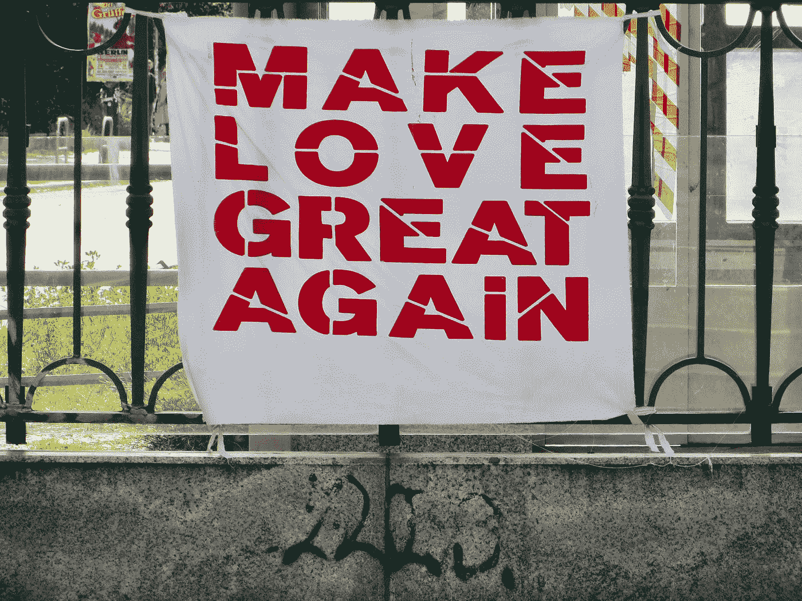
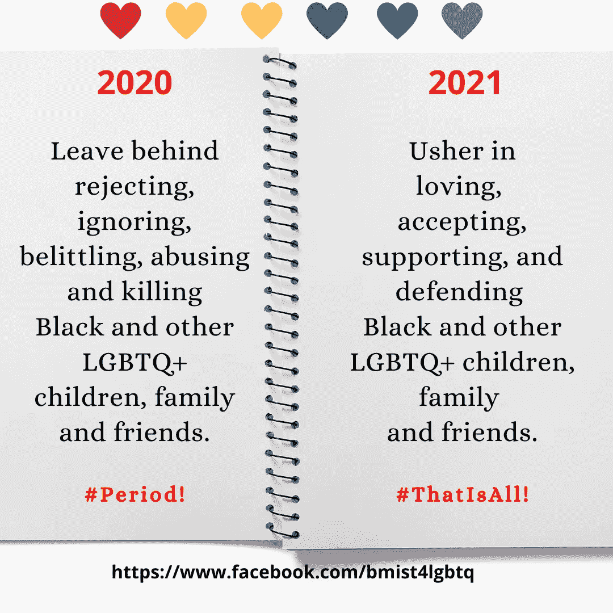
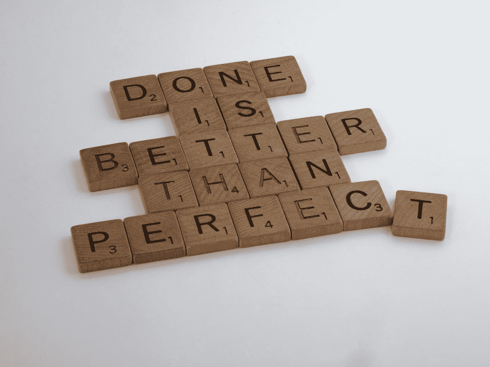

# 我的 2020 年最后一年在媒体上支持 LGBTQ+人群的爱情笔记

> 原文：<https://medium.datadriveninvestor.com/my-last-year-of-2020-love-note-on-medium-in-support-for-lgbtq-people-4db23f6c01b2?source=collection_archive---------49----------------------->

# 让我们为所有的人过一个快乐的新年

Photo by [Bekky Bekks](https://unsplash.com/@bekky_bekks?utm_source=medium&utm_medium=referral) on [Unsplash](https://unsplash.com?utm_source=medium&utm_medium=referral)

> 做还是不做？这是个问题。
> 
> BMISTribe 创始人 CarlaDee

当然，今天我可以写很多东西。

史无前例的 2020 年的这最后一天(也是我要写的最后一个故事)。

考虑到这一点，我在内容选择上花了很多心思。

我可以再写一篇类似于今年迄今为止获得最多掌声的帖子，希望能够重复。请注意，这是许多顶级媒体作家强烈建议的。

或者，我可以再写一篇类似阅读时间最长的文章。表明这足以激起读者的兴趣，让他们一直读到最后。这肯定是个好兆头。

或者，我可以写下我的观点和我的热情。尽管我自己的经验表明。我写的关于我生活中这两个重要因素的故事并不是人们感兴趣阅读或鼓掌的内容。

事实也的确如此。

# 当你的观点和热情不受欢迎时，无论如何都要写出来

完全公开。

你可以看看我的追随者账户，发现我不是顶级媒体作家。反正还没有。注意，我真诚地感谢你们中的每一个人，不管前面提到的事实，他们(因为这样或那样的原因)选择跟随我。你们是最优秀的人类)。

即便如此。我是一件事(实际上是两件事)。

1.  我是一名作家。谢谢提醒 [Itxy 洛佩兹](https://medium.com/u/ea638054cfa5?source=post_page-----4db23f6c01b2--------------------------------)。看看她的故事。这是一本值得一读的好书。

 [## 我们想成为作家是不是疯了？

### 如果我们的梦想太大了呢？

medium.com](https://medium.com/itxy-writes/are-we-crazy-for-wanting-to-be-writers-96faef08f0b7) 

2.我知道自己最大的超能力。你知道你的吗？如果没有。你很幸运。我写过这个。看看我的故事，尽快找出你的故事。

 [## 你知道对自己诚实是你最大的超能力吗？

### 力量在你体内

carlalaskey.medium.com](https://carlalaskey.medium.com/did-you-know-being-true-to-yourself-is-your-greatest-superpower-e0469df025a2) 

谢天谢地。因为我知道这两件事。

我完全知道如何回答我自己的问题。

生活是美好的。所以我来了。

# 2020 年留下什么，新的一年迎来什么

我今天早些时候用 [Canva 创建了这张图片。](https://www.canva.com/)注意，我爱 Canva。如果你有时喜欢创建自己的图像，但不知道如何创建。看看这个。他们提供了一个“免费”版本，我用它来为 Fb、Instagram 和 Twitter 创建帖子。

总之。如果你读过我的“[关于我](https://medium.com/about-me-stories/about-me-carla-d-wilson-laskey-2dd14f7eab4c)的故事。那你已经知道我是美国黑人女性了(我的视角)。我也是一个无可厚非的、支持 LGBTQ+年轻人和其他 LGBTQ+人群的母亲(激情)。

[如果你还没读过或不感兴趣，点击故事上的](https://medium.com/about-me-stories/about-me-carla-d-wilson-laskey-2dd14f7eab4c)。此外，如果你是一个中等作家，还没有添加你的故事。[瞿马](https://medium.com/u/f62128f9ca6e?source=post_page-----4db23f6c01b2--------------------------------) & [詹妮弗玛丽](https://medium.com/u/c840c634301c?source=post_page-----4db23f6c01b2--------------------------------)很乐意为你出版。点击[此处](https://medium.com/about-me-stories/submit-your-story-53edfdf6527)获取出版物提交信息。

不管怎样，再来一次。

由于我的观点和热情。我最近为他们的 LGBTQ 孩子、家人和朋友创建了 [BMIST](http://carladeesblog.com/black-mothers-in-support-tribe-for-their-lgbtq-children/) (支持部落中的黑人母亲)。目前，这些是支持那些活着的人，或支持这种独特的生活体验的在线空间。在不同的空间里。我定期分享内容，代表部落鼓励、激励、教育或倡导。

我发现它不是很受欢迎。但我还是会继续做下去。

# 所以这是一个总结

Photo by [Brett Jordan](https://unsplash.com/@brett_jordan?utm_source=medium&utm_medium=referral) on [Unsplash](https://unsplash.com?utm_source=medium&utm_medium=referral)

虽然我知道成为一个顶尖的媒体作家可能不是一件完美的事情。

我决定做什么。

我决定忠于自己。

我决定相信我最大的超能力。

我决定分享内容来支持我的观点和热情。

我认为这对许多读者来说似乎不受欢迎并不重要。

我认为支持 LGBTQ+对我来说很重要，也很受欢迎。

我认为对我来说重要的是值得写的内容。

最后，我决定与任何可能读到它的人分享。

就像我之前说的。我还不是顶尖的媒体作家。

但是今天，即使我达到了那个目标。

我是，也将永远是，真实的我。不管怎样。

我希望你也一样。

直到下一次…

充满爱与和平，

卡拉迪

访问专家视图— [**订阅 DDI 英特尔**](https://datadriveninvestor.com/ddi-intel)