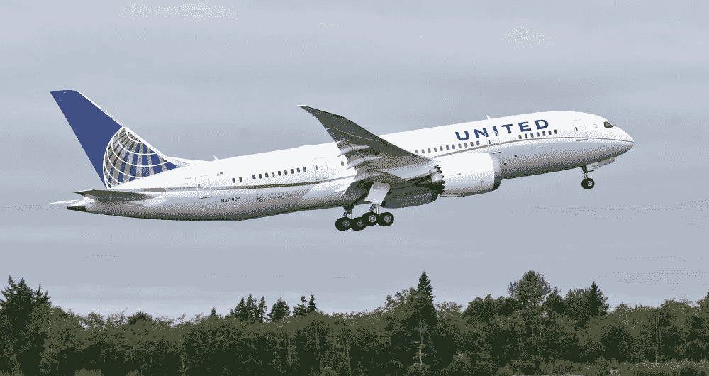

# 我与梦幻客机的恋情

> 原文：<https://medium.datadriveninvestor.com/my-love-affair-with-the-dreamliner-7dd1cd16c65a?source=collection_archive---------18----------------------->

## 波音 787 将空中旅行带到了一个新的高度

波音公司正受到指责。

很难有一天不在新闻中听到另一个负面的 737 Max 故事。飞机的软件有这样或那样的小故障；联邦航空局不会重新认证飞机的飞行，波音公司正在失去股票价值，等等。等。

是的，波音公司在 737 Max 上受到了不好的指责。这太糟糕了，因为围绕 737 Max 的所有负面宣传掩盖了一个简单的事实。

波音公司制造了一些非常好的飞机。

我的最爱？787 梦想飞机。多好的飞机啊！

我对这架飞机的喜爱始于大约四年前，飞机投入使用后不久。我读过一些关于波音 787 飞行体验的故事。人们普遍对这次经历赞不绝口。当然，我对此表示怀疑，但我不得不试一试。

 [## 危机管理乘“飞机”飞行真相|数据驱动的投资者

### 当埃塞俄比亚航空公司的一架 737 Max 飞机起飞后不久坠毁，整个国家陷入危机。最好的…

www.datadriveninvestor.com](https://www.datadriveninvestor.com/2019/03/26/crisis-management-flies-on-plane-truth/) 

我是一名国际航空旅行者，在首尔和美国之间的飞行通常持续 10 到 12 个小时。它们通常相当悲惨——我称它们为我的“铁罐中的耐力飞行”

所以，我欢迎任何能让长途飞行变得更容易忍受的事情。这就是为什么我如此渴望尝试梦想飞机的体验。

2016 年，这意味着飞往日本东京，登上一架 787 飞机。全日空、日本航空和联合航空都在东京和美国各目的地之间飞行梦想飞机。然而，由于梦想飞机刚刚投入运营，韩国仁川机场只有几条 787 航线。

是去东京。我第一次乘坐 787 航班的时间到了。

一开始我有点不以为然。机舱看起来足够新，但经济舱座位看起来就像任何其他长途经济舱一样。但后来我开始注意到不同之处。

我注意到的第一件事是头顶行李箱的大小。他们是巨大的！在这趟航班上，找到足够的空间存放我们的随身行李不成问题！

然后我来到我的座位。和往常一样，我坐在经济舱的座位上，只是为了伸腿。但是我没有为我将要得到的额外空间做好准备。这几乎就像商务舱一样。座位很舒适，每个座位后面都有飞行屏幕。

然后是窗帘——我的意思是没有窗帘。“窗帘”是电子的。机组人员控制着它们——当靠窗座位上的某个不体贴的人决定迅速拉起窗帘以获得更好的视野时，再也不会有“被光线蒙蔽”的经历。

所有这些漂亮的小设施隐藏了乘坐梦想飞机的真正好处；生物舒适。而不是加压到 8000 英尺，机舱内部压力 6000 英尺(相当于科罗拉多州丹佛)。在飞行过程中，空气被过滤 12 次，而不是其他商用飞机通常的两次。机舱湿度高达 15%(相比之下，其他飞机的湿度只有 4%)。

这些舒适的功能让你的飞行体验与众不同。在我第一次乘坐 787 航班从东京飞往丹佛后，当我在丹佛下飞机时，我惊讶地发现我仍然感到神清气爽。坐了 15 个小时的飞机后，我从未感到如此精神焕发——从来没有。

我仍然持怀疑态度。但是在我的第二次国际飞行有了同样的结果后，我被迷住了。这些天，无论我去哪里旅行，我都在寻找最好的 787 路线——即使我必须支付额外的费用。优质的服务、更宽敞的飞机以及对我身体更少的压力，这些好处值得我去寻找 787 航班。

现在，如果航空公司能制造更宽敞的经济舱和更宽的座位就好了。唉…我们总是可以做梦。