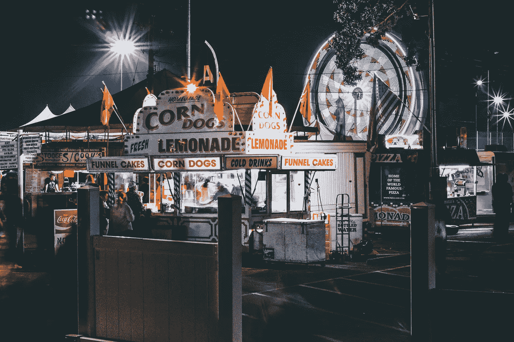

# 我的营销灾难

> 原文：<https://medium.datadriveninvestor.com/my-marketing-disaster-4f91fe56969b?source=collection_archive---------10----------------------->

我所指望的是在 WBAL、WJZ 和 WMAR 报道交易会的那个晚上，我们在电视上得到的宣传。

Photo by Taylor on Unsplash

在拥有一个小镇广播电台的 8 年里，我确信自己做对了一些事情，但现在我什么都想不出来了。

马里兰州塞西尔县每年都会发生一些事件，我们的小镇广播电台必须对此进行报道。

有游行，7 月 4 日的烟火，一艘船，但最重要的是塞西尔县集市。这就像诺曼·洛克威尔画的一幅乡村集市。每个有孩子的家庭都必须参加——至少一次。一个家庭可以连续一周每天都去，这取决于孩子逗弄能力的有效性。

交易会在每年夏天八月的第一周举行

WSER *每天晚上都从会场进行远程转播。对我们的工作人员来说，采访一些博览会的赞助人——成人、儿童和介于两者之间的人，已经成为一种受欢迎的传统。*

我仍然沉浸在兴奋的幻想中，希望能够让电台的信号到达巴尔的摩，获得那个巨大的市场。我刚刚向联邦通信委员会申请增加电力。

一天晚上，巴尔的摩电视台对塞西尔县集市进行了简短的报道。孩子们喜欢近距离亲自观看他们在电视上看到的所有相机、天线、卡车和人。

我觉得 WSER 应该在展会上有一个更大的存在，而不是我们普通的小展位，有一个发射机，WSER 横幅和几个巡回记者问人们是否喜欢自己。毕竟，我们是塞西尔郡的代言人。

我想了又想。

我们需要有影响力又不贵的东西。

经过几天的思考，我找到了答案。我的大多数问题都有答案。大多数情况下，当我从恼人的每小时一次的睡眠周期中醒来时，他们会在凌晨 2:00 出现。

凌晨 2:00，我意识到。

WSER 需要扩大它的公平存在只能是:

**巨型 Cloudbuster 氯丁橡胶 8 英尺气球**

计划是专业地将 WSER——塞西尔县的声音——涂在它巨大的红色圆形上，装满氦气，然后将它漂浮在游乐场上空，供大家观赏。

整个计划完全在电视台 500 美元以下的预算范围内。

博览会的一周过去了，我们终于可以把气球吹大了。带走了将近一整箱氦气。我们把它拴在了广播室。卖给我们这个气球的人向我们保证，这个气球充满氦气的时间可以长达 5 天。这将是接近整个运行的公平！

我所指望的是在 WBAL、WJZ 和 WMAR 报道交易会的那个晚上，我们在电视上得到的宣传。

气球充气进行得很顺利，怪兽充气艇的发射无疑给了我们想要的高姿态。

气球飞近为跳水马建造的塔，这是博览会的主要吸引物。

这次营销上的胜利甚至比我希望的还要大。发射后，每个人都在谈论气球。

在交易会的最后一个晚上，我注意到比往常更多的人群。

我很快发现，善待动物组织和其他动物权利活动家在博览会上抗议潜水马法案。关于那匹马被迫爬上 20 英尺的梯子斜坡。关于驯马师催促马从平台上跳下来的事情；从 20 英尺高的地方掉到地上的水池里。

活动分子封锁了后一个斜坡，当然，景点的所有者，因为不是害羞的紫罗兰，反对活动分子不让他们训练的马做他们训练它做的事情。

接着发生了一场混战。肯定有 30 个 20 多岁的人，大多数是穿着 60 年代安妮·霍尔服装的女性，他们抓着马的后躯，而肌肉发达的乡下男孩拉着马的缰绳*哄着他做燕麦给他报酬的事情。整个事情持续了不到一分钟。*

女生赢了；保安赢了。这匹马没有跳跃就被牵回了他的旅行车。

在 11 点的新闻前在家吃晚饭。*我受够了集市上卖的玉米热狗、棉花糖、薯条和漏斗蛋糕。*

啊，新闻。

嘿，电视上有气球！

记者:正如你所看到的，今晚有活动人士抗议的 *WSER 跳马*。他被免除了原本极其残酷的任务，不得不爬上一个陡峭的梯子，被他的训练员从 20 英尺高的平台上推下来，掉到至少 20 英尺深的浅水池里。活动家们仁慈地结束了这种虐待。你真可耻，WSER。

什么？扯淡！！

我想我听到我们服务的农业社区所有的收音机都被关掉了。

塞西尔乡村的声音对许多人来说是沉默的。

那周晚些时候，巴尔的摩电视台播出了道歉和撤回声明。

没人看。