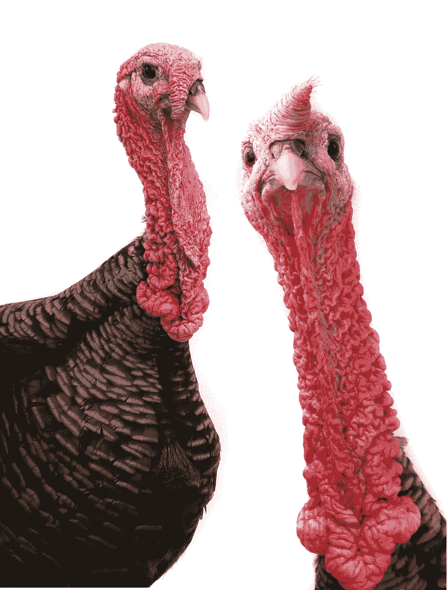

# 我唯一的变焦会议

> 原文：<https://medium.datadriveninvestor.com/my-one-and-only-zoom-meeting-f1b24427978e?source=collection_archive---------20----------------------->

## 这就够了。

Photo by [Magnet.me](https://unsplash.com/@magnetme?utm_source=medium&utm_medium=referral) on [Unsplash](https://unsplash.com?utm_source=medium&utm_medium=referral)

大家好。

天哪，那是我的脖子吗？？？)

嗨，很高兴见到你。

(*天啊那个* ***就是*** *我的脖子。*)

所以我们今天有很多要讲的。朱莉娅，想把我们踢出去吗？

 [## 为什么我们投资 Totient，也就是人工智能如何帮助我们生产抗癌药物和 Covid | Data…

### 9 月 10 日，一家人工智能驱动的药物研发公司宣布与……建立关键合作伙伴关系，从此悄然出现

www.datadriveninvestor.com](https://www.datadriveninvestor.com/2020/09/13/why-we-invested-in-totient-aka-how-ai-can-help-us-produce-drugs-against-cancer-and-covid/) 

**(我脖子怎么了？？？)**

朱莉娅。

朱莉娅。

*朱莉娅？*

(我的高领毛衣呢？我的围巾在哪里？神圣的狗屎！！！！！)

朱莉娅，你在做什么？

***那是胶带吗？***

点击。

Deposit photos

## 获得专家观点— [订阅 DDI 英特尔](https://datadriveninvestor.com/ddi-intel)