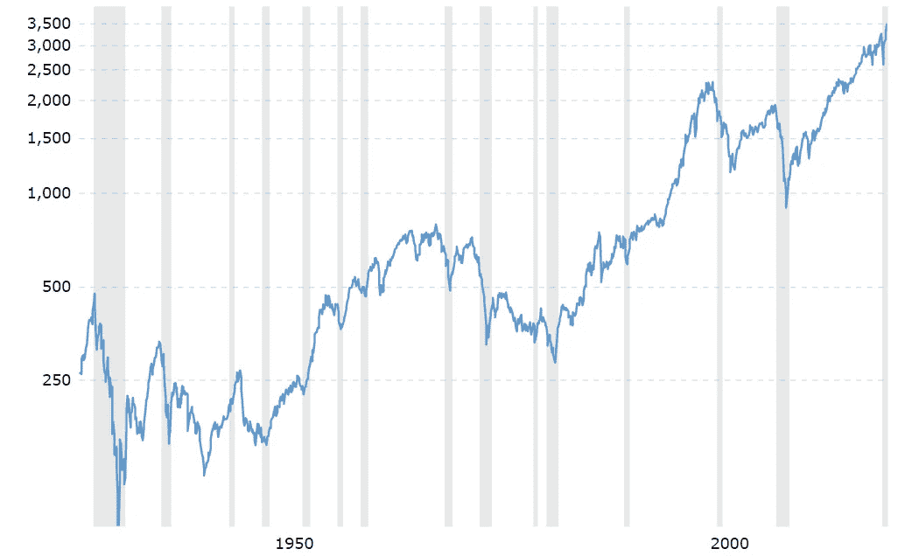

# 我对即将到来的市场崩溃的计划

> 原文：<https://medium.datadriveninvestor.com/my-plan-for-the-upcoming-market-crash-6f3841b37439?source=collection_archive---------7----------------------->

> 声明:我不是一个有执照的财务顾问，所以把这作为一个娱乐片。你可以随意复制这些计划，但要明白在股票市场上没有什么是有保证的。在股票市场上，任何事情，哪怕是最不可能发生的事情，都有可能发生。所以如果你决定投资，明智地投资。

Source: [Bryan Taylor](http://www.globalfinancialdata.com/taylors-golden-rule-of-stock-market-size-indices/)

如果你看过任何一部华尔街电影，像《华尔街之狼》、《锅炉房》或《大空头》，那么你大概可以想象股市崩盘时的情景。嗯，我在这里告诉你，不是每个投资者都会在市场崩盘时赔钱。有些人甚至在市场崩盘时赚了大部分钱。那个人很可能就是你。

# 市场崩溃

自 1950 年以来，标准普尔 500 指数已经经历了 6 次大崩盘。这些崩盘往往是短暂的，从长期来看，市场最终会复苏。

在历史上，平均牛市持续约 [**4.5 年**](https://apnews.com/84ee301c404539d8731da34128330752#:~:text=On%20average%2C%20bear%20markets%20have,the%202007%2D2009%20bear%20market.) ，而平均熊市仅持续约 **14 个月**。这条信息告诉我们，当市场处于下跌趋势时，我们应该抓住机会低价买入，几年后以更高的价格卖出。

当恐惧笼罩华尔街，投资者对他们的投资组合感到恐慌时，我计划出击。我想去那里，因为他们给了我一个绝好的机会来划掉我的股票购物清单。你不要担心，市场崩溃会来的！

# 大局

[90 Year Historical Chart of the S&P 500](https://www.macrotrends.net/2324/sp-500-historical-chart-data)

尽管新冠肺炎崩盘很严重，但 90 年来的美元间谍图仍指向右上角。换句话说，如果你在过去 90 年的任何时候投资了标准普尔 500 指数，你都有可能获利。

有了这些信息，我们的工作不再是质疑市场是涨是跌。现在的问题是你应该在何时何地执行你的投资计划。

也就是说，并不是市场上的每只股票都像“间谍美元”那样表现出色，所以你必须选择正确的股票。或者干脆选择投资各种市场指数，如标准普尔 500 或道琼斯工业平均指数。

 [## 这么说一家大型风投基金正在投资你的初创公司？4 实际考虑|数据驱动的投资者

### 首先，恭喜你。融资总是需要努力的，一个大的风险投资基金当然是一个大的…

www.datadriveninvestor.com](https://www.datadriveninvestor.com/2020/08/09/so-a-big-vc-fund-is-investing-in-your-startup-4-practical-considerations/) 

# 投资组合

我理想的投资组合是大约 10 到 15 只股票。成长股和红利股的良好组合。而且说实话，市场上的优质股票也不多。

## [指数基金](https://www.investopedia.com/terms/i/indexfund.asp#:~:text=An%20index%20fund%20is%20a%20portfolio%20of%20stocks%20or%20bonds,follow%20a%20passive%20investment%20strategy.)

购买指数基金对你的投资组合至关重要。指数基金被描述为一篮子股票的平均值。举例来说，购买 100 美元的 SPY 就像是一次性买下标准普尔 500 的 500 家公司。

**$间谍——$ 300，$280，$260**

有许多指数基金，但我选择了$SPY，因为它拥有一些世界上最大的公司，大多数主要银行和对冲基金都以此为基准。

我坚信我会达到 300 美元的价格目标，因为这是支撑所在。随着价格的下跌，我会在 280 美元和 260 美元买入更多。如果价格更低，我会以 220 美元的价格再买一些，但我怀疑自己能否买到这个价格。因为如果发生了，世界上很多人都会有麻烦。

**$ESGV — $50，$45**

我希望安全地交易这只 ETF，因为它是 2018 年推出的一只相当新的指数。对此我仍持怀疑态度，但他们的股票篮子包括一些最能代表未来的公司，如$AAPL、$MSFT、$AMZN、$FB 和$TSLA。

看 50 美元，心理支持区域和 45 美元，如果市场仍处于下降趋势。如果这个指数决定把我搞垮，并涨到 0 美元，我会很好。

## [成长股](https://www.investopedia.com/terms/g/growthstock.asp#:~:text=A%20growth%20stock%20is%20any,average%20growth%20for%20the%20market.&text=This%20is%20because%20the%20issuers,growth%20in%20the%20short%20term.)

简单来说，如果你认为某家公司的股价未来会大幅上涨，那就是成长股。值得注意的是，成长型股票通常不会向股东支付高额股息。股东从低价买入高价卖出中获利。

AAPL——85 美元，75 美元，68 美元。

每个人都知道苹果，一家卖 700 美元轮子的公司。创新！

我耐心地等待这只股票跌到 90 美元以下。这是因为一旦突破 90 美元的支撑位，它可能会升至 80 美元。85 美元是我的估计，因为我看到在这个水平有很多支持。如果股价进一步下跌，我会在 75 美元和 68 美元买入。

**$ MSFT——168 美元，145 美元**

我知道微软也是一个大玩家，但在史蒂夫·鲍尔默的管理下，他们失去了几年时间。我并不讨厌他，但我必须在这里说实话。

因此，我不想把太多的重点放在这只股票上，因为$AAPL 一直是领头羊。这只股票对我来说很难确定水平，我盯着 168 美元和 145 美元，但这将严重依赖于竞争对手的图表。

**$ NVDA——250 美元**

今天的大多数电脑要么使用英特尔，AMD，或英伟达芯片。所有这些股票在新冠肺炎的突破中都表现不错。由于 Nvidia 在这一组中表现最好，我将重点关注它。

自新冠肺炎崩盘以来，这只股票几乎涨了两倍！现在，它看起来非常过度扩张，有很大的下降空间。我只会在这只股票突破 300 美元后看它，如果没有，我会看 AMD 或 INTC。

**$ AMZN——2000 美元**

未来的电子商务领域仍有巨大的潜力。最重要的是，亚马逊也是一家非常多元化的公司，拥有稳定的用户群。目前唯一的竞争对手是沃尔玛。

他们的股价相当昂贵，所以我需要对这一次有耐心。一旦它跌破 2250 美元，我就会关注，当它达到 2000 美元时，我肯定会买入。

**$GOOGL — $1200，$1000**

可能是最多元化的科技公司，但谷歌确实以做出明智的商业决策而闻名。我将购买 A 级股票$GOOGL，因为我打算做一个长期投资者。如果你不是，那就去买 C 类股$GOOG。

$GOOGL 是一个相当落后和弱势的股票，所以我想尽可能低的买它。1200 美元是我希望达到的水平，但我可能需要根据市场情况调整这个水平。

**$ TSLA——220 美元，$150**

我完全不建议新手买特斯拉股票。因为这只股票非常非常不稳定。如果你被抓到错误的一方，这可能对你的账户非常不利。

也就是说，他们确实是电动汽车领域的大男孩之一，该行业正在朝着这个方向发展。我将监测低于 220 美元的股票，并将对这只股票格外谨慎。

**$ ABB——20 美元**

我把这只股票放在最后，因为 ABB 机器人公司不是一个受欢迎的名字。顾名思义，这是一家机器人公司。我做过调查，相信他们是一家不错的公司，有很好的潜力。此外，世界正在向机器人世界转变，因此这可能是一个值得投资的好行业。

我不会对这家公司进行大规模投资，因为管理层可能会变得粗心大意，他们仍然可以达到 0 美元。这个想法是以便宜的价格获得一些股票，并持有几年。

## [分红股票](https://www.investopedia.com/dividend-stocks-4689744)

我喜欢把分红股票想象成拥有一套出租房产，除了你跳过了所有烦人的差事。你是某支股票的现任所有者，那家公司定期给你发工资。这些公司的支出可能是每月、每季度、每年或者不一致的。股息高的股票通常不会增长很多。这就是他们发行股息来吸引买家的原因。

**$ WMT——110 美元，95 美元**

如上所述，沃尔玛是少数几家有能力与亚马逊竞争的公司之一。沃尔玛设法设计出转化亚马逊用户的策略只是时间问题。但如果这种情况没有发生，沃尔玛仍然会非常好。

除此之外，假设入门价格为 110 美元，他们还以每年 2%的利率向股东支付股息。我会格外关注任何恐慌，因为图表显示价格会迅速反弹。

**$ BMO——$ 52，$46**

蒙特利尔银行目前的储蓄账户利率为 0.05%，而其股票的股息利率为 6%。因此，我将把钱放在哪里的答案非常清楚。

我只在这里投资一小部分资金，因为尽管银行破产的可能性很低，但它们的上升潜力也有限。这意味着资本收益相当少。

**$ INTC——45 美元，$35**

再说一次，我们所有的计算机都需要 GPU，而英特尔是这个市场的主要竞争者之一。他们也给股东分红，所以我倾向于英特尔而不是 AMD。

我的参赛费是 45 美元。我希望它不会打破这一支持，但如果它做了，我会在 35 美元的位置增加更多。

Photo by [Marvin Meyer](https://unsplash.com/@marvelous?utm_source=medium&utm_medium=referral) on [Unsplash](https://unsplash.com?utm_source=medium&utm_medium=referral)

如果你想了解更多关于我为什么选择这些公司的信息，请访问[**https://bit.ly/2FQKbea**](https://bit.ly/2FQKbea)，在那里我解释了为什么我认为这些公司不会很快发展。

这些股票和它们各自的价格水平是我在即将到来的市场崩盘中投资的计划。绝不是向你推荐。我有自己的投资风格，这可能对一些人来说没有意义，但它让我赚了一大笔钱。所以如果它没坏，就不要修好它？

请不要只相信我的话。自己做研究，自己做决定。如果你有任何问题，请随时问我，我会尽力帮助你。如果你真的投资了，我祝你一切顺利。安全投资，明智投资。

*嘿，既然你在这里，为什么不加入我的* [***邮件列表***](https://marcuschan.ck.page/76504d9d12)**来看看你收件箱里偶尔出现的精彩故事，或者考虑成为会员***来阅读我所有的故事！☺***

## **访问专家视图— [订阅 DDI 英特尔](https://datadriveninvestor.com/ddi-intel)**