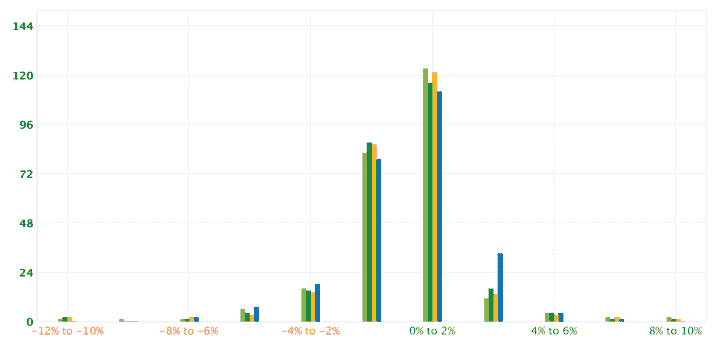
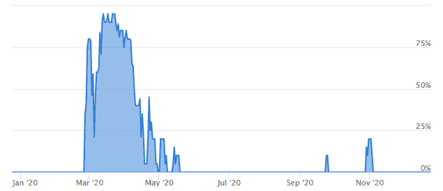
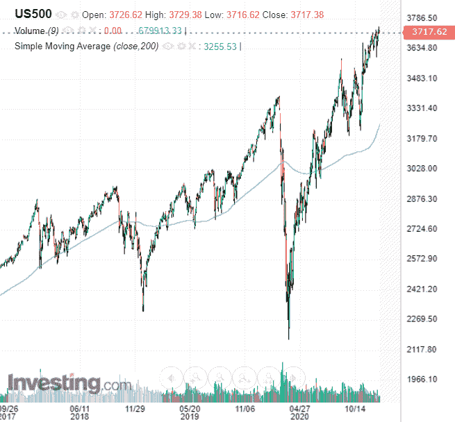

# 我的投资组合在 2020 年暴涨 62%。这是我进入 2021 年的定位。

> 原文：<https://medium.datadriveninvestor.com/my-portfolio-surged-62-in-2020-heres-how-i-m-positioned-entering-2021-56a9d5583087?source=collection_archive---------4----------------------->

随着我们进入 2021 年，我一直在反思我的投资组合在过去一年中的表现，思考那些进展顺利的决定以及我可以改进的地方，以便在未来成为更好的投资者。

在这篇文章中，我将分享我在 2020 年从市场中学到的三大经验，以及我的投资组合在 2021 年的定位。

# 业绩审查

2020 年，我的投资组合上涨了 61.8%，而标准普尔 500 上涨了 16.7%，跑赢基准 45.1%。该投资组合今年的最大跌幅为 15.2%，而标准普尔 500 在 3 月份的回调中损失了 30%以上。以一半的风险获得了几乎 4 倍于基准的回报，我对我的投资组合今年的表现相当满意。

更深入地说，下面的图显示了我的投资组合(蓝条)相对于各种基准的每日回报分布。横轴显示投资组合的每日表现，纵轴显示实例数量。这一情节的两个关键方面很突出。

首先，在图的左侧，我们可以看到所有基准都在几天内遭受了-10%到-12%的损失。这与我们在今年 3 月看到的由于新冠肺炎的抛售相对应。幸运的是，由于我的模型的[主动风险管理系统](https://pyinvesting.com/fear-and-greed/)，我的投资组合在 3 月份主要持有现金，所以今年我的投资组合没有一天亏损在-10%到-12%之间。这保护了我的投资组合在此类调整期间不会大幅缩水。

第二，我的投资组合大约有 32 天，回报率在 2%到 4%之间，相比之下，基准投资组合不到 16 天，回报率在 2%到 4%之间。这种优异表现归功于选股，我的模型选择了回报率远高于基准的股票。我的模型结合了趋势跟踪和基本面分析来选择有很大机会跑赢市场的股票。关于我的投资策略的更多细节，你可以参考[这篇文章](https://pyinvesting.com/blog/19/im-up-42-this-year-despite-covid-heres-how-i-did-it/)。

这两个因素是我的投资组合今年跑赢基准 45.1%的主要原因。风险管理和股票选择。

基于这种表现，这里是我的前三课。

# 当别人贪婪时，变得更贪婪

你知道沃伦·巴菲特喜欢宣扬你应该“在别人贪婪的时候恐惧，在别人恐惧的时候贪婪”吗？我做的正好相反。

当其他人贪婪时，我并不害怕，当股市在 3 月份抛售后开始复苏时，我比其他人更贪婪。在 4 月至 5 月间，我的模型积极地开始买入股票，并将我的现金配置从 90%降至 0%，以参与反弹。

我还开始增加我的投资组合的杠杆，在我的互动经纪人账户上增加保证金，以扩大我从这个机会中获得的收益。

谢天谢地，这个决定得到了巨大的回报，因为市场继续 V 型复苏，导致我的投资组合飙升至新高。

Amount of cash in my portfolio

# 多样化，多样化，多样化

我学到的下一课是持有至少 30 只股票，在我的投资组合中权重相等。没有例外。在花了 2020 年投资股市之后，我更加确信，多元化对于任何投资组合都是绝对必要的。

2020 年，我最大的赢家是 CRWD(crowd strike)、TSLA(Tesla)、亚马逊(Amazon)、NFLX(Alibaba)和 Sea，而我最大的输家是阿里巴巴(Alibaba)、ZM(Zoom)、BDX(Becton Dickinson)、WMT(Walmart)和杂货零售店(杂货零售店)。

如果我有一个水晶球，我会只选择赢家，而忽略上面列出的所有输家。然而，事实是没有人有水晶球可以预见未来。上面列出的所有股票都处于上升趋势，并且有坚实的基本面。如果我没有分散我的投资组合，选择了 5 只股票而不是 30 只，我可能会持有我最大的 5 只股票，这绝对是一场灾难。集中风险不会得到市场的回报。

这里的关键是，通过拥有 30 只股票的多元化投资组合，我打赌我的模型能够选择更多的赢家而不是输家，并且赢家的收益高于输家的损失。我只需要一些像 CrowdStrike、Tesla 和 Sea 这样的成功股票，来补偿所有的输家，并把我的投资组合推向新高。

 [## 如何在不牺牲孩子或财务的情况下安全理智地离婚|数据驱动…

### 在美国，七月是以孩子为中心的离婚月。作为 cdfaⓡ的专业人士，我可以向你保证，从长远来看…

www.datadriveninvestor.com](https://www.datadriveninvestor.com/2020/07/28/how-to-divorce-safely-and-sanely-without-sacrificing-your-children-or-your-finances/) 

# 唱一点歌没关系

今年有相当多的科技公司首次公开募股。不幸的是，因为这些股票是新的，最近才在证券交易所上市，我的网站没有足够的历史数据将这些股票作为模型投资组合的一部分。

然而，我忍不住涉足其中一些股票，并购买了 Palantir (PLTR)，尽管我在[pyinvesting.com](https://pyinvesting.com/)的现场策略并不建议这样做。

这是因为 Palantir 作为一家人工智能公司，通过从其他公司的数据中学习来帮助他们提高业务效率，这种商业模式和增长潜力令人惊叹。

尽管我打破了自己的规则，没有完全遵循这个模型，但我将 Palantir 的权重保持在我投资组合的 3.3%。这个权重和我投资组合中的其他股票差不多。通过将 Palantir 的权重限制在 3.3%，我投资组合的风险最小。此外，在我的投资组合中拥有一只闪亮的新人工智能股票让我兴奋不已。

# 我的未来定位如何？

市场开始在短期内过度拉伸，标准普尔 500 的交易价格比其 200 天移动平均线高出 14%。虽然市场肯定会继续上涨，但与 2020 年 3 月相比，我看不到同样的上涨，当时标准普尔 500 在几周内下跌了 30%以上。船已经起航，风险回报率不再那么有吸引力。

[investing.com](https://investing.com/)

在经历了创纪录的 62%的回报率后，我认为现在明智的做法是兑现我的一些利润并降低我的杠杆。需要澄清的是，我不会卖掉我的全部投资组合，把现金存在银行里。我只是在降低我的杠杆率以锁定一些利润，同时继续完全投资于市场。

我也开始添加一些可能会扰乱其行业的股票，以便[站在变革](https://ark-invest.com/articles/market-commentary/investors-beware/)的正确一边。ARK Invest 首席执行官凯瑟琳伍德(Catherine Wood)表示，我们生活在一个“破纪录的技术变革不仅创造了指数级增长机会，也给全球经济和金融市场带来了黑洞”的时代。这些新的颠覆性股票具有巨大的增长潜力，并有可能推动我的投资组合未来的回报。

随着这些股票被添加到我的投资领域，如果它们开始形成趋势并伴随着强劲的基本面，它们现在有资格被我的模型选择。

如果你喜欢这篇文章，并想在云上创建自己的投资策略，我邀请你去看看 PyInvesting 的新[初学者回溯测试](https://pyinvesting.com/backtest/new-user/)，我们将通过一个例子来指导你，并帮助你了解该网站是如何工作的。我希望 PyInvesting 能帮助你走向财务自由。

投资愉快，希望机会对你有利。

获得专家视图— [**订阅 DDI 英特尔**](https://datadriveninvestor.com/ddi-intel)