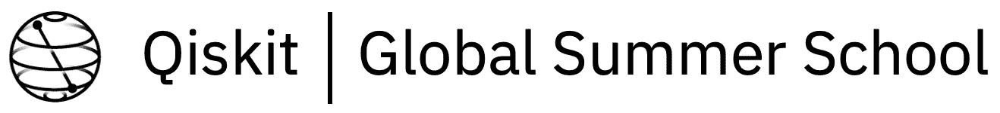

# 我的 Qiskit 全球暑期学校 2020 体验

> 原文：<https://medium.datadriveninvestor.com/my-qiskit-global-summer-school-2020-experience-56b89064e573?source=collection_archive---------9----------------------->

## IBM 如何组织了一个 5000 多名学生的暑期学校。

每年，Qiskit 都会为量子计算社区组织全球夏令营和活动。由于 COVID 的情况，今年的暑期学校在网上举办(而且是免费的)。

我开始知道 Qiskit 全球暑期学校的时候，我在暑假里超级无聊，除了准备面试和 GRE 考试之外，没有什么事情可做。我需要休息一下来学习一些新的有趣的东西。当我看到申请的链接时，我马上就决定了，我真的很兴奋，等不及了。

我不知道什么是量子计算机，也不知道它们是如何工作的，我所知道的是它们的速度非常快，而且处于真正的早期发展阶段，所以现在不是很有用，我看过 IBM 的一些照片。

[Source](https://www.google.com/url?sa=i&url=https%3A%2F%2Fwww.cnet.com%2Fnews%2Fibm-now-has-18-quantum-computers-in-its-fleet-of-weird-machines%2F&psig=AOvVaw1AjkjAboZgvH7i3di96Ovq&ust=1596475810422000&source=images&cd=vfe&ved=0CA0QjhxqFwoTCNiN5v6F_eoCFQAAAAAdAAAAABAa)

QGSS-2020 对于那些希望深入研究量子计算的人来说是一个绝好的机会。有理论物理、计算机科学、数学甚至化学背景的人是很好的学习对象。他们中的大多数是大学生，甚至高中生也参加了，其余的是职业人士。

暑期学校的先决条件是线性代数的全面知识和一点 python 编程。在此期间，我不得不复习线性代数和物理知识。前提条件是以这样一种方式给出的，即大多数人都可以在船上，尽管要完全理解讲座还需要更深层次的知识。

# 不和谐频道

Discord 是暑期学校学生的主要交流平台。这是让大约 2000 多名实验室学生一起讨论和提问的最有效方式。也有由学生组成的学习小组来讨论讲座和实验。

# 现场讲座

每个现场讲座持续约 3 个小时，中间有 10-15 分钟的休息时间和 1 个小时的实验时间。讲座和实验室在 crowdcast.io 上进行直播，这似乎是一个在线举办大型活动的良好平台。虽然它缓冲了很多，也许是因为有太多的与会者。录音一直到暑期学校结束，这对以后的复习是一件好事。

# 实验室

实验室是暑期学校最重要的部分，因为它们真的有助于理解算法的工作。没有亲身经历，我是不会理解所有那些理论的。

实验作业以 Jupyter 笔记本文件的形式分发给实验学生。在建立电路后，它将与学生的姓名和电子邮件 id 一起发送到 Qiskit 进行评分。通过暑期学校的标准是成功完成 65%以上的实验作业。

QGSS 是这个夏天发生在我身上最好的事情。每个人都从这两个星期中学到了很多，并期待着进一步学习。

许多量子计算社区在这个暑期学校期间成立，特别是在印度小组。他们围绕 QC 开展活动和会议。其中一些是:

*   [量子计算印度](https://quantumcomputingindia.com/)
*   [IndiQ](https://indiq.org/)

QC 有可能解决世界上许多真正重要的问题，而这些问题是以前无法解决的，这使得学习 QC 变得更加有趣。它可能会改变医学，打破加密，并彻底改变通信和人工智能。此外，它需要来自各种背景的人:物理，数学，计算机科学，电气，化学，甚至生物学。总的来说，这个暑期学校很有趣，令人兴奋，并真正帮助我进入量子计算和许多其他领域。这个社区的所有人都非常友好，非常乐于助人。

量子计算正在增长，而且增长速度很快，甚至从事量子计算的初创公司也获得了大量资金。现在是学习量子计算和 Qiskit 的好时机。

