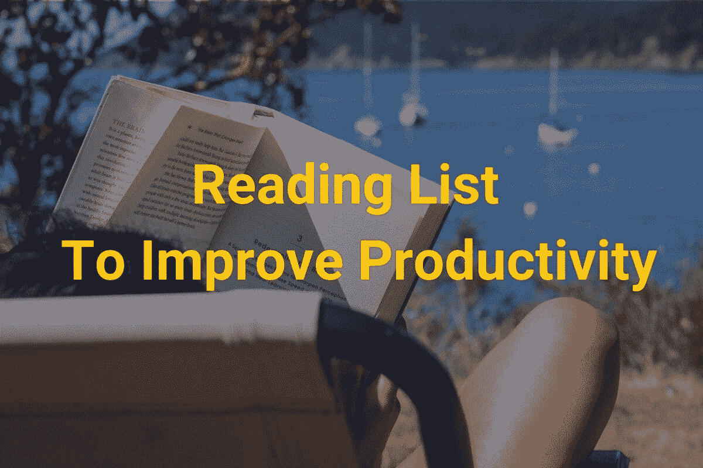
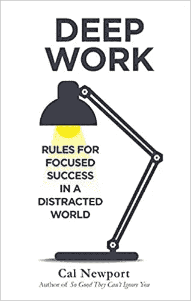
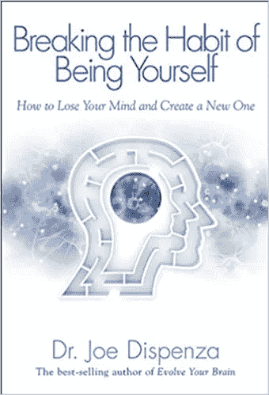
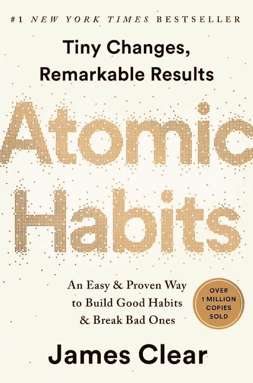

# 我二月份的阅读清单——提高生产力

> 原文：<https://medium.datadriveninvestor.com/my-reading-list-in-february-improve-productivity-bc04faf201ab?source=collection_archive---------21----------------------->

## 我研究了那三本书，我相信它们会帮助我保持专注、耐心和高效。

Photo by [Greg Rosenke](https://unsplash.com/@greg_rosenke?utm_source=unsplash&utm_medium=referral&utm_content=creditCopyText) on [Unsplash](https://unsplash.com/s/photos/reading-productivity?utm_source=unsplash&utm_medium=referral&utm_content=creditCopyText)

## [1。深度工作](https://www.amazon.com/Deep-Work-Focused-Success-Distracted-ebook/dp/B013UWFM52/ref=sr_1_1?crid=3F87JRLSSF66A&dchild=1&keywords=deep%20work&qid=1612090260&sprefix=deep%20work%2Caps%2C228&sr=8-1)

我最喜欢的一本来自加州新港的书是<so good="" they="" can="" ignore="" you="">。这本书给我留下了深刻的印象，所以我渴望阅读另一本来自加州新港的知名书籍——《深度作品》。</so>

我听说这本书已经有一段时间了，但还是有动力去读它。我一直认为我是一个有效率的人，我对自己的效率很满意。直到最近，在每天长时间 100%专注地工作后，我有一个严重的眼睛问题。我想知道是否有更聪明的方法来提高效率？我相信这句话“你不知道你不知道的”。也许有办法提高我的生产率，减少工作时间，但产出不变？因此，我决定将这本书加入我二月份的阅读清单。

## [2。打破做自己的习惯:如何失去理智并创造一个新的](https://amzn.to/3anTj4Y)

我从去年三月开始冥想。在禁闭和许多其他发生在我身上的负面事情中，我晚上无法入睡，一直处于不稳定的状态。所以我决定尝试冥想。不到一周，我晚上就能睡个好觉了。从那时起，我就一直这样做，但我不得不承认，我觉得冥想是一项任务。有几次，如果我不在家或者我的日常事务改变了，我会跳过它。

我看到这本书的一个推荐，帮助人们理解冥想背后的原因，所以它会向你解释当你冥想时你的大脑发生了什么，并明确冥想好处背后的所有原因。作为一个逻辑思考者，我想更多地了解它，理解冥想的具体好处，我相信它会帮助我坚持这个习惯。

## [3。原子习惯](https://amzn.to/2MDufig)

根据评论，这本书教你如何微小的习惯可以改变你的生活或帮助你成为你想成为的人。这不是一本以理论为基础的书，而是一本以行动为导向的书。当我在亚马逊上阅读这些评论时，对许多人来说，它就像一本改变人生的书。我很久以前就听说过这本书，但还没有机会读它。为了完善生产力主题阅读清单，我将把这本书加入我的二月阅读清单。

有了这三本书，我可以学习如何更有效率，培养正确的习惯，并坚持我的冥想之旅。

有哪些改变了你生活的书，你肯定会推荐给大家？

如果你想了解更多关于如何管理你的钱，如何高效工作，如何每天进步，一定要订阅[快速跟踪播客](https://www.fasttrack.life/)或[快速跟踪 YouTube 频道](https://bit.ly/3ngv4KQ)。

*原载于 2021 年 1 月 31 日*[*https://www . fast track . life*](https://www.fasttrack.life/blog/my-reading-list-in-february-improve-productivity)*。*