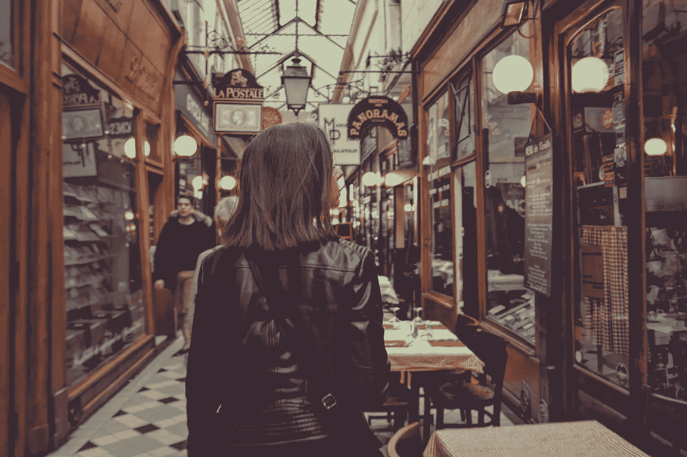

# 我 2021 年的购物禁令

> 原文：<https://medium.datadriveninvestor.com/my-shopping-ban-for-2021-c46c7cdea0c2?source=collection_archive---------18----------------------->

Photo by [Tristan Colangelo](https://unsplash.com/@tristancolangelo?utm_source=unsplash&utm_medium=referral&utm_content=creditCopyText) on [Unsplash](https://unsplash.com/s/photos/shopping-bags?utm_source=unsplash&utm_medium=referral&utm_content=creditCopyText)

我会难过吗？很有可能。我会发疯吗？这也很有可能。

一个人决定一整年不购物，这有什么大不了的吗？在 2020 年世界濒临灾难和实际灾难的背景下，没有什么大不了的。

但对我来说，这不仅仅是改变已经成为一种无意识的、昂贵的习惯。这是关于重新安排我如何应对个人挑战。

作为一个 15 岁的女孩，她如饥似渴地看着《洛杉矶法律》这样的电视节目和《华尔街》和《上班女郎》这样的电影，我觉得衣服、包包和鞋子会帮助我创造……嗯，我。或者更准确地说，一个理想版本的我。

关于如何应对生活中日益增长的不安全感，以及如何最好地进入成人世界，既没有书籍，也没有谷歌提供的自助建议。所以我自己编的。

因此，到我 19 岁的时候，我已经进入了投资银行业的百万富翁世界。我也很难跟上看起来像一个企业银行专业人士的花费。

自从我买了第一套西装以来的 29 年里，我意识到，衣服不能成就男人，也不能成就女人。由于糟糕的决策，衣服会带来很多债务和自我厌恶。

在强调我在过去的六个月里没有写一篇中型文章的事实时，我终于在一本名为《更少的一年》的书中找到了灵感。她写了自己不购物的一年。

她面临的生活挑战与她在某一天要穿什么无关。她面临酗酒。破裂的关系。她父母的离婚。以及她对未来生活的展望。

在她过去，作为应对这类挑战的一种方式，她的信用卡经常能帮上忙。在她不购物的一年里，她别无选择，只能面对严酷的生活现实，没有购物疗法提供的多巴胺这种抚慰剂。

在那一年，她发现自己从来都不是一个重视物质的人，而是她生活中的人和他们共同的经历。而不是挂在她衣柜里的东西。

这就是我为什么要这么做的关键所在。不是因为它会以任何方式改变世界，而是希望它会改变我。

我希望从 2021 年 1 月 1 日到 12 月 31 日的购物禁令能帮助我珍惜我已经拥有的东西，缓解我应该或不应该买什么的决策疲劳。

例如，我需要一件新的露肩泳衣吗？它被评为《Vogue》2019 年最佳泳衣。不，我不知道。我会想尝试一条完美的妈妈牛仔裤吗？它能托起臀部，抚平腹部。不，我不知道。

 [## 在家工作如何提高我的工作效率|数据驱动型投资者

### 在家工作确实激发了我最大的潜能，让我更有效率。因为在家工作给了我…

www.datadriveninvestor.com](https://www.datadriveninvestor.com/2020/07/29/how-working-from-home-increased-my-productivity/) 

Cait 还提供了一些指导原则。她希望任何想应对这一挑战的人都能列出三个清单，即:

**(1)必需品清单。**这包括那些我用完了就可以买的东西。“咄”的项目，如食品杂货和化妆品，但也给别人的礼物。

**②非必需品的清单。**这份清单迫使我明确说明 2021 年我不允许买什么。对我来说，这些是衣服、鞋子、包包和(囧)书。

**③批准的购物清单。**感谢这份名单。这些是我被允许购买的特定物品。所以现在开始。既舒适又性感的冬季套头衫。与丈夫共度特别夜晚的鸡尾酒礼服。还有一件夏季浴袍，原因我就不说了。

值得注意的是，这项购物禁令不包括外出就餐或旅游等“体验”成本。

也不包括替换那些已经磨损的物品，比如我的运动鞋。但是，它必须基于一出一入的原则。

例如，我不能因为运动鞋碰巧在打折，就用一双运动用的、另一双休闲用的、第三双来代替我的运动鞋。一双出去，一双进来。

Cait 还建议**告诉所有你认识的人**。对我来说，这是我在 Medium 上的所有 5 个读者和我的丈夫。如果有完美的责任伙伴来应对这种挑战，那就是丈夫。

但事实上，在经历了 2020 年可怕的一年后，我人生中第一次觉得自己已经准备好迎接这个挑战了。

我已经清点了我所有的库存，情况看起来不错。一个可爱的丈夫。一个充满爱的家庭。一个了不起的儿子。朋友圈。一个漂亮的家。

我也有一个胶囊衣柜，可以让我在夏天保持凉爽，在冬天保持温暖，并且穿着适合几乎任何情况或场合。

因此，对于我所有的读者，我在此承诺，在 2021 年的每个月底，我都会写下我在那个月是如何度过的。我会给你统计我的理智、快乐和自信。我还会写下我的胶囊衣橱，尽管很简短。

再见 2020，愿我们永不相见。你好 2021，愿我们成为朋友，善待彼此。

## 理智:可疑
快乐:稳定
信心:80–85%

**访问专家视图—** [**订阅 DDI 英特尔**](https://datadriveninvestor.com/ddi-intel)