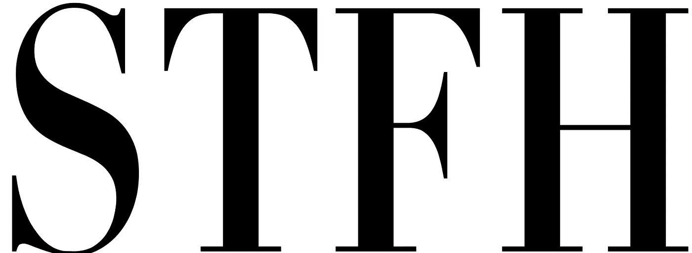
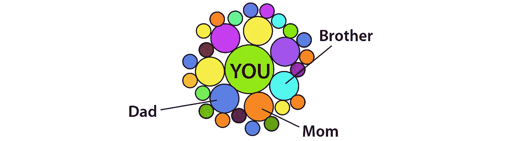
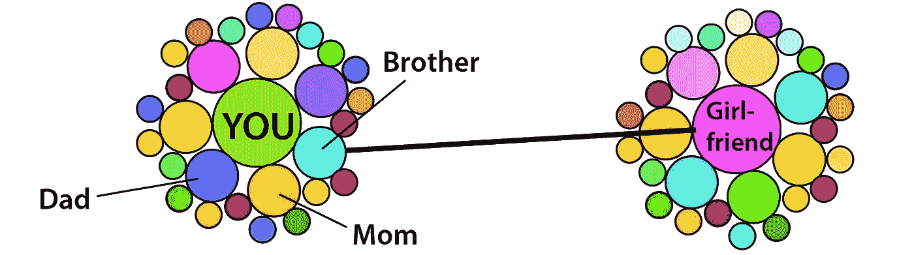
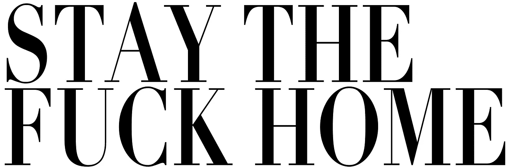
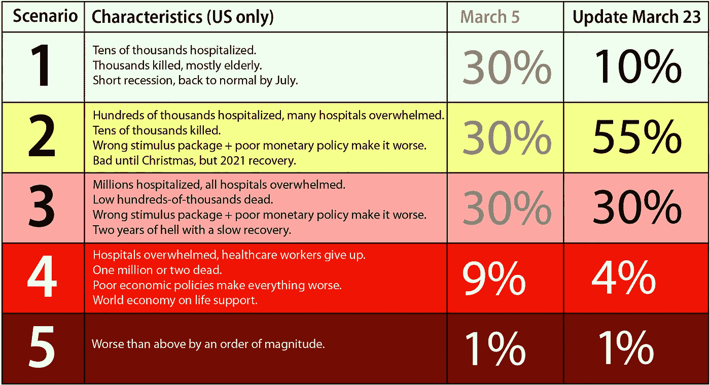

# 我的社会病毒载量就是你的社会病毒载量

> 原文：<https://medium.datadriveninvestor.com/my-socioviral-load-is-your-socioviral-load-1dcf3da536b1?source=collection_archive---------2----------------------->

## 现在的年轻人应该做什么。

年轻人，我知道你们很想念你们的春假。你一定想知道你在家里和爸爸妈妈一起做什么，而不是在劳德代尔堡的泡沫派对上。

放下你的 WhatChat，InstaPin，和 SnapTok 12 分钟。我们得谈谈。

事情是这样的:你现在对冠状病毒的暴露量是过去十天左右你接触过的其他人以及他们接触过的所有人的暴露量的总和，等等。看起来是这样的:

让我们想象你住在家里，在一个标签上做你的在线微积分，同时在另一个标签上看[王子 EA 视频](https://www.youtube.com/watch?v=dqTTojTija8)。或者你失业了，决定回来。偶尔，你会瞥见你的弟弟，他已经 17 岁了。他有一个大家都认可的女朋友——他们已经在一起几个月了。他和他的女朋友经常见面，然而“无论从哪方面来看”，他们都相距甚远。所以好像每隔几天，他们就隔着六尺的距离去散步一次。或者做点别的。以下是你现在的病毒暴露情况:

从病毒的角度来看，你现在和你哥哥的女朋友以及她过去十天交往过的所有人都有联系。

你的曝光率增加了一倍。

每一个包装、牛奶盒、把手、狗、桌面、厕所、你接触的人、你乘坐的每一辆公交车，都有可能成为使你的病毒暴露增加的“一个”,成为受感染的携带者，并可能出现症状。我们收到越来越多的[关于年轻人，甚至是 20 多岁的运动员，因为几乎无法呼吸而去医院的报道。](https://www.nytimes.com/2020/03/23/opinion/coronavirus-young-people.html)

 [## 保护主义、政治和经济动荡|数据驱动的投资者

### 美国股市昨日出现 400 多点的大幅反转，为未来的事情发出了警告信号。市场…

www.datadriveninvestor.com](https://www.datadriveninvestor.com/2018/06/28/protectionism-politics-economic-turmoil/) 

你的总风险是你过去十天接触过的人的所有风险的总和。这是一个指数函数。你接触圈子里的每个人感染病毒的几率都会翻倍。

我们从最近的[帝国学院论文](https://www.imperial.ac.uk/media/imperial-college/medicine/sph/ide/gida-fellowships/Imperial-College-COVID19-NPI-modelling-16-03-2020.pdf)中了解到，仅仅做“社会距离”和隔离有症状的人是不够的。我们不能只关注缓解。我们需要专注于遏制。这是一个微妙的区别，所以让我这么说吧:我们都必须…

在接下来的两个月，可能是六个月，这都是真的。

对不起我真的是。但是我们对此不够重视。

# 年轻人的群体免疫

这里有一个潜在的解决方案，我们称之为 Boris 解决方案(简称 BS):

1.  要求所有 30 岁以下的人都出去生病。
2.  在他们康复前保持隔离。
3.  然后他们可以回到正常的生活，甚至回到学校，如果他们的教授足够年轻(或勇敢)的话。

如果我们能做到的话，这将是可行的。问题是第二步。就像你的小弟弟很难离开他的女朋友两个星期一样，保持这个群体的良好隔离几乎是不可能的。只需要一个小小的失误，整个计划就会让当地人口崩溃，迫使医生选择谁生谁死。

我会说，如果你能做到，你就应该去做。例如，如果几百个年轻人可以去一个农场，在没有外界接触的情况下生活一个月，这实际上是可行的。带一个生病的人一起去生火。如果你有东西送来，应该放在路的尽头，让居民在卡车离开后去取。打牌，开泡沫派对，放音乐，牵手，发烧的时候多喝水，希望没人淹死在自己的痰里。

不幸的是，我们无法对大多数年轻人做到这一点。反正看起来[免疫力可能不是得了这个病](https://www.reuters.com/article/us-china-health-reinfection-explainer/explainer-coronavirus-reappears-in-discharged-patients-raising-questions-in-containment-fight-idUSKCN20M124)之后得到的。

# 对老年人的隔离

这是相反的方法。把所有测试结果为阴性的 61 岁以上的人都送去火星。或者塞多纳。或者某个他们不会接触到我们其他人的地方(不用费心根据这一段来计算我的年龄)。让他们打桥牌，喝威士忌，睡午觉。再说一遍，这是个好主意。同样，第二步是棘手的部分。一个失误，针刺，温泉变成了停尸房。不要看*沃利*或*向上*——他们不会给你任何关于隔离的实际想法。28 天可能更现实。

# 什么会出错？

真正生病的人会不由自主地咳嗽。他们被告知去医院，那里的工人压力大得令人难以置信。最有可能的是，一个病人需要使用呼吸机 3-4 周。最有可能的是，那个病人需要插管。这不是度假。这是躺在床上，大部分是镇静剂，管子从你的喉咙里出来，人们监视你，清洁你的便盆，给你洗澡，给你药物，观察感染，在你咳嗽时帮助呼吸机，甚至更糟。整整四周。

我们只有 20 万台呼吸机。很快，我们所有的呼吸机都会投入使用。新病人会被拒之门外。

随着越来越多的人因为心脏病发作、车祸、需要化疗、受伤、肾结石、细菌感染和其他紧急需求而来到医院，医院也将他们拒之门外。他们被占领了。有可能在未来几周内死亡的人中有一半或更多不会感染新冠肺炎病毒。

许多怀孕的妇女现在计划在家分娩。我的猜测是，这将大大降低美国 2020 年的婴儿死亡率。当然也有需要就医的情况，但是自然率比我们习惯的要低很多。今天，准妈妈们面临着特殊的计划挑战。但是更少的剖腹产将是一件好事。我们可能会看到住院分娩的永久下降。对于孕妇来说，导尿、分娩指导、防护服、良好的计划、选择和隔离条件比以往任何时候都更重要。

不仅医院现在超负荷运转，2021 年出生的婴儿数量也会大幅下降。这种差距将持续多年，影响学校、医疗保健系统，甚至牙医。

医护人员有孩子、父母和责任。他们知道他们的一些同事会生病，有些会死去。当他们在不可能的条件下疯狂工作时，他们必须依靠他人来照顾他们的家庭。没有护具只需要一瞬间就会生病，然后*他们*需要呼吸机。

父母必须照顾他们的孩子。所以如果孩子感染了病毒，父母也会感染，反之亦然。如果父母中的一方必须继续工作，那他就不应该呆在家里。通过 Skype 保持联系。

现在出现了使问题复杂化的其他事情:地震、流感、抑郁症、自杀、破产、葬礼、互联网超载、严重短缺、停电、保险公司破产、我们国家日常发生的大规模谋杀、旅行/旅游业陷入困境、餐馆倒闭、额外开支等。

今年剩下的时间里，将会有 5%的急性冠状病毒病例和 95%的其他疾病。这是没有办法的。

当我们有了疫苗之后，群体免疫就会到来。假设我们在秋天有了好的疫苗，我们只需要制造、分发和运送足够的疫苗来覆盖 80%的人口。我猜测这一事件发生在 2021 年下半年，尽管它可能会更早。

简而言之，我们生活在一个几乎完全政治两极化的国家，一个[全面测试集群操](https://www.theatlantic.com/health/archive/2020/03/how-many-americans-are-sick-lost-february/608521/)，一个[总统指责前任政府当前的失败](https://nymag.com/intelligencer/2020/03/trump-coronavirus-hospital-masks-blames-obama-ppe.html)，[因“中国病毒](https://www.usnews.com/news/health-news/articles/2020-03-18/trump-dubs-covid-19-chinese-virus-despite-hate-crime-risks)”而犯下的仇恨罪行[，以及](https://www.cnn.com/2020/03/19/business/coronavirus-gun-sales/index.html)大规模的枪支销售。股市出现了 2008 年以来的最大跌幅。国债即将大幅上涨。两位总统候选人都年近七旬，都有心脏病。

会出什么问题呢？

# 什么是正确的？

温暖的天气可以阻止病毒的传播。一些研究人员表示，温暖的天气正在摧毁病毒，而温暖的国家并没有真正感染病毒。一份报告指出，美国北半部比南半部受到的打击更大。其他人说大多数国家将会遭受重创，温暖的天气可能只会有所帮助。现在说太多还为时过早。

有很多潜在的治疗方法。尽管我们听说了一些有效的方法，但我们仍然需要 2-6 个月的时间才能获得真正的数据，为我们大规模治疗患者开绿灯。

在世界各地，成千上万的志愿者和企业家正在研究数据、应用程序、口罩、呼吸机等等。主要项目有:

*   HelpWithCovid 是一个由 OpenAI 运营的志愿者网站，可以引导项目获得资金。
*   **open demic 是一个网站，你可以在这里输入你的健康信息，以帮助创建症状的“热图”。**
*   **[**开源 COVID19 医疗用品**](https://www.facebook.com/groups/670932227050506/) 是一家脸书集团，拥有超过 23，000 名成员，从事从口罩到基本用品到呼吸机的各种工作。**
*   **[**Foldit**](https://www.fastcompany.com/90470524/how-scientists-are-crowdsourcing-a-coronavirus-vaccine) 正在利用成千上万人的机器的计算能力，试图寻找可以治疗或防止病毒造成伤害的新药。**
*   **谷歌的 [**Deepmind** 正在寻找蛋白质解决方案](https://singularityhub.com/2020/03/17/how-deepminds-ai-is-working-to-decode-coronavirus/#.XneezSbMR4U.linkedin)。 [IBM 的 **Summit 计算机**确定了 77 种待测试的潜在化合物](https://futurism.com/neoscope/fastest-supercomputer-finds-potential-covid-treatments)。**
*   **以色列的 [**Circles**](https://circles.eco/) 有数百个合作项目正在进行中，但目前只有希伯来语。翻译即将推出。**
*   **[**stop the spread**](https://www.stopthespread.org/)已经要求企业高管齐心协力，带领他们的公司帮助对抗病毒。**
*   **前线响应者基金正在从捐助者那里募集资金，为前线卫生工作者提供个人防护装备。**

**一个重要的发展是美国医疗工作者口罩和用品的国内产量增加。威望美国公司从每天 25 万个口罩增加到 100 万个。 [**3M** 已经达到每月 1 亿个 N95 口罩](https://news.3m.com/blog/3m-stories/3m-responds-2019-novel-coronavirus)。Zoll 是美国为数不多的通风机制造商之一，其产量已经翻了两番。Ventech 正在与通用汽车公司合作寻找零件，以增加他们多功能通风机的产量。**

**可悲的是，骗子正在假装销售这些公司制造的产品，这可能会导致数百人死亡。我希望我们能为他们找到一个拥挤的牢房，其他骗子在那里咳嗽。**

**赶紧多做些呼吸机就好了。但是呼吸机需要训练有素的人员来维护和观察病人，医生必须将管子插入注射了镇静剂的病人体内。如果没有必要的医务人员，那么呼吸机将无法使用。州长们要求退休医生回来工作。失业的航空公司人员可以在医院轮班，帮助腾出护士和护士助理来照顾病人。前餐馆工人可以帮助那些需要吃饭、睡觉、工作、重复的人做日常杂务。**

**希望可以多使用无创呼吸机。非侵入式呼吸机使用面罩，而不是喉咙里的管子。那会给我们更多的可能性。**

**还有其他的好消息。[苹果在中国重开全部 42 家门店](https://www.theverge.com/2020/3/13/21177964/apple-stores-china-reopened-coronavirus-covid-19)。我们要到 7 月份，或者可能更晚，才需要报税。政府将帮助人们推迟支付抵押贷款至少几个月，可能更长时间，房东可能会理解，因为替换租户将是一个挑战。美联储正在随机印刷钞票。如果我们能在今年将它扼杀在萌芽状态，明年接种疫苗，让经济再次运行，那么我们就失去了一年，我们又回到了正轨。**

**对富人来说:艺术市场正在被摧毁，这是拿起伟恩·第伯的画的好时机(或者干脆由 T2 买下拍卖行本身)。[至少在接下来的六个月](https://www.businessinsider.com/coronavirus-outbreak-could-wipe-out-43-billion-in-luxury-sales-2020-2)，奢侈品将会“打折”。**

# **政府官员只有在用尽所有其他选择后才会做出正确的决定**

**不幸的是，我们努力工作的政治家们即将通过一个不会奏效的刺激方案。这相当于给一个刚刚失业的人相当于一周工资的小费。美联储刚刚宣布了一项支撑市场的意外计划。**

**财政刺激让国家陷入更深的债务，而且不会持续太久。正如我们多次看到的那样，糟糕的货币政策会让事情变得更糟。QE(印刷钞票)有所帮助，但它太随意了，没有达到任何经济目标。**

**在我给美联储 [*的公开信*](https://medium.com/@pullnews/an-open-letter-to-the-federal-reserve-78cf9a6e5339) 中，我解释道，一个好得多的货币政策应该宣布一个名义 GDP 增长目标，并承诺实现这一目标，必要时通过印制和销毁货币来实现。如果我们能以不同的方式做事并得到不同的结果，我们就能从这次冲击中恢复过来。了解更多信息，请访问世界上最好的宏观经济学家之一斯科特·萨姆纳的访谈。这是视频。从你的在线经济学课程中抽出一个小时的时间，了解这一点及其重要性:**

# **我们能期待什么？**

**我又更新了我可能的场景。请记住，我们只有大约 100 万张病床，其中大部分已经被使用。我们能在短时间内建造多少？我想我们马上就会知道了。**

****

**我现在更关注场景 2，甚至可能是场景 2 的低端。这并不奇怪。我们总是一个威胁，可能会打破场景 1，然后不得不重新洗牌。有足够的理由相信第二种情况。中国和韩国正在走下坡路([尽管没有他们希望我们相信的那样](https://www.youtube.com/watch?v=kBCh5P3oiOI))。德国的病例比我们预期的要少。美国和英国即将成为下一个震中，但也许我们会幸运一点，事情不会变得那么糟糕。另一方面，这种病毒在几个温暖的地方呈上升趋势，比如澳大利亚和泰国。场景 3 是一个非常真实的可能性，但是我现在将重点放在场景 2 上。**

**不幸的是，美联储将使经济复苏变得更加不可预测——可能要多几年。我还降低了对第四种情况的预测，因为我们正在认真考虑采取重大举措。学校已经关闭。人们都呆在家里。我不认为我们会走到那一步。但是场景 3 已经够糟糕了。这是我在 4 周内第三次不得不重新绘制这张图表——让我们希望我们解决方案 2。**

# **拉平曲线**

**每个人都在谈论“拉平曲线”，但是[他们不理解这些数字](https://medium.com/@joschabach/flattening-the-curve-is-a-deadly-delusion-eea324fe9727)。是 3.3 亿人对 20 万台呼吸机。如果我们能延迟这种疾病的发作以保持在极限之下，我们将不得不延迟它至少十年。那是不会发生的。另外，真正的限制不是呼吸机，而是那些被授权安装、监控和使用呼吸机的人。**

**现在我们到了没人想听的真正选项，但意大利人希望他们三周前就这么做了。我们需要 **STFH** ，这可能会持续整个夏天。我们不能搞砸了。没人说这会很有趣。让孤立成为你的新超能力。让我来分解一下。**

## **不要被感染**

**每个被感染的人都会将感染传播给其他人。最终会有人去医院，那里的工作人员会当场做出生死抉择。你必须尽自己的一份力量，110%保证不被感染:**

*   **经常洗手。**
*   **对从外界进入你家的每一件物品进行消毒。**
*   **不要去商店。把所有东西都送过来。这将为那些可以独自工作并把东西送到你家门口的人创造就业机会。**
*   **离所有人十英尺远。假设你有病毒，其他人也有。**

**如果你身体健康，想走出家门，去找一份仓库或送货员的工作。**

## **假设每个人都有病毒，包括你**

**除非你的医生要求检查，否则你真的不需要检查。除非你的症状超出了普通感冒或流感的范围，否则你真的不需要打电话给医生。简单地假设你有。假设你的室友有。假设每个和你打交道的人都有。那是最好的行动方式。**

**最难的是有小孩的家庭，他们必须和小孩亲近。那些父母可能需要更多的信息和支持。任何能远离其他人的人都应该远离。丈夫和妻子保持隔离是个好主意，这样如果一方感染了病毒，另一方就不会。从 [*学到更多你应该考*](https://medium.com/datadriveninvestor/should-you-get-tested-for-the-coronavirus-bf6bc06b44ad) *？***

## **不要给医疗系统增加负担**

**如非必要，不要开车。让专业司机给你带东西。如果你不出门，就不需要戴口罩。避免家庭事故。**

## **零社交生活**

**我和你一样不喜欢这样，但是出去玩，约会，旅行，喝咖啡现在都正式结束了。零。STFH，并充分利用它。**

## **身体健康**

**既然你有时间，你可以也应该锻炼一个小时或更多。跑步没问题。如果你不太冒险开车或者在容易受伤的地方，徒步旅行是很棒的。订购划船机或 Peloton。进入一个 YouTube 的屁股鞭打频道，开始流汗。在八周内，你会有很好的身材，如果一切顺利的话，为可能的社交夏天做好准备。或者至少你的 Instagram 泳装照每个人都想看。**

**有很多关于饮食、睡眠、补充剂、“如何增强你的免疫系统”、减肥等方面的建议。几乎所有这些事情都是未经证实的，没有效果(或者更糟)。如果你想调查这些事情，从 [www.inreality.show](http://www.inreality.show) 开始，在[www.sciencebasedmedicine.com](http://www.sciencebasedmedicine.com.)继续。现在是在健康和饮食方面教育自己的好时机——这两个环节会让你开始。**

## **寻找创造性的方式来度过你的时间**

**现在是充电和重置的绝佳时机，我说的不是小睡。你可以阅读。你可以学习。你可以写作。可以做视频。你可以帮助别人。**

**我们的信仰体系中都有很多偏见。抓住这个机会，忘掉一些你认为你知道的事情，找到新的观点，打开你的思维，迎接新的可能性。例如，一些气候活动家呆在家里抱怨他们不能出去宣布世界末日。这对你有意义吗？你调查过了吗？真的看了？现在你有时间这样做了，所以这里有两个地方开始:**

**[**全球变暖的假人**](https://medium.com/@pullnews/global-warming-for-dummies-a24928b51ca9)**

**[**我们来看一些气候数据**](https://www.youtube.com/watch?v=bJWnMA3-sQs)**

**你很幸运——你有机会重新思考你在大多数话题上的立场，因为这个世界可能会因为我们都在经历的“间隔年”而发生相当大的变化。你还没有固定下来。你喜欢学习。为什么不和我一起踏上探索之旅，挑战自我，开拓新的思维方式呢？为什么不一起炸教育，创造更好的东西？未来几周我会在媒体上宣布。同时，你可以从这个开始:**

**[**Inreality.show**](http://www.inreality.show)**

**[**佐丹奴研究院**](http://www.giordano.institute)**

# **好了，布玛儿，我能回到刚才的话题了吗？**

**你可以，或者你可以成为解决方案的一部分。现在是年轻人带头提出新的倡议和对策的时候了。许多人会将这一整年视为“暂停”或“除了网飞，我什么都没做的一年”，但少数人会抓住机会，创造新的东西或加入其他人的创新行列。我想创建一个冠状病毒商店，人们可以订购 t 恤和其他有趣的物品。还有 corona radio——一个专门播放人们在家创作的歌曲和视频的频道。我很想制作一部关于疫情的纪录片，收集人们拍摄的视频，然后编辑成每天的故事——每个人都在家里和电话上工作，收集、整理、追踪镜头，把故事拼凑起来。如果做得好的话，可以获得奥斯卡奖。也许有一种新的实时真人秀类型，由普通人发送剪辑和一套锐利的工具将它们编织成一场比赛、一个故事、一场游戏等等。有没有一个游戏可以让我们一起玩，让更多的防护服到达医院？那会是什么样子？**

**现在有成千上万的创造性解决方案涌现出来——这可能是一个在线创意新时代的开始。**

**我不认为我们会回到仅仅两个月前的旧世界。我也不认为我们将生活在一个病毒偏执和分离的世界。相反，我认为这场混乱，这场危机，将给我们一个机会去思考新的想法，尝试新的东西，比如更好的货币政策。如果 [Ev Williams](mailto:ev@medium.com) 要开始[审查人们在媒体上写的东西](https://www.zerohedge.com/health/covid-19-evidence-over-hysteria)，那么可能是时候发明一个新的发布平台了。我认为这一时期可能会带来更多的创新，因为人们会更愿意质疑现状。如果你想参与其中，让我们一起创造未来。**

**接下来的几个月，STFH。**

**哦，那你哥哥呢？让他读一下[这首](https://www.lovense.com/teledildonics)。**

**如果你认识一个投资者或者可以帮我的新研究所筹集资金的人，如果你对接下来的几个月有想法，请联系我。**

**如果你做到了这一步，这个系列的下一期是: [***没有巅峰***](https://medium.com/@pullnews/there-is-no-peak-a-critical-assessment-of-our-collective-situation-8e3b73d876ac) 。**

****

**[**大卫·西格尔**](http://dsiegel.com/) 是 DC 华盛顿州的一位连环企业家。他是[支柱工程](http://pillarproject.io/)[和 2030](http://2030.io/) 的创始人。他是《令牌手册》**、* [、 *Open Stanford* 、](http://www.openstanford.com/)、*、*、[T21《文化甲板》、](http://theculturedeck.com/)、、[、*气候好奇*、*和*、**](http://climatecurious.com/)**[T35《气候数据之旅》](https://www.youtube.com/watch?v=bJWnMA3-sQs)* 的作者。他的全部工作都是在[**dsiegel.com**](http://www.dsiegel.com/)进行的。****