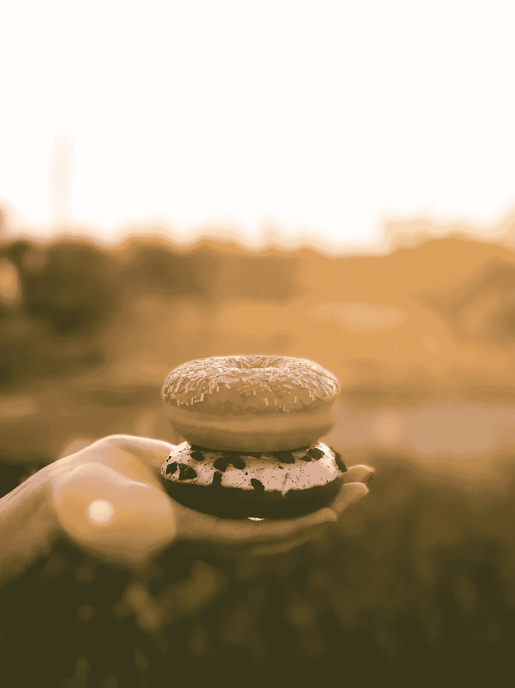

# 我是如何戒掉的故事加了糖

> 原文：<https://medium.datadriveninvestor.com/my-story-how-i-quit-added-sugar-4e1cc1605080?source=collection_archive---------21----------------------->

## 健康改善

## 我戒了 21 天的糖，并和我的身体和大脑分享到目前为止发生的事情

Photo by [Brigitte Tohm](https://unsplash.com/@brigittetohm?utm_source=unsplash&utm_medium=referral&utm_content=creditCopyText) on [Unsplash](https://unsplash.com/s/photos/donut?utm_source=unsplash&utm_medium=referral&utm_content=creditCopyText)

我一直喜欢吃甜食。没办法，我只是习惯每天吃很多糖果、巧克力、饼干。当我换了工作，我的雇主提供免费可乐时，我也开始大量饮用可乐。

我们都知道它对我们的身体、牙齿、血糖水平和精力有害，没有人会感到惊讶。但是，朋友，这太棒了！其实，**是**。

 [## 成功人生的 25 种自我提升方式|数据驱动的投资者

### “我活得越久，学到的就越多。学的越多，体会的越多，知道的越少。”―米切尔·莱格兰德时间到…

www.datadriveninvestor.com](https://www.datadriveninvestor.com/2019/03/12/25-self-improvement-ways-for-a-successful-life/) 

我听说要获得一个新习惯或摆脱一个旧习惯，我们需要做出承诺并连续坚持 **21 天**。在那之后，你的**大脑会改变并习惯你的新行为**，并将其视为常规行为。这就是我决定去土耳其看看之后会有什么变化的原因。

所以，长话短说，事情是这样的:

# 能量水平

我一直错误地认为这些碳水化合物食物应该提高我的能量。当我长距离跑步时，它很有效，但当它成为日常生活的一部分时，它并不像我预期的那样有效。

因此，在最初的 5-7 天里，我的生活并不如意。我情绪低落，什么都不想做。但是大约一周后，我的能量水平恢复正常，现在我有足够的能量来度过活跃的一天。我不再经历那些过山车，**我一整天都精力充沛**，所以我早上锻炼，有足够的精力活跃到晚上。

当然，如果我需要跑马拉松，一些富含碳水化合物的甜食会派上用场。但是一天不吃这些不健康的零食，我会感到精力充沛。

# 脑

其中一个最令人担忧的问题与我的大脑活动有关。我以为是碳水化合物供给了我的大脑，让它按照我的预期工作。但是，幸运的是，它与脂肪和氨基酸有更多的关系，所以我可以连续工作几个小时而没有变化。

老实说，**在这个实验过程中，我没有任何与我的大脑表现相关的问题**，即使是在最初的几天。我只是试着去想除了甜食以外的任何事情，这有助于我的大脑活动保持在一个良好的水平。不然最后会想着这些甜甜的，让人垂涎三尺的零食，完成不了手头的任务。

所以，总的来说，还好，我只是需要**避免想甜食**。我认为我的大脑和以前一样工作良好，没有变化。可能比平时晚一点累，但没什么特别的。

# 情绪和情感

这确实改变了。我认为自己是一个头脑冷静的人。然而，我觉得自己在生活中找到了平衡。我有一个很好的情绪状态，很难被一些事情激怒，感觉我看着一切会让我发怒的东西(即使我很平衡)，就像它不再是一个大问题。

当你能处理任何事情的时候感觉很好。也许这是暂时的，但它是如此之好，即使它要走了，我也会努力保持这种心态。

# 失眠

我遇到了这个可怕的问题，这是我一生中最糟糕的事情之一。有时我根本睡不着，不得不躺上几个小时，直到我能睡一会儿。我说的“几个”是指 2、3 个小时，有时是 5-7 个小时。

有一次，我注意到在吃了很多糖果、巧克力或蛋糕后，入睡变得更加困难**。所以，午饭后我不再吃甜食，情况有所好转。但没有我去掉所有添加的糖好。**现在，我睡得很好**，太棒了。我只是不习惯在 7-8 小时内有足够的睡眠，也不习惯每隔一天就感到昏昏沉沉。**

# 重量

我从未患过肥胖症，但我一直想摆脱让我感觉身体状况不佳的“那几公斤体重”。但是，一旦我开始实验，体重秤上的数字就让我开心。我有智能体重秤，可以显示所有不同的数值，比如身体质量指数、脂肪百分比、肌肉量，当然还有体重。

尽管现在我吃得更多，但迄今为止我已经减掉了 4 公斤，现在，我的体重比过去 5-7 年都要少。肌肉量逐渐增加，因为我锻炼，所有其他参数都在变好。我希望通过这种节食方式，我能减掉更多的体重。

# 食物的味道

**现在的食物更好吃了**，我感觉它的味道更好了，太棒了，我有尝试新东西的欲望。此外，很可能，我的身体从中获得了更多的维生素和矿物质，因为消化系统工作得更好，很可能它使食物更加美味。

# 渴望

我没有渴望。头三天。我非常惊讶，以为不费吹灰之力就能冲过终点线。我感觉很好，不出意料。但是，第三天之后，情况变得更糟了。

哦，我有如此强烈的欲望，所以我什么也不想。我只想吃巧克力、蛋糕、冰淇淋、饼干、巧克力棒、喝果汁或可乐。那是一段艰难的时光。我想到的最有帮助的想法是，一切都结束了，我可以尽可能多吃点甜食。

最后，在第 17 或 18 天，我不再想吃甜食了，它看起来没有那么吸引人了。所以，令我惊讶的是，一旦 21 天的期限结束，我继续节食，我只是不想再吃甜食了。

# 糖果的味道

我想知道那次实验后的味道如何，所以，在第 24 天，我强迫自己吃巧克力。而且**也不好**。味道很奇怪，有点混合，这不是我想吃的东西，因为它曾经每一秒钟。

我尝了冰淇淋，味道更好，但还是太甜了，所以我也不能吃。我试过黑巧克力口味的冰淇淋，我一直不喜欢的那种，更好吃。我想是因为它有点苦，所以它让它的味道变得更亮了。

最后，我试了一块巧克力，这是在杂货店等收银员时最受欢迎的巧克力之一。我非常喜欢它，有时很快就能得到我的那份能量，有时只是吃它，因为你想吃些甜食。再说一次，**的味道很糟糕。我不再想要它了。这怎么可能呢？**

我知道有些人有另一种体验，他们在停止吃添加糖后确实喜欢甜食，有时会偷吃。我不确定我是否会那样做。可能我会的。但是，现在，我不想再吃甜食了。

这是一个伟大的实验。我以后会吃甜食吗？我不知道，可能，是的。但只在特殊场合。因为，现在，**我不想再吃任何甜的东西了**，我只是不喜欢那种味道。