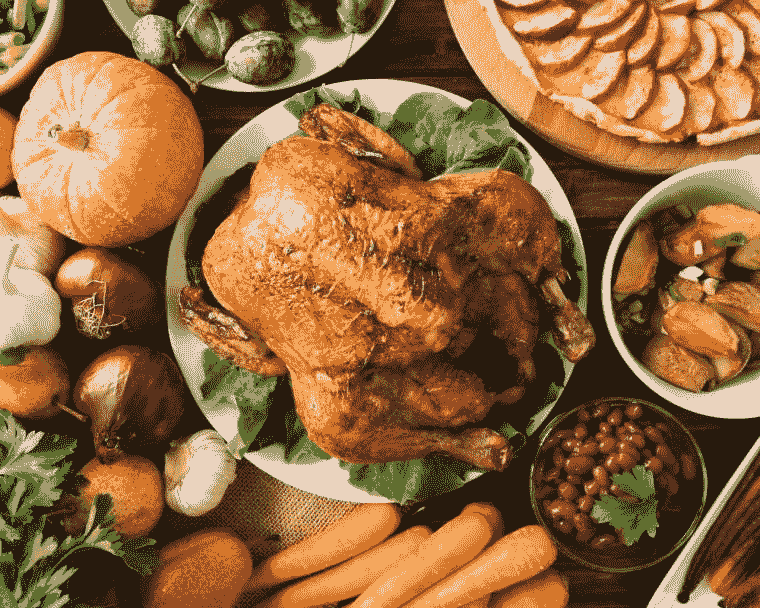
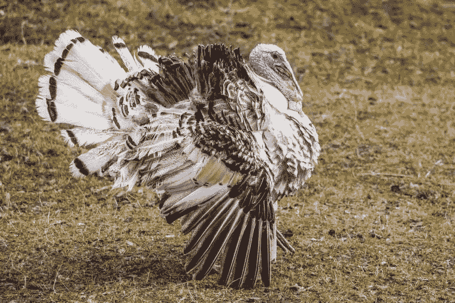

# 我的感恩节信息:像一只野生火鸡

> 原文：<https://medium.datadriveninvestor.com/my-thanksgiving-message-be-like-a-wild-turkey-ac507cd713bc?source=collection_archive---------20----------------------->

Happy Thanksgiving!

# 我的感恩节信息:像一只野生火鸡

感恩节快乐！本周末，火鸡将出现在许多美国家庭的菜单上。在这一时刻，我的感恩节信息是:要像一只野生火鸡。我相信你会对这条消息感到有点困惑，请耐心听我说。让我们从头开始，陪我到最后，你会明白我的感恩节信息。

感恩节是美国的一个传统，在 11 月的第四个星期四，美国各地都会庆祝。这是全家人聚在一起吃火鸡大餐的时刻。这一传统始于大约 400 年前的一个史诗般的故事，其中先锋精神、勇气、逆境、慷慨和感激占据了中心舞台。

故事发生在 1620 年，地点是现在的马萨诸塞州。这个史诗故事的主要演员是 100 名出生于英国的朝圣者，他们登上*五月花号*从英国出发，穿越大西洋，在新世界定居，寻求更好的生活。他们新家的第一个冬天是残酷无情的；他们到达得太晚，无法种植庄稼，结果，一半的殖民地居民死于饥饿和疾病。

由于万帕诺亚格部落的善良，幸存下来的成员熬过了冬天，他们与定居者分享自己的食物，并教他们如何种植各种作物，如玉米、大麦、豆类和南瓜。土著美国人也帮助定居者熟悉土地，并教他们狩猎海狸和钓鲑鱼的艺术。

1621 年的秋天，殖民者收获了他们的庄稼，看到美丽而丰收的景象，他们欣喜若狂。为了表达他们的感激之情，清教徒们组织了一场盛宴，并邀请当地的万帕诺亚格酋长和他部落的 90 名成员参加庆祝活动。土著美国客人带来了烤鹿和火鸡，并使用从土地上收获的新鲜水果和蔬菜准备了各种菜肴。这是一个持续了整整三天的快乐的时刻。

在美国，庆祝感恩节仍然是一件重要的事情，一家人围坐在餐桌旁，共享一顿丰盛的大餐，包括烤火鸡、火鸡填料、土豆泥、肉汁、青豆、玉米、小圆面包、蔓越莓酱和南瓜派。

每年都有一只幸运的火鸡在被赦免的美国总统拍照后，会住进动物保护区，而不是被放在别人的烤箱里烤。多么幸运的逃脱。这一传统可以追溯到亚伯拉罕·林肯，当时他的儿子泰德恳求他为家庭晚餐使用的火鸡写一份总统赦免书，认为火鸡和任何人一样有生存的权利。林肯同意了，火鸡活了下来，一个新的传统诞生了。

 [## 为什么唐纳德·特朗普是生活游戏的最终赢家|数据驱动的投资者

### 用唐纳德·特朗普(Donald Trump)的话说，他的“一生都在争取胜利。我不常输。我几乎从没输过。”特朗普会…

www.datadriveninvestor.com](https://www.datadriveninvestor.com/2020/10/28/why-donald-trump-is-the-ultimate-winner-in-the-game-of-life/) 

# 纳西姆·塔勒布给我们所有人的感恩节信息:让我们不要做火鸡

畅销书《黑天鹅》的作者纳西姆·尼古拉斯·塔勒布讲述了一只火鸡的故事，这只火鸡被农场主每天早上喂养 1000 天(注:一只人工饲养的火鸡平均寿命为 6 个月)。最终，火鸡开始期待农夫的每一次拜访都意味着更多的美食。他对自己的生活方式很满意。他认为自己过着美好的生活，和朋友们一起在农场闲逛，每天都被友好的农民喂养，农民很好地照顾他，确保他吃得好，继续成长，体重增加。土耳其意识到，他越大，农民似乎越快乐。因此，农场里的火鸡之间会有一场竞争，尽可能地增加体重，以获得农场主的青睐。但是，第 1001 天到来了。感恩节前两天，当农夫出现时，他没有带食物，而是一把斧头。土耳其很快意识到，它的预期完全错了。感恩节那天，火鸡得到了前所未有的关注，成为餐桌上的主菜。

> 纳西姆·塔勒布的感恩节信息:“让我们不要做火鸡。”

这个故事的 m *口述并不是用可观察到的过去作为未来的指示器*:

> *你没死过，不代表你是神仙。*
> 
> **纳西姆·塔勒布**

# **我的感恩节信息:像野生火鸡一样**

**你知道野生火鸡的奔跑速度可以达到每小时 25 英里，飞行速度可以达到每小时 55 英里吗？驯养的火鸡失去了快跑和飞翔的能力，这是因为它们的选择性繁殖旨在让它们长得异常大，并且比它们的野生表亲敏捷得多。囚禁和懒惰把一只快速飞翔的鸟变成了一块停滞不前的肉。**

****

**野生火鸡是群居的、爱玩耍的鸟类，它们聪明且个性鲜明，就像猫和狗一样，它们也很喜怒无常。它们是令人难以置信的好奇和好奇的动物，喜欢探索，它们非常擅长地理，可以了解非常大的区域的细节，这对寻找食物特别有好处。他们喜欢调情，当他们看到他们喜欢的雌性时，他们会表演给她留下深刻印象，炫耀他们美丽的羽毛。关于野生火鸡的另一个有趣的事实是，它们的寿命可以长达 10 年。**

> **乔安妮·里德感恩节信息:“如果你想活得长久、快乐、自由，最好做一只野火鸡。”**

# **来自野生火鸡的消息**

> **我很容易被激怒。我时不时会想入非非。我最喜欢的事情是狼吞虎咽地吸引注意力，让注意力都集中在我身上。我喜欢有观众。只要有机会，我就会骄傲地炫耀我的东西。看着我，我喜欢成为关注的焦点。感恩节听起来很棒。晚餐吃什么？**
> 
> ***野生火鸡***

# **来自古代墨西哥文化的信息:火鸡有着神圣的天性**

**在古代墨西哥文化中，火鸡被认为是神圣的，比如阿兹特克人和玛雅人，他们尊重火鸡惊人的美丽和骄傲自信。某些美国土著部落也将火鸡视为富足、牺牲和生育的象征。**

**作为一种精神动物，火鸡提醒我们尊重自己，尊重地球，关爱并滋养这两者。培养与地球的和谐关系是土耳其智慧的关键教义之一。也是我们今天的世界所需要的。火鸡也是社区、分享和真实联系的重要性的强烈象征，并提醒我们感激和意识到我们生活中的许多幸福。**

**我亲爱的朋友，这是你的追求。**

**PS:我感谢我的家人，我的朋友，我的读者。祝所有人感恩节快乐！**

**如果你喜欢这篇文章，你可以在 [Instagram](https://www.instagram.com/author_joanne_reed/) 、 [Pinterest](https://www.pinterest.co.kr/rlreed71/) 或[脸书](https://www.facebook.com/AuthorJoanneReed/)上关注我，或者你也可以喜欢:**

**我的书《这是你的追求》的音频版本已经推出。请随意查看并使用此[特别促销代码](https://www.audible.com/pd/B08LJQJWRW/?source_code=AUDFPWS0223189MWT-BK-ACX0-219667&ref=acx_bty_BK_ACX0_219667_rh_us)**

*   **[**我的感恩节寄语:要像一只野火鸡**](https://authorjoannereed.net/thanksgiving-message-be-like-a-wild-turkey/)**
*   **[**如何获得智慧？读一些伊索寓言**](https://authorjoannereed.net/how-to-gain-wisdom/)**
*   **[**如何寻找人生的意义？秘密被揭露……**](https://authorjoannereed.net/how-to-find-meaning-in-life-the-secret-is-revealed/)**
*   **[**成为英雄需要什么？**](https://authorjoannereed.net/to-be-a-hero/)**
*   **[**当生活给你柠檬时，让……**](https://authorjoannereed.net/when-life-gives-you-lemon-makes-lemonade/)**
*   **[**想打破社会距离感？感受音乐的力量**](https://authorjoannereed.net/want-to-break-social-distancing-feel-the-power-of-music/)**
*   **[**有声读物和讲故事的艺术。**](https://authorjoannereed.net/audiobooks-and-the-art-of-storytelling/)**
*   **[**希望好事发生在你身上？试试耐心**](https://authorjoannereed.net/want-good-things-to-happen-to-you-try-patience/)**
*   **[**想要冒险？然后挣脱你的舒适区**](https://authorjoannereed.net/want-an-adventure-break-free-from-your-comfort-zone/)**
*   **[**作者访谈—为什么讲故事很重要**](https://authorjoannereed.net/author-interview/)**
*   **[**谁知道是好是坏？**因祸得福](https://authorjoannereed.net/who-knows-whats-good-or-bad-a-blessing-in-disguise/)**
*   **[**要谈婚论嫁吗？是的，我知道。**](https://authorjoannereed.net/do-you-want-to-talk-about-marriage-yes-i-do/)**
*   **[**自助类书籍能成为畅销书，但它们实际上有用吗？**](https://authorjoannereed.net/self-help-books-can-become-bestsellers-but-do-they-actually-work/)**
*   **[**想要一段美好时光？拥抱滑板美学**](https://authorjoannereed.net/want-a-wheely-good-time-embrace-the-skate-aesthetic/)**
*   **[**女生，想感受被授权？学习自卫的艺术。**](https://authorjoannereed.net/the-art-of-self-defense/)**

**关于这个主题的更多信息，你可以在 [BookLocker 在线购买我的书](http://booklocker.com/9732)[这是你的任务](https://authorjoannereed.net/the-book/)，从[亚马逊](https://www.amazon.com/THIS-YOUR-QUEST-Experience-Happiness/dp/1634928474/ref=sr_1_1?ie=UTF8&qid=1545774871&sr=8-1&keywords=this+is+your+quest+by+joanne+reed)或从 [Barnes & Noble](https://www.barnesandnoble.com/w/this-is-your-quest-your-mission-joanne-reed/1128470006) 购买。电子书版本在亚马逊(Kindle)、巴恩斯& Noble (Nook)、苹果(iBooks) & Kobo 都有。点击这里查看我的[亚马逊作者页面](https://amazon.com/author/joannereed)或者我在[Booksradar.com](https://www.booksradar.com/reed-joanne/reed.html)的列表。**

****

**Joanne Reed The Author
Author of “This Is Your Quest”. You can’t buy happiness but you can buy books. Your mission, should you wish to accept it is to experience happiness**

## **访问专家视图— [订阅 DDI 英特尔](https://datadriveninvestor.com/ddi-intel)**