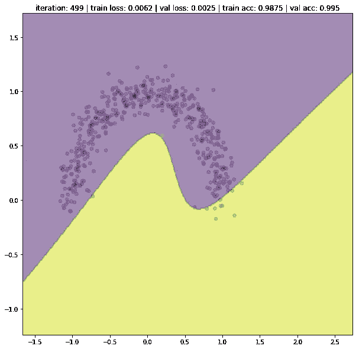
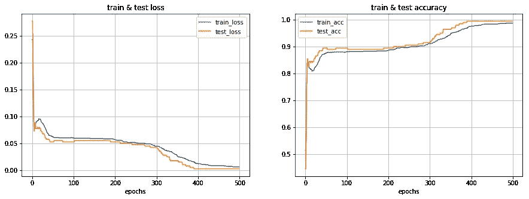
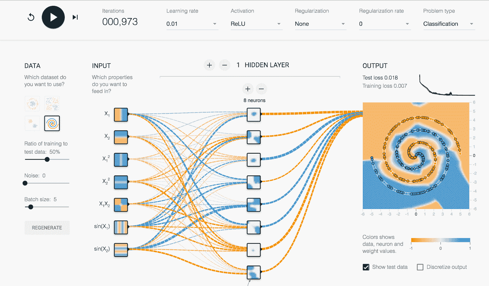
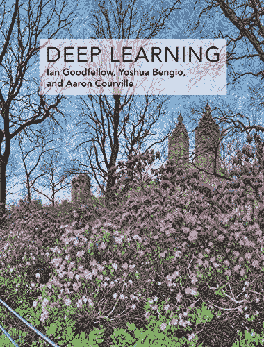

# 以下是我学习深度学习的顶级资源🌟

> 原文：<https://medium.datadriveninvestor.com/my-top-resources-to-learn-deep-learning-a14d1fc8e95a?source=collection_archive---------0----------------------->

## 黑进你的神经网络

> 深度学习制造了太多的炒作。很多人都在谈论它，但是有多少人真正理解它是如何工作的呢？

Photo by [Bank Phrom](https://unsplash.com/@bank_phrom?utm_source=unsplash&utm_medium=referral&utm_content=creditCopyText) on [Unsplash](https://unsplash.com/s/photos/press?utm_source=unsplash&utm_medium=referral&utm_content=creditCopyText)

在这篇文章中，我将分享一些帮助我更好地理解和解释神经网络如何工作的资源。

# 1 —一些培训幻灯片👨‍🏫

这是我为我的同事制作的深度学习培训课程制作的一组幻灯片。

它应该是实用的，因为它在大约 3 个小时内涵盖了很多东西。如果你是这个领域的新手，想对这个主题有一个总体的了解，这是一个很好的起点。

这里，先睹为快，它的一小部分在视频格式，说明了向前和向后传递的神经网络。
不要犹豫暂停或重放它，以了解发生了什么。

Forward and backward pass in a fully-connected network

**下面是我将在幻灯片中介绍的内容:**

*   不同行业的一些深度学习应用
*   人工神经元的概念
*   感知器
*   多层感知器
*   激活功能
*   损失函数
*   梯度下降算法
*   如何形式化神经网络的训练管道
*   避免过度拟合的提示和技巧

您可以在此处观看幻灯片:

# 2 —代码和笔记本💻

前面幻灯片的最后一部分是动手操作。如果你遵循它，你将从零开始建立一个全功能的可训练神经网络。只用纯 python 代码，不涉及任何框架。

完成后，您将在一些复杂的非线性分类问题上测试您的婴儿神经网络，由于笔记本中的交互式可视化，您将**看到它在您面前实时学习和改进！**

You’ll see the decision boundary of your network updating throughout training

Training and Validation loss/accruacy

所有代码都记录在我的 Github 存储库中:

 [## ahmedbesbes/从头开始的神经网络

### 在这个资源库中，我将向您展示如何从零开始构建一个神经网络(是的，通过使用普通的 python 代码，没有…

github.com](https://github.com/ahmedbesbes/Neural-Network-from-scratch/) 

我鼓励你去拉它或者叉它，去深潜它，去理解它，去自己复制它。

如果您对此有任何疑问，请不要犹豫提交[问题](https://github.com/ahmedbesbes/Neural-Network-from-scratch/issues)。

如果你想通过添加一个新的特性来提升它，请随时给我发送一个[拉请求](https://github.com/ahmedbesbes/Neural-Network-from-scratch/pulls)。

# 3 —其他一些很棒的资源📄📹

深度学习是一门迷人的学科。在学习的过程中，我看到了非常好的论文、工具和博客文章。

以下是我给你的非详尽列表:

*   **神经网络和深度学习**

无可争议的最详细和精确的神经网络介绍。这是一本写得非常好的在线书籍，展示了所有的东西。

 [## 神经网络和深度学习

### 神经网络和深度学习是一本免费的在线书籍。这本书将教你关于神经网络，一个美丽的…

neuralnetworksanddeeplearning.com](http://neuralnetworksanddeeplearning.com/) 

*   [**安德烈·卡帕西**](https://medium.com/u/ac9d9a35533e?source=post_page-----a14d1fc8e95a--------------------------------) **斯坦福深度学习讲座笔记**

很棒的素材。详细且直截了当。关于神经网络的注释分为 3 个部分。

与生物学相似的神经网络概述

 [## 用于视觉识别的 CS231n 卷积神经网络

### 目录:引入神经网络而不诉诸大脑类比是可能的。在…一节中

cs231n.github.io](http://cs231n.github.io/neural-networks-1/) 

关于数据预处理、正则化和损失函数的注记

 [## 用于视觉识别的 CS231n 卷积神经网络

### 目录:在上一节中，我们介绍了一个神经元模型，它根据一个……

cs231n.github.io](http://cs231n.github.io/neural-networks-2/) 

关于有效训练和超参数优化的注记

 [## 用于视觉识别的 CS231n 卷积神经网络

### 目录:在前面的章节中，我们已经讨论了神经网络的静态部分:我们如何建立…

cs231n.github.io](http://cs231n.github.io/neural-networks-3/) 

*   [**张量流游乐场**](https://playground.tensorflow.org/)

Tensorflow Playground 是一个在您的浏览器上运行神经网络的 web 应用程序。它允许你快速设置网络的参数(层数，神经元数，激活函数等。)以及超参数(学习率、正则化率等。)在开展一项培训之前。

这将最终帮助您对每个参数的作用以及它们如何相互作用建立一种直觉。

*   **伊恩·古德菲勒、约舒阿·本吉奥和亚伦·库维尔的深度学习书籍**

这无疑是每个深度学习实践者的圣经。

它当然是数学密集型的，但是如果你想深入数学演示，它有你需要的一切。当你有疑问时，这是最好的资源。

你可以在这里找到这本书的 PDF 章节。

 [## janis har/麻省理工学院-深度学习-图书-pdf

### 伊恩·古德菲勒、约舒阿·本吉奥和亚伦·库维尔的 PDF 格式的麻省理工深度学习书籍(完整和部分)。麻省理工学院…

github.com](https://github.com/janishar/mit-deep-learning-book-pdf) 

*   **麻省理工 6。S191 深度学习简介**

这是麻省理工学院关于深度学习方法的官方入门课程，应用于游戏、机器人等领域！

*   Awesome deep learning:一个由 Github 管理的仓库，包含 awesome deep learning 教程、项目和社区。

 [## ChristosChristofidis/awesome-深度学习

### 你还可以从这里找到被引用最多的深度学习论文 ImageNet 分类与深度卷积神经…

github.com](https://github.com/ChristosChristofidis/awesome-deep-learning) 

# 谢谢你🙏

我希望您会发现这些资源对开始您的深度学习之旅很有价值！

当然还有大量其他优秀的论文和博客，但这些应该会让你很忙，至少在开始的时候。

不要犹豫，分享一些其他的链接来完成这个列表！

 [## 将定义 2020 年就业前景的五大数据科学和机器学习趋势|数据驱动…

### 数据科学和 ML 是 2019 年最受关注的趋势之一，毫无疑问，它们将继续发展…

www.datadriveninvestor.com](https://www.datadriveninvestor.com/2020/02/19/five-data-science-and-machine-learning-trends-that-will-define-job-prospects-in-2020/) 

*最初发表于*[*【https://www.ahmedbesbes.com】*](https://www.ahmedbesbes.com/blog/neural-networks-from-scratch)*。*