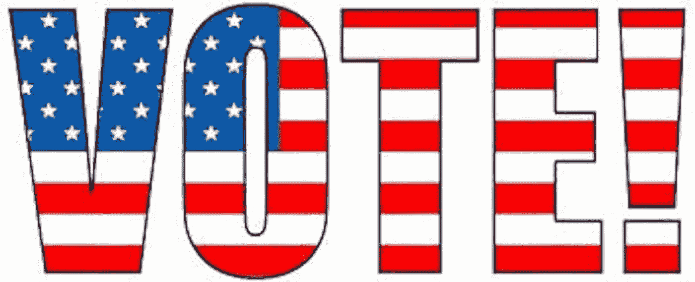
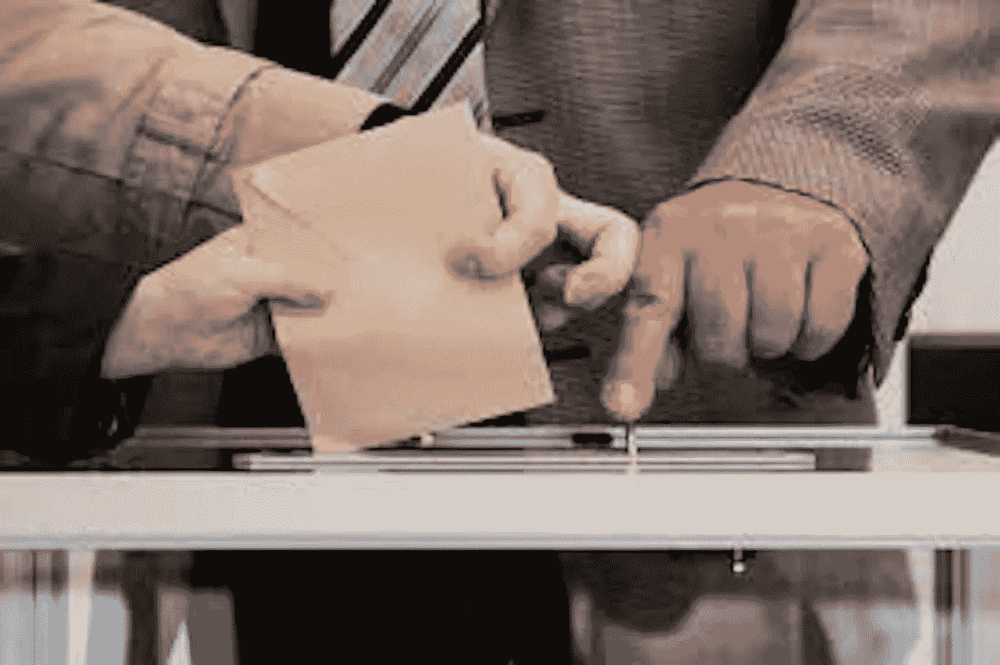

# 我的完全不带偏见和客观的要点实际上会让我们的国家再次伟大:保护我们的选举

> 原文：<https://medium.datadriveninvestor.com/my-totally-un-biased-objective-list-of-changes-that-would-actually-for-real-make-our-nation-503221b6c829?source=collection_archive---------7----------------------->

1.  **去掉选举团**，就像，嗯……昨天。把它扔在 VHS 播放器、XFL、palm pilots、格伦·贝克重播、吉姆克劳定律和一箱箱未开封的新可乐旁边。去拿。里德。它的。在某个时候，我们的孩子会回过头来震惊地看待这件事，比如，“人们真的忍受了那个公牛曲棍球？”就像我们大多数人回顾隔离浴室和学校一样。我指的是我们这些没有种族歧视的人。但是，是的，把它踢到路边，它是一个时代的遗迹，那个时代大多数公民不识字，妇女和少数民族不被允许投票。
2.  **将 11 月的第一周变成为期七天的全国性选举假期。**受够了这半天假的废话。给每个人一周的时间去投票，让他们被计算在内，并强制要求在投票结束前不公布任何结果。据说，我们是一个民主国家，所以我们应该庆祝这个比庆祝圣诞节和哥伦布大得多的节日。说到这个…
3.  **去掉哥伦布日**。早就过了时间了。去他妈的哥伦布，伙计。
4.  仅纸质选票。机器可以而且经常被黑。所以纸质选票。书面记录，宝贝。书面记录。
5.  每个有资格的人都必须投票。这是公民义务，就像登记征兵、纳税和不乱扔垃圾一样。比这三件事更重要的是，然而，没有强制执行。让它成为法律。生活在这里的人们从生活在我们的民主中受益，作为交换，他们应该参与其中。如果人们拒绝，罚款和更多。比如税收。囚犯投票，学生投票，任何合法居民都可以投票。
6.  **所有由公共资金支持的候选人**。除非我们支付选举费用，否则我们永远不会成为真正的自由民族。由公家出，用公款出，不附带任何条件。不再有亿万富翁购买他们的宠物政客。不再有亿万富翁为自己的虚荣心候选人自筹资金(不再有亿万富翁，时期，但那是另一个时间的帖子)。不要开始抱怨“我们要怎么支付它？”如果我们能为海外近二十年的战争买单，我们就能为我们自己的民主进程买单。很简单，这是我们必须支付的最重要的东西(据说也是我们的制服服务人员应该为之奋斗的东西)，所以我们可以支付它。我们可以。除此之外，你知道政治家花多少时间筹集资金和要求捐款吗？太过分了！太过分了。这将使他们有时间专注于他们的实际工作。管理。
7.  当选的官员不允许从他们的工作中获利。随时随地。只是一个巨大的不。这是很大的，因为这是他们这样做的常识。在一次情报会议上，当他们知道信息会对股票产生负面影响时，他们会告诉一个亲戚或者直接打电话，在消息公开之前利用这个机会。如果他们这样做，他们将失去他们的福利、养老金，并可能面临牢狱之灾。拿走他们的养老金，禁止他们从事公共服务。
8.  **让初选在全国范围内变得统一和民主。现在，所有州的初选差别很大，取决于政党和州。核心小组是最糟糕的，他们积极歧视那些不能离开家的人，例如，他们也不民主。允许人们在初选中投票，允许他们的投票有意义、有价值。在有些州，你必须是党员才能参加，有些州则不是。这很奇怪，毫无意义，就像许多美国运输安全管理局的规则一样，应该被禁止。我们需要它来代表人民。**
9.  **税堂**。他们不应该参与政治或选举过程而不失去他们的免税地位，但我们都知道他们无论如何都会这样做，所以就向他们征税吧。你想用我们的政治程序来反对堕胎，可以，但是要交税。
10.  **让每一票都平等**。不再有超级代表，不再有如果州变成红色，整个州都投红色。不。如果有人在蒙大拿投了蓝色的票，那票就归蓝色了。如果有人在加州投了红色的票，那这一票就会在全国投给红色。没有一个被淘汰。每一票都被计算和应用。每一个都是。让每一张选票都变得重要，因为他们现在不重要。在过去的 20 年里，我们举行了两次总统选举，赢得普选的人输掉了选举，这不仅是错误的，也告诉民众他们的选票并不重要。你想让人们相信他们的选票很重要吗？向他们展示它确实如此。只要这个领域是歪斜和倾斜的，只要密歇根州一个人的选票比纽约一个选民的选票更重要，那么它就不是。
11.  每场辩论和政治广告的即时事实核查。应该是不言自明的吧？事实-实时检查他们，如果他们撒谎，就当面对质。公之于众。没有客观的事实核查，就没有广告。
12.  每个候选人都会公布他们所有的税收和医疗记录。同样，应该是不言自明的，对不对？我们需要知道这些信息。
13.  **年龄限制**。不能太年轻就去竞选总统(35 岁及以上)。反过来也一样，一个人也应该在 70 岁以下。受够了这些竞选公职的老家伙。年龄很重要，这也是为什么青少年不能跑步的原因，对于老年人来说也应该是一个因素。
14.  正式的竞选季节很短。最多六到九个月。如果我们在那么长的时间内做不到，那就是我们有问题。我们不应该在两年后的选举中竞选。
15.  **定期对选举和任命的官员进行身体和心理检查**。如果不止一个医生说这位法官，这位参议员，或者，让我们说……这位总统是个疯子，对他们自己和他人都是个威胁……那么我们就把他们调离岗位。
16.  **带回公平主义**。保持媒体真正的平衡。事实上，效仿加拿大也不失为一个好主意，加拿大有法律禁止新闻节目传播虚假或故意的错误信息。我们需要这个，很重要的时刻。过去我们有公平原则。它需要回来保护公共电波。
17.  候选人不得援引宗教信仰。政教分离，哟。他们认为自己家中的隐私是他们的权利，但他们不应该在竞选公职时谈论这个话题。我们需要让宗教远离我们的政治。就像那个关于宗教就像阴茎的老笑话一样，你在自己的卧室里用它做什么，那是你的事，但你不应该在公共场合拿出来。不要告诉别人。
18.  将政客在科学问题上撒谎定为犯罪。好吧，这是一个长镜头，我明白，但男人哦男人，我生病了，厌倦了看到当选的官员撒谎科学，特别是进化论，即使他们排队打流感疫苗。作为一个社会来说，对科学的误解已经对我们造成了不可估量的伤害，我们需要回到这个问题上来。
19.  **除掉说客**。这需要解释吗？不应该，但是是的。摆脱他们。将他们驱逐出我们的政治舞台。
20.  **去掉选举团**。是的，我知道我在开始的时候说过，但这可能是第一件，最好的，如果我们必须选择一件的话，也是我们能够并且应该做的最重要的事情。

如果你喜欢这个列表，请为它鼓掌几百次。你也可以关注我的亚马逊作者页面，这里是**…或者我的 FB 页面，* [*这里是*](https://www.facebook.com/Joshua-Todd-James-104708464207596/?modal=admin_todo_tour) *…我应该补充一下，我的‘zon 页面’上还有* ***免费的*** *电子书。**