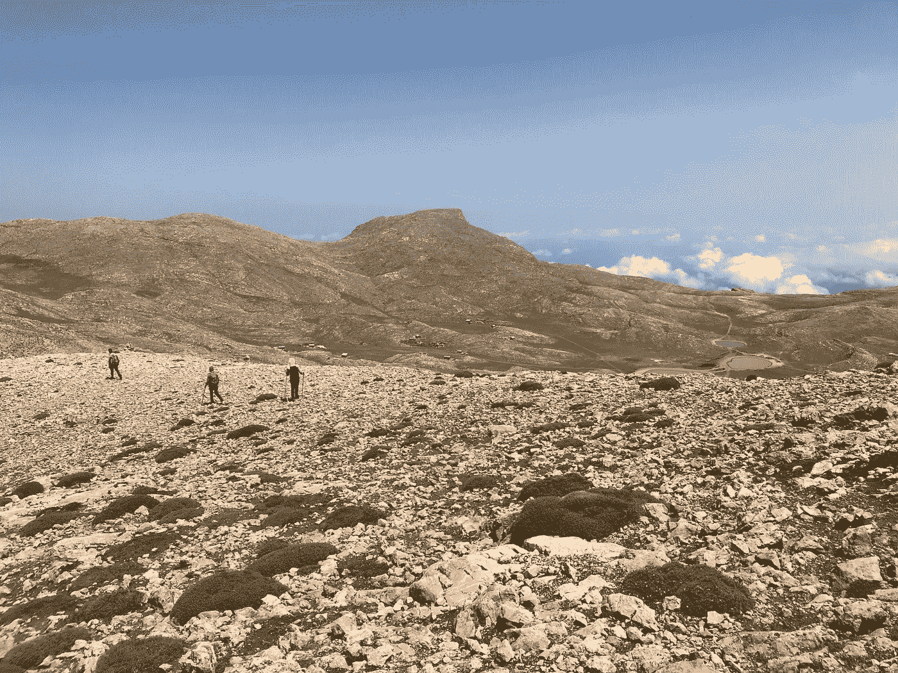

# 我的路是我的——你的路是你的——有共同点吗？

> 原文：<https://medium.datadriveninvestor.com/my-way-is-mine-your-way-is-yours-is-there-common-ground-2b41bde83830?source=collection_archive---------36----------------------->

## 只是因为我的方式是我的，并不意味着我们不能找到一些共同点(在合理的范围内)。

Photo by [vahid asadi](https://unsplash.com/@vak?utm_source=unsplash&utm_medium=referral&utm_content=creditCopyText) on [Unsplash](https://unsplash.com/s/photos/common-ground?utm_source=unsplash&utm_medium=referral&utm_content=creditCopyText)

我们正在接近这个星球上的 80 亿人口。让我把它写出来——那是 80 亿人。

假设你个人知道，总共有 100 个人。也许不是很好，但为了便于讨论，这是一个很好的整数。这意味着你知道这个星球上总人口的 0.0000000125。那是一个超级小的人数。

这些人中的每一个人都有自己思考、感受、感知和体验生活的方式。那是一百种独特的观点和方式。现在——把它乘以八千万(80，000，000)倍。这就是世界上有多少独特的视角。

在这广大的人群中，有一种集体意识。这是指一群个人分享某些信仰、观点、看法、意识形态等。几乎所有这些都是建立在人为的分歧和看法上的。

有些是字面意思。肤色、性别、身高、体重等等。但是大多数都是象征性的——宗教、国籍、职业、政治等等。

在很大程度上，集体意识是现实结构的一个良性方面。不幸的是，它可以被激进化、武器化，并被用来动摇人们无视理性和逻辑，支持恐惧和意见。然后，你会看到暴乱者追随煽动者的理想，而这些理想实际上违背了他们自己的最佳利益。

在这个世界上，你我都无能为力。我们所有的控制完全存在于我们自己身上。我的路是我的，你的路是你的。但是我们可以——作为个人——找到和/或创造共同点。

# 对我们自己负责

我们生活在一个喜欢指责的社会。有一种对任何事情都不承担任何责任的爱情。

需要我指出特朗普是这方面最明显的例子吗？就在最高层，有人完全没有责任。这种形式的涓滴效应往往是唯一有效的(例如，与经济学不同)。

因为这个和其他太多的例子，我们倾向于像躲避瘟疫一样逃避责任。目前这是一个讽刺性的短语——因为许多人没有采取必要的预防措施来避免瘟疫。但是我跑题了。

关键是，对这个、那个或其他事情进行指责是非常普遍和被接受的。去吧，去责怪你的父母四十年前所做的(或者可能没有做的)行为。那会把它修好的。

当然，它不会。推卸责任。逃避责任和义务让你无法控制。

我的路是我的，你的路是你的。这并不意味着我们在——或者应该——相互对抗。那是因为我们不是在竞争。

让我重申一下。我们不是在竞争。认识到这个事实有助于你明白对自己的生活经历负责任会让你掌控它。

我在人生道路上寻求的东西与他人相似，但又不相同。你在人生道路上寻求的东西与他人相似——但不相同。终点不是一个稀缺的东西——无论是有形的还是无形的。这是一个丰富的宇宙，对每个人来说都绰绰有余。

当你对自己负责时，你不仅能洞察自己，还能洞察你在这个疯狂的世界中的位置。

# 我的路是我的，你的路是你的，共同点

最近有很多关于寻找政治共同点的讨论。这是一个相当有趣的信息——尤其是当它来自一个完全扯淡的地方。

抱歉，没办法——这会变得政治化。当你花了 4 年时间称一方为非美国人时；许多校园名称，如“libtards”和“雪花”；而妖魔化对方——要求公平和团结是彻头彻尾的虚伪。你在公共场地上吐口水，撒尿，拉屎——现在你要躺在你自己弄得一团糟的地方。

当我们从上述的大局出发，你和我有更好的机会找到共同点。作为个人，我的方式是我的，你的方式是你的——但是两者可以折中。

也就是说，只要我们的方式都不否认对方的方式，不伤害对方的方式，也不具有破坏性。

例如，我们可以在政治上有不同意见。但是除非你看到自己的缺点(相信我——我看到了我倾向于支持的政党的缺点)，否则不会有中间立场。如果你把自己的命运放在仇恨者、科学否认者和一般自私的人中间，就找不到共同点了。

共同点来自于首先对你是谁负责。例如，我知道我是谁。我也知道自己的缺点、弱点和盲点。当你不对自己的这些方面负责时，你已经关闭了寻找共同点的任何可能性。

这是非常不幸的——而且完全丧失了权力。这就是为什么我们这么多所谓的领导人喜欢尽可能地削弱人们的权力。

Photo by [Xan Griffin](https://unsplash.com/@xangriffin?utm_source=unsplash&utm_medium=referral&utm_content=creditCopyText) on [Unsplash](https://unsplash.com/s/photos/success?utm_source=unsplash&utm_medium=referral&utm_content=creditCopyText)

# 被授权的人掌控一切

控制他人生活的最好方法之一就是告诉他们自己没有能力做到。让他们相信你的方式，你的计划，是唯一可行的救赎。否则，他们会遭殃。没有人想受苦。

引用《炼金术士*中保罗·柯艾略的话，*

> “告诉你的心，对苦难的恐惧比苦难本身更糟糕。”

通常，我们所谓的领导者希望你完全专注于你对痛苦的恐惧。那样的话，你会被剥夺权力，并愿意把自己生活的控制权交给他们。

因为责备是如此猖獗——在你做了一些愚蠢的事情之后，很容易——他们鼓励——责备他们而不承担责任。这进一步削弱了你的力量。

你脑子里唯一的人就是你自己。因此，你有能力掌控自己的人生经历。

这是通过正念最容易做到的。知道，现在，你有意识的想法、感觉、行动和意图向你的内在——你的心态/顶部空间/精神——报告你正在经历的事情。如果你意识到自己无法掌控，你就获得了掌控的能力。

被授权的人控制他们自己的生活。当你这样做的时候，你就可以开车了。

# 我的路是我的，你的路是你的

所有这一切的要点是，我们生活在一个丰富的宇宙中。因此，有足够的空间、资源、潜力、机会等等来满足我们的需求。事实上，对于我们所有的道路。

即使我们之间几乎找不到共同点，我们也可以相互尊重，走上没有否认、伤害或以其他方式伤害对方的道路。我无意否定你生活中的愿望——你也应该有类似的感觉。

近 80 亿人以这样或那样的方式共存于这个星球上。那是对生命、宇宙和一切事物的许多独特的、奇异的看法。但这是一个丰富的宇宙——对每个人来说，一切都绰绰有余。

不要被指责或缺乏和稀缺的信息所迷惑，这些信息经常被用来剥夺少数人的权力并把控制权掌握在他们手中。

我的路是我的，你的路是你的，不代表我们找不到一些共同点(合理范围内)。

**你看到我的方式和你的方式是如何共存和分离的了吗？**

 [## 徒步旅行的哲学

### 什么是路径行走？请允许我向你介绍我的个人哲学。

mjblehart.medium.com](https://mjblehart.medium.com/the-philosophy-of-pathwalking-afab1fb35f8e) 

[脸书](https://www.facebook.com/blehartmj/)|[LinkedIn](https://www.linkedin.com/in/murray-mj-blehart-9859543/)|[Twitter](https://twitter.com/mjblehart)|[Amazon authorpage](https://www.amazon.com/~/e/B00BKITBKQ)

*感谢您的阅读。我是* [MJ Blehart](https://medium.com/about-me-stories/about-me-mj-blehart-7b9f63e06ab1#5895) *。我写的是关于正念、有意识的现实创造、积极、选择和走自己的路的哲学，以及类似的生活课程。* [***获得我让世界变得更好的五个简单步骤(免费！)这里***](http://www.mjblehart.com/fiveeasysteps)

*原载于 2021 年 1 月 13 日*[*【https://titaniumdon.com】*](https://titaniumdon.com/my-way-is-mine-pathwalking/)*。*