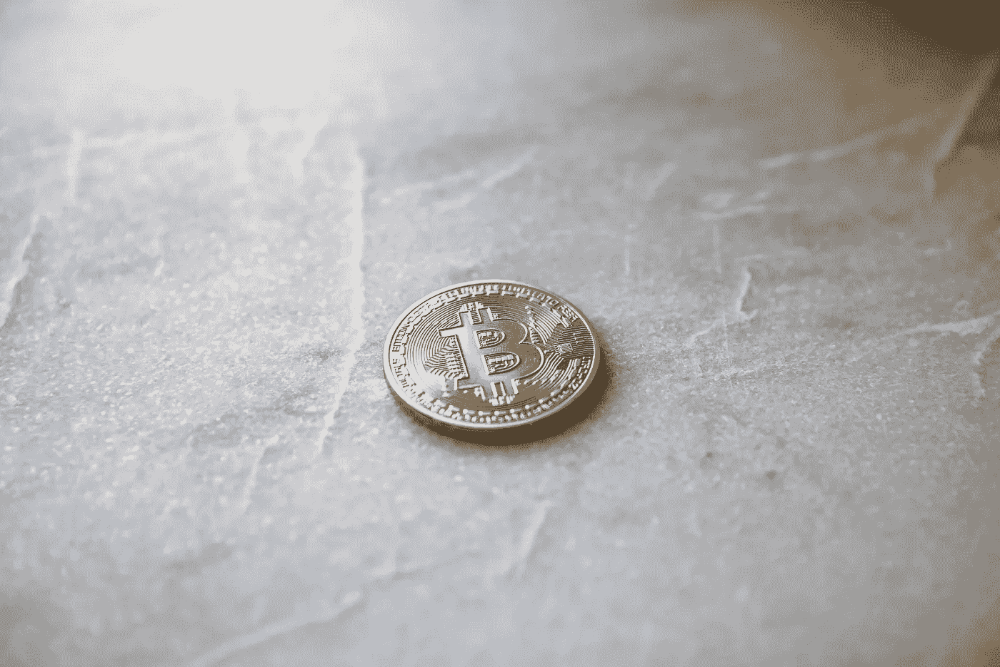
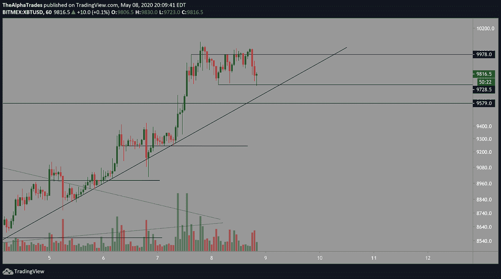

# 减半前我是如何交易比特币的

> 原文：<https://medium.datadriveninvestor.com/n-ushow-im-trading-bitcoin-before-the-halving-af39b0fb12fa?source=collection_archive---------5----------------------->

## 一层一层——对于十一年的交易来说，这是最重要的。

Bitcoin halving is upon us! Photo by André François McKenzie on Unsplash

早上好，阿尔法交易者！看起来我们昨晚在 [BTC](https://www.tradingview.com/symbols/BTCUSD/) 有所下降，我将解释到底发生了什么，以及我们如何交易。

我渴望 [BTC](https://www.tradingview.com/symbols/BTCUSD/) 今天早上，当它重新测试绿色盒子，如下图所示。我已经说过，如果价格形态得到支撑，对过去两天盘整的绿色方框的重新测试将是一个需要做多的强势区域。现在，价格正从那个区域反弹出来。当你们读到这篇文章的时候，整个市场可能已经颠倒了，但是*这不是投资建议*，我正在尽可能快地打出这些电话和分析。

在我看来，这是一个强烈的买入，但我的止损点需要比我想要的更深一点，可能在 9332 的灯芯下方或最近的低点下方，在 9500 点的绿色方框下方进行更紧的止损。

 [## 利用股市相关性的最佳方式|数据驱动的投资者

### 当阿尔弗雷德·温斯洛·琼斯开创了世界上第一个“对冲”基金(后来“d”被去掉了)时，他让其他投资者大吃一惊…

www.datadriveninvestor.com](https://www.datadriveninvestor.com/2020/02/02/the-best-way-to-use-stock-market-correlations/) 

过去几天，我做了一些惊人的交易，不管是做空还是做多市场。昨天，只有一个头寸是亏损平仓的，因为它在一夜之间被止损了-1.4%。谢天谢地，我遵循这个规则，让输家变小，赢家变大。到目前为止，我算出了本周的四笔盈利交易和一笔亏损交易。

Bitcoin finds support in previous consolidation, Source: Alpha Trades, LLC

在一个小时的时间内， [BTC](https://www.tradingview.com/symbols/BTCUSD/) 已经打印出了一个像样的[锤子](https://www.tradingview.com/ideas/hammer/)，但是锤子没有任何意义，除非你有一些后续上升。一个消极的迹象是，BTC 正在下方徘徊的[价格通道](https://www.tradingview.com/ideas/parallelchannel/)(9978–9728)[已经经历了分配，下方的水平正在接受支撑测试。](https://www.tradingview.com/symbols/BTCUSD/)

这就是为什么我逐层交易，因为在这个阶段我们有几个关键的支撑位和阻力位需要守住。此外，从下图的 1 小时时间段来看，上升[趋势线](https://www.tradingview.com/ideas/trendline/)被打破，并被测试为阻力。如果价格能够爬回到 T2 趋势线 T3 以及 9730 点的 T4 阻力位 T5 之上，那将是多头的一个好兆头。

一个看起来不错的[多奇](https://www.tradingview.com/ideas/doji/)正在 4 小时内形成，但是我们再次需要在下一根蜡烛线上跟进，以使这个[多奇](https://www.tradingview.com/ideas/doji/)有意义。我在寻找下一根 4 小时蜡烛线，让它看起来更乐观，对我目前的多头头寸更有信心。

转到[日线时间框架](https://www.tradingview.com/ideas/daily/)(看本帖主图)，心理 10000 点水平应该有足够的[引力](https://www.tradingview.com/symbols/NASDAQ-GRVY/)在周末结束前再次被冲击。

Bitcoin challenges the distribution channel to 10,000, Source: Alpha Trades, LLC

昨天, [s & p 500](https://www.tradingview.com/symbols/SPX/) 收盘表现强劲，大约在 61.8%的 Fib 附近，如果它压得更高一点，我不会感到惊讶。我在看着疲惫向上，所以我可以回到一些短裤和 puts。

你们知道我们的记录，我们保持诚实。我已经做了 11 年了，不打算马上停下来！我的经验的核心是——要在这个游戏中保持一致，你必须明白什么时候获利，管理仓位大小，永远不要太贪婪，因为在任何时候市场都可能对你不利。如果你已经从这些分析中受益，请在文章末尾留下评论。如果您想实时了解我们的分析，请查看我们的签名栏。干杯，祝周末愉快！

## 比特币减半派对！

你被邀请参加 12 小时的直播，与 Alpha Trades 一起庆祝 2020 年比特币减半事件。[更多详情请点击此处](https://www.instagram.com/p/B_-B6-UDcX5/?utm_source=ig_web_copy_link)，或者您可以通过以下渠道联系我们。

# 处于优势

感谢您成为这个社区的一员。如果你对这篇文章有共鸣，请[订阅 Discord 服务器](https://bit.ly/2KJ1oor)。你可以免费访问我的公共频道，在那里我们每天发布大量免费有用的内容。(我们将从 2020 年 5 月 5 日开始提高[优势社区订阅](https://bit.ly/3bUdg3a)的价格)。更多细节请看下面的视频。

# 放弃

Alpha Trades，LLC 提供的信息不用于制定任何财务决策，也不是购买、持有和/或销售特定产品、数字资产或 ICO 的请求或建议。

访问我们的完整服务条款:【https://bit.ly/3faVeeV 