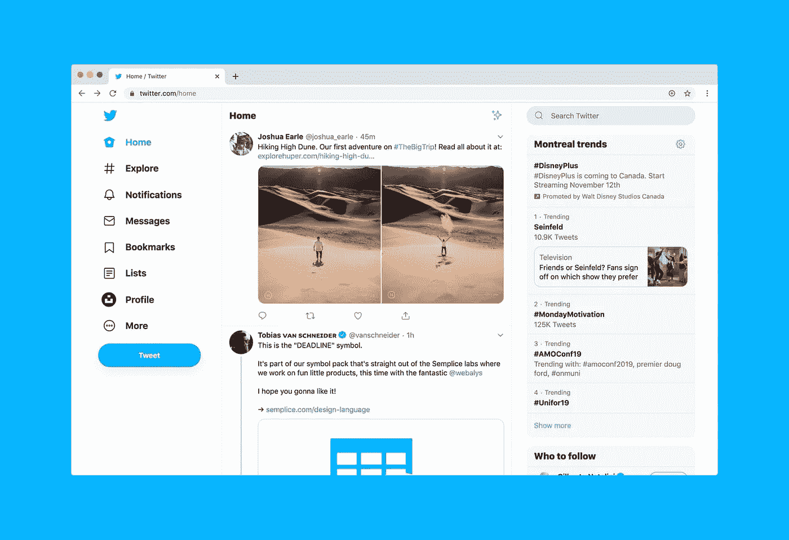

# 用文字钉消息

> 原文：<https://medium.datadriveninvestor.com/nail-messages-with-the-write-stuff-163f5df3124f?source=collection_archive---------27----------------------->

## 通过适合各种社交媒体的内容获得关注者

Photo by Luke Chesser on Unsplash

写作本身要求很高。然后加入每个社交媒体平台的需求，写作变得越来越复杂。

[Lindo Myeni](https://twitter.com/LindoMyeni) 每天都面临这些挑战。作为一名获奖的影响者和战略家，他是在线就业中心[趋势工作](https://twitter.com/trending_jobs)的首席布道者。与数字营销专家 Madalyn Sklar 一起，Myeni 谈论了从角色限制到社交媒体推广的一切，目的是获得更多的追随者。

关于字符限制，他们都表示用户应该利用他们面前的东西。

“在每个平台的参数范围内工作，这样你就可以把你的信息传递出去，”Sklar 说。“我不认为有一个理想的性格限制。尽你所能工作。”

也就是说，Myeni 承认每个场馆都有推荐的角色数量。

“每一个平台都是独一无二的，应该被如此对待，”他说。“直到 2017 年，Twitter 的帖子限制是标志性的 140 个字符。现在是 280 个字符。

“就像许多其他社交媒体网络一样，当他们在移动中快速滚动他们的 Twitter feed 时，没有人想阅读 280 个字符，”Myeni 说。“Buddy Media 的数据显示，与较长的帖子相比，长度在 71 至 100 个字符之间的推文最受关注。具体来说，这些推文被转发或参与的可能性增加了 17%。”

脸书是另一个故事。

“现在，[你的脸书帖子](https://blog.markgrowth.com/facebook-marketing-is-a-maze-ing-abfe0961a107?source=friends_link&sk=b1efe1a941a2dc8a973c27ebe7bf05a3)可以长达 63206 个字符，”Myeni 说。“好吧，让我们现实一点。没有人会读那么长时间的《脸书邮报》。

“人们不会花整个通勤时间去读你品牌的脸书小说，”他说。"专注于保持你的脸书帖子简洁明了——40 到 50 个字符之间."

 [## 将股份打入 Instagram 神话和传说

### 道听途说会把你引入歧途

blog.markgrowth.com](https://blog.markgrowth.com/driving-a-stake-into-instagram-myths-and-legends-6e8ac0648892) 

Instagram 将自己与 Twitter 和脸书区分开来。

“Instagram 的标题可以长达 2200 个字符，在整篇帖子中可以包含多达 30 个标签，这包括评论中留下的标签，”Myeni 说。

“很明显，很难让人阅读 2200 个字符的 Instagram 说明，”他说。"像其他网络一样，保持你的 Instagram 标题的重点."

# **随动磁铁**

社交媒体管理公司[的 Nick Martin](https://twitter.com/Hootsuite)Hootsuite 谈到了如何获得 Twitter 粉丝，这些指导方针在许多方面也适用于收集其他社交网络上的人。

“通过活跃和说一些有趣的事情来聚集追随者，”他说。“在这个可爱的社交媒体网络上分享或创建内容，参与讨论，发出积极的互动声音。

他说:“通过[填写你的个人资料](https://blog.markgrowth.com/make-your-entire-profile-your-best-side-ddf7ae75307a?source=friends_link&sk=b1eb9bdcc70c7f70d26e8192bec99565)，让自己变得更‘受关注’。”“有一张清晰的个人资料照片，在简历中说明你是谁，有一张引人入胜的标题照片。此外，加入 gif、图像和视频等媒体，为你的推文增添一点儿活力。

Hootsuite 的文章 [*“如何获得 Twitter 追随者:44 个实际有效的技巧和诀窍”更深入地挖掘了这一点*](https://blog.hootsuite.com/how-to-get-twitter-followers/)

 [## 常青树发芽新生命

### 接受旧的内容，让它重生

medium.com](https://medium.com/datadriveninvestor/evergreens-sprout-new-life-c41810f6b654) 

在其他社交媒体平台上重新利用推文应该是一种常规做法。

Sklar 说:“重新利用 tweets 可以让你通过撒下更大的网来扩展你的信息。”“因为其他平台允许更多的字符，所以你可以说得更多。”

赢内容更是如此。

“有很棒的博文或视频吗？到处张贴，”迈尔尼说。“虽然您可以在多个平台上发布相同的内容，但重要的是，您要为每个重新调整用途的平台定制内容。”

让推特易于阅读是一个简洁明了的问题。

“保持你的推文简短，”米尼说。“有多短？真的很短很简洁。

“这就是有能力的社交媒体文案发挥作用的地方——编辑推文以产生高参与度，”他说。"毫无疑问，短推文比 280 个字符长的推文有更高的参与度."

涉足广告的人会注意到它与普通社交媒体广告的不同。

“对于广告文案，你需要让读者做点什么，”Sklar 说。“呼吁采取行动至关重要。看看大品牌的广告来获得灵感。”

# **记住人性**

这并不是要忽视个人接触。

“社交化，让你的品牌人性化，”米尼说。“一旦你发出自己的声音，你的广告文案可能与普通帖子没有什么不同。即使有广告文案，也不是每个社交媒体帖子都应该是推销。应该有能加深与你的受众联系的帖子。

“人性化是社交媒体的核心所在，”他说。“人们希望与其他人互动，而不是被营销信息轰炸。我关注当地和全球的品牌，比如火焰烤鸡公司 [NandosSA](https://twitter.com/NandosSA/) 。

 [## 最棒的 GIF 是转瞬即逝的

### 尝试简单、醒目的视觉效果来赋予你的品牌个性

medium.com](https://medium.com/datadriveninvestor/the-greatest-gif-of-all-is-fleeting-868d6220f69a) 

特别是在 Twitter 上，某些内容联系在一起。

Sklar 说:“当我的内容有视频、GIF，尤其是自定义的 GIF 时，我会得到最好的结果。”"在你的推文中添加媒体将会提高你的参与度."

米尼表示同意。

“当人们浏览提要时，视觉内容会吸引他们的注意力，并鼓励更深入的参与，”他说。

“问一些开放式的问题，比如，‘我来自 [Keabetswe](https://twitter.com/akreana_/) 的有影响力的同事，你在烦恼什么？’”米尼说。Twitter 将这条推文列为 2019 年全球转发量最大的推文。"

推广社交媒体帖子与广告文案相关。

“最引人注目和最有效的社交媒体文案来自观众的语言，而不是文案或社交媒体经理的大脑，”迈尔尼说。

“[了解你的观众](https://blog.markgrowth.com/know-like-and-trust-drive-conversion-and-sales-51c791e7c6b6?source=friends_link&sk=910f20a2541a78982c2c73592527caf7)是关键，”他说。“你的社交媒体平台的目的是为你的受众提供相关、有趣和有价值的内容。在你发帖的时候，调整你在每个社交媒体平台上的做法。”

# **理想客户**

Sklar 建议“给你的头像写一份拷贝。那就是你的[一个完美的客户](https://www.eofire.com/defining-your-avatar/)。”

“社交媒体文案写作有一个万无一失的方法，”米尼说。“这不是简单地胡乱猜测人们想要什么。而是倾听，关注你的听众使用的语言，并将这种语言转化为高转化率的拷贝。”

 [## 社交媒体收听让你保持联系

### 竖起耳朵听听消费者和竞争对手怎么说

medium.com](https://medium.com/datadriveninvestor/social-media-listening-keeps-you-plugged-in-c1ca7d031df5) 

他依靠他的专业文案技巧:

*   不校对你的推文就不要发布。如果你发布带有粗心语法和拼写错误的推文，这将对你的品牌产生不良影响。在发布帖子之前，请检查您所写的内容并修复错误。
*   不要只发关于你自己的微博。通过转发其他人和分享你的粉丝可以联系到或会发现有用的文章来混合它。
*   没有调查热门话题不要发微博。你最不想看到的就是对一件严肃的事情表现得麻木不仁，或者你只是为了做这件事而加入谈话。

“永远记得在发布推文之前做好调查，”米尼说。“确保热门话题与你认为的相关，并且与你的品牌相关。”

**关于作者**

吉姆·卡扎曼是[拉戈金融服务公司](http://largofinancialservices.com/)的经理，曾在空军和联邦政府的公共事务部门工作。你可以在[推特](https://twitter.com/JKatzaman)、[脸书](https://www.facebook.com/jim.katzaman)和 [LinkedIn](https://www.linkedin.com/in/jim-katzaman-33641b21/) 上和他联系。