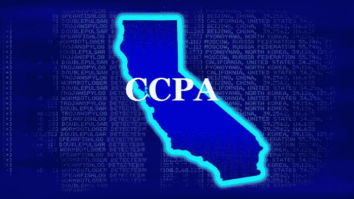

# 奈对 CCPA“销售”概念的理解(上)

> 原文：<https://medium.datadriveninvestor.com/nais-approach-to-the-sale-concept-of-the-ccpa-part-i-ea0c2be59431?source=collection_archive---------14----------------------->

今年 1 月 1 日，加州消费者隐私法(CCPA)生效，这是一项保护“T0”消费者及其“T2]个人信息的法规:它将规范和加强加州公民的隐私，特别是他们作为消费者的隐私，在这个地区，可能会感受到更大的科技巨头的压倒性权力。

该法规将特别涵盖“*处理*”消费者个人数据的公司，在这些数据上开展收集、披露和出售活动。

尽管美国在这些领域一直倾向于温和的方式，但由于不同的法律文化，GDPR 的影响肯定被感受到了，而且商业实体现在必须通过适当的隐私政策告知消费者他们将享有的权利。

虽然 GDPR 的范围要广泛得多，但在 CCPA，不同的是视角:例如，我们不谈论数据主体，而是消费者，我们不是指数据控制者，而只是指“公司”；除了纯粹的合同义务之外，没有数据控制器。

 [## 人们对隐私的不理解是什么？数据驱动的投资者

### 你知道那种感觉。无论是访问应用程序、订阅还是你最喜欢的运动鞋。你按下…

www.datadriveninvestor.com](https://www.datadriveninvestor.com/2019/04/11/privacy-and-convenience/) 

除了这些明显的区别之外，甚至仅在术语方面，在 CCPA 中显而易见的是一种极端的"*"商业愿景，其中的 synallagma 不一定是经济的，但肯定是有价值的，因此现在意识到个人数据有价值的用户能够触发某种交换。另一方面，如果在一开始，就在 GDPR 的出口处，美国公司坚决反对变革之风，提议脱离欧洲市场，因为游说者的利益可能会受到损害，后来，他们宁愿管理这种变化，而不是忍受它！*

*《加州消费者法案》保障了消费者了解所收集的个人信息的权利、删除这些信息的权利，但最重要的是选择退出的权利:后者是在面临合法拒绝的情况下，不出售自己数据的意愿，不会受到任何损害。但是，该权利不同于定义为“ ***请勿出售我的个人信息*** ”的权利，该权利表现为拒绝向第三方公司出售个人信息，并且必须在相关网站的主页上明确说明！*

*在美国，数据存储在文件中(甚至是简单的 excel)，记录被定义为可检索、可搜索的，这是出于一个非常“商业”的原因:在注册了“不出售”的情况下，有可能在每年的最后期限询问用户他是否改变了主意并且想要同意向第三方出售。但是在这一点上，一个相当微妙的问题不能不出现:“不卖”如何适应广告、统计监测或数字广告的实践？根据最近的立法，IP 地址、cookie IDs、设备标识符和浏览历史被视为“个人信息”，那么与参与广告制作和销售的第三方共享这些信息会构成“数据销售”吗？*

*NAI(网络广告倡议组织)在其文件“*NAI 成员关于根据 CCPA 将广告技术数据流分类为“销售”的考虑:An NAI 分析*”中，试图给出“销售”的定义。NAI 成立于 2000 年，是代表第三方数字广告公司的领先自律组织。作为一家非营利组织，NAI 通过维护和执行数据收集的高标准以及在各种媒体(包括网络、手机和电视)中使用数字广告来促进在线生态系统的健康发展。NAI 认为，加州消费者能够享受行使其新权利的隐私好处，不仅是 NAI 成员公司，它们已经参与了整个行业的选择退出，而且是 CCPA 覆盖的所有公司。NAI 准则在某种程度上超越了 CCPA，提供了隐私保护，这超越了 CCPA 提供个人信息“*销售*”豁免的义务。
例如，与 CCPA 不同，NAI 行为准则提供了适应所用数据敏感程度的隐私保护，事实上，如果 CCPA 不区分敏感医疗数据和任何其他数据，如 IP 地址，其隐私仅由“ ***不得出售*** ”条款来保证，反之亦然，NAI 要求用户对任何用于个性化广告的敏感医疗数据的使用都必须获得*选择加入同意*！*

## *—“销售”的定义—“销售”*

*CCPA 将“销售”—*销售*定义为“通过口头、书面、电子或其他方式，将消费者的个人信息出售、出租、发布、披露、传播、提供、转让或以其他方式交流给另一家企业或第三方，以获取金钱或其他有价值的报酬，包括*提供*个人信息，以换取任何有价值的报酬。*

*正如我们在 NAI 文件中读到的:“*CCPA 退出“销售”与 NAI 退出“个性化广告*”有何不同？在这一点上，加州司法部长 AG 没有提供太多的澄清。*

*NAI 将“销售”的定义分为三个要素，这三个要素对于其配置是必要的:*

**——数字广告必须涉及“个人信息”。
-数字广告必须将个人信息从一家公司转移到另一家公司或第三方。
——数字广告必须涉及货币对价或其他有价值的个人信息的交换。**

*没有这三个要素,“销售”就不会发生！*

*然而，有两个重要的例外:*

***1** 对于服务提供商而言:使用或与服务提供商共享消费者的个人信息的活动，这是实现其商业目的所必需的，但未“出售”该信息，如果:
-公司在其条款&条件中披露该信息被使用或共享；
-服务提供商不会收集、出售或进一步使用消费者的个人信息，除非出于商业目的。*

***2** 消费者授权的个人信息披露。
这份文件甚至更进一步，围绕“不要出售”条款列出了一个更明确的界限，但我将在下一篇评论中再讨论这个问题。*

*版权所有*

***律师*律师*律师***