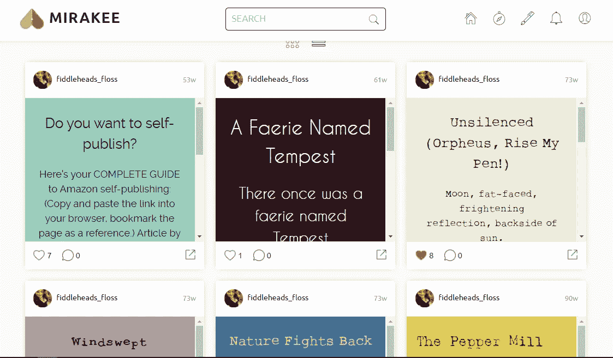
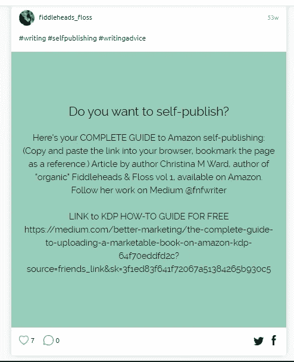
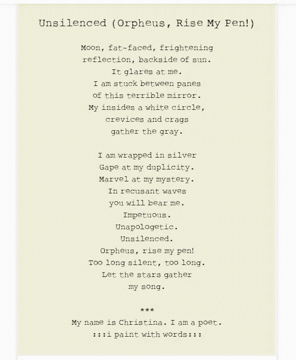

# 米拉奇作家应用程序的名称更改

> 原文：<https://medium.datadriveninvestor.com/name-change-for-mirakee-writers-app-4662d1157ea1?source=collection_archive---------17----------------------->

## 关于这个作家的应用程序，你可以用它做什么，以及即将推出的新名称。

Author’s screenshot

不久前，我报道了 12 种真正有创意的方式，你可以分享你的作品，自我推销，为你的作品和诗歌吸引粉丝。米拉基就是其中之一。

> **使用较小的网站，如** [**Mirakee**](http://www.mirakee.com/) **和**[**Flipboard**](https://flipboard.com/)
> Mirakee 是一个收集诗歌片段和引语的好地方——一个非常可视化的网站，拥有年轻的追随者。Flipboard 允许你发布文章，就像人们可以关注的在线杂志集一样。([引自文章。](https://medium.com/the-partnered-pen/12-very-creative-ways-to-promote-your-writing-10935af79647))

长期以来，我一直想进入一个较小的社区，寻找诗歌的狂热读者和书面文字的爱好者。(*它仍然在我的探索清单上*)我今天收到了一封关于我下载的应用程序更新的电子邮件，同时还有一条新信息:**名称更改**。

## 米拉基到底是什么？

Mirakee 有点像 Twitter、Pinterest 和 Instagram 的混搭，可以分享引文和小段落文本。每个帖子都允许你选择一个彩色的背景，为你的作品使用有趣的字体(颜色、类型和大小)，并通过标签或链接分享你的帖子的一些细节。微博平台非常直观，在你的手机上容易阅读和滚动，面向那些喜欢书面文字并喜欢让它可视化的人；非常适合诗歌、微博和小广告。

 [## 给数字营销工作者的 5 本书推荐|数据驱动的投资者

### 随着就业率的上升，由于疫情和人们花更多的时间在网上，数字营销的技巧…

www.datadriveninvestor.com](https://www.datadriveninvestor.com/2020/10/28/5-book-recommendations-for-those-who-work-with-digital-marketing/) 

米拉基标榜自己是“作家的天堂”，提供对作家和创意人员有吸引力的定制工具。作为一个永远在创造 [Canva graphics](https://www.canva.com/) 来分享我的诗歌语录的人，Mirakee 更容易一些，也更省时，只是你仅限于与你的 Mirakee 追随者分享。

author’s screenshot

Author’s screenshot

## 米拉奇是如何工作的？

下载[免费应用](https://play.google.com/store/apps/details?id=io.mi.ra.kee&hl=en_US&gl=US)，创建您自己的个人资料，并开始发布您的创意帖子。就这么简单。界面超级简单。你可以关注他人，浏览你的订阅源，寻找其他 Mirakee 用户的有趣片段、语录或诗歌。

## 改名是怎么回事？

米拉基员工发出的电子邮件没有指定日期，但名称现在被改为**米拉奎尔**，这是一个关于作家工具的游戏，进一步提高了品牌认知度。(我不确定这个新名字会不会让人想起治疗头部充血的药物 NyQuill，但假以时日，我们会看到这个新名字是否会在用户中生根发芽。)

拥有大约 30 万粉丝的米拉基，我的意思是 [*米拉奎尔*](https://apps.apple.com/us/app/mirakee-writing-community/id1194104022) 对社交媒体舞台(成立于 2016 年 7 月)来说是相当新的，但确实符合一个重要的利基:热爱自己的工作并希望与其他人一起庆祝的作家。许多最专注于这个平台的用户(也是这个平台的创造者)来自[印度](https://medium.com/@kapoor.gitanjali/today-ive-completed-a-year-on-mirakee-yes-its-my-1st-anniversary-but-i-m-not-going-to-share-my-d7d7439744ff)，他们喜欢那里的简单和与其他作家的创造性联系。

## 我可以用 Mirakee/Miraquill 做什么？

分享你的诗歌或微博想法。发挥创造力。阅读并评论。你知道该怎么做——只是这一次，有点“漂亮”

[*Appgrooves 给了 Mira quill 4.1 星的评价*](https://appgrooves.com/app/mirakee-writing-community-by-alankrita-sood/negative) *，大多数负面评价都与该应用提供的翻译选项和更新错误的速度缓慢有关。*

在 Medium 上关注 Mirakee(根据他们的简历，是“作家的 Instagram ”):

 [## 米拉基-中等

### 写作在很大程度上是一种孤独的追求。作为作家，你一直在与自我怀疑和恐惧作斗争。所有人都希望…

medium.com](https://medium.com/@mirakee.justwords) 

感谢阅读。如果你在米拉基，想在那里转机，你可以在这里找到我。

~[◦•●✿·克里斯蒂娜·m·沃德·✿●•◦](https://medium.com/u/87a63af50103?source=post_page-----4662d1157ea1--------------------------------)

**访问专家视图—** [**订阅 DDI 英特尔**](https://datadriveninvestor.com/ddi-intel)