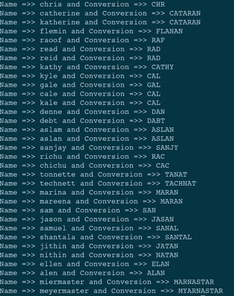
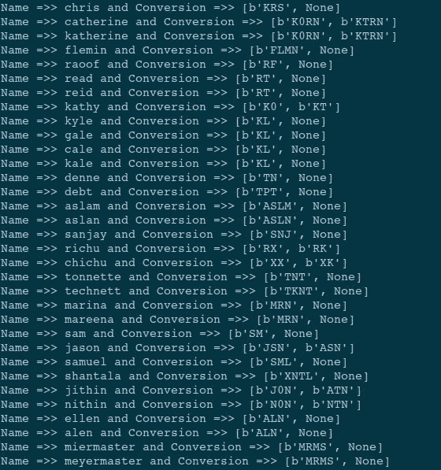
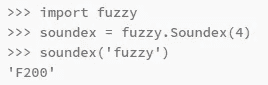
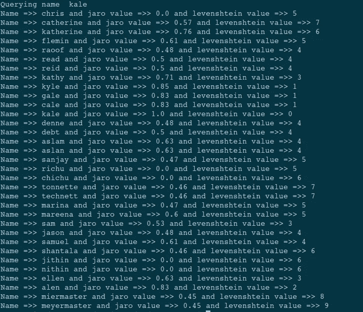

# Python 中的名称匹配技术

> 原文：<https://medium.datadriveninvestor.com/name-matching-techniques-with-python-8c6861477c3?source=collection_archive---------4----------------------->

## 如何用 python 纠正有错别字和拼写错误的名字和单词？

我们确实面临许多情况，我们不得不将一个单词与其许多变体相匹配。这可能是因为打字错误、发音错误、昵称、缩写等。这在将数据库中的名称与查询名称进行匹配的情况下最容易遇到。当您需要将输入文本与数据库匹配时，我们不能总是期望完全匹配。NLP 开发人员可能已经经历了将名称提取为命名实体并对其进行拼写和误译匹配的场景。对于以文本作为输入的常规聊天机器人来说，拼写错误是我们需要解决的最常见的问题。这通常用普通的模糊匹配技术和库来解决。

但是在有些情况下，我们得到转录的句子作为输入(输入是语音到文本对话的结果),我们必须处理这样的错误。在这里，我们正在寻找可以用来搜索数据库条目的输入单词或名称的技术。

Photo by [Surendran MP](https://unsplash.com/@sure_mp?utm_source=unsplash&utm_medium=referral&utm_content=creditCopyText) on [Unsplash](https://unsplash.com/s/photos/alphabets?utm_source=unsplash&utm_medium=referral&utm_content=creditCopyText)

# 公共密钥法— NYSIS

Nysis 是解决类似问题的常用技术之一。NYSIS 最初被现在的纽约刑事司法服务部门用来帮助识别他们数据库中的人。它产生更好的结果。

结果相当不错。检查下面。

Generated By Author

# 公共键方法—双变音

另一个图书馆于 1990 年出版。它是其中复杂的建筑之一。它包括处理拼写不一致的特殊规则，还包括查看同源词的组合。这个库被修改得更加精确，这被称为双变音。Double metaphone 通过为每个名字返回“主要”和“次要”代码来进一步细化匹配。

结果包含两个哈希值。这可以使精度更好。

Generated By Author

# 公共密钥法— Soundex

soundex 值是通过从一个基本的查找表中取出第一个字母并将其余的成分(不是元音)从字母转换成数字来创建的。尽管这看起来是一种幼稚的方法，但在许多情况下它是有用的。

在官方文档中，它建议这样的输出。但是对我来说，当我检查的时候，我面临很多问题。当我查找错误时，发现 [soundex 似乎损坏了](https://github.com/yougov/fuzzy/issues/14)。

Official Documentation

# 列表法

此方法用于列出每个名称组件的所有可能的拼写变体。也就是说，这可以创建给定名称的几乎所有变体(这在计算上是昂贵的)，然后可以从中进行匹配。

它带来了计算成本和降低的速度。但是每当用户抱怨不匹配时，很容易将新的匹配添加到给定的列表中。

 [## 如何用 Python |数据驱动投资者构建 Twitter 抓取应用

### 每秒发出约 6000 条推文，每天发布 5 亿条推文，普通人甚至不能…

www.datadriveninvestor.com](https://www.datadriveninvestor.com/2020/12/01/how-to-build-a-twitter-scraping-app-with-python/) 

# 距离法

像 Levenshtein 距离、Jaro-Winkler 距离和 Jaccard 相似系数这样的方法可以用来逐个字符地查找两个名称之间的距离。因此，通过了解字符方面的错误是检查匹配的另一种选择。

# 机器学习方法

这是社区建议的另一种方法，我们可以训练一个模型，该模型可以接受两个名称并返回它们之间的相似性得分。为此，我们必须用相似和不相似的名称训练一个模型，以便该模型学习这种数据的模式，并给我们一个良好的相似性分数。

# 单词嵌入方法

这里我们看到，有时名称包含同义词，这通常出现在组织名称中。在这些情况下，我们可以使用单词嵌入。因为单词嵌入是单词语义的数字向量表示。如果两个单词或文档具有相似的向量，那么我们可以认为它们是语义相似的。这种思想可以用于在名称匹配的情况下实现。

# 文本相似性搜索

为了寻找姓名中的错别字和错误，文本相似性搜索是检查其准确性的另一种选择。[贾罗-温克勒距离](https://en.wikipedia.org/wiki/Jaro%E2%80%93Winkler_distance)、[汉明距离](https://en.wikipedia.org/wiki/Hamming_distance)、[达默劳-莱文斯坦距离](https://en.wikipedia.org/wiki/Damerau%E2%80%93Levenshtein_distance)以及常规的[莱文斯坦距离](https://en.wikipedia.org/wiki/Levenshtein_distance)都可用于此。

我们试图用字典中的其他名字来查询一个名字“kale”。检查下图中的结果。

Generated By Author

# 集合方法

通过阅读和观察这些输出，你一定发现没有一个能同时给我们完美的回忆和精确。因此，我们必须做一些集成方法，以获得良好的准确性和精度。

1.  将普通关键字(语音)分数与 jarovakue 或 levenshtein 分数结合可以是一个好的标准。
2.  我们还观察到，nysis 和 Dmetaphone(第一散列值)也可以被集合，并且可以被产生以获得更好的方法。

检查代码的 [github repo。](https://github.com/raoofnaushad/name_matching_nlp)

这个故事居然在这里[发表](https://www.datadriveninvestor.com/2020/12/07/name-matching-techniques-with-python/)。

 [## 使用 Python |数据驱动投资者的名称匹配技术

### 我们确实面临很多情况，我们必须匹配一个有很多变体的单词。这可能是因为错别字…

www.datadriveninvestor.com](https://www.datadriveninvestor.com/2020/12/07/name-matching-techniques-with-python/) 

感谢您的阅读，感谢您的宝贵时间

**进入专家视图—** [**订阅 DDI 英特尔**](https://datadriveninvestor.com/ddi-intel)