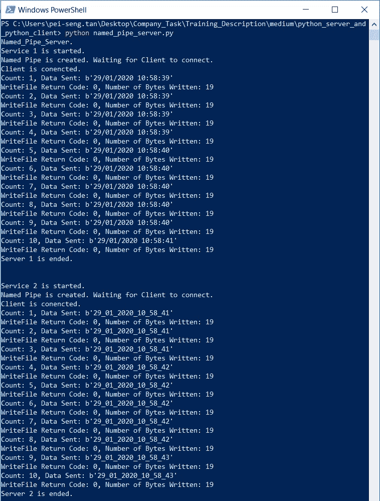
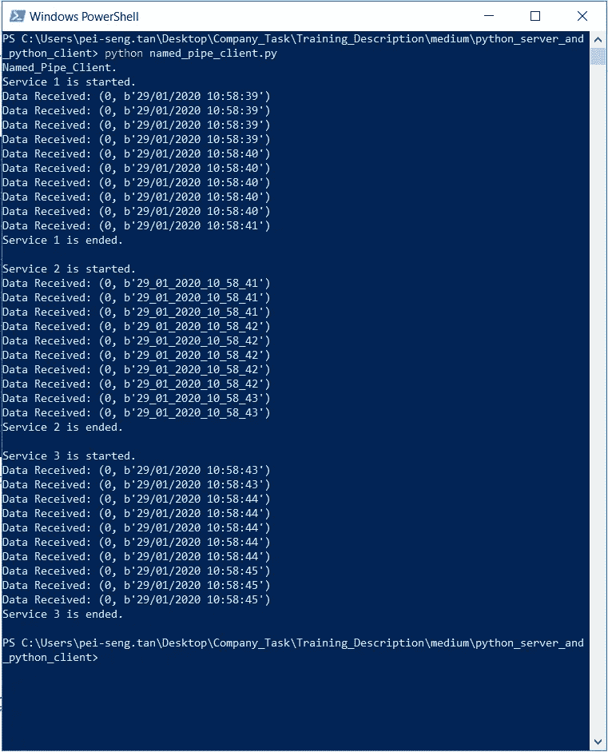

# Window 环境下 Python 服务器和 Python 客户端之间的命名管道通信

> 原文：<https://medium.datadriveninvestor.com/named-pipes-communication-between-python-server-and-python-client-on-window-8cdf64504801?source=collection_archive---------0----------------------->

## 如何使用命名管道进行进程间通信？


Photo by Pei Seng Tan at Queen Victoria Building

根据 Wikipedia，命名管道被定义为通常用于执行进程间通信(IPC)的方法之一，其中进程可以在它们之间轻松地共享数据。管道被视为一个文件，允许进程写入或读取命名管道。到目前为止，它能够在 Linux 和 Window 操作系统上实现。在此示例中，将创建一个 Python 服务器和一个 Python 客户端，以演示如何使用基于 Python 的 Win32 API 在 Window 上执行它们之间的命名管道通信。

# Python 命名管道服务器

将用于创建 Python 命名管道服务器的 API 包括:

*   **win32pipe。CreateNamedPipe:** 为了将命名管道用于 IPC，首先，我们需要通过给命名管道分配一个特定的名称来初始化它。它将创建一个命名管道的实例，并为后续管道操作返回一个句柄。该字符串必须遵循“\的格式。\pipe < i > pipename ",其中 pipename 在本例中设置为“ABC”。其他参数如 openMode、pipeMode、nMaxInstances、nOutBufferSize、nInBufferSize、nDefaultTimeOut 和 lpSecurityAttributes 可以设置为默认值或根据您的需要设置。openMode 设置为“ePIPE_ACCESS_DUPLEX”表示允许服务器和客户端进程从命名管道读取和向其写入。pipeMode 设置为“PIPE_TYPE_MESSAGE ”,这意味着数据将作为消息流写入命名管道，或者设置为“PIPE_READMODE_MESSAGE ”,允许数据作为消息流从命名管道读取，或者设置为“PIPE_WAIT ”,打开阻塞模式。

```
pipe = win32pipe.CreateNamedPipe(r'\\.\pipe\ABC', win32pipe.PIPE_ACCESS_DUPLEX, win32pipe.PIPE_TYPE_MESSAGE | win32pipe.PIPE_READMODE_MESSAGE | win32pipe.PIPE_WAIT, 1, 65536, 65536, 0, None)
```

*   **win32pipe。ConnectNamedPipe:** 命名管道初始化后，我们需要通过命名管道将服务器连接到客户端。该函数使命名管道进程能够等待客户端连接到服务器。

```
win32pipe.ConnectNamedPipe(pipe, None)
```

*   **win32file。WriteFile:** 客户端通过命名管道连接到服务器后，服务器现在可以向客户端发送数据了。该函数将通过命名管道向客户端写入多个编码字符串。该函数将返回两个值，其中 primer 表示错误代码，后者表示发送的字节数。如果函数执行失败或进程完全异步，错误代码的返回值将为零。在这个例子中，客户端和服务器的进程是异步的。因此，存储在“err”变量中的值将始终为零。

```
err, bytes_written=win32file.WriteFile(pipe, some_data)
```

*   **win32file。FlushFileBuffers:** 缓冲区将被刷新，因此所有缓冲的数据都将被写入命名管道。通过调用这个函数，我们可以确保所有的消息都被客户端接收到。

```
win32file.FlushFileBuffers(pipe)
```

*   **win32pipe。DisconnectNamedPipe:** 服务器和命名管道之间的连接被断开。如果客户端和命名管道之间的连接仍处于连接状态，可能会导致客户端句柄无效。在客户端处理这个错误需要额外的工作。

```
win32pipe.DisconnectNamedPipe(pipe)
```

*   **win32pipe。CloseHandle:** 最后，关闭管道实例的句柄。

```
win32file.CloseHandle(pipe)
```

# Python 命名管道客户端

将用于创建 Python 命名管道客户端的 API 包括:

*   **win32file。CreateFile:** 在服务器初始化命名管道后，客户端将被要求使用该函数或另一个命名为“CallNamedPipe”的命名管道连接到服务器。如果管道实例可用，将向客户端返回一个句柄。dwDesiredAccess 设置为“GENERIC_READ”或“GENERIC_WRITE”，这允许客户端读取或写入命名管道。dwCreationDisposition 的参数设置为“OPEN_EXISTING”表示如果退出，将打开命名管道。dwFlagsAndAttributes 的参数设置为“FILE_ATTRIBUTE_NORMAL ”,因为命名管道没有设置其他属性。

```
handle = win32file.CreateFile(r'\\.\pipe\ABC',win32file.GENERIC_READ | win32file.GENERIC_WRITE, 0, None, win32file.OPEN_EXISTING, win32file.FILE_ATTRIBUTE_NORMAL, None)
```

*   **win32pipe。SetNamedPipeHandleState:** 客户端通过命名管道连接到服务器后，我们需要设置为 read 模式，以便从服务器接收消息。“lpMode”设置为“PIPE_READMODE_MESSAGE ”,因此数据将作为消息流从命名管道中读取。如果客户端连接到字节类型管道而不是消息类型管道，您将会遇到失败。在本例中，使用了消息类型管道。

```
res = win32pipe.SetNamedPipeHandleState(handle, win32pipe.PIPE_READMODE_MESSAGE, None, None)
```

*   **win32file。ReadFile:** 在设置了读取模式之后，客户机现在准备从命名管道中读取数据。将读取一系列消息，直到服务器和命名管道或客户端和命名管道之间的连接断开。

```
resp = win32file.ReadFile(handle, 65536)
```

# 示例应用程序:将数据从 Python 服务器发送到 Python 客户端

要了解如何将上述 API 转化为简单应用程序的更多细节，您可以参考下面的 github 链接。总的来说，Python 服务器将以 0.2 秒的周期连续 3 个周期向 Python 客户端发送 10 行用日期时间信息编码的字符串。图 1 显示了来自 Python 服务器的控制台，图 2 显示了来自 Python 客户端的控制台。

[](https://github.com/PeiSeng/Named_Pipe_Communication) [## Pei seng/命名管道通信

### 此时您不能执行该操作。您已使用另一个标签页或窗口登录。您已在另一个选项卡中注销，或者…

github.co](https://github.com/PeiSeng/Named_Pipe_Communication) 

Figure 1: Console of Python Server



Figure 2: Console of Python Client

# 参考

1.  进程间通信:[https://en.wikipedia.org/wiki/Inter-process_communication](https://en.wikipedia.org/wiki/Inter-process_communication)
2.  Python 和 Windows 命名管道:[https://stack overflow . com/questions/48542644/python-and-Windows-Named-Pipes](https://stackoverflow.com/questions/48542644/python-and-windows-named-pipes)
3.  命名管道操作:[https://docs . Microsoft . com/en-us/windows/win32/IPC/named-Pipe-Operations](https://docs.microsoft.com/en-us/windows/win32/ipc/named-pipe-operations)
4.  用于 Win32 扩展的 Python 帮助【http://timgolden.me.uk/pywin32-docs/contents.html 