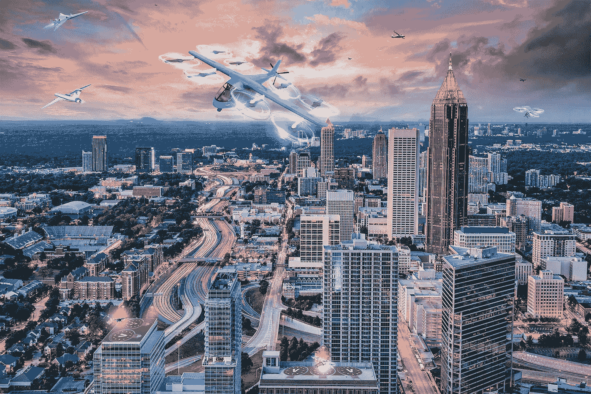
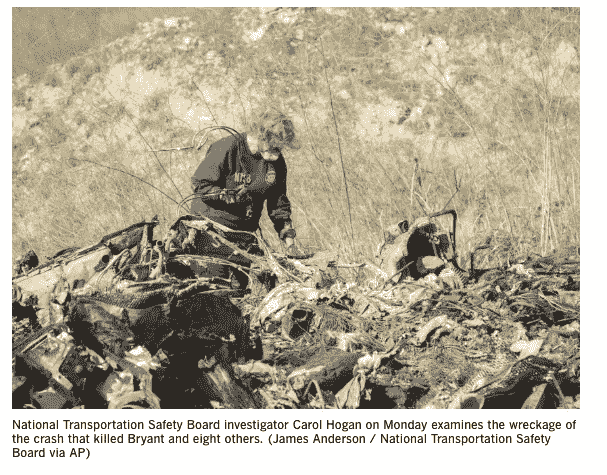
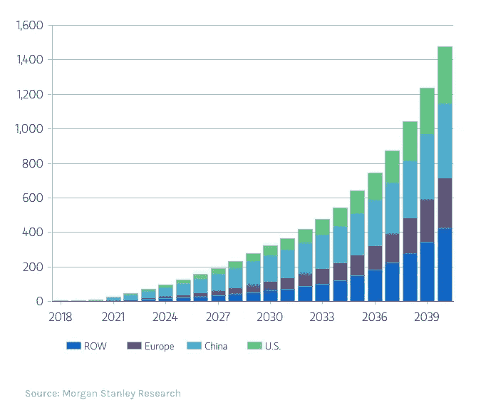
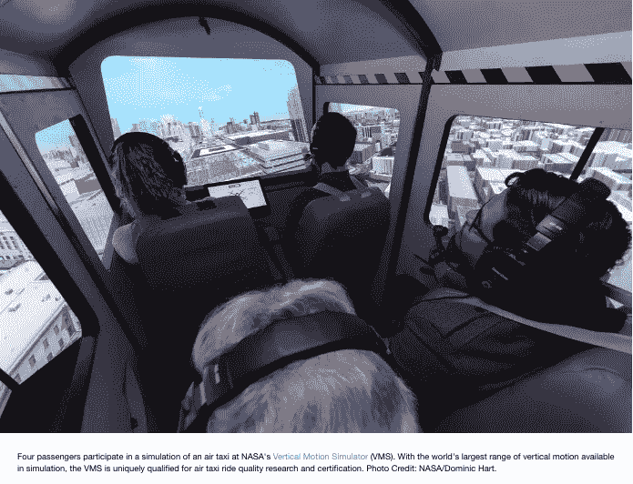

# 美国国家航空航天局为飞行出租车做准备？

> 原文：<https://medium.datadriveninvestor.com/nasa-prepares-the-nation-for-flying-taxis-c6aa697906e6?source=collection_archive---------18----------------------->

上个月，科比·布莱恩特直升机坠毁事件震惊了世界。当全国各地的家庭停下来反思他们自己的死亡时，国家运输安全委员会(NTSB)的调查人员努力在废墟中挖掘寻找线索。虽然媒体正在等待 NTSB 的官方报告，但已知的是直升机缺乏地形感知和警告系统(TAWS ),该系统可以提醒飞行员下面即将发生的危险。这场悲剧对自主航空旅行的未来提出了更大的问题。

为了更好地了解无人驾驶飞机这一新兴行业面临的挑战，我联系了航空学先驱[罗布·林赛](https://www.linkedin.com/in/rob-lindsay/)(飞行员、天使投资人，曾是[优步 Elevate](https://www.uber.com/us/en/elevate/) 和 [Blade](https://blade.flyblade.com/?gclid=CjwKCAiA-P7xBRAvEiwAow-VaUUb4qJ5Df9cNnCGM015F_ZOTGLM-WIC26bldTVKksWimvXez1B9hxoCXKgQAvD_BwE) 的高管)。我问林赛先生，他是否认为像上个月那样的直升机事故会减缓自动化的步伐。他坚定地宣称，“这不会改变开发自主 eVTOLs(电动垂直起飞和着陆系统)的时间框架。有如此多的组件、技术、程序、政策等。需要开发和迭代，开发的速度不会因为一个事故而提高。就此而言，多重事故也不会加快时间线。”我进一步征求了他关于将驾驶舱控制权交给机器的意见，“这突出了航空中人的因素。自动驾驶飞机表面上能够在低能见度条件下沿着既定路线导航和飞行，并能够保持与障碍物的分离，并且在较低的分离裕度下这样做，允许较短的飞行时间和系统中更多的飞机。它还消除了人的判断因素。在某些飞行员可能会感到压力，不得不在边缘或不安全的条件下完成任务的情况下，计算机不会偏离预先确定的参数。”

在确定了相对于载人飞行的 eVTOLs 的价值主张后，林赛大胆预测，我们将在 2030 年看到 UAS 运送人类的第一阶段:“我们将在 2010 年前拥有载人电动垂直起降，很可能更快达到一定规模。”虽然直升机通勤随着高收入阶层的增长而增加，但大多数美国人仍然被困在交通中。他透露，“为了让大众能够享受到航空旅行，价格需要降下来。Ridesharing 目前正在这样做，允许多名乘客分担费用。电动垂直起降将有助于以更低的运营成本进一步降低价格。”进一步思考后，他强调说，仍然存在一些监管和操作安全障碍，“他们准备好了就会准备好，监管机构不会批准本质上不安全的东西。”在一天结束时，前优步 Elevate 经理认为，“交通只会越来越糟，人们希望这样。”

林赛的观点得到了摩根士丹利(Morgan Stanley)最近一份报告的证实，该报告估计，到 2040 年，自动驾驶飞机的市场规模将达到 1.5 万亿美元。该研究的作者亚当·乔纳斯(Adam Jonas)断言，“许多技术的交叉，如超高效电池、自主系统和先进的制造工艺，正在这个领域催生一系列活动。”乔纳斯的预测跟踪航空领域的所有部门，包括:军事，物流，消费和运输。这位华尔街分析师暗示，空中出租车可能是即将到来的最大垂直市场之一，“城市空中交通代表着基础设施、车队管理、软件、硬件和内容方面的商机，就像自动驾驶汽车的机会一样，”尽管这项技术继续以喷气式飞机的速度飙升，但消费者的接受程度和监管框架仍然未知。在 2018 年[麦肯锡&公司](https://www.mckinsey.com/)的民意调查中，2500 名潜在飞行出租车乘客中有一半对服务没有意见，只有 25%的人肯定他们对无人驾驶飞机的舒适度。

为了让公众为采用城市空气流动(UAM)替代方案做好准备，美国宇航局推出了一系列“[大挑战](https://www.nasa.gov/uamgc)”来汇集新兴产业的所有利益相关者。根据去年 12 月的新闻稿:“大挑战(GC)系列旨在提高公众对 UAM 安全的信心；促进社区范围的学习，同时抓住公众的想象力；并让潜在的车辆制造商和运营商以及潜在的空域服务提供商了解不断发展的监管和运营环境。”今年晚些时候，车辆运营商和空域制造商将被邀请参加初步测试活动，完整的大挑战计划将于 2022 年开始。正如[斯塔尔·银](https://www.linkedin.com/in/starr-ginn-989a3a8/?msgConversationId=6468544260898639872&msgOverlay=true)所解释的那样，“最大的挑战是将美国宇航局和联邦航空局作为一个整体……我们的目标是永远领先工业几步。”目前，还没有飞机认证的飞行器用于空中任务，但银的团队的目标是在十年内实现“具有合作和负责任的自动化系统的中等密度和复杂操作”。为了实现这一目标，银的团队概述了 GC 的四个阶段:1)运营安全，2)复杂运营，3)大容量*垂直运输*，4)规模化城市运营。目前，试飞将利用加利福尼亚州的爱德华兹空军基地，但银乐观地说，“许多城市都倾向于提供机会。”除了美国之外，欧盟和中国的航空监管机构也在实施自己的计划。

随着政府积极为飞行汽车车队奠定基础，许多人预测 eVTOLs 甚至会在地面机器人出租车之前运送乘客。“现实是，空中自动化不会是一个技术问题；“这将是一个社会接受度的问题，”Lindsay 先生说，并继续说道，“记住，在自动按钮电梯首次安装后，电梯有服务员已经超过 50 年了。随着当今世界技术进步的快速步伐，我不认为人们需要那么长时间才能在自动驾驶飞机中感到舒适。”前面还有很长的路要走，但用一位领先的航空创新者的话说，“随着每周有 130 万人搬到世界各地的城市，交通只会越来越糟糕。是时候开始三维思考了。该抬头了！”

 [## 模式和机器人:复杂的现实|数据驱动的投资者

### 哈耶克的名著《复杂现象理论》(哈耶克，1964)深入探讨了复杂性的话题，并断言…

www.datadriveninvestor.com](https://www.datadriveninvestor.com/2019/03/04/patterns-and-robotics-a-complex-reality/)