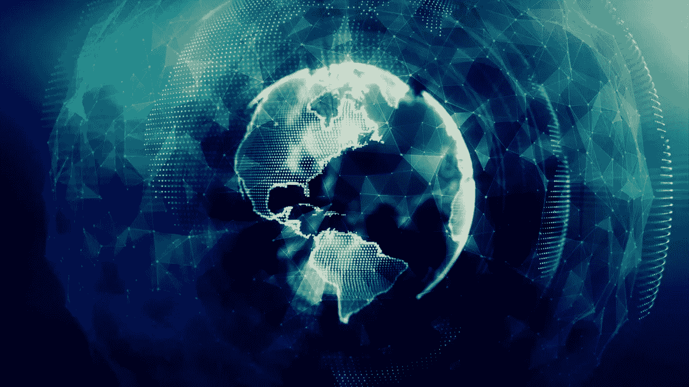

# 纳斯达克泡沫 2.0 和一生的崩溃

> 原文：<https://medium.datadriveninvestor.com/nasdaq-bubble-2-0-and-the-crash-of-a-lifetime-95ded8e59ef3?source=collection_archive---------1----------------------->

*编辑*当我在 7 月份写这篇文章时，有一些变化，这些变化是针对特斯拉(TSLA)和纳斯达克交易所交易基金(QQQ)的价格。然而，投机的潜在信息仍然存在。

美国股市的非理性投机令人困惑。纳斯达克是新的比特币，科技泡沫 2.0 正在到来。许多人推测，纳斯达克指数将在年底达到 15，000 点。仅今年一年，特斯拉股价就飙升了 200%以上，刚刚超过每股 1500 美元。正在酝酿的泡沫将超过纳斯达克泡沫，纳斯达克泡沫在一场像 1999 年一样的派对上消灭了互联网初创公司。任何一个名字中有. com 的人都可以获得风险投资和天使投资，只需要一份简单的商业计划。即将到来的崩盘将让纳斯达克泡沫看起来不值一提。即使是 2008 年的房市崩溃也算不了什么。如果任何一个有工作的人都能负担得起无止境的抵押贷款，那么房地产市场的崩溃将无足轻重。即将到来的崩盘将被比作 1929 年的崩盘。这次坠机会有所不同。

全球疫情导致失业率飙升，但华尔街记录受到冲击，这是有道理的。除了 FOMO(害怕错过)，什么都没有，那些正在购买的人正在盲目地玩一场音乐椅游戏。咒语是你不能输，逢低买入，美联储不会让你失败。杰罗姆叔叔(杰罗姆·鲍威尔，美联储主席)将让打印机继续运转。当这个泡沫破裂时，其破坏力将是这个世界自 1929 年以来从未有过的。

DC 的美联储除了制造一个更大的问题之外，什么也没做，因为市场不再理性，事实上它们从来都不是理性的。然而，过去你可以观察某种形式的技术趋势，而现在，市场根据推文上涨。来自美联储的免费资金使这里成为比拉斯维加斯更大的赌场。无数人收到了 1200 美元的刺激支票，并将这笔钱投入市场。被称为“罗宾汉兄弟”的交易员不假思索地将大量资金投入赫兹、切萨皮克能源和其他破产公司。在正在进行的新冠肺炎疫情期间，中国病毒式社交应用 Tiktok(Alibaba)和金融科技(Fintech)初创公司罗宾汉(Robinhood)向新投资者开放了世界。交易者观看 Tiktok 的视频，盲目从众，没有对提到的任何公司做任何尽职调查。

截至今天，7 月 11 日，纳斯达克收盘再创新高，这似乎每天都在发生。追踪纳斯达克(NASDAQ)的交易所交易基金(ETF) QQQ 的交易量微乎其微。但是，我们仍在创下新高，这是什么问题呢？甚至道琼斯和 S&P500 交易所交易基金(DIA 和 SPY)的交易量也在减少。波动性低，那有什么问题？一切都是伟大的，利润为所有人，没有风险，只是购买，你不能失去。

美国银行、摩根大通、高盛和富国银行等大银行将在接下来的一周公布收益。这些收益会有多糟糕？有多少人停止支付抵押贷款？有多少人停止支付信用卡？对于大型科技公司来说，Twitter、谷歌和脸书会有多少收入，因为它们都在削减广告成本？创纪录的失业率和华尔街创纪录的高点，如果这都不会让你抓狂，那就没什么会了。当地毯被拉开，美联储推动的庞氏骗局市场崩溃时，谁会被甩在身后？401k 将被摧毁，但也许你还有几年时间退休，你可以度过随后失去的十年。

会有一场像 1929 年那样的崩溃，而当前的世界状况已经越来越清楚地表明，我们离施舍处只有一份薪水了。你会继续玩音乐椅的游戏吗？