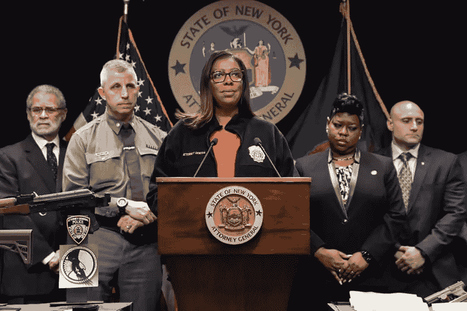

# 全国步枪协会被瞄准了

> 原文：<https://medium.datadriveninvestor.com/national-rifle-association-in-the-crosshairs-f740edfd5362?source=collection_archive---------7----------------------->

纽约农业公司已经起诉解散全国步枪协会。此举背后是什么？

New York Attorney General Letitia James. February 13, 2020\. (photo: Facebook)

经过 18 个月的调查，纽约司法部长莱蒂夏·詹姆斯(Letitia James)对全国步枪协会(National Rifle Association)及其领导层提起诉讼，要求在本周全部解散全国步枪协会。

司法部长詹姆斯声称，多年的腐败削弱了该组织作为非营利组织继续运营的能力。她在一份诉讼中声称，她发现财务渎职导致了三年多时间里超过 6400 万美元的损失。

詹姆斯在一份声明中说:“全国步枪协会的影响力如此强大，以至于该组织几十年来一直不受约束，而高层管理人员却将数百万美元装进了自己的口袋。”“全国步枪协会充满了欺诈和滥用，这就是为什么，今天，我们寻求解散全国步枪协会，因为没有组织凌驾于法律之上。”

AG James 正在起诉 NRA，指控四名现任或前任高管，如 39 岁的首席执行官 Wayne LaPierre，将数百万美元的慈善基金用于昂贵的私人旅行，为朋友和家庭成员授予合同以及其他有问题的支出。

 [## 不是数据驱动的政治辩论投资者

### 《纽约时报》在 2020 年 6 月 3 日在线发表了阿肯色州参议员汤姆…

www.datadriveninvestor.com](https://www.datadriveninvestor.com/2020/06/08/the-political-debate-that-has-not-been/) 

“这一阴谋背后的核心人物不是别人，正是韦恩·拉皮埃尔……拉皮埃尔先生利用该组织为自己和家人谋取经济利益。”

这起诉讼中提到的其他 NRA 高管包括该组织的法律总顾问约翰·弗雷泽(John Frazer)、拉皮埃尔的前高级副手约什·鲍威尔(Michael brown)和前首席财务官伍迪·菲利普斯(Woody Phillips)。

该诉讼称，四名高管未能履行对 NRA 的职责，将 NRA 的储备用于个人用途，并要求纽约法院命令 LaPierre 和其他现任和前任高管偿还她在调查中发现的管理不善的资金和虚高的工资。

该诉讼还试图解除 LaPierre 和 Frazer 在该组织的领导地位，并阻止这四个人今后在纽约的一个慈善机构的董事会中任职。

由于该组织的注册地点在纽约，詹姆斯对其拥有管辖权。寻求解散全国步枪协会是她可能对非营利组织采取的最激进的方法。

民主党人詹姆斯在竞选司法部长期间威胁要调查全国步枪协会的非营利地位，并在 2018 年将该组织称为“[恐怖组织](https://www.ebony.com/news/letitia-tish-james-on-becoming-new-yorks-next-attorney-general/)”。

詹姆斯声称这起诉讼与她对枪支暴力的个人观点无关。

自 1871 年成立以来，全国步枪协会已经建立了美国最强有力的枪支权利保护者的声誉。该组织已成为国家政治和政府中的主要力量和游说力量。

全国步枪协会主席 Carolyn Meadows 对司法部长的行动做出了回应，T2 在一份声明中表示，该组织“不会在这场斗争中退缩——我们将面对它并取得胜利。”

她说，“这是对我们组织及其捍卫的第二修正案自由的毫无根据、有预谋的攻击。”“你可以用它来设置你的手表:随着我们进入 2020 年选举周期，调查将达到高潮。这显然是企图在政治上得分，并攻击反对左派议程的主要声音。这是一个政治机会主义者的夺权行为——这是一个绝望的举动，是等级政治仇杀的一部分。我们的成员在捍卫政治和宪法自由时不会被吓倒或被欺负。”

如果此举确实是出于政治动机，很难说解散全国步枪协会的努力是否会在 11 月选举日帮助民主党人。

密歇根等摇摆州的民主党人对此表示怀疑。批评者认为此举是试图通过“对抗全国步枪协会”来获得政治分数，因为诉讼不太可能解散全国步枪协会。

共和党人注意到了提交的时机，指出针对全国步枪协会的法律案件将需要数年的审判和诉讼，但[的政治影响将立即开始](https://www.breitbart.com/radio/2020/08/07/mark-smith-nra-lawsuit-backfire-drive-gun-owners-polls/)。共和党人坚持认为，拥有枪支的美国人，一群在过去七个月创纪录的枪支销售中呈指数增长的人，不会更倾向于投票给假定的民主党提名人乔·拜登[，因为这是针对全国步枪协会的法律文件](https://www.foxnews.com/politics/ari-fleischer-ny-suing-nra)。

特朗普总统称纽约司法部长针对全国步枪协会的行为是“可怕的事情”，并建议他们转移地点。

特朗普说:“我认为全国步枪协会应该搬到德克萨斯州，过上非常美好的生活……我认为德克萨斯州将是一个伟大的地方，也是全国步枪协会的合适之地。”。

在接受《今日雷切尔·玛多》采访时，AG James 为自己的诉讼进行了辩护，并驳斥了川普要求全国步枪协会离开纽约州的呼吁。

> “需要明确的是，没有我的办公室或纽约州最高法院的批准，任何在 NYS 注册的慈善机构，包括@NRA，都不能解散并搬迁到另一个州。”
> 
> “只要我们的诉讼继续，全国步枪协会就必须原地不动&为他们根深蒂固的欺诈行为负责。”纽约 AG Leticia James，推特。

(特约记者阿莱格拉·诺卡伊)(特约撰稿人布鲁克·贝尔)

**访问专家视图—** [**订阅 DDI 英特尔**](https://datadriveninvestor.com/ddi-intel)