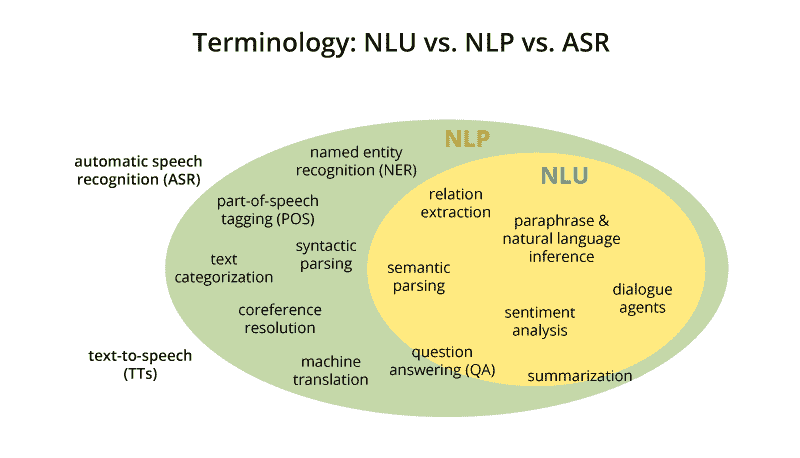
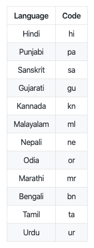
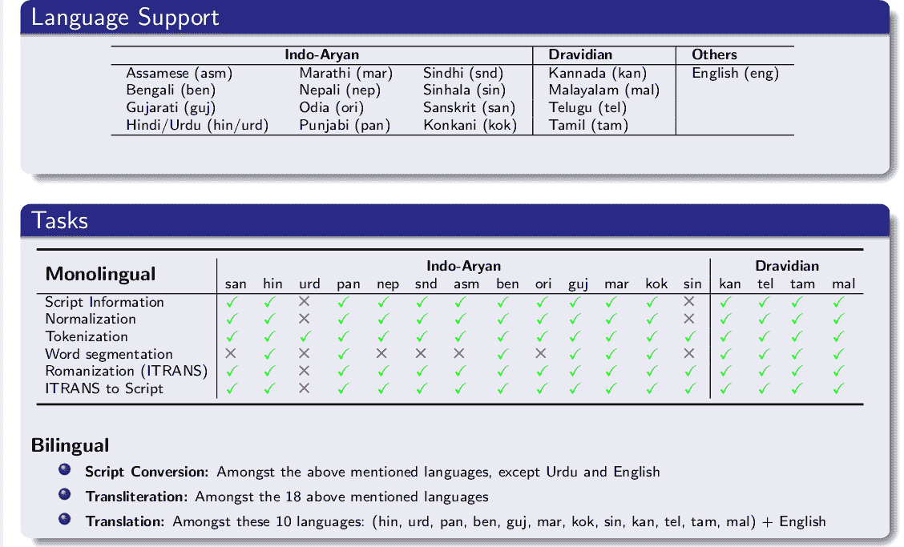
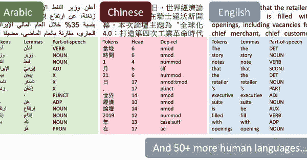
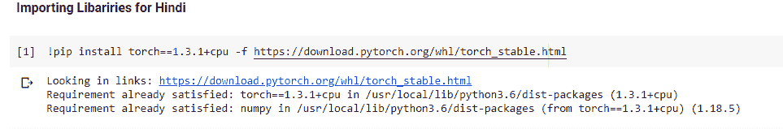
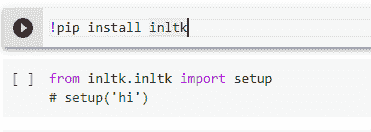

# Web 上印度语言(印地语)的自然语言处理(NLP)

> 原文：<https://medium.datadriveninvestor.com/natural-langauge-processing-nlp-for-indian-language-hindi-on-web-64d83f16544a?source=collection_archive---------1----------------------->

Natural Language Processing

"语言是一个秘密，每个人都可以处理，对我来说，这是美丽的."

每种语言都包含无数独特的单词、短语和规则。每种语言都是绝对的:如果你不会说，你就不会理解它。虽然语言有可怕的力量分裂我们，但它也有不可思议的力量团结我们。

正如纳尔逊·曼德拉所说:

“如果你用一个人能理解的语言和他交谈，那会让他头脑发热。

如果你用他的语言和他交谈，那会触及他的内心。"

> **我们将在本文中讨论的内容**

1.  **自然语言处理简介**
2.  **印度语言图书馆**
3.  **iNLTK(Python 代码)的实际实现**
4.  **使用 Streamlit 在网络上实施**

**那么让我们开始:-**

**在了解更多细节之前，如果你想看最终结果，请查看我的 YouTube 视频👉:-**[**YouTube**](https://www.youtube.com/watch?v=C2gXYRR7-HY&t=59s&ab_channel=HimanshuTripathi)

**如果寻找源代码👉:-**[**GitHub**](https://github.com/iamhimanshu0/NLP_WEB_BASE_PROJECTS/blob/master/hindi_nlp.ipynb)

**现在开始:-**

> **自然语言处理简介:-**

我们将把自然语言处理——简称 NLP 从广义上来说，包括任何种类的自然语言的计算机操作。在一个极端，可以简单到计算词频来比较不同的写作风格。在另一个极端，NLP 包括“理解”完整的人类话语，至少在一定程度上能够对它们做出有用的响应。

——第 ix 页，[用 Python 进行自然语言处理](http://amzn.to/2uZMF27)，2009。

听起来很专业，对吧？**我们来分解一下**

自然语言处理(NLP)是指使用自然语言(如英语)与智能系统进行通信的人工智能方法。

当你想要一个像机器人一样的智能系统按照你的指令执行时，当你想要听到一个基于对话的临床专家系统的决定时，自然语言的处理是必需的。

NLP 的领域包括让计算机用人类使用的自然语言执行有用的任务。NLP 系统的输入和输出可以是

*   演讲
*   书面文本

# NLP 的组件

NLP 有两个组成部分，如下所示

# 自然语言理解(NLU)

理解包括以下任务

*   将自然语言中的给定输入映射成有用的表示。
*   分析语言的不同方面。

# 自然语言生成(NLG)

它是从某种内在表征中以自然语言的形式产生有意义的短语和句子的过程。

> 印度语言图书馆

主要有三个用于印度语言文本处理的库

1.  INLTK
2.  印度自然语言程序库
3.  斯坦福大学

**自然语言处理步骤:**

*   **印度语自然语言工具包**

*iNLTK 提供了现代自然语言处理任务所需的大部分功能，如生成一个向量* ***嵌入*** *用于输入文本、标记化、句子相似度等。在一个非常* ***直观的*** *和简单的 API 接口中。*

**语言支持**

*   **印度文自然语言程序库**

*" Indic NLP 库构建为支持大多数* ***通用文本处理*** *和印度语言的 NLP 功能。*

 [## 什么是数据目录，它如何使机器学习取得成功？数据驱动的投资者

### 数据目录是机器学习和数据分析的燃料。没有它，你将不得不花费很多…

www.datadriveninvestor.com](https://www.datadriveninvestor.com/2020/08/27/what-is-a-data-catalog-and-how-does-it-enable-machine-learning-success/) 

*印度语言在* ***文字、音韵、语言句法、*** *等方面都有共性。这个库试图为* ***印度语言文本*** *提供一个通用的解决方案。*

**语言支持**

*   **斯坦福大学**

*本库最显著的特点是支持大约* ***53 种人类语言*** *进行文本处理！*

> **iNLTK(Python 代码)的实际实现**

**第一步:**

**安装 iNLTK**

**iNLTK 依赖 PyTorch 1.3.1，因此先安装它**

！pip 安装火炬= = 1 . 3 . 1+CPU-f[https://download.pytorch.org/whl/torch_stable.html](https://download.pytorch.org/whl/torch_stable.html)

**然后使用 pip 和设置语言**安装 iNLTK

！pip 安装入 tk

从 inltk.inltk 导入设置

设置(“嗨”)

**标记化:**

将文本分解成最小的单元或记号

从 inltk.inltk 导入标记化

Hindi _ text = " "प्राकृतिकभाषाप्रसंस्करणभाषाविज्ञान，कंप्यूटर विज्ञान，औरकृत्रिमबुद्धिमत्ताकाएकउपक्षेत्रहै，

जो कंप्यूटर और मानव भाषा के बीच

पारस्परिक क्रियाओं से संबंधित है, विशेष रूप से कंप्यूटर

को बड़ी मात्रा में प्राकृतिक भाषा डेटा को संसाधित और विश्लेषण करने के लिए कैसे प्रोग्राम किया जाता है।”””

# tokenize(输入文本、语言代码)

tokenize(hindi_text，“hi”)

— — — — — — — — — — — — — —

输出

— — — — — — — — — — — — — —

[‘▁प्राकृतिक’,

‘▁भाषा’,

‘▁प्रसंस्करण’,

‘▁भाषा’,

‘▁विज्ञान’,

‘,’,

‘▁कंप्यूटर’,

‘▁विज्ञान’,

‘,’,

‘▁और’,

‘▁कृत्रिम’,

‘▁बुद्धिमत्ता’,

‘▁का’,

‘▁एक’,

‘▁उपक्षेत्र’,

‘▁है’,

‘,’,

‘▁जो’,

‘▁कंप्यूटर’,

‘▁और’,

‘▁मानव’,

‘▁भाषा’,

‘▁के’,

‘▁बीच’,

‘▁पारस्परिक’,

‘▁क्रियाओं’,

‘▁से’,]

## 从给定的文本输入中生成相似的句子

从 inltk.inltk import 中获取 _ 相似 _ 句子

#得到类似于用印地语给出的句子

输出=get_similar_sentences('प्राकृतिकभाषाप्रसंस्करणभाषाविज्ञान、कंप्यूटर विज्ञान、औरकृत्रिमबुद्धिमत्ताकाएकउपक्षेत्रहै'，5，“嗨”)

打印(输出)

— — — — — — — — — — — — —

输出

— — — — — — — — — — — — —

[‘प्राकृतिक भाषा परिष्करण भाषा विज्ञान, कंप्यूटर विज्ञान, और कृत्रिम बुद्धिमत्ता का एक उपक्षेत्र है’,

‘प्राकृतिक भाषा प्रसंस्करण आकृति विज्ञान, कंप्यूटर विज्ञान, और कृत्रिम बुद्धिमत्ता का एक उपक्षेत्र है’,

‘प्राकृतिक भाषा प्रसंस्करण भाषा विज्ञान, कंप्यूटर विज्ञान, एवं कृत्रिम बुद्धिमत्ता का एक उपक्षेत्र है’,

‘प्राकृतिक भाषाओं प्रसंस्करण भाषा विज्ञान, कंप्यूटर विज्ञान, और कृत्रिम बुद्धिमत्ता का एक उपक्षेत्र है’, ‘प्राकृतिक भाषा प्रसंस्करण भाषा विज्ञान, कंप्यूटर शाकाहार, और कृत्रिम बुद्धिमत्ता का एक उपक्षेत्र है’]

## 文本完成(预测下一个单词)

从 inltk.inltk 导入设置

从 inltk.inltk 导入预测 _ next _ words

predict_next_words("प्राकृतिकभाषाप्रसंस्करणभाषाविज्ञान，कंप्यूटर विज्ञान，“，10，“嗨”，0.7)

— — — — — — — — — — — — — — — — — — — —

输出

— — — — — — — — — — — — — — — — — — — -

प्राकृतिक भाषा प्रसंस्करण भाषा विज्ञान, कंप्यूटर विज्ञान, कंप्यूटर विज्ञान और कला / तकनीक का प्रयोग करती है

## 发现两个句子之间的相似性

从 inltk.inltk 导入 get _ 句子 _ 相似性

#使用默认为余弦相似度的 cmp 函数计算编码的相似度

get_sentence_similarity('प्राकृतिकभाषापरिष्करणभाषाविज्ञान、कंप्यूटर विज्ञान、औरकृत्रिमबुद्धिमत्ताकाएकउपक्षेत्रहै'，

'प्राकृतिकभाषाप्रसंस्करणआकृतिविज्ञान、कंप्यूटर विज्ञान、औरकृत्रिमबुद्धिमत्ताकाएकउपक्षेत्रहै'，“嗨”)

— — — — — — — — — — — — — — — — — — -

输出

— — — — — — — — — — — — — — — — — —

0.9826000928878784

> **使用细流**在网上实现

**什么是流线:**

**流线**是一个开源 Python 库，可以很容易地为机器学习和数据科学构建漂亮的定制网络应用程序。

**安装细流**

！pip 安装简化

**查看细流文档获取更多信息(**[**https://www.streamlit.io/**](https://www.streamlit.io/)**)**

**全源代码:** **👉:-**

****完整代码:-****

**将流线导入为 st**

**从 inltk.inltk 导入令牌化**

**从 inltk.inltk import 中获取 _ 相似 _ 句子**

**从 inltk.inltk 导入预测 _ next _ words**

**从 inltk.inltk 导入 get _ 句子 _ 相似性**

**def main():**

**st.title(“北印度语 NLP”)**

**菜单= [“主页”，“关于”]**

**choice = st .侧栏. selectbox('Himanshu Tripathi '，菜单)**

**如果选择== '主页':**

**st .副标题(“北印度语 NLP”)**

**“语言是一种极好的交流工具——几个世纪以来，它一直是人类的动力，并继续成为我们文化的核心。”)**

**st.sidebar.write("भाषासंचारकाएकअद्भुतसाधनहै-इसकीसदियोंसेचलीआरहीमानवजातिऔरहमारीसंस्कृतिकेकेंद्रमेंबनीहुईहै।)**

**#**

**st.success(“单词标记”)**

**#进行令牌化**

**印地语 _ 文本= st.text_area(“输入印地语文本”)**

**如果 st.button(“令牌化”):**

**output = tokenize(hindi_text，“hi”)**

**st.write(输出)**

**st.success(“从给定的文本中获得相似的句子”)**

**#从给定的文本中获取相似的句子**

**text = st.text_input("输入文本以查找相似的句子")**

**slider_value = st.slider("选择多少个句子"，2，10)**

**如果 st.button("生成单词"):**

**output = get _ similar _ sentences(text，slider_value，" hi ")**

**st.write(输出)**

**st.success("预测下一个单词(文本完成)")**

**#预测下一个单词(文本完成)**

**text = st.text_input("输入文本")**

**max_length = st.slider("选择最大值(生成单词)"，5，100)**

**random_ness = st.slider("选择随机性的值"，4，10)**

**如果 st.button("完整文本"):**

**output = predict_next_words(text，max_length，" hi "，random_ness * 0.1)**

**st.write(输出)**

**st.success(“找出两个句子之间的相似之处”)**

**#找出两个句子之间的相似之处**

**first_text = st.text_input("输入文本 1 ")**

**second_text = st.text_input("输入文本 2 ")**

**如果 st.button("寻找相似性"):**

**sim = get _ sentence _ similarity(first _ text，second_text，' hi ')**

**如果 sim > 0.5:**

**st.success(f "这两个词看起来更相似，值是:{sim} ")**

**否则:**

**st.error(f "似乎不太相似，值为:{sim} ")**

**#第一次写入(sim)**

**if __name__ == '__main__ ':**

**主()**

**暂时就这样了。下一篇文章再见。**

**如果你觉得这篇文章有趣、有帮助，或者你从这篇文章中学到了什么，请发表评论并留下反馈。**

****感谢阅读！****

****参考文献:-****

**[**https://www . analyticsvidhya . com/blog/2020/01/3-重要-NLP-图书馆-印度-语言-python/**](https://www.analyticsvidhya.com/blog/2020/01/3-important-nlp-libraries-indian-languages-python/)**

****还有，让我们在**[**Linkedin**](https://www.linkedin.com/in/iamhimanshu0/)**[**Twitter**](https://twitter.com/iam_himanshu0)**[**insta gram**](https://instagram.com/iamhimanshu0/)**[**Github**](https://github.com/iamhimanshu0)**，以及** [**脸书**](https://www.facebook.com/iamhimanshu0) **。**********

## ****获得专家观点— [订阅 DDI 英特尔](https://datadriveninvestor.com/ddi-intel)****