# 自然语言智能:为商业搭建语言桥梁

> 原文：<https://medium.datadriveninvestor.com/natural-language-intelligence-building-a-language-bridge-for-business-997ff8bba977?source=collection_archive---------8----------------------->

*作者罗斯。*

本文为大家带来阿里巴巴 CIO 学院第九期关于用技术对抗疫情的公开直播的精彩内容，题为《人工智能皇冠上的明珠:DAMO 学院的语言技术》本次直播的演讲嘉宾是阿里巴巴 DAMO 研究院语言技术实验室负责人、ACM 特聘成员、阿里巴巴高级研究员罗斯。他做了题为“为商业搭建语言桥梁”的演讲，并介绍了自然语言研究的当前发展和趋势以及 DAMO 学院在自然语言智能方面的成果。

 [## 商业价值和人工智能的 5 个原则|数据驱动的投资者

### 提取商业价值很难。我是说真的很难...说到高级分析，这一过程甚至…

www.datadriveninvestor.com](https://www.datadriveninvestor.com/2020/07/07/5-principles-for-business-value-and-artificial-intelligence/) 

# 1.人工智能和自然语言智能

什么是自然语言智能？自然语言智能研究旨在通过语言实现人与计算机之间的有效交流。它是一门综合了语言学、心理学、计算机科学、数学和统计学的科学，跨越了广泛的学科领域，包括自然语言和形式语言的分析、提取、理解、转换和生成。目前，人工智能(AI)无疑是最热门的研究领域之一。罗斯将人工智能的发展分为四个阶段:计算智能、感知智能、认知智能和创造智能。

*Figure 1 — Stages of Artificial Intelligence Development*

计算智能是 AI 的基础阶段。是指利用计算机或机器的海量计算和存储能力，完成超出人类能力的任务的能力。谷歌的 AlphaGo 就属于这一类智能。下一个阶段是感知智能。这是指可以从广泛的非结构化信息中精确定位目标信息的智能，包括在新闻文章中找到像人名、地点和组织这样的重要元素。另一个例子是使用计算机视觉进行面部识别。更进一步，认知智能试图识别由感知智能识别的重要信息片段之间的相互关系。然后进行推演，比如从大量新闻报道中确定重要事件的发生、发展、高潮、过程、结局。认知智能的另一个例子是使用计算机视觉来跟踪一个人在不同时间和不同场景下的轨迹和活动。在前面几个阶段的基础上，更高级的阶段是创造性智力。这种类型的智能可以产生新的复杂的想法，这些想法是语义和理性的。它是人工智能的高级形式。截至 2020 年，计算机无法写出内部高度一致的小说。只有当计算机或人工智能能够进行非常复杂的科学工作，如数学推理或物理研究时，才能称为“创造性智能”。感知智能、认知智能和创造智能涉及广泛的语义理解和常识推理。自然语言处理对于实现人工智能的高级阶段至关重要，也是一项非常具有挑战性的任务。

# 2.阿里巴巴 DAMO 研究院的语言技术研究系统

2009 年，自然语言智能的研究取得了一些重要进展。深入的语言建模取得了突破，推动了重要的自然语言技术的进步。公共云 NLP(自然语言处理)技术从通用功能转向定制服务。自然语言技术越来越多地融入到行业和场景中，并创造了更大的价值。2020 年，我们预计自然语言智能将在这些领域继续取得进展。作为一家技术驱动的公司，阿里巴巴自然会努力成为自然语言智能的先行者。这就是我们成立 [DAMO 学院](https://damo.alibaba.com/)的原因，这是一个专注于自然语言智能的语言实验室，旨在:

1.  建立阿里巴巴的自然语言技术生态系统，以支持阿里巴巴经济的语言技术和应用。
2.  赋能阿里巴巴的合作伙伴，开发包容性的自然语言技术。
3.  创新自然语言技术，探索未来的 AI 技术。

自两年前成立以来，阿里巴巴 DAMO 研究院一直在不断发展和完善其技术生态系统。它在各种国内外技术评测中取得了优异的成绩，包括在 2016 年的 ACM CKIM Cup 个性化电子商务搜索国际竞赛中获得第一名，在 2017 年由美国国家标准与技术研究所举办的信息提取英语实体分类竞赛中获得第一名，在 2019 年语义评估(SemEval)中获得四个类别(包括 RumorEval 和 Toponym Resolution)的第一名，以及在 2020 年 3 月获得知名语言模型评估集 Gluebenchmark 的第一名。阿里巴巴 DAMO 研究院参与了这些技术演习，以评估我们的技术，验证和改善我们的技术生态系统。这使得我们能够将我们的研究成果应用到自然语言技术平台上，并赋能阿里巴巴的内部应用和合作伙伴，创造更大的商业价值。

## 1)自然语言技术平台

依托技术实力，DAMO 研究院搭建了一个自然语言技术平台，如图*图 2* 所示。平台的底层是数据层，收集海量数据，包括语言词典、分词/词性标注语料库、实体语料库、情感语料库等。构建在数据层之上的是一整套基本的 NLP 算法，包括基本的词法分析、语法分析、语义分析、文本分析和深度建模。基础算法之上的垂直 NLP 技术包括搜索、内容推荐、情感分析、产品理解。最后，结合 NLP 垂直技术来支持复杂的 NLP 应用，例如搜索、推荐、翻译和广告。

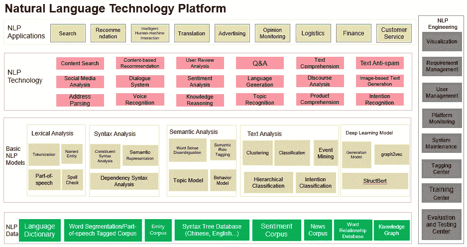

*Figure 2 — DAMO Academy Language Lab’s Natural Language Technology Platform*

**2)翻译技术平台**

自然语言处理的一个非常重要的分支是翻译技术。这是用来消除商务交流和沟通中的语言障碍。语料库平台是翻译技术的重要组成部分，涵盖了语料库抓取、众包、语料库质量评估等功能。在语料库平台之上，有多语言 NLP 技术，包括多语言分词、关键词识别、实体识别和拼写错误纠正。机器翻译技术建立在多语言 NLP 技术之上，主要包括统计翻译技术、多语言统一翻译模型和神经网络机器翻译。在机器翻译的支持下，翻译技术可以支持各种跨语言的解决方案，并应用于不同的业务场景，如电子商务中的标题翻译、产品描述翻译、评论翻译等。翻译技术也在促进许多阿里巴巴业务的国际化方面发挥了重要作用，包括全球速卖通、ICBU、菜鸟和阿里云。

*Figure 3 — Translation Technology Platform*

阿里巴巴的机器翻译技术支撑着阿里巴巴内部广泛的国际应用场景。它支持 70 多个业务和 170 多个应用场景，每天被调用 10 亿次。在积累大量语料库数据的同时，该技术通过其核心神经网络机器翻译引擎支持许多重要任务，并产生了数亿美元的商业价值。机器翻译并不打算取代人工翻译。在很多情况下，采用组合式人机解决方案来提高效率，更快地完成工作。这项技术从大量的应用场景中发展出来，可以在全球化的世界中支持更多的场景，并通过打破语言障碍创造更大的价值。

## 3) NLP 自学平台

前面提到的自然语言技术平台和翻译技术平台都是比较常见的 NLP 平台。它们支持通用模型的相应工作。在努力为我们的合作伙伴赋能的同时，阿里巴巴发现公司的需求通常是多样化的，并且高度依赖于针对特定场景和行业的定制。大多数数据是高度隐私的，公司缺乏基于平台的解决方案。阿里巴巴的很多合作伙伴都需要用到算法，而不能自己开发算法。因此，我们必须提供集成的 NLP 标记、培训和预测服务平台，为在基于算法的设计方面经验不足的合作伙伴量身定制。为了满足真实场景的需求，语言实验室设计了 NLP 自主学习平台。该平台从数据标记开始，提供相对完整的数据中心，帮助执行标记和数据质量控制。用户可以使用 NLP 自学平台来训练与特定行业场景紧密结合的模型，增强他们的业务，并创造商业价值。NLP 自学平台方便易用，结合了低成本和高准确率。该平台允许合作伙伴利用 NLP 技术的商业优势，而不需要任何算法能力。因此，使 NLP 基础平台可访问是非常重要的。出于同样的原因，许多供应商正在提供类似的 NLP 平台来加速业务授权。

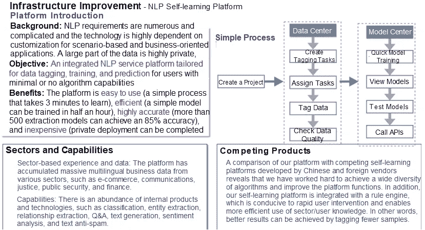

*Figure 4 — NLP Self-Learning Platform*

目前，该学院的 NLP 自学平台的原子功能已经从文本提取和文本分类功能发展到更高级的短文本匹配和关系提取功能，以及其他复杂的原子功能。我们还支持基于场景的应用，包括电子商务领域的情感分析和产品评论分析，并正在测试复杂的应用，如合同评论。

使用文本提取功能，我们可以从纯文本中提取信息并检索重要的元素。例如，我们可以训练模型来自动提取合同的标题、甲方和乙方的名称、接收方的银行和账号，以及合同中的其他关键信息。我们的简历解决方案从简历中提取关键信息，包括申请人的姓名、学校、专业和过去的工作经验。文本分类是自然语言技术的一个非常重要的特征，但是很多重要的应用都可以看作是特殊类型的文本分类。例如，短文本分类应用程序识别短文本字符串，并将其分类为不同的类别，如色情、广告、滥用和政治。另一个例子是对用户评论进行分类，以确定它们是正面的还是负面的。关系提取和短文本匹配是更复杂的原子功能的两个例子。通过关系提取，我们可以识别重要的实体，提取它们之间的关系，并确定多个实体之间的连接。短文本匹配可以应用于许多场景。例如，在信用卡更换过程中，我们可以使用 NLP 自学平台上的应用，通过问答来确定用户请求更换信用卡的真实意图和业务需求。

对于产品评论场景，语言实验室已经基于阿里巴巴内部平台的标记数据训练了许多模型，并取得了很好的效果。通过创建为不同行业量身定制的模型，并对产品评论文本进行多维分析，DAMO 学院的 NLP 自学平台现在支持产品评论解析模型，可以对用户评论进行分类。

# 3.语言模型

有了技术平台，构建基础语言模型就变得非常重要。语言模型用于描述自然语言的表示、序列、结构、意义和生成过程，并解释如何执行语言相关的应用任务。传统上，语言模型有两种构造方式。第一种方法是语言学方法，它依赖于语言语法(上下文依赖)来描述形式语言的表示和意义。这种方法可以有效地解释一种语言的语法是如何产生的。然而，随着语言的动态发展，新的语言、新的语法和新的含义不断涌现。因此，严格的基于规则的方法受到很大的限制。另一种方法是数据驱动的方法。这种方法使用统计学习或深度学习来分析大量的语料库和一些相关的应用任务，并学习一种语言的表示和结构。通过使用不断变化的语言信息和海量的语料库信息进行自我学习，这种方法可以应用于广泛的场景和应用。罗斯认为，整合语言知识、一般知识、特定领域知识和大量多模态数据信息的模型代表了自然语言智能的未来。今天，数据驱动的语言模型，包括统计语言模型和神经网络语言模型，是模型开发的主要焦点。

## 1)统计语言模型

统计语言模型建立在 N 元语言概率模型的基础上，用于预测具有时间关系的句子结构。该模型使用最大似然估计(MLE)来训练，这是一种高效、易于解释且易于理解的方法。缺点是模型只能依赖于训练数据窗口中一个序列的前几个词。如果扩大范围，参数空间会成倍增加，导致数据稀疏，新词处理困难。

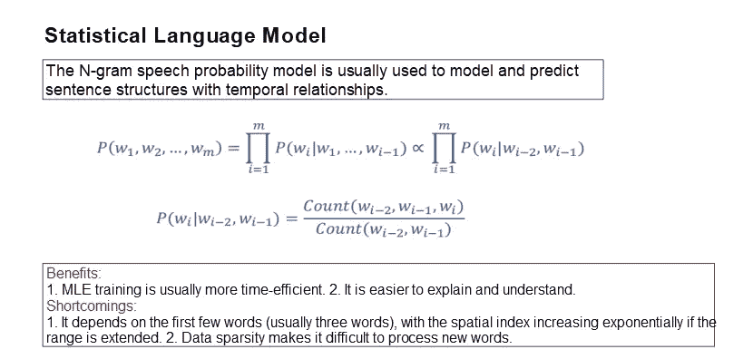

*Figure 5 — Statistical Language Model*

## 2)神经语言模型和表征学习

为了解决统计语言模型固有的问题，学术界提出了神经语言模型和表征学习。在这种方法中，向量(例如词向量)被分配给连续空间中的每个语义单元(例如词)，并且通过神经网络学习分布式表示。基于这种向量表示，可以执行自然语言相关的应用，例如计算和分类。典型的例子是 Word2vec 模型。在该模型中，每个词用一个多维向量表示，用目标词向量通过周围的词来预测中心词。这种方法使用单个隐藏层来学习矢量表示，因此它具有固有的缺点。比如每个词的表征空间是固定的，不随上下文变化。这个模型很简单，但代表性有限。与下游任务，特别是某些监督主体任务的联系不够。

基于 Word2vec 的特点，研究人员提出了一种深度语言模型，该模型使用深度神经网络来学习通过上下文学习自适应的语言表示。在深度语言模型中，一个众所周知的例子是 ELMo，它使用 LSTM 网络对单词左右的上下文进行建模。事实证明，ELMo 是一种非常有效的模式。*图 6* 显示其结构。

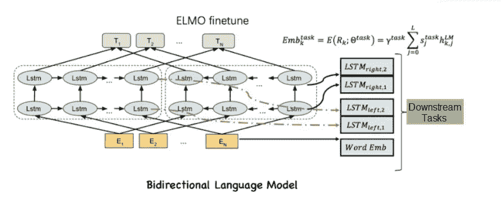

*Figure 6 — ELMo Model*

另一个流行的模型是谷歌在 2019 年提出的 BERT 模型。BERT 模型分为两个阶段:预训练阶段和微调阶段。在预训练阶段，BERT 模型在没有监督单词和句子之间关系的情况下进行预训练，并学习每个句子中每个单词的上下文语义向量表示。微调阶段侧重于下游任务的组合。它使用下游的一些监督期望作为优化目标。然后，将它们与反向传播的 BERT 模型中的语义表示相结合，改变了 BERT 模型中的语义向量表示。在这两个阶段中，BERT 模型使用深度语言模型和 transformer 架构来完成相应的任务。

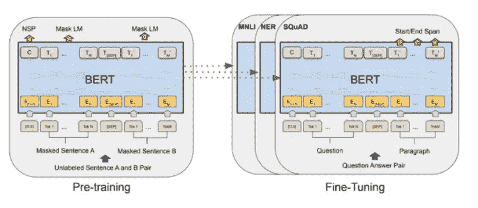

*Figure 7 — BERT Model*

## 3)结构伯特

BERT 和 ELMo 之间的简单比较揭示了两者都使用深度神经网络通过上下文学习来学习自适应语言表示，并通过组合下游任务来提高模型性能。但是，这两种模型之间存在一些差异:

1.  BERT 模型使用自动编码器架构，以统一的方式用注意机制对整体模型信息进行建模，但是 ELMo 分别对左上下文和右上下文进行建模。
2.  伯特模型使用变压器建模，而埃尔莫模型依赖于 LSTM 和 RNN 建模。
3.  BERT 模型强调下游任务的组合以进行协调微调，而 ELMo 模型则强调下游任务和功能的组合。

考虑到两个模型的特征，如果下游任务是相对更多监督的语料库，则 BERT 模型通常产生比 ELMo 模型更好的结果，因为它与下游任务更耦合并且引入了更多协调的优化。

自首次亮相以来，BERT 模型已经建立了庞大的用户基础，并被广泛应用。许多组织已经开发了该模型的改进版本。语言实验室在这方面也做了很多工作，特别是在 BERT 模型的基础上提出了 StructBERT 模型。StructBERT 模型更深入地利用了单词和句子之间的关系。例如，StructBERT 使用单词之间的位置关系来确定单词关系。通过使用单词和句子之间的关系，StructBERT 在训练单词向量表示方面更有效。同时，该模型还使用了生成模型和鉴别器模型来改进词向量的表示。目前，StructBERT 在通用语言理解评测基准(GLUE)中排名第一。

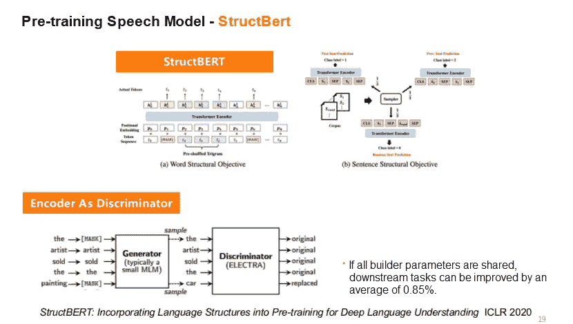

*Figure 8 — StructBERT Model*

**4)基于 StructBERT 的示例**

围绕 StructBERT 模型，阿里巴巴在开发各种自然语言技术方面取得了一些进展。这里有一些例子。

1.**中文 StructBERT 模型的标记化优化**

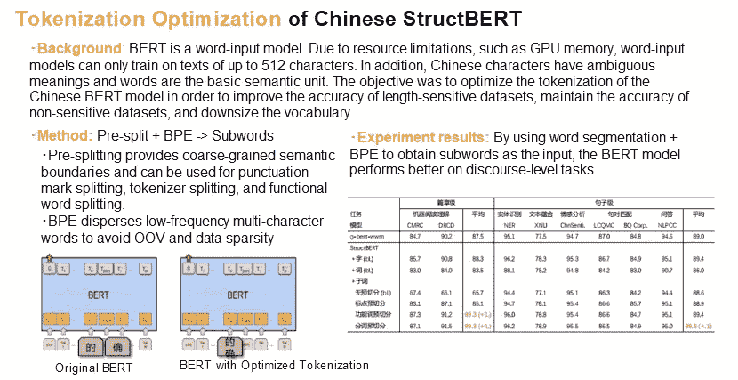

*Figure 9 — Tokenization Optimization of Chinese StructBERT*

**2。结构伯特加速度—知识蒸馏**

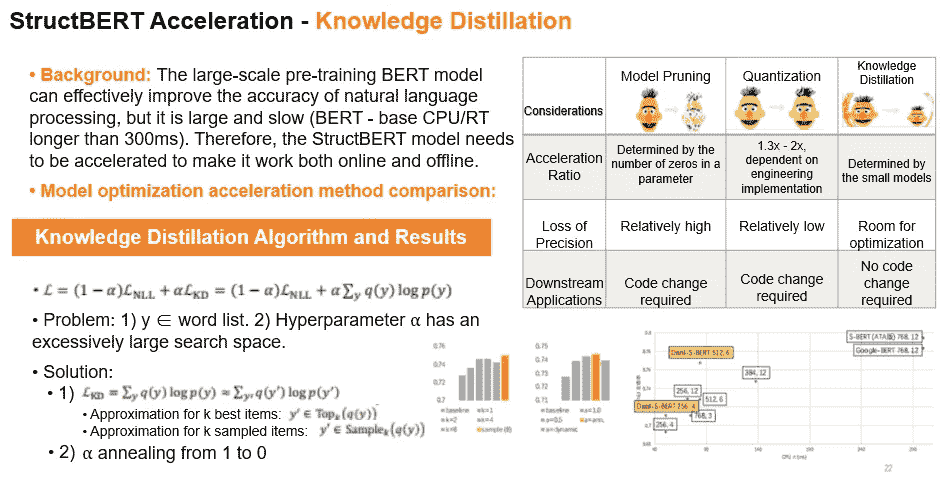

*Figure 10 — StructBERT Acceleration — Knowledge Distillation*

**3。预训练语言模型—结构化信息的整合**

传统的 BERT 模型使用文本信息。但是，很多场景涉及更多的信息，比如结构化信息。例如，表格信息通常包括单词的位置信息。如果使用 OCR 工具提取信息，我们还可以获得单词的位置信息。如果该信息与文本信息一起用于训练 BERT 模型，则更容易执行下游任务。

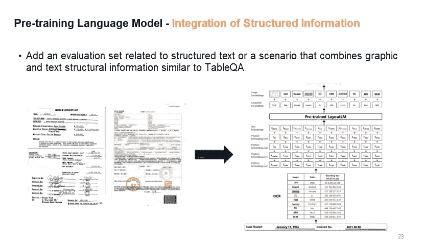

*Figure 11 — Pre-Trained Language Model — Integration of Structured Information*

**4。机器阅读理解—多文档/多段落模型**

StructBERT 模型在与多文档/多段落模型结合使用时，可以在机器阅读理解任务中实现高性能，如检索、排序和问答。

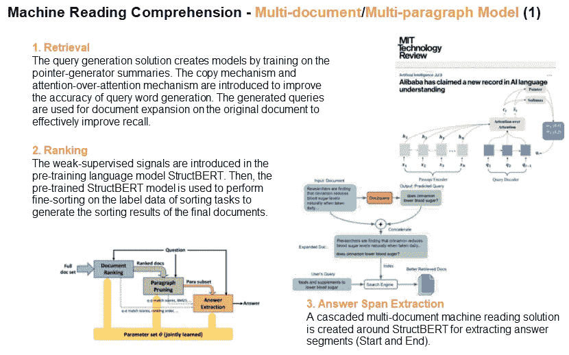

*Figure 12 — StructBERT used with Multi-Document/Multi-Paragraph Model*

**5。机器阅读理解—知识整合**

StructBERT 还可以将常识等知识集成到语言模型中，以促进分类和问答等任务。

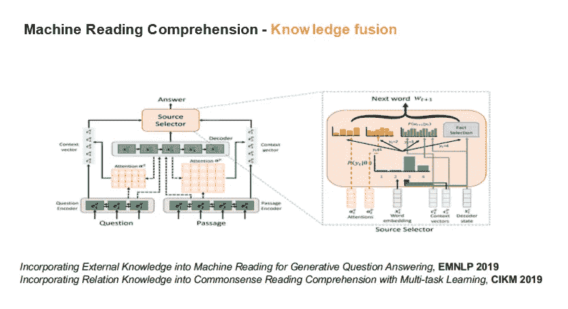

*Figure 13 — Machine Reading Comprehension — Knowledge Integration*

**6。知识驱动的机器翻译—语言学知识**

一种语言通常有丰富的表达形式。配备了语言学知识的语言模型在翻译场景中可以表现得更好。例如，语言模型可用于学习不同语言中的特殊表达形式，如复合词和后缀，以提高翻译结果。

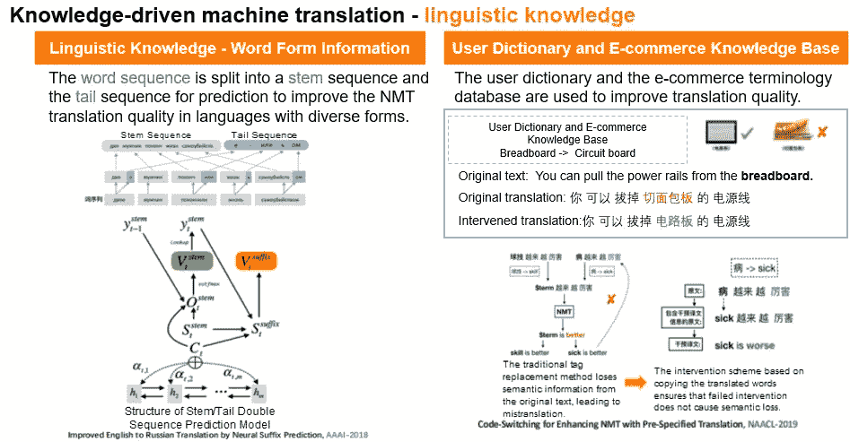

*Figure 14 — Knowledge-Driven Machine Translation — Linguistic Knowledge*

# 将 NLP 集成到业务场景中

NLP 本身的原子能力并不构成一个完整的场景。实现其潜在价值的唯一方法是在业务场景中结合这些能力。一个企业通常有许多内部场景，如电子商务和客户服务，此外还有大量面向社区的外部场景，如涉及司法机关、公共安全和教育的场景。在这些场景上训练的模型可以积累全面的、多领域的和多语言的 NLP 数据和知识，这些数据和知识可以用于构建适用于类似场景的基于 NLP 的应用技术。只有一个闭环的过程，才能实现自然语言技术的真正价值。

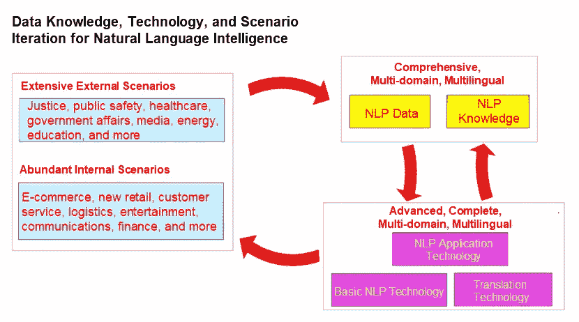

*Figure 15 — Closed Loop between Natural Language Intelligence and Business Scenarios*

下一节将简要介绍 DAMO 学院的语言实验室如何在某些商业场景中使用自然语言技术。

## 1)电子商务翻译

阿里巴巴的跨境电商场景非常广泛，需要大量的翻译工作。在电商翻译场景中，我们需要建立完整的多语言翻译技术链，从产品标题和描述的翻译，到支付指令的翻译，以及与客户的沟通。这些都需要翻译技术支持，才能保证阿里巴巴整体跨境电商业务的运转。

## 2)社交场景下使用的机器翻译:DingTalk 翻译

近年来，DingTalk 发展迅速。它进入国际市场得到了 DAMO 研究院翻译技术的支持。到目前为止，DingTalk 的翻译功能支持 30 种语言，并在大量的商业应用场景中使用。当然，随着它的广泛应用，也出现了一些问题。比如一些口语化的文字翻译不准确，很难准确识别上下文。DAMO 学院一直致力于优化这项技术背后的算法，为用户提供更好的服务。

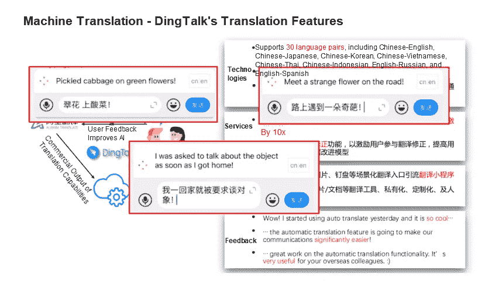

*Figure 16 — Machine Translation in Social Scenarios: DingTalk’s Translation Feature*

## 3)云产品

随着 NLP 取得令人鼓舞的进展，阿里巴巴 DAMO 研究院的语言实验室一直致力于将这一技术集成到许多商业场景中，以创建适合特定场景的广泛的云产品和解决方案。

**1。地址信息管理系统**

地址信息管理系统对各种业务系统中登记的非标准地址信息进行纠错、归一化、层次分类等自然语言处理。它系统地生成、匹配、管理和使用标准化地址，以更好地支持物流和业务场景。

**2。事件分析图**

事件分析图在大量文本信息上使用 NLP 技术，并在诸如数据连接、检索和推理的场景中将这些信息转换成文本、结构化数据和图形。

**3。云解决方案助力大众传播**

在通信行业，阿里云的通信解决方案利用 AI 赋能云通信，帮助我们的产品建立差异化竞争优势。例如，该解决方案将其原子功能应用于短信内容，以改善云通信。未来，我们将把这个解决方案从单纯的文本信息扩展到语音信息、视频信息和国际场景中的多语言信息。事实证明，这一解决方案卓有成效，在阿里云的服务上进行测试时，提高了商业价值。

**4。智能司法**

由于法院案件数量持续激增，没有足够的法官来应对。在这种背景下，引入自然语言处理技术可以大大提高司法系统的效率。

**5。智能合同管理**

与司法领域类似，智能合同管理是 NLP 技术可以应用的另一个场景。电子签名和合同管理已经成为一个非常重要的趋势，但绝大多数合同仍然是由律师人工审查。通过 NLP intelligence，智能合同管理解决方案可以促进合同的审查和管理，全面提高合同服务的整体效率。

**6。智能医疗保健**

NLP 技术也可以应用于智能医疗。目前，该技术主要应用于病历质量检查。这有助于提高患者咨询前和咨询期间的效率。

**7。NLP 助推疫情防控**

在抗击新冠肺炎疫情冠状病毒的艰苦斗争中，语言实验室承担了一些基础性工作，为疫情防控提供了便利。首先，其地址解决方案使用 NLP 技术从海量信息中提取地址。这一解决方案对于支持遏制冠状病毒爆发的努力至关重要，例如通过[疫情预测和预防](https://www.alibabacloud.com/solutions/health-epidemic-prediction)。典型场景包括疫情受灾地区的入境旅游分析、相关人员筛查和出境呼叫。医疗机器翻译解决方案为抗击疫情做出了巨大贡献。例如，医疗机器翻译引擎通过翻译医学文献、外语术语以及降低使新冠肺炎研究复杂化的语言障碍来支持研究人员。在中国爆发最严重的全国封锁期间，NLP 技术被证明在促进远程试验方面非常有效。这项技术极大地提高了杭州市上城区和下城区人民法院在疫情期间进行远程审判的效率。在大多数情况下，正式记录是在法庭审理期间自动生成的。

*在* [*我们的科技展系列*](https://resource.alibabacloud.com/webinar/topic/tech-show.html) 上，从阿里巴巴的顶级资深专家那里了解我们的核心技术和最新产品更新

# 原始来源:

 [## 自然语言智能:为商业搭建语言桥梁

### 阿里巴巴 Clouder 2020 年 7 月 22 日 710 本文为您带来阿里巴巴 CIO 学院第九届公开直播的亮点…

www.alibabacloud.co](https://www.alibabacloud.com/blog/natural-language-intelligence-building-a-language-bridge-for-business_596417) 

**访问专家视图—** [**订阅 DDI 英特尔**](https://datadriveninvestor.com/ddi-intel)