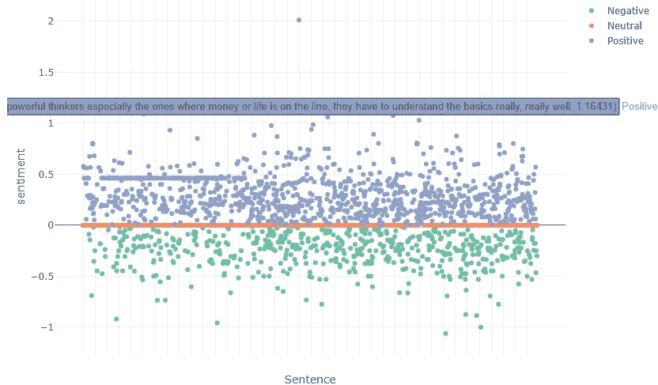

# 自然语言处理和海军:播客的艺术

> 原文：<https://medium.datadriveninvestor.com/natural-language-processing-and-naval-the-art-of-the-podcast-b7ff7e201b31?source=collection_archive---------14----------------------->

播客是一种和谐的创作。

它们是迷人的工具，以一种非常私人的方式将我们与演讲者联系起来，就像我们也是对话的一部分一样。尽管与面试官和被面试者处于不同的时间和地点，我还是会对一些事情大声笑出来，或者点头附和，做出强烈的反应。

播客是联系的工具。几乎每个人要么想开播客，要么认识开播客的人(不管是好是坏)。

播客创作是开放的消费者基础、不断发展的互联网以及可访问的录制软件和硬件的完美风暴。准入门槛低。在最基本的方法中，你需要的只是一部手机和互联网接入。

我们也喜欢听网上“名人”或我们非常钦佩的人的意见，并将这些内容用于学习和娱乐。在 Spotify 或苹果网站上很容易就能获得各种各样的播客，涉及各种各样的话题。

# 最好的播客是什么？

当 Lambda School 的首席执行官奥斯汀在 Twitter 上拥有 13 万多名粉丝时，我很好奇人们会怎么说。我要提醒的是，奥斯汀的大多数追随者都是与技术/技术相关的人(大多数回复在他们的简历中有“软件”或“建筑”这个词)，所以这些回复很可能偏向于技术领域。

Source: [Austen Allred](https://twitter.com/Austen/status/1305210103730073600)

我在电子表格中挖掘了他们的回答。

最受推荐的播客是 Tim Ferris Show(占所有回复的 16%，n = 208)，紧随其后的是 Joe Rogan。

具体组合建议如下:

在 208 个回答中， **8%的人特别推荐乔·罗根+海军组合**。7%的人特别推荐了 T2 知识项目 T3 的 Naval 和 Shane Parrish。另外 2%是 Naval 自己的播客，*如何致富。*

Naval 占指定受访者的所有建议的 24%(35 个单独的回答)。彼得·泰尔和德里克·西弗斯紧随其后，分别占所有回答的 5%和 4%。

# 海军的知识

Naval 很迷人，他占所有受访者推荐的四分之一是有道理的，因为用他的话说，他是“年轻男性极客中的英雄”。

Naval 代表了一种更高层次的思维，表达了我们许多人的感受，但并不总是说出来(未来是企业家精神，超越猴子思维的力量，调试，思想的双重性，等等。等等。).

埃里克·乔根森最近写了一本《海军拉维康年鉴》，其中收录了他的许多智慧。Twitter 上有数百条帖子，从这本书以及 Naval 的采访中摘录了关键内容。

甚至仅仅运行来自知识项目的*的文字记录中的单词的频率度量，你就能明白为什么 Naval 在这个领域如此受推崇。*

在他与谢恩·帕里什的对话中,“思考”这个词被提到了 161 次。“可以”这个词被提到> 100 次，与“人”和“读”并列。从我从 Naval 那里收集到的信息来看，这四个字概括了他所重视和关心的很大一部分。

但是让我们做一个更深的潜水。

 [## 一瞬间学会数据科学！？数据驱动的投资者

### 在我之前的职业生涯中，我是一名训练有素的古典钢琴家。还记得那些声称你可以…

www.datadriveninvestor.com](https://www.datadriveninvestor.com/2020/07/23/learn-data-science-in-a-flash/) 

## 海军文本挖掘

我从*的知识工程*播客、*的何蒂姆费里斯播客*和*乔罗根*的播客中提取了海军的采访记录。我使用 R 包进行自然语言处理，以获得情绪、情感和单词联想的感觉。

我使用了由 NRC 研究员 Saif Mohammad 开发的 NRC 词汇-情感联想词典。EmoLex 将单词分为八种情绪:愤怒、恐惧、期待、信任、惊讶、悲伤、快乐和厌恶。这些词通过众包被分割(如果你感兴趣，你可以在这里阅读更多[)。](http://saifmohammad.com/WebDocs/Mohammad-Turney-NAACL10-EmotionWorkshop.pdf)

Source: [Safi Mohammad](http://saifmohammad.com/WebPages/NRC-Emotion-Lexicon.htm)

# 情感联想和情感分析

## 知识工程

在知识工程中，很多对话都陷入了“信任”情绪。差不多 400 字。像智慧、财富、体贴等词。

Plot of Shane Parrish and Naval: Distinct Emotions

从百分比来看，信任和期待比其他任何情绪都重要。

下面是情绪散点图，随着时间的推移，大部分对话保持积极。

对话的平均情绪是 0.077，是所有对话中最“消极”的。

最积极的一句话:

> 如果你能更正确，更理性，这是我喜欢你博客的原因之一，因为它真的专注于帮助你更正确，更好的决策，更理性，那么你将在你的生活中获得非线性回报

## 乔·罗根播客

对于乔·罗根的播客，相对于信任，有更多的期待和喜悦。信任仍然占主导地位。

在情绪谱上也有更均匀的分散，相当数量的恐惧(约 10%)插入到对话中。

同样数量的悲伤和愤怒在这里也被表现出来，但是谈话是相对积极的。

谈话在情绪方面非常积极，得分为 0.0985。

这是最积极的一句话:*非常专业，非常迅速，非常彻底，但他对我比对他做得更努力*

## 蒂姆·费里斯秀

蒂姆·费里斯和纳维尔进行了一次非常信任的谈话。

根据这个分布，这里有更多的信任，更多的期待——这个播客与 Naval 与 Shane Parrish 的对话非常相似。

平均情绪为 0.0901。

最积极的句子*:我们试图从内心获得平静的大多数方式都是间接的，然而如果你理解事物，如果你正确地看待事物，你会自然地慢慢发展内心的平静*

最消极:*“所以你要狠狠地，狠狠地让大家失望”*

# 播客

## 知识工程

知识项目有一个有趣的词频分布，播客描述中最常见的词是'作者'、'制作'、'能'、'学习'、'生活'和'世界'。

## 经济对话

Econ Talks 是另一个热门播客，大学一词是最突出的(可能是因为受访者的职称)，以及争论、作者、书籍和政策。

## 蒂姆·费里斯秀

蒂姆·费里斯的展览是课程、生活、大师和建筑。

乔·罗根没有描述性的播客名称(只有受访者的名字)，所以没有 JRE 的词汇云。

## 结论

信任中有力量。一个好的播客和一个伟大的播客之间只有一线之隔，受访者是其中的 85%。一个好的面试官同样重要——他让受访者说话，但也能有意义地参与谈话。

传达信任+期待(希望)似乎是一个成功播客的强大组合(至少对 Naval 来说)。

我还要强调的是，在这个数据集中，在种族、性别、年龄等方面都缺乏多样性。为了更多的思考和观点，我在下面收录了一些优秀的播客。请在下面评论！

*   [She-VC](https://www.youtube.com/channel/UCK3Gup_QSKH8pOlyb2gRGkg)
*   腱，腱，腱
*   [关联](https://anchor.fm/associated)
*   [分歧独角兽](https://www.divergentunicorns.com/)
*   最酷的书呆子播客
*   [超 RP](https://twitter.com/Hyper_RPG) G
*   [女人街](https://twitter.com/femstreet)
*   [带 Anil 破折号的功能](https://podcasts.apple.com/us/podcast/function-with-anil-dash/id1439658455)
*   [旅程更远](https://podcasts.apple.com/gb/podcast/journey-further-podcast/id1490689835)
*   [挖](https://digpodcast.org/)
*   [他们的联赛](https://twitter.com/TheirLeague)
*   [我们的领导方式](https://twitter.com/thewaywelead)
*   [基础 CS](https://twitter.com/basecspodcast)
*   [自举 VC](https://twitter.com/BootstrappedVC)

## 访问专家视图— [订阅 DDI 英特尔](https://datadriveninvestor.com/ddi-intel)