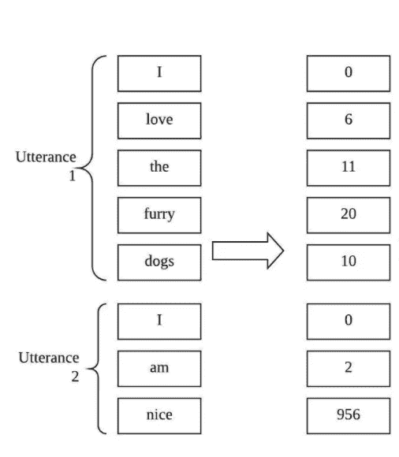

# 五岁儿童的自然语言处理

> 原文：<https://medium.datadriveninvestor.com/natural-language-processing-for-five-year-olds-b07b832b2de2?source=collection_archive---------10----------------------->

## 没有行话，很多图

Photo by [Ketut Subiyanto](https://www.pexels.com/@ketut-subiyanto?utm_content=attributionCopyText&utm_medium=referral&utm_source=pexels) from [Pexels](https://www.pexels.com/photo/smiley-black-boys-watching-funny-video-on-laptop-on-bed-4545951/?utm_content=attributionCopyText&utm_medium=referral&utm_source=pexels)

## **什么是自然语言处理？**

不要被夸夸其谈的话吓到！所有“自然语言处理”的意思是，我们试图帮助计算机理解人类语言。

如果你要去外国生活，你必须学习语言，对吗？嗯，这个差不多。电脑和我们生活在一起，对它们来说，这个世界是一个陌生的国度，我们正努力教它们说我们的语言。你可以教他们说任何人类语言，但我们今天将谈论教他们英语。

Photo by [Esther](https://www.pexels.com/@esther-234072?utm_content=attributionCopyText&utm_medium=referral&utm_source=pexels) from [Pexels](https://www.pexels.com/photo/close-up-photo-of-baggage-sign-746500/?utm_content=attributionCopyText&utm_medium=referral&utm_source=pexels)

计算机真的很擅长数学。你可以说**数学是他们的语言**。所以要教计算机英语，我们需要把英语翻译成数学。就像你我如果想学日语都需要一本英日词典一样！

聪明的计算机科学家已经找到了一种方法，通过使用他们所谓的“语言模型”，将英语翻译成计算机的母语(数学)。'

 [## 人工智能和监督资本主义|数据驱动的投资者

### 大科技，总是现在:人工智能推动的大科技，已经使购物，搜索，在你的…

www.datadriveninvestor.com](https://www.datadriveninvestor.com/2020/03/04/on-artificial-intelligence-and-surveillance-capitalism/) 

有了这些语言模型，计算机就能像人类一样用英语完成任务了！例如，你的妈妈可以根据你过去对食物的评论来预测你是否会喜欢未来的一顿饭！如果你经常说“我不太喜欢烘肉卷”这样的话，你的妈妈会知道，把烘肉卷放在食物里意味着你可能不喜欢这顿饭。

因为计算机现在可以说英语，它们还可以根据你说的话来分类和记忆你喜欢和不喜欢的食物。

Photo by [cottonbro](https://www.pexels.com/@cottonbro?utm_content=attributionCopyText&utm_medium=referral&utm_source=pexels) from [Pexels](https://www.pexels.com/photo/eating-cake-on-brown-wooden-table-3992135/?utm_content=attributionCopyText&utm_medium=referral&utm_source=pexels)

事实上，你可能很熟悉像 Postmates 或 Foodpanda 这样的应用程序，当你的父母不想做饭时，他们可以在那里点餐。这些应用程序通常会记住你的家人喜欢吃的食物类型，这取决于你们过去对食物的表达！

其中一些应用程序可以使用计算机和这些英语数学词典(语言模型)来阅读你父母对过去餐馆的英语评论，以确定你是否会喜欢一家新餐馆！就像你的妈妈可以根据你过去对食物的评论来预测你是否会喜欢一顿饭一样！超级有用吧？

## **语言模型**

你可能很好奇语言模型是如何工作的！好吧，让我们来谈谈语言模型如何将书中的一页从英语“翻译”成数学。

记住数学使用数字。所以一个非常简单的语言模型会简单地用一个数字来标记每个曾经存在过的单词。例如，“I”可能是第 0 个单词，“am”可能是第 2 个单词。该模型可以对字典中的每个单词都这样做。

Photo by Author.

虽然这是从英语到数学的成功转换，但当我们帮助计算机理解字典中单词之间的关系，而不是我们谈到的简单标签时，它们往往会发现更容易！因此，我们通常会包含两个单词出现频率的信息。举例来说，你可能会认为“Good”和“morning”经常出现在彼此附近，因为我们经常说“Good morning ”!所以一些语言模型包含这种信息，而不是简单的标签。

事实证明，当计算机知道哪些单词经常一起出现时，它们会变得非常聪明，可以解决像我们之前讨论的问题——决定你对某种食物的评论是否意味着你喜欢这种食物！

## **结论**

我真的希望你喜欢学习教计算机说人类语言！如果你想了解更多，请告诉我！你是个优秀的学生！

**访问专家视图—** [**订阅 DDI 英特尔**](https://datadriveninvestor.com/ddi-intel)