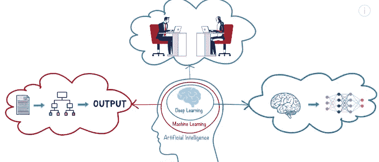
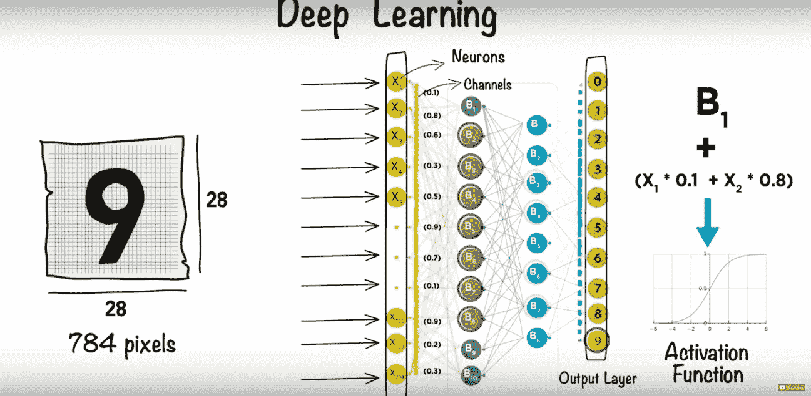
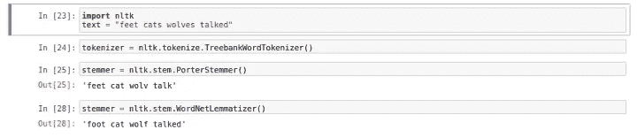
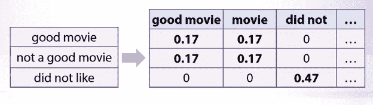
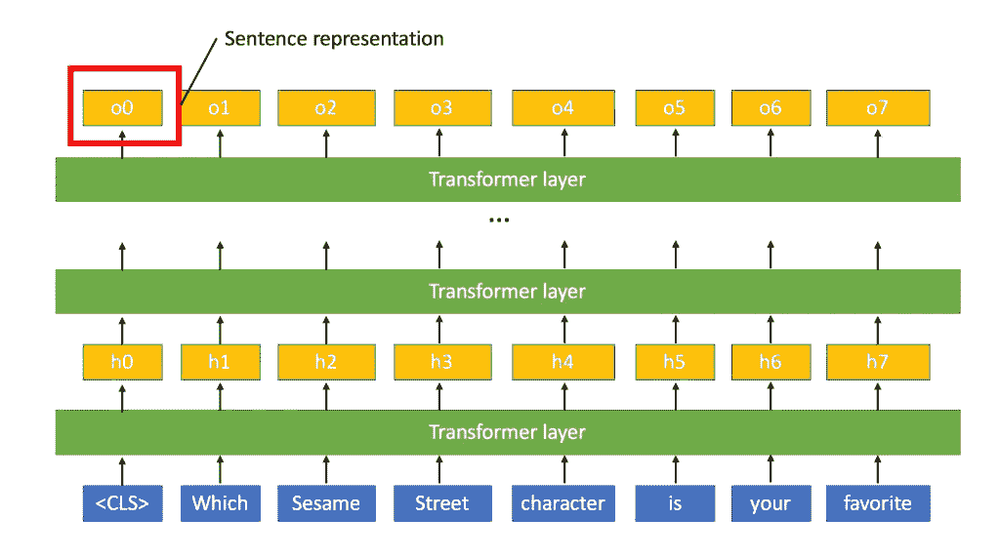
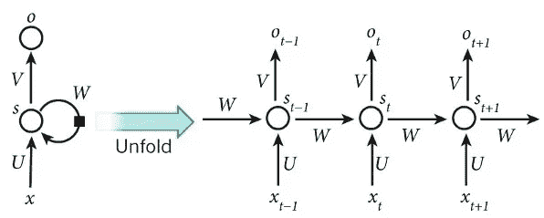
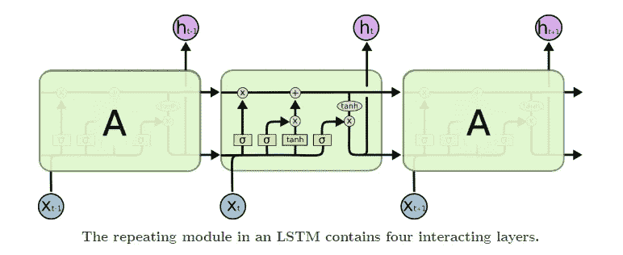
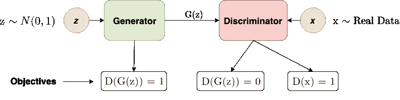

# 自然语言处理-你需要知道的事情。

> 原文：<https://medium.datadriveninvestor.com/natural-language-processing-things-you-need-to-know-43eeb87da177?source=collection_archive---------2----------------------->

这个故事向你解释了几乎所有你需要知道的关于自然语言处理和人工智能的事情。

让我们简单地过一遍。



Artificial Intelligence | Machine Learning | Deep Learning

## 人工智能

人工智能是指机器对人类智能的刺激。人工智能的具体应用包括专家系统、自然语言处理(NLP)、语音识别和机器视觉。

## 机器学习

人工智能是人工智能的一个分支，机器可以分析数据，系统可以从数据中学习，识别模式，并在最少或没有人工干预的情况下做出决策。

## 深度学习

同样，深度学习是人工智能中机器学习的子集，具有能够学习的人工神经网络，也称为深度神经网络或深度神经学习。深度学习是一种受人脑结构启发的 ML，就深度学习而言，这种结构被称为人工神经网络。

[](https://www.datadriveninvestor.com/2019/03/03/editors-pick-5-machine-learning-books/) [## DDI 编辑推荐:5 本让你从新手变成专家的机器学习书籍|数据驱动…

### 机器学习行业的蓬勃发展重新引起了人们对人工智能的兴趣

www.datadriveninvestor.com](https://www.datadriveninvestor.com/2019/03/03/editors-pick-5-machine-learning-books/) 

深度学习和机器学习的基本区别在于，当你希望系统学习如何对两个对象进行分类时，在机器学习中，你必须输入允许机器学习的数据特征，并输出分类。但是在深度学习中，人工神经网络本身使用人工神经网络学习特征，代价是拥有大量数据。

## 人工神经网络是如何工作的？

考虑人类书写数字的分类(0-9 ),这些数字很容易被人类理解。深度学习的动作来了。在上面提到的图像中，您可以看到图像中的一个数字由 28*28 = 784 个像素组成。信息处理发生的神经元，图像中的 784 个像素中的每一个都作为每个神经元的输入，这是输入层。有一个包含输出值 0–9 的输出图层。



Working of artificial neural networks

输入层和输出层通过连接通道经由不同层连接。每个通道都有一个值，称为权重，隐藏层中的每个神经元都有一个与之相关的偏差。该偏差与输入一起被添加到权重中，然后被应用于被称为激活函数的函数。激活函数的结果决定了神经元是否被激活。每个被激活的神经元都包含关于输入的信息。这个过程一直持续到倒数第二层和输出层中激活的一层对应于输出。权重和偏差得到调整和更新，以获得训练有素的网络。


# **自然语言处理**

人工智能领域的自然语言处理，赋予机器阅读、理解和从人类语言中获取含义的能力。

NLP 的类别包括:

1.  文本分类:将文本分类到不同的类别。垃圾邮件过滤
2.  语言建模:问题是从给定的先前输入单词中预测下一个单词。
3.  语音识别:将文本的声音转换为人类可读文本的过程。
4.  标题生成:如果你有一个数字图像，获得它的文本描述属于这一类。
5.  机器翻译:将源文本从一种语言转换成另一种语言，而不丢失上下文。
6.  文档摘要:创建文档摘要。当我们想从一个给定的文档中创建一个摘要或标题时，这就起作用了。
7.  问答:给定一个文本或文档，获取特定查询的结果。
8.  聊天机器人:创建一个用户友好的助手，可以集成自定义操作，也可以聊天。

我们来讨论一下 NLP 中的一些重要算法:

一)**袋字**(鞠躬)

一个允许你计算一段文本中所有单词的模型。它为句子或文档创建一个出现矩阵，不考虑语法和词序。这些词频或出现次数然后被用作训练分类器的特征。


BOW implementation

B) **标记化**

它是将连续文本分割成句子和单词的过程。本质上，它的任务是将文本切割成称为*记号的片段。*

*   nltk . tokenize . whitespace tokenizer
*   按标点符号分割:使用标点符号
*   由一组规则分割:ntlk。Tokenize . TreebankWordTokenizer

C) **停止字**

在这个过程中，一些看起来对 NLP 目标提供很少或没有价值的非常常见的单词被过滤并从要处理的文本中排除

D) **令牌规范化:**

> 词干化和词汇化
> 
> *词条解析将单词解析为其字典形式(称为*词条*)。*
> 
> 指的是为了去除词缀(词根的词汇附加物)而对单词的结尾或开头进行切片的过程。



Stemming and Lemmatization

E) **TF-IDF**

该值适用于提取特征。我们可以找到文档中的术语计数(术语频率)乘以语料库中文档总数的对数的倒数乘以出现术语 t 的文档总数。



TF-IDF implementation

f)**NER——命名实体识别:**

命名实体识别是信息提取的一个子任务，它试图定位非结构化文本中提到的命名实体并将其分类成预定义的类别，例如人名、组织、位置、医疗代码、时间表达式、数量、货币值、百分比等。

G) **N-Grams**

N 元语法指的是出于表示目的将邻近单词组合在一起的过程，其中 N 表示要组合在一起的单词的数量。

我们讨论了人工智能、机器学习、深度学习。然后是 NLP 以及与之相关的各种算法。

现在我们来讨论一下**自然语言处理**的**各种框架**。

1.  **spaCy** :一个 Python 包，设计用于提高速度、完成任务，并与其他深度学习框架互操作。它是在精心管理内存的 Cython 中从头开始编写的。2015 年的独立研究发现 spaCy 是世界上最快的。它可以与 TensorFlow、PyTorch、scikit-learn、Gensim 和 Python 的其他出色的人工智能生态系统无缝互操作。

空间示例

2. **Gensim:** Gensim 是针对大型语料库的*主题建模*、*文档索引*和*相似度检索*的 Python 库。目标受众是自然语言处理(NLP)和信息检索(IR)社区。

这个软件依赖于科学计算的两个 Python 包 [NumPy 和 Scipy](http://www.scipy.org/Download) 。您必须在安装 gensim 之前安装它们。

```
**>>> from** **gensim.summarization.summarizer** **import** summarize
**>>>** text = '''Rice Pudding - Poem by Alan Alexander Milne
**...** What is the matter with Mary Jane?
**...** She's crying with all her might and main,
**...** And she won't eat her dinner - rice pudding again -
**...** What is the matter with Mary Jane?
**...** What is the matter with Mary Jane?
**...** I've promised her dolls and a daisy-chain,
**...** And a book about animals - all in vain -
**...** What is the matter with Mary Jane?
**...** What is the matter with Mary Jane?
**...** She's perfectly well, and she hasn't a pain;
**...** But, look at her, now she's beginning again! -
**...** What is the matter with Mary Jane?
**...** What is the matter with Mary Jane?
**...** I've promised her sweets and a ride in the train,
**...** And I've begged her to stop for a bit and explain -
**...** What is the matter with Mary Jane?
**...** What is the matter with Mary Jane?
**...** She's perfectly well and she hasn't a pain,
**...** And it's lovely rice pudding for dinner again!
**...** What is the matter with Mary Jane?'''
**>>> print**(summarize(text))
And she won't eat her dinner - rice pudding again -
I've promised her dolls and a daisy-chain,
I've promised her sweets and a ride in the train,
And it's lovely rice pudding for dinner again!
```

gensim 摘要生成器的一个例子。

3.Fasttext: fastText 是一个高效学习单词表示和句子分类的库。FastText 是一个开源、免费、轻量级的库，允许用户学习文本表示和文本分类器。它在标准的通用硬件上工作。模型可以缩小尺寸，甚至适合移动设备。

4.**基于 TensorFlow** :

*   SyntaxNet:一个自然语言理解的工具包(NLU)。

SyntaxNet 是一个在学术界被称为 [*语法解析器*](https://en.wikipedia.org/wiki/Parsing) 的框架，它是许多 NLU 系统中的第一个关键组件。给定一个句子作为输入，它用描述单词的句法功能的词性(POS)标签来标记每个单词，并且它确定句子中单词之间的句法关系，用依存解析树来表示。

*   **textsum** (用于文本摘要):一种用于文本摘要的序列到序列的注意模型。

文本摘要问题有许多有用的应用。如果你经营一个网站，你可以为用户生成的内容创建标题和简短摘要。如果你想读很多文章，但没有时间，你的虚拟助手可以为你总结这些文章的要点。

*   **跳跃思维向量**:“跳跃思维向量”或简称“跳跃思维”是一个简单的神经网络模型的名称，用于学习任何自然语言中句子的固定长度表示，无需任何标记数据或监督学习。Skip-Thoughts 使用的唯一监督/训练信号是自然语言语料库中句子的排序。
*   **ActiveQA** :在传统 QA 中，[监督学习技术](https://en.wikipedia.org/wiki/Supervised_learning)与标记数据结合使用，训练一个回答任意输入问题的系统。虽然这是有效的，但它缺乏像人类一样处理不确定性的能力，通过重新制定问题，发布多次搜索，评估和汇总响应。受人类“提出正确问题”能力的启发，ActiveQA 引入了一个反复咨询 QA 系统的代理。在此过程中，代理可能会多次重新表述原始问题，以便找到可能的最佳答案。我们称这种方法为主动的，因为代理参与了与 QA 系统的动态交互，目的是提高返回答案的质量。
*   **BERT:** BERT 使用 Transformer，这是一种学习文本中单词(或子单词)之间上下文关系的注意力机制。一般来说，Transformer 包括两个独立的机制——一个读取文本输入的编码器和一个为任务生成预测的解码器。由于 BERT 的目标是生成一个语言模型，所以只有编码器机制是必要的。谷歌的[论文](https://arxiv.org/pdf/1706.03762.pdf)中描述了 Transformer 的详细工作原理。



BERT Language Model

与顺序读取文本输入(从左到右或从右到左)的方向模型相反，Transformer 编码器一次读取整个单词序列。因此，它被认为是双向的，虽然说它是非定向的会更准确。这一特性允许模型基于单词的所有周围环境(单词的左侧和右侧)来学习单词的上下文。

## 5.**建立在 PyTorch 上**

a) **PyText** : PyText 是一个基于深度学习的 NLP 建模框架，构建于 PyTorch 之上。PyText 解决了快速实验和大规模模型服务这两个经常发生冲突的需求。它通过为模型组件提供简单和可扩展的接口和抽象，以及使用 PyTorch 的导出模型的功能，通过优化的 Caffe2 执行引擎进行推理，来实现这一点。我们在脸书使用 PyText 快速迭代新的建模想法，然后无缝地大规模交付它们。

b) **AllenNLP** : AllenNLP 可以轻松设计和评估新的深度学习模型，用于几乎任何 NLP 问题，以及在云中或笔记本电脑上轻松运行它们的基础架构。

c) **Flair** :强大的 NLP 库。Flair 允许您将我们最先进的自然语言处理(NLP)模型应用于您的文本，如命名实体识别(NER)、词性标注(PoS)、词义消歧和分类。

d) **FairSeq** : Fairseq(-py)是一个序列建模工具包，允许研究人员和开发人员训练自定义模型，用于翻译、摘要、语言建模和其他文本生成任务。

e)**Fastai**:Fastai 库的`[text](https://docs.fast.ai/text.html#text)`模块包含了定义适合各种 NLP(自然语言处理)任务的数据集和快速生成您可以使用的模型的所有必要函数。具体来说:

*   `[text.transform](https://docs.fast.ai/text.transform.html#text.transform)`包含预处理数据的所有脚本，从原始文本到令牌 id，
*   `[text.data](https://docs.fast.ai/text.data.html#text.data)`包含了`[TextDataBunch](https://docs.fast.ai/text.data.html#TextDataBunch)`的定义，它是 NLP 中需要的主类，
*   `[text.learner](https://docs.fast.ai/text.learner.html#text.learner)`包含快速创建语言模型或 RNN 分类器的辅助函数

f)**Transformer Model**:**Transformer**是 2017 年推出的一款[深度](https://en.wikipedia.org/wiki/Deep_learning) [机器学习](https://en.wikipedia.org/wiki/Machine_learning)模型，主要用于[自然语言处理](https://en.wikipedia.org/wiki/Natural_language_processing) (NLP)像[递归神经网络](https://en.wikipedia.org/wiki/Recurrent_neural_networks) (RNNs)，Transformer 被设计为处理有序的数据序列，如自然语言，用于各种任务，如[机器翻译](https://en.wikipedia.org/wiki/Statistical_machine_translation)和[文本摘要](https://en.wikipedia.org/wiki/Automatic_summarization)。然而，与 rnn 不同，转换器不要求按顺序处理序列。因此，如果所讨论的数据是自然语言，转换器在处理句子结尾之前不需要处理句子的开头。由于这个特性，Transformer 在训练期间允许比 RNNs 更多的[并行化](https://en.wikipedia.org/wiki/Parallel_computing)。

自推出以来，变压器已成为 NLP 中大多数最先进架构的基本构建模块，在许多情况下取代了门控循环神经网络模型，如[长短期记忆](https://en.wikipedia.org/wiki/Long_short-term_memory) (LSTM)。由于 Transformer 体系结构在训练计算过程中促进了更多的并行化，因此它能够对比引入它之前多得多的数据进行训练。这导致了[预训练系统](https://en.wikipedia.org/wiki/Transfer_learning)的开发，例如 [BERT](https://en.wikipedia.org/wiki/BERT_(language_model)) (来自变压器的双向编码器表示)和 [GPT-2](https://en.wikipedia.org/wiki/OpenAI#GPT-2) ，它们在发布之前已经过大量通用语言数据的训练，然后可以针对特定语言任务进行微调训练

**GPT-2** (OpenAI): OpenAI 发布了[生成式预训练模型](https://towardsdatascience.com/combining-supervised-learning-and-unsupervised-learning-to-improve-word-vectors-d4dea84ec36b) (GPT)，在 2018 年的多个 NLP 任务中取得了最先进的结果。GPT 利用 transformer 来执行无监督学习和有监督学习，以学习 NLP 下游任务的文本表示。

GPT-2 使用无监督学习方法来训练语言模型。与其他车型如[埃尔默](https://towardsdatascience.com/elmo-helps-to-further-improve-your-word-embeddings-c6ed2c9df95f)和[不同，伯特](https://towardsdatascience.com/how-bert-leverage-attention-mechanism-and-transformer-to-learn-word-contextual-relations-5bbee1b6dbdb)需要两个阶段的培训，即预培训和微调阶段。GPT-2 没有微调阶段。

没有 GPT-2 的定制培训。OpenAI 不发布训练 GPT-2 的源代码(截至 2019 年 2 月 15 日)。因此，我们只能将训练好的模型用于研究或采用。

**ELMo** : ELMo 使用双向语言模型(biLM)来学习单词(例如，句法和语义)和语言上下文(例如，对多义性建模)。在预训练之后，向量的内部状态可以被转移到下游的 NLP 任务。

与传统的单词嵌入不同，ELMo 针对不同的场景，为每个单词生成多个单词嵌入。较高层捕获单词嵌入的上下文相关方面，而较低层捕获语法的模型方面。在最简单的情况下，我们只使用 ELMo 的顶层(只有一层),同时我们也可以将所有层合并成一个矢量。

## 递归神经网络(RNN)

RNN 是在自然语言处理中大量使用的神经网络的一个非常重要的变体。

> *从概念上讲，它们不同于标准神经网络，因为 RNN 中的标准输入是一个单词，而不是标准神经网络中的整个样本。这使得网络可以灵活地处理不同长度的句子，这是标准神经网络* *由于其固定的结构而无法实现的。它还提供了* ***共享跨文本*** *的不同位置学习的特征的额外优势，这在标准神经网络中是无法获得的。*



RNN architecture

RNN 将句子中的每个单词视为在时间“t”出现的独立输入，并且还使用在“t-1”的激活值，作为除了在时间“t”的输入之外的输入。下图显示了 RNN 架构的详细结构。

> **GRU** :
> 
> 这是对基本循环单元的修改，有助于捕捉长程相关性，也有助于解决消失梯度问题。
> 
> GRU 由一个额外的存储单元组成，通常称为更新门或复位门。 ***除了通常的具有 sigmoid 函数和 softmax 输出的神经单元外，它还包含一个附加单元，具有 tanh 作为激活函数*** *。使用 Tanh 是因为它的输出可以是正的也可以是负的，因此可以用于放大和缩小。然后，该单元的输出与激活输入相结合，以更新存储单元的值。*

**LSTM** :

在 LSTM 体系结构中，不是像 GRU 那样只有一个更新门，而是有一个更新门和一个遗忘门。



LSTM Architecture

这种结构给存储单元一个选择，即在时间 t-1 保持旧值，并在时间 t 将值加到其上

**双向 RNN:**

以前的架构只考虑以前的值，但是 BRNN 考虑以前和以后的输入。

> *双向 RNN 由一个前向和一个后向递归神经网络组成，在任何给定时间 t，结合两个网络的结果进行最终预测，如图所示。*

## 生成性对抗网络:

观察 GAN 的最简单方式是将其视为一个*发生器网络*，通过引入一个对手(即*鉴别器网络*)对其进行训练以产生真实样本，鉴别器网络的工作是检测给定样本是“真”还是“假”。我喜欢的另一种方式是，鉴别器是一个动态更新的评估指标，用于发电机的调谐。发生器和鉴别器都在不断改进，直到达到一个平衡点:



GAN Architecture

1.  生成器在接收到关于其生成的样本如何设法欺骗鉴别器的反馈时会有所改进。
2.  鉴别器得到了改进，不仅显示了生成器生成的“假”样本，还显示了从真实分布中提取的“真”样本。通过这种方式，它可以了解生成的样本是什么样的，真实的样本是什么样的，从而能够向生成器提供更好的反馈。

参考资料:

[](https://towardsdatascience.com/elmo-helps-to-further-improve-your-word-embeddings-c6ed2c9df95f) [## ELMo 有助于进一步改善您的单词嵌入

### 语言模型嵌入(ELMo)

towardsdatascience.com](https://towardsdatascience.com/elmo-helps-to-further-improve-your-word-embeddings-c6ed2c9df95f) [](https://becominghuman.ai/generative-adversarial-networks-for-text-generation-part-1-2b886c8cab10) [## 文本生成的生成性对抗网络——第一部分

### 用于文本生成的 GANs 的问题以及解决这些问题的方法

becominghuman.ai](https://becominghuman.ai/generative-adversarial-networks-for-text-generation-part-1-2b886c8cab10) 

维基百科(一个基于 wiki 技术的多语言的百科全书协作计划ˌ也是一部用不同语言写成的网络百科全书ˌ 其目标及宗旨是为全人类提供自由的百科全书)ˌ开放性的百科全书

[](https://github.com/keon/awesome-nlp) [## keon/awesome-nlp

### 致力于自然语言处理的精选资源列表请用英语、繁体中文阅读此内容…ediu

github.com](https://github.com/keon/awesome-nlp)