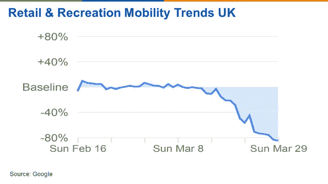
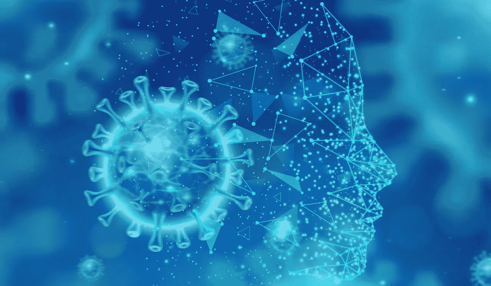
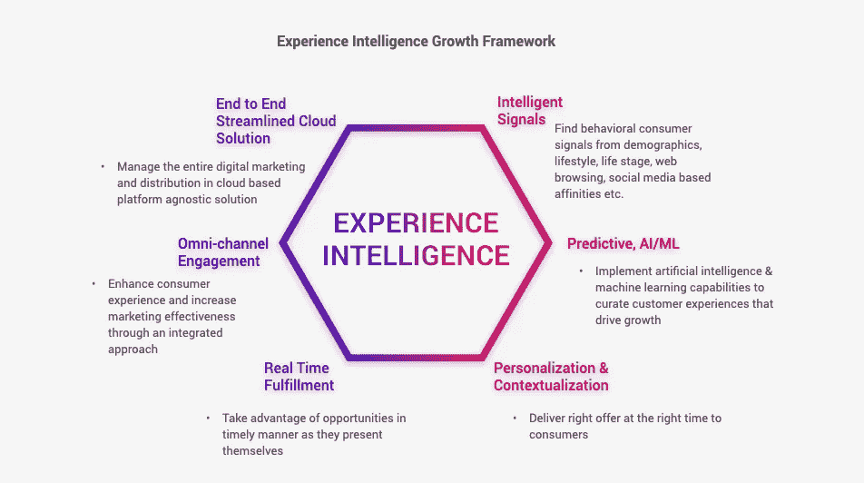

# 导航后 COVID 金融市场:智能策略和弹性

> 原文：<https://medium.datadriveninvestor.com/navigating-post-covid-financial-markets-c0eea66a6e34?source=collection_archive---------29----------------------->

# 连锁反应

**适应战略的需要** 新冠肺炎疫情是一场健康和人道主义危机，也是一场经济冲击。这是一个白天鹅事件，让认知自动化不再需要人工智能模型、数据地图和战略的改变。金融行业比以往任何时候都更需要面向银行、财富管理和保险的自适应智能解决方案，以帮助保持核心收入并确定新的增长路径。

**认知瘫痪** 根据正常行为训练的机器学习模型出现了裂缝——迫使人类介入以纠正它们，并导致企业认知瘫痪。

连锁反应已经在各行各业显现。但它们也影响了人工智能，引发了管理算法、欺诈检测、营销等等。结果，基于“正常”人类行为训练的机器学习模型不再相关和/或失效。

认知自动化陷入混乱，需要人工干预勉强支撑的自动化系统。机器学习模型旨在响应可预测的变化。但是大多数也是脆弱的；当输入数据与他们接受训练的数据相差太大时，他们表现很差。

疫情揭示了我们的生活是如何与人工智能交织在一起的，揭示了一种动态的相互依存关系，其中我们行为的变化和人工智能的变化通过经验反馈回路相互联系。

认为你可以设定并忘记人工智能是错误的:它是一个有生命的系统。

 [## AI 将军是否已经超过了人类的智力容量？数据驱动的投资者

### 不仅在游戏中，而且在劳动力市场上，机器都比人类聪明。在今天的许多领域，使用…

www.datadriveninvestor.com](https://www.datadriveninvestor.com/2020/02/12/has-general-ai-exceeded-the-intellectual-capacity-of-humans/) 

疫情揭示了我们的生活是如何与人工智能交织在一起的，揭示了一种动态的相互依存关系，其中我们行为的变化和人工智能的变化通过经验反馈回路相互联系。

认为你可以设定并忘记人工智能是错误的:它是一个有生命的系统。

# 弹性

**保护您的核心收入** 从历史上看，危机需要加强挽留。在当前情况下，理解和满足客户需求的重要性怎么估计都不为过。那些在危机过后仍能蓬勃发展的公司之所以与众不同，是因为它们有能力预测和把握市场变化，同时实时适应新出现的客户需求。

**培养快速洞察能力** 在急剧变化的时代，依靠历史模型和数据已不再可能。对新出现的客户情况、行为模式和需求进行快速的上下文洞察至关重要。发现和实施新的领先指标，如疫苗开发、公共卫生数据，并深入研究数字行为模式，以发现新趋势和未开发的价值。

**实施弹性模型** 在动荡的市场中，弹性是一个关键的生存因素。当别人停滞不前时，开发差异化能力，发展新的增长模式。

经验智能框架可以帮助解决短期和长期后果，并引导思维和策略走向基于模块化超相关性平台和经验智能框架的适应性智能解决方案。后者可以帮助减轻客户行为、市场波动、收入压缩的变化，并快速开发适应性分析模型和解决方案，通过随机测试和控制实验测试业务假设，跟踪对 KPI 的可测量影响，并通过迭代闭环分析使机器学习模型重新上线。

# 增长

**释放隐藏的价值，开发新的增长途径** 在关键的涌入时刻，有必要超越传统的细分，关注超越一般衡量标准的满意度驱动因素&忠诚度，优化客户互动，并确保您组织的沟通产生影响，以最大限度地提高客户终身价值，同时考虑客户心理构成。

**迭代、扩展和持续** 通过使用敏捷方法加速决策过程，并通过体验智能框架的棱镜释放之前未开发的价值，您可以构建战略数据和分析能力来优化、扩展和持续改进，从而获得更强的弹性和更好的近期和近期结果。