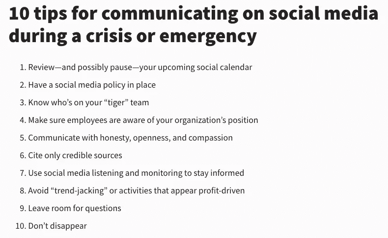

# 在 280 个字符或更少的字符中导航混乱

> 原文：<https://medium.datadriveninvestor.com/navigating-turmoil-in-280-characters-or-less-1043c9207789?source=collection_archive---------17----------------------->

## 战略性地思考，以便在事情变糟时做好准备

Photo by Ayo Ogunseinde on Unsplash

上涨是不可避免的。你不会知道它来自哪里，来自什么方向，但聪明的企业家必须做好准备。一个战略是不完整的，除非它说明了当情况变坏时该做什么。

“三分之二的全球首席执行官专注于数字战略，以改善客户体验，”数字战略家[金·斯卡拉韦利](https://twitter.com/KimScaravelli)说。她通过战略性地思考客户在网上所做的一切，帮助他们成长和繁荣。

随着世界的不断变化，Scaravelli 与数字营销专家 [Madalyn Sklar](https://twitter.com/MadalynSklar) 讨论了如何在非常时期以专业人士的身份驾驭 Twitter。

斯卡拉韦利说，在危机中处理社交媒体的计划应该包括以下内容:

*   谁将负责
*   采取什么步骤
*   要遵循的品牌*指南*

 [## 危机管理在“飞机”上飞行真相

### 公共关系和新闻业可以挽救声誉

medium.com](https://medium.com/datadriveninvestor/crisis-management-flies-on-plane-truth-7bec6139921) 

在危机期间，确保内容清晰明确。在盛怒之下，无辜的事情可能会被误解。

对于斯卡拉韦利来说，这些推特规则是危机中的关键:

*   真实一点。不要自动化。
*   事实核查*一切*。
*   要冷静，要安心。
*   谨慎使用幽默。
*   关注*啮合*。

“如果你甚至有一点点担心某些东西可能会被误解，不要发微博，”她说。

社交媒体管理公司的尼克·马丁呼吁所有人不要制造混乱。

他说:“除非你有一些相关的、有帮助的东西可以贡献，否则让那些知情的人在危机期间承担网上的负担。”“不要成为交流的障碍。

“危机沟通非常重要，”他说。“我们可以写一百万字。”

为了尽可能简洁，他提供了 Hootsuite 的 10 大技巧。

Hootsuite 还有一篇文章， [*“如何利用社交媒体进行危机沟通和应急管理。”*](https://blog.hootsuite.com/social-media-crisis-communication/)

# **别搅了锅**

确保以前创建的内容不会在新的环境中使情况恶化。解决危机，但保持内容与你如何能提供帮助相关。现在不是出售的时候。

Scaravelli 分享了具体内容:

*   引用
*   链接到乐观有趣的视频
*   对她自己经历的评论
*   关于在家工作、处理视频会议等主题的信息。

 [## 沟通面临严峻形势

### 在不确定时期，在社交媒体上做出反应至关重要

medium.com](https://medium.com/datadriveninvestor/communication-confronts-critical-condition-31a3fa17eea) 

“我和其他推特用户有一些很棒的对话串，”Scaravelli 说。"倾向于乐观和同情很少是错误的."

Sklar 添加了她的 [*“现在就在 Twitter 上发布 5 件事。”*](https://madalynsklar.com/2020/03/things-to-post-on-twitter/)

在危机中，人们会恐慌。他们没有首先核实事实，或者只传播他们想听的东西，用不良信息感染他们社区的其他人。

“不要试图劫持一场危机来吸引人们对你品牌的注意，”斯卡拉韦利说。"它*将*适得其反."

她在危机中见过这些推特上的大错误:

*   继续自动化
*   尝试销售和自我推销
*   发帖但不*与人交往*
*   涉足政治
*   消失，或不张贴

在普遍的不确定性和焦虑中，斯卡拉韦利大声疾呼“*这么多*人保持真实*和分享伟大的东西，”仅举几例:*

*   [梅丽莎·斯图尔特](https://twitter.com/MelissaOnline/)
*   梅勒妮·本森
*   [KA 社交媒体](https://twitter.com/KASocialMedia/)
*   布列塔尼·皮克雷姆
*   米歇尔·加勒特
*   克里斯蒂娜·亚当斯
*   [洛里安定](https://twitter.com/southbaysome/)
*   萝莉·西卡
*   丽莎·西卡尔
*   安妮塔·柯克布莱德

Sklar 增加了 Matthew Kobach，他“无论如何都是值得追随的，但现在更是如此。”

 [## 公司的成功取决于公关…不管他们是否知道这一点

### 公共关系专家传播商业信息

medium.com](https://medium.com/datadriveninvestor/companies-success-depends-on-pr-whether-they-know-it-or-not-bc160bb5eb3a) 

无论是在和平时期还是在危险时期，社交媒体都在不断产生指标。

“在危机中，Twitter 关注的指标是参与度、点赞、转发和回复，”Scaravelli 说。“不要纠结于关注计数或链接点击。销售不是首要任务。这一切都是为了保持积极的联系。”

从人们对你内容的反应可以看出你的危机策略是成功的。你是英雄还是反派？

斯卡拉韦利说:“如果你现在还保持参与度，你就很棒。点赞、转发、评论都是好的迹象。

“我在分享一些东西，比如创造内容，但其他话题现在感觉太‘深入’了，”她说。“房间里的气氛似乎不太适合‘数字战略’之类的东西。”

**关于作者**

吉姆·卡扎曼是[拉戈金融服务公司](http://largofinancialservices.com/)的经理，曾在空军和联邦政府的公共事务部门工作。你可以在[推特](https://twitter.com/JKatzaman)、[脸书](https://www.facebook.com/jim.katzaman)和 [LinkedIn](https://www.linkedin.com/in/jim-katzaman-33641b21/) 上和他联系。