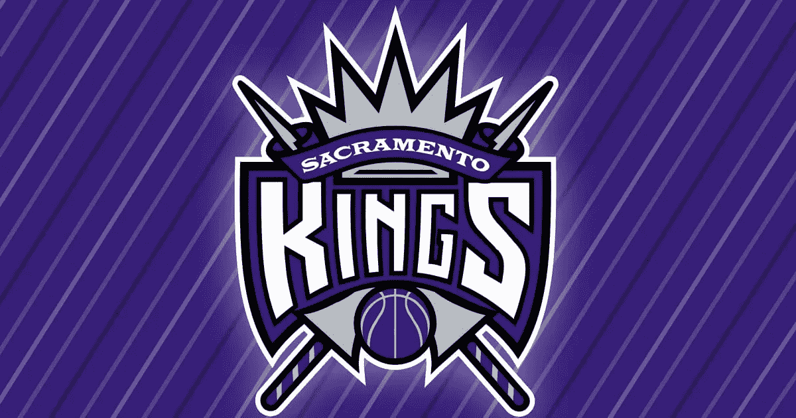

# NBA 萨克拉门托国王队利用区块链购买真实的游戏内装备

> 原文：<https://medium.datadriveninvestor.com/nba-sacramento-kings-leverage-blockchain-for-authentic-in-game-gear-purchases-bcc3eece3576?source=collection_archive---------18----------------------->



今年，来自足球、赛车以及现在的 NBA[的顶级体育特许经营将加密和区块链的采用带到了新的高度。每项运动的团队都采用了区块链技术，以确保真实的游戏装备，包括球衣、衬衫、球等都可以得到确认，并让世界各地的球迷在购买时感到安全。](https://www.ccn.com/crypto-closer-to-adoption-nba-team-launches-blockchain-app/)

萨克拉门托国王队是加密领域的早期采用者，现在已经将区块链安全加入到他们的业务中。它始于 2014 年，当时该团队成为[第一支接受比特币支付的 NBA 球队](https://www.coindesk.com/sacramento-kings-nba-accept-bitcoin)，然后转向挖掘以太坊。现在利用底层技术，国王队将区块链添加到他们的服务中，以帮助球迷购买和跟踪真正的游戏装备，这样他们就不会以邻居的旧衬衫和可疑的球员签名而告终。

随着大品牌通过实施该技术认可区块链，提高认知度和使采用更容易的努力继续改善。体育迷应该为他们感到高兴，这意味着他们购买的那些特殊签名和磨损的装备可以很容易地被证明是 100%真实的，而不是假冒的。运动装备的仿冒品是一个巨大的市场，迄今为止，整个服装行业被盗价值高达 [1.2 万亿](https://www.businesswire.com/news/home/20171222005383/en/Global-Brand-Counterfeiting-Report-2018-Counterfeited-Goods)美元。

区块链通过多种方式解决这个问题:

1.  从源头追踪原始产品
2.  特殊标记
3.  透明度和数据易于在线验证

从任何球员脱下球衣的那一刻起，数据就可以被记录和提交，并进行跟踪，这样就完全杜绝了伪造和非法行为的时间。

建立流程和时间表可以证明项目来自哪里、谁批准了交易以及何时批准的。任何时候物品被转移后，购买和销售历史，以及所有权的证明，来自透明度和特殊标签，使任何进一步的转移遵循相同的原则。从而防止假冒商品。

随着全球各地的球迷愿意购买他们最喜爱的球员物品、球队纪念品等，这是确保球迷获得他们所支付的确切物品的重要一步。

```
*Image via Shutterstock*
```

*原载于*[*https://block chain . news*](https://blockchain.news/post/nba-sacramento-kings-leveraging-blockchain-for-authentic-in-game-gear-purchases)*。*