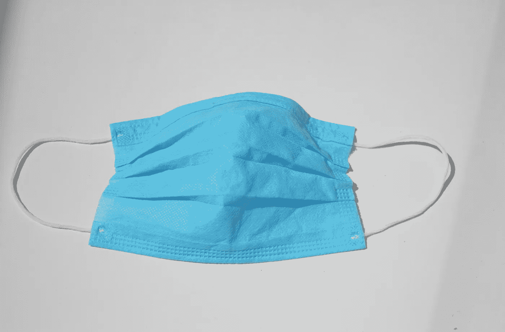
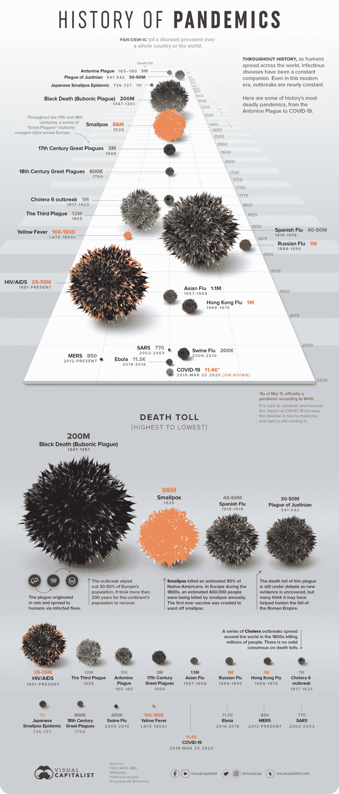
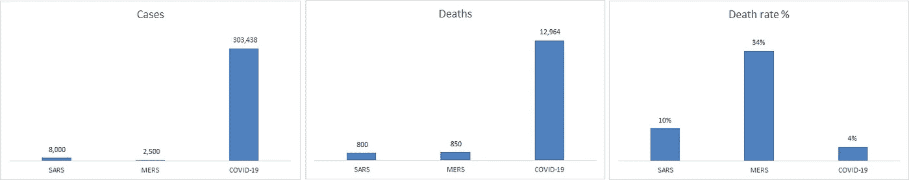
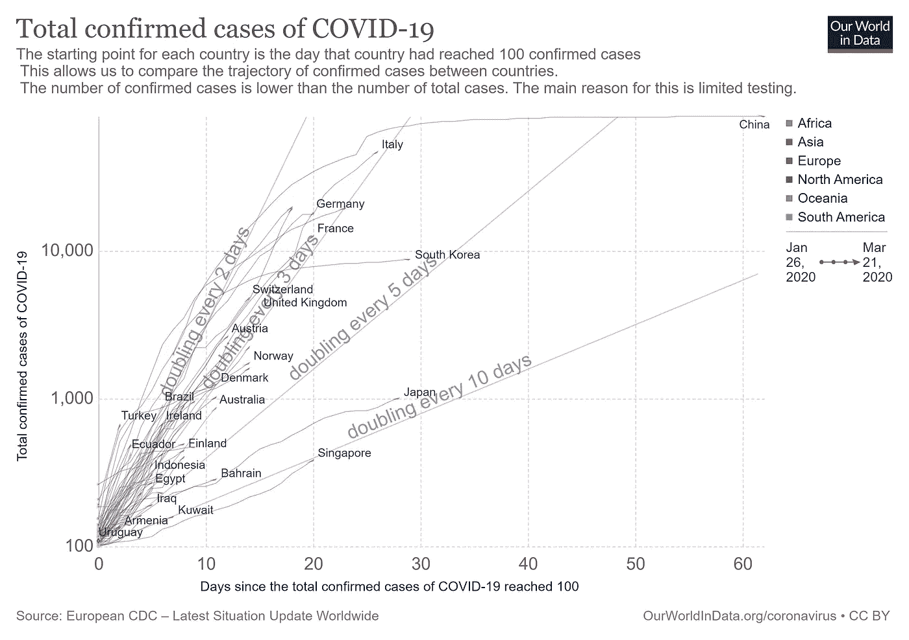
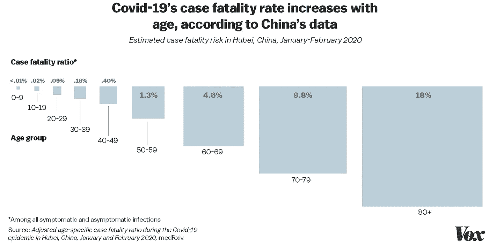
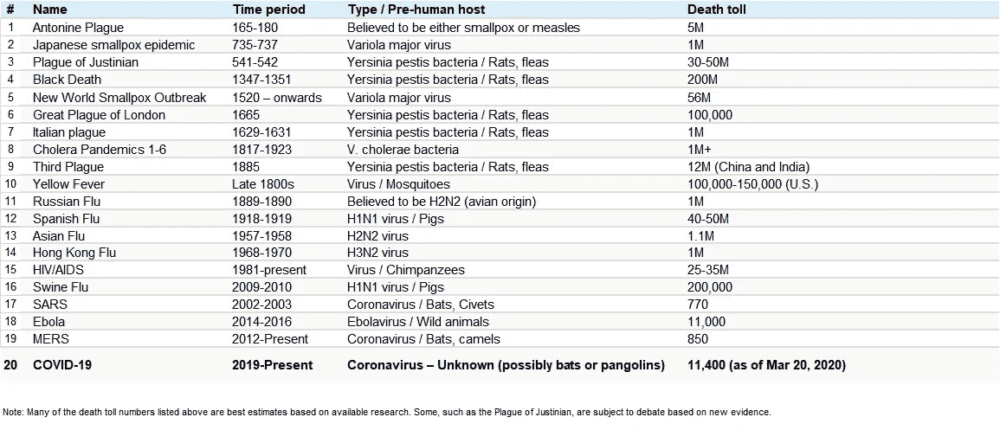
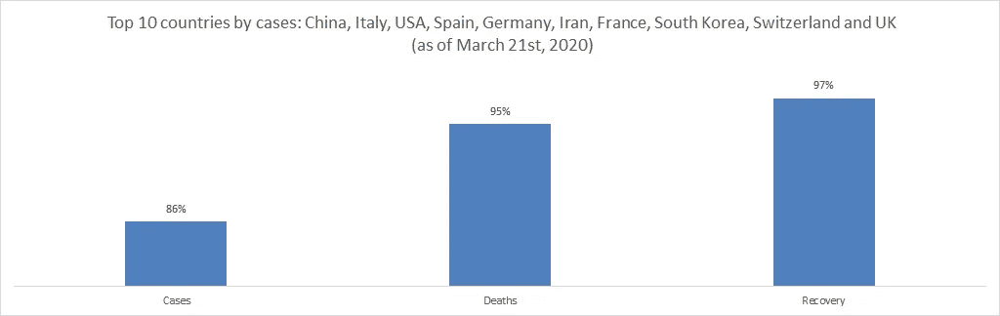
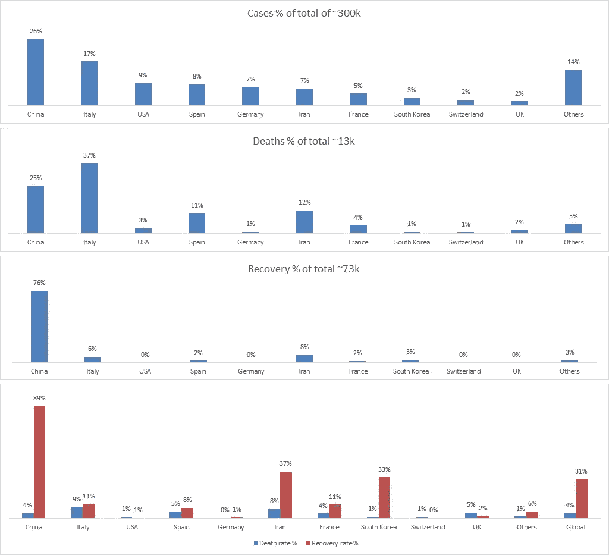

# 抗击冠状病毒需要人均纪律，而不是人均 GDP

> 原文：<https://medium.datadriveninvestor.com/need-discipline-per-capita-not-gdp-per-capita-to-fight-the-coronavirus-88158840601?source=collection_archive---------6----------------------->

为新常态做准备

Photo by [Khawaja Saud Masud](https://unsplash.com/@saudmasud?utm_source=unsplash&utm_medium=referral&utm_content=creditCopyText) on [Unsplash](https://unsplash.com/@saudmasud/stats?utm_source=unsplash&utm_medium=referral&utm_content=creditCopyText)

在这篇文章中，我涵盖了 10 个要点，以更好地理解新冠肺炎疫情的全球现实如何影响我们所有人和我们的家庭，以及我们应该如何为未来做好准备。我的几个家庭成员正在努力破译关于疫情的大量实时信息流，所以我决定将我迄今为止收集和理解的内容总结如下。

***1。冠状病毒并不新鲜:*** 它实际上是一组 **7 种人类冠状病毒**，其中最早的[是在 20 世纪 60 年代中期发现的](https://www.cdc.gov/coronavirus/types.html)，其中 **4 种是轻微的**具有普通流感样症状， **3 种是危险的**包括 2002/2003 年的中东呼吸综合征(MERS)、2012 年的严重急性呼吸综合征(SARS)以及 2012 年 12 月发现的最新**新冠肺炎**[新冠肺炎是一个缩写](https://www.cdc.gov/coronavirus/2019-ncov/faq.html)，自 2019 年被发现以来，它共同代表电晕，vi-代表病毒，d-代表疾病，19。它的其他名字是 2109 新型冠状病毒和 2019-nCoV。

要了解更多信息，请查看下面由视觉资本家[制作的精彩信息图:](https://www.visualcapitalist.com/history-of-pandemics-deadliest/)

***2。新冠肺炎比其他冠状病毒更危险:*** MERS 和 SARS 的死亡率(也称为病死率)分别约为 34%和 10%，相比之下，新冠肺炎的死亡率约为 0.5%至 2.5%，普通流感为 0.1%。由于新冠肺炎没有中东呼吸综合征和非典那么致命，这种疾病不会很快消失，这意味着它让感染者活得足够长，并且没有意识到继续传播感染。新冠肺炎症状出现可能需要长达 14 天的时间，因此在此期间通过各种社会交往增加了病毒风险。从这种疾病中康复或死亡还需要 14 天。

 [## 摔倒不是失败。数据驱动的投资者

### 你只有在放弃的时候才会失败。每个英雄都会倒下，我们活着就是为了失败者出现的时刻；上升到…

www.datadriveninvestor.com](https://www.datadriveninvestor.com/2019/01/17/falling-isnt-failing/) 

Wikipedia, Vector Partners (Pvt.) Limited

***3。这个疫情现在几乎无处不在:*** 截至 2020 年 3 月 21 日，在 **183** 个国家(全球共有 195 个国家，记得有些国家没有新冠肺炎检测试剂盒)报告的[**303483**](https://www.worldometers.info/coronavirus/)新冠肺炎确诊病例**12964**和**94640**。请不要低估病毒的影响范围。

***4。这种疾病每周都在增加一倍:*** 迄今为止，与新冠肺炎相关的确诊病例和死亡病例大致遵循每周增加一倍的轨迹。这个速度不太可能在未来几个月继续下去，因为从数学上来说，到 2020 年夏末，这个数字将超过整个人类人口！

我们可以通过采取所有的预防措施来帮助降低翻倍率。疾病的传播速度与人口密集、社会限制宽松密切相关。我们不能真正降低人口密度，但我们可以限制社会交往。我们需要发挥我们个人的作用，保持封闭，在家庭之外进行“非必要的运动”，就像中国、韩国、日本和新加坡的情况一样。自我约束和国家限制将把双倍增长从 2 天减少到 10 天，并允许我们的医疗基础设施吸收新冠肺炎的第一波冲击。

***5。没有立即治愈的方法，在这一点上只有预防:*** 截至 2020 年 3 月 21 日，**没有治愈的方法**疫苗，最早的疫苗预计将在一年后或可能更长的时间内出现。我们可以主要通过 [**社交距离**](https://www.who.int/emergencies/diseases/novel-coronavirus-2019/advice-for-public) 和 [**洗手**](https://www.cdc.gov/coronavirus/2019-ncov/prepare/prevention.html) 来预防自己。**建议新冠肺炎感染者和他们的照顾者都戴口罩，对其他人来说，口罩可能不会有太大影响。记住，我们唯一的疫苗是社会疫苗！**

*****⑥。75 岁以上男性最易受感染但年轻并不能保证保护:*** 老年人尤其是男性最易受新冠肺炎病毒感染。随着免疫力水平迅速下降，特别是在 75 岁以后，老年人群面临着首先无法抵御病毒攻击，然后面对细胞因子风暴的过度反应的危险，在这个过程中，身体释放其抗感染能力，并清除好细胞和坏细胞。**

****

**[https://www.vox.com/2020/3/12/21173783/coronavirus-death-age-covid-19-elderly-seniors](https://www.vox.com/2020/3/12/21173783/coronavirus-death-age-covid-19-elderly-seniors)**

**男性占意大利新冠肺炎病例的 58%，占相关死亡的 70%。在中国，男性死亡率为 2.7%，远远高于女性的 1.7%。这可能归因于多种因素，包括拥有两条 X 染色体的女性比只有一条 X 染色体的男性天生更有弹性，以及社会因素，如男性比女性吸烟更多，不像女性那样经常洗手。**

**这种病毒表现出的年龄偏见似乎给了年轻人一种错误的解脱感，认为年轻人可能是对抗新冠肺炎病毒保护的保证。在美国，近三分之二的确诊病例年龄在 65 岁以下，20%的死亡病例年龄在 20-64 岁(T3)。**年轻有帮助，但绝不保证免受新冠肺炎的攻击。****

*****7。新冠肺炎会持续多久？回顾过去的大流行(见下表)，似乎它们不仅发生得相当频繁，大约每十年一次，而且可能持续 1-2 年，其中一些大流行逐渐消失或转变为地方性流行病。*****

****

**[https://www.visualcapitalist.com/history-of-pandemics-deadliest/](https://www.visualcapitalist.com/history-of-pandemics-deadliest/)**

**一些专家认为，世界人口可能需要接触这种病毒来发展群体免疫，全球 40%-70%的成年人口最终可能会感染新冠肺炎病毒。这可能会使感染人口平均达到 30 亿左右，并有可能导致 3000 万人死亡(死亡率为 1%)。**

**耶鲁大学社会与自然科学教授、内科医生尼古拉斯·a·克里斯塔基斯(Nicholas a . Christa kis)(@ NAChristakis)表示，我们还必须考虑病毒的后续波，第一波可能在 2020 年 11 月出现。**随着我们的人口继续面对这种病毒并发展出一定程度的免疫力，随着时间的推移，我们也许能够像对付其他病毒一样对付新冠肺炎病毒，但只有时间能证明一切。****

*****8。最初的新冠肺炎浪潮主要影响发达国家:*** 截至 2020 年 3 月 21 日，86%的新冠肺炎病例集中在前 10 个国家，从确诊病例数最多的中国和意大利到最少的瑞士和英国。除伊朗之外，所有国家都是发达经济体，具有弹性医疗基础设施和资源调动能力。**

****

**Wikipedia, Vector Partners (Pvt.) Limited**

**新兴市场和欠发达经济体的优势在于赢得时间，而不是阻碍它们的资源匮乏。因此，这些经济体可以主要利用他们所掌握的一个工具，即在需要应对冲击其医疗基础设施的病例激增时，强制实施社会距离和封锁。比起人均 GDP，我们更需要“人均纪律”来反击。**

****9*。吸取的教训:*** 最重要的教训是**预防远比治疗好得多，反正这是不存在的。**截至 2020 年 3 月 21 日，**全球死亡率约为 4%** (由于缺乏确定病例的测试，可能会低得多，约为 2%)，迄今为止的恢复率约为 31%(康复患者占总病例的百分比)，预计约有 [90%的患者会完全康复](https://www.weforum.org/agenda/2020/03/coronavirus-recovery-what-happens-after-covid19/)。中国是新冠肺炎的发源地，迄今为止报告的病例数最多，约占总数的 26%。但通过对大约 10 亿人实施严格的隔离和社会距离措施，它能够推动迄今为止高达 89%的治愈率。这是一个好消息——也就是说，我们中的绝大多数人都有可能挺过这次疫情。**

**面临的挑战是，大多数国家在疫情的传播速度上落后于中国数周，在处理这种疾病的严格程度上也落后于中国。例如，意大利占报告病例的 17%,但迄今占总死亡人数的 37%,死亡率为 9%,即迄今全球平均水平的 2.5 倍。尽管拥有先进的医疗基础设施，意大利在人口中的预防措施较为宽松，但该国仍无法像中国或韩国那样应对病毒的影响。**

****

**Wikipedia, Vector Partners (Pvt.) Limited**

****10*。应对不确定性的心理学——摆脱疫情:*** 在任何特定时刻成为无形威胁的受害者、照顾任何感染新冠肺炎病毒或其他可能使他们更容易受到冠状病毒攻击的疾病的人的焦虑，自然会加剧心理压力。鉴于全球经济引擎的急剧减速，估计全球有 2500 万个工作岗位处于危险之中。无论各国政府采取何种临时措施，金融压力都可能在未来几天加剧。火上浇油的是被锁在家里几天甚至几周的压力。**

**在过去的几天里，我已经目睹了我周围不断上升的沮丧、易怒和排外情绪。人们害怕，需要有人责备，在某些情况下，因为有意识地试图为自己和家人一直保持积极的态度而筋疲力尽。与人握手、拥抱和拥抱的自然倾向正不断受到考验，这再次提醒我们不可想象的现实正降临在我们身上。**

**对此，我建议如下:**

1.  **培养耐心和包容的心态——不要对抗事实。我们可能会暂时处于这种新常态，所以没有必要承受不必要的压力。读一读我写给儿子的关于如何应对生活挑战的短信。**
2.  **制定一个工作和放松(包括锻炼)平均分配的日常计划——也许连续工作 3 个小时，然后放松 3 个小时。每天重复这个循环 2 到 3 次。想出你自己的保持高效和情绪健康的模式——关键词是模式，因为每天的节奏会减少不确定感。**
3.  **转向艺术、音乐、舞蹈和读书，一些大多数人没有投入足够时间去做的事情。这些活动有助于从累积的压力中治愈身心。**
4.  **如果你想走出家门，去进行一次[散步或跑步，只要你不进入人口密集的地区，这是可以的。不要参加集体散步，与他人保持安全距离(六英尺)。](https://edition.cnn.com/2020/03/21/health/social-distancing-coronavirus-faq-wellness-trnd/index.html)**
5.  **不要恐慌购买和囤积物品，担心必需品大量短缺。生活还会继续，我们会一次解决一个家庭、一个社区和一个国家的问题。像以前一样，调整自己的节奏，购买家居用品。**
6.  **从你的社交网络中剔除消极的预言家。现在不是人们独立预测事情每小时会变得有多糟糕的时候，也不是你随意消费的时候。唯一能让我们所有人更快摆脱这种局面的是集体关注限制性和预防性行动。每天一剂世界末日的场景对大脑是不健康的，只会限制你的纪律去做实际上需要做的事情，希望在这次爆发的另一边出现——练习社交距离，洗手并保持理智！**
7.  **创建家人和朋友新冠肺炎特定的 WhatsApp 群，并让彼此了解相关信息，例如，本周谁可以帮助购买杂货，在裁员的情况下帮助人们找到工作，在短缺的情况下哪里可以找到必需品，与老年人保持联系，因为许多人在未来将越来越孤立，等等。**
8.  **赶上你的[网飞](http://www.netflix.com)暴饮暴食或花时间观看喜剧内容[在线](http://www.youtube.com)并确保不要过度沉迷于每小时关于疫情爆发的报道和新闻。脱离爆发！**

**我想我们现在知道，金钱或武器将无助于解决这个明显存在的问题，这肯定是一个世代的挑战，它不在我们的家门口，而是在我们的家庭和社区里。勇气的时刻就在现在，它始于也止于个人的自律。**

> **"自我控制是自尊的主要因素，而自尊是勇气的主要因素。"
> ― **修昔底德，伯罗奔尼撒战争史****

**______________________________________________________**