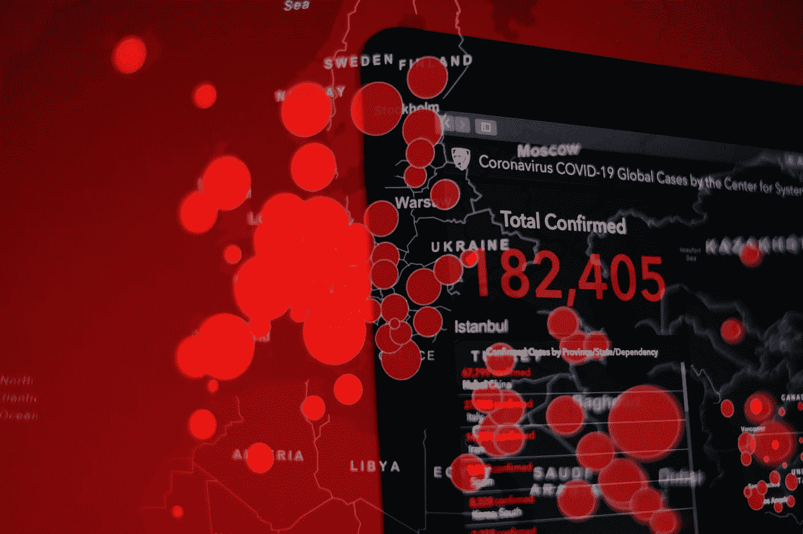

# 全球化者和民粹主义者都不能垄断新冠肺炎故事

> 原文：<https://medium.datadriveninvestor.com/neither-the-globalists-nor-the-populists-can-monopolize-the-covid-19-story-data-driven-investor-fb48e8eec995?source=collection_archive---------20----------------------->

Photo by [Brian McGowan](https://unsplash.com/@sushioutlaw?utm_source=medium&utm_medium=referral) on [Unsplash](https://unsplash.com?utm_source=medium&utm_medium=referral)

# 如果说 2008 年的金融危机引发了人们对全球经济体系的怀疑，那么新冠肺炎则暴露了其脆弱性。然而，它也显示了民粹主义的弊端以及采取多边方式解决全球问题的必要性。

政治领导人正在努力阻止新型冠状病毒新冠肺炎的传播。关于纽约曲线变平的有希望的报告显示，这座城市已经迅速成为美国冠状病毒病例的中心。

各国都关闭了边境。杠杆过高的公司正在寻求救助。世界似乎已经停止了。

从具有全球意识的精英的角度来看，这种新型冠状病毒不可能在更不合时宜的时间传播。过去十年，自由市场全球主义议程一直受到民粹主义力量的攻击。然而，民粹主义者也不会庆祝。没有多边合作，各国政府应对全球威胁的能力就会下降。

2008 年的上一次金融危机给全世界带来了冲击波，摧毁了中产阶级——至今仍未完全恢复——并让位于世界各地的民粹主义运动。全球内陆地区经济机会的丧失，以及财富和权力无耻地积聚在全球极少数民粹主义运动手中。

 [## 现金为王，比我们想象的更强大|数据驱动的投资者

### 2020 年 3 月 12 日，在川普总统宣布新冠肺炎进入国家紧急状态的前夕，纽约时报报道…

www.datadriveninvestor.com](https://www.datadriveninvestor.com/2020/03/26/cash-is-king-more-potent-than-we-think/) 

劳动力市场没有跟上整个经济的转型步伐。大型科技公司的崛起和美国制造业的衰落加速了经济实力本已剧烈的转变。然而，美国民主制度的本质仍然和几年前一样。集中在大城市会降低思想自由的个人的代表影响力。2016 年美国总统选举第一手展示了这一点。尽管以 300 万票的优势赢得了普选，但希拉里·克林顿最终通过选举团输给了唐纳德·特朗普总统。我们的现任总司令在人口稀少的州取得了巨大的胜利，这些州的人民目睹了他们的生活质量下降，无法从全球金融危机中恢复过来。

在过去十年中，强人在世界各地声名鹊起，通过替罪羊、压迫和强烈的民族主义转移人们对失败政策和虚假承诺的注意力。

全球极右翼人气飙升，暴露了容易被遗忘的“普通人”的沮丧情绪，这些人认为他们正在失去他们在经济和政治馅饼中的应有份额，落入少数民族、移民、纵容精英和外国人手中。

极右分子长期以来一直谴责全球主义是对本土文化、价值观和经济的破坏。曾经不容置疑的自由市场正统观念被怀疑损害了国家利益。

新冠肺炎显示了我们的经济体系是多么的脆弱。一种起源于中国武汉的病毒利用我们相互联系的世界，成功地使全球经济活动陷入停顿。全球自由市场资本主义的支柱暴露了它的缺点，这是多么不祥的预兆。

经济数据提供商 TradingEconomics 预计，明年美国国内的失业率将达到 15%。企业正在寻求大规模救助，特朗普政府向美国公民发放救济支票，作为前所未有的刺激计划的一部分，希望减轻工薪阶层家庭的负担。这不足以从已经造成的损害中恢复过来，也不能防止未来的另一场灾难。总统候选人伯尼·桑德斯最近退出了总统竞选。在目前的情况下，民主党领跑者乔·拜登可能更难将被剥夺权利的人团结起来。他不是民粹主义者，这将在政治上对他不利。

然而，另一个现象也很明显:各国未能独立应对全球威胁。尽管韩国和台湾等某些国家的情况比其他国家好，但仅靠国家应对措施并未取得巨大成功。国际合作和世卫组织等组织的授权对于减轻这种新型冠状病毒的影响至关重要。

虽然孤立主义和保护主义政策可能有助于预防，但对治疗无效。鉴于当今世界的现实，完全隔离以防止讨厌的虫子和病毒的形式进入是不可能的。为了应对共同的危机，各国必须相互依赖。多边主义可能会再次获得牵引力。这并不意味着低消费价格和生产效率的全球主义论点将赢得失去生计的工人。在国内，国家利益将决定经济政策和协议。在国际上，各国政府可能会决定在紧迫问题上合作符合它们的最大利益。

20 世纪 10 年代，世界各地的民粹主义倾向急剧上升。如果我们迄今为止与 20 年代的短暂经历是未来的任何迹象，我们可能会在国家层面上看到更多的孤立主义，并通过专门的全球组织的形式看到更多的多边合作。

不管发生什么，巨大的变化即将到来。

在卡内基梅隆大学学习商业和国际关系。对地缘政治、政治经济、技术创新、市场、国际发展和消费趋势感兴趣。我喜欢投资、健身和喝覆盆子热巧克力。

*原载于 2020 年 4 月 22 日 https://www.datadriveninvestor.com***。**