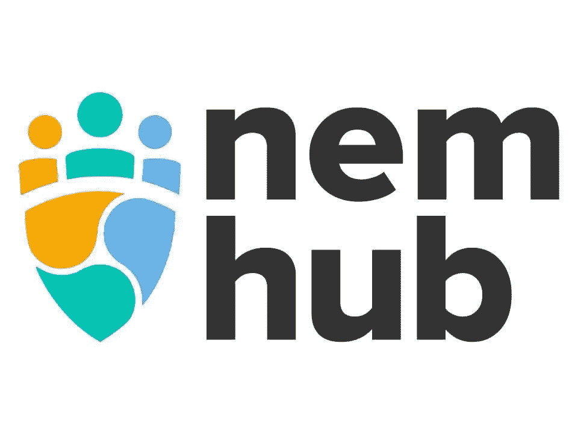

# NEM 推出下一代社交媒体平台

> 原文：<https://medium.datadriveninvestor.com/nem-launches-next-generation-social-media-platform-7d097a44b326?source=collection_archive---------16----------------------->

NEM 中心正处于起步阶段，它将彻底改变社交媒体互动。一个独特的激励系统位于该中心，该系统奖励用户的承诺，并向他们支付加密货币。

这个新系统已经在 6 月 12 日作为测试版开始运行，并从 7 月 15 日起全面开放。用户可以在注册后注册不同的任务，并因创建不同的内容而获得奖励。这是由一个独特的声誉系统。

所有注册的合格参与者每月至少可获得 10，000 美元的 NEM 代币(XEM)。如何参与由他们自己决定。文章和视频形式的活动是明确需要的，但也可以扩展到 Twitter 或 Telegram 以获得奖励。

但是 NEM 中心也支持特别促销。例如，该社区成功举办了一次标志比赛，现在在日本代表 NEM 发挥了重要作用。

 [## 区块链投票和美国选举|数据驱动的投资者

### 在不到 70 天的时间里，这个世界上最古老的民主国家将以前所未有的方式面临最大的摊牌…

www.datadriveninvestor.com](https://www.datadriveninvestor.com/2020/08/26/blockchain-voting-and-the-american-elections/) 

# 来自社区，为了社区

NEM 枢纽旨在加强国际上的 NEM 社区。因此，它使社区能够创造和分享有需求和有价值的 NEM 内容。

这确保了高标准的质量，促进了 NEM 技术的知识和采用。这也反映在绝对数字上。由于 NEM 中心社区的惊人合作，官方社交媒体账户的公众关注度增加了 10 倍。

联合工作最重要的方面是内容的质量。这些可能是令人信服的，因为它们的数量不是决定性的。

# 与刀匠强强联手

NEM 中心是通过使用 DAO Maker 的社交挖掘技术作为白标解决方案而成为可能的。这已经在其他项目中证明了自己，并提供了一个独特的机会，让社区分享他们为 NEM 所做的事情。

通过这种伙伴关系，NEM 扩大了它的影响范围，同时确保可持续的信息传递与消费者，行业和贸易媒体的强烈共鸣。

# 成为成长社区的一部分

要亲自参与并持续从奖励中获益，您必须首先在 [NEM 中心](https://t.me/nem_hub)注册。你还必须在自己的钱包里放 1000 XEM，以向外界表明你对 NEM 的兴趣。

之后，你可以直接开始。对于开放性问题，自有的[电报组](https://t.me/nem_hub)是个不错的选择。NEM 社区也很乐意欢迎有兴趣的人来访问该中心，了解更多关于 NEM 的信息，而无需参与社区奖励。

我在每月一期的 [**简讯中分享了更多私密的想法，你可以在这里**](https://mailchi.mp/bf8f8e8ed697/keep-in-touch-with-lukas) 查看。请在评论中告诉我，并在各种社交媒体平台上加入我:

[**推特**](https://twitter.com/WiesfleckerL)●[**insta gram**](https://www.instagram.com/lukaswiesflecker/)●[**脸书**](https://www.facebook.com/lukaswiesfleckerr)●[**Snapchat**](https://www.snapchat.com/add/luggooo)**●[**LinkedIn**](https://www.linkedin.com/in/lukas-wiesflecker-1b11251a5/)**

**无论你做什么，都要带着爱和激情去做！**

## **访问专家视图— [订阅 DDI 英特尔](https://datadriveninvestor.com/ddi-intel)**