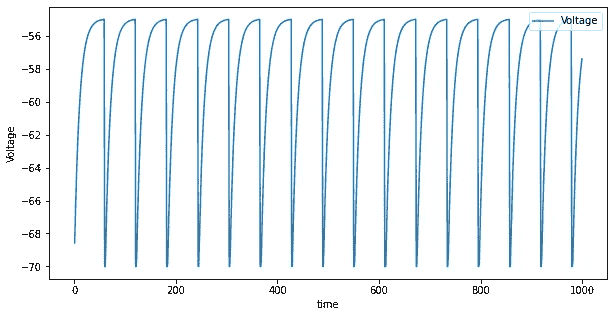
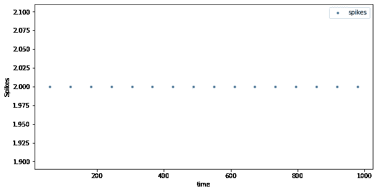
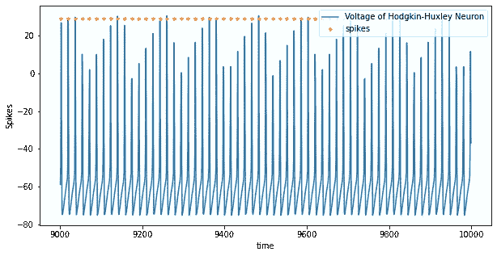

# NEST 模拟器|构建最简单的生物神经元

> 原文：<https://medium.datadriveninvestor.com/nest-simulator-building-the-simplest-biological-neuron-23556ff06ace?source=collection_archive---------8----------------------->

## 建立大量的神经元需要大量的编程和对网络参数的高度敏感性。您需要很好地指定所有参数，以便能够从您的网络进行记录。

如果你正在学习计算神经科学，你很可能来自不同的背景，比如数学、物理、计算机科学或简单的生理学。我本人有物理背景。


作为一名计算神经科学家，主要是知道如何对大量神经元网络建模，以及如何调整它来测试不同的假设(当然还有更多)。

建立一个庞大的神经元群体需要大量的编程和选择网络参数的高度敏感性，因为相信我，它不会那么简单地运行。您需要很好地指定所有参数，以便能够从您的网络进行记录。

所以在了解了所有这些之后，你可能会问自己，有没有什么软件包或软件能让你的生活变得更轻松？答案是肯定的。有许多软件包(虽然不是很多)可以帮助你从模拟单个神经元的复杂性和细节到模拟一大群神经元。最著名的软件包是:

*   布里安 2
*   筑巢
*   发生
*   神经元
*   DynaSim
*   能戈
*   长钉
*   ….

这个列表要多得多，但是我提到了科学家倾向于使用的最流行的包。在下面的链接中，你可以找到很多开始计算神经科学的好材料:

[](https://github.com/nosratullah/open-computational-neuroscience-resources) [## nostratullah/开放计算神经科学资源

### 计算神经科学意味着两件事之一:1。神经科学数据的分析，无论是功能磁共振成像…

github.com](https://github.com/nosratullah/open-computational-neuroscience-resources) 

在所有这些软件包中，NEST 是最受欢迎的三个软件包之一，我将在文章系列中更多地讨论它以及如何使用它。

[](https://www.ncbi.nlm.nih.gov/pmc/articles/PMC5517781/) [## 脑网络模拟软件的比较研究

### 作为第一步，我们定义了三个最流行的大脑网络模拟软件。如材料中所述…

www.ncbi.nlm.nih.gov](https://www.ncbi.nlm.nih.gov/pmc/articles/PMC5517781/) [](https://www.datadriveninvestor.com/2020/02/12/has-general-ai-exceeded-the-intellectual-capacity-of-humans/) [## AI 将军是否已经超过了人类的智力容量？数据驱动的投资者

### 不仅在游戏中，而且在劳动力市场上，机器都比人类聪明。在今天的许多领域，使用…

www.datadriveninvestor.com](https://www.datadriveninvestor.com/2020/02/12/has-general-ai-exceeded-the-intellectual-capacity-of-humans/) 

这是 nest simulator 的快速定义:

“NEST 是一个针对**尖峰神经网络模型**的模拟器，非常适合任何规模的网络，例如:

1.  信息处理模型，例如在哺乳动物的视觉或听觉皮层中，
2.  网络活动动力学模型，例如层状皮层网络或平衡随机网络，
3.  学习和可塑性模型。"

我建议您查看在线文档:

[](http://nest-simulator.readthedocs.io/) [## 欢迎使用 NEST 模拟器文档！- NEST 模拟器用户文档 1.0.0…

### NeuralEnsemble 是一个基于社区的倡议，旨在促进和协调开源软件开发

nest-simulator.readthedocs.io](http://nest-simulator.readthedocs.io/) 

# 装置

多亏了 NEST 开发人员，安装比以前容易多了，您可以在终端中用一行代码安装它:

```
conda create --name ENVNAME -c conda-forge nest-simulator
```

如果你还没有康达，记得安装它！这里的“ENVNAME”是你可以自己选择的。然后，您需要激活您的环境来使用 NEST。

```
conda activate ENVNAME
```

# 开始

首先，NEST 背后有一个逻辑，那就是从你的网络中测量一些东西，你需要像在实验室中那样做。NEST 中有一些实用工具，如万用表或尖峰检测器和许多其他东西。如果不清楚我在说什么，请继续和我一起编写第一个模拟神经元的代码。

从我们需要的库开始。

```
import nest
import matplotlib.pyplot as plt
```

创建一个神经元就像写一行代码一样简单。

```
neuron = nest.Create("iaf_psc_alpha")
```

*   **神经元:**我们神经元的名字。
*   **创建:**在嵌套中创建任何种类的对象都需要这个函数。
*   **"iaf_psc_alpha":** 我们要用的神经元模型。有这么多类型的神经元模型，你可以根据自己的需要使用。

```
nest.Models()
```

*   上面一行可以显示神经元模型，你需要从列表中选择。

从现在开始，我们只需要调用“神经元”就可以访问任何类型的修改。

每个神经元模型都有一些描述神经元状态的参数。要查看它的参数，您可以简单地这样写:

```
nest.GetStatus(neuron)
```

如果你想改变神经元的一些参数，试试这个:

```
nest.SetStatus(neuron, {"I_e": 376.0})
```

*   这里，因为我们要向神经元注入电流，使其产生尖峰，所以我们将电流值更改为(376.0 mA)

现在，让我们创建一个工具来测量它的膜电压以及神经元峰值的时间。

```
multimeter = nest.Create("multimeter")
nest.SetStatus(multimeter, {"withtime": True, "record_from": ["V_m"]})
```

*   “万用表”:测量膜电压的工具。
*   “with time”:True:记录电压的同时记录时间。
*   " record_from": ["V_m"]:告诉万用表记录膜电压。

至此，您创建了一个神经元和一个万用表，但实际上并没有将它们连接起来。记住我告诉你的关于巢穴的逻辑。

```
nest.Connect(multimeter, neuron)
```

*   Connect:这个函数连接 NEST 中的对象，它有更多的细节，我会在下一个教程中告诉你更多的神经元。
*   对象的顺序实际上很重要。

好像就是它了。到目前为止，你创造了一个特定的神经元，你改变了神经元的输入电流，然后我们创造了一个万用表，改变了一些参数。最后，我们将万用表连接到神经元上。但是只剩下一步了。那是为了模拟程序。我们没有说你应该模拟它的巢穴多久。

```
nest.Simulate(1000.0)
```

因为这个程序不是很重，所以你可能不会注意到模拟过程。几秒钟后，你就会得到结果。现在所有的计算都完成并存储。你唯一需要做的工作就是查看你的记录，也许还可以把它们标出来。

```
dmm = nest.GetStatus(multimeter)[0]
Vms = dmm["events"]["V_m"]
ts = dmm["events"]["times"]
```

*   记住所有的结果都可以通过 **GetStatus()** 函数获得。
*   由于 NEST 使用的数据结构，您需要从“事件”列表中提取您的膜电压和时间。

```
plt.figure(figsize=(10,5))
plt.plot(ts, Vms, label='Voltage')
plt.xlabel('time')
plt.ylabel('Voltage')
plt.legend(loc='upper right')
```



LIF neuron membrane voltage with the input of a high current value

我们可以做几乎同样的事情来从尖峰探测器中提取信息。

```
dSD = nest.GetStatus(spikeDetector,keys="events")[0]
evs = dSD["senders"]
tss = dSD["times"]
plt.figure(figsize=(10,5))
plt.plot(tss, evs, ".", label='spikes')
plt.xlabel('time')
plt.ylabel('Spikes')
plt.legend(loc='upper right')
```



LIF neuron spike times with the input of a high current value

在下图中，我尝试了一个具有不同输入电流的霍奇金-赫胥黎神经元:



代码如下:

了解更多信息:

[](https://github.com/nosratullah/HodgkinHuxely) [## nosratullah/hodgkinshely

### 一种基于霍奇金-赫胥黎模型的模拟神经元放电的模型

github.com](https://github.com/nosratullah/HodgkinHuxely) 

注意:这些系列首先是简单例子的简要介绍，然后通过他们的论文开始模拟一些实验研究。来自你们的评论和指导将会对正确的方向有很大的帮助。