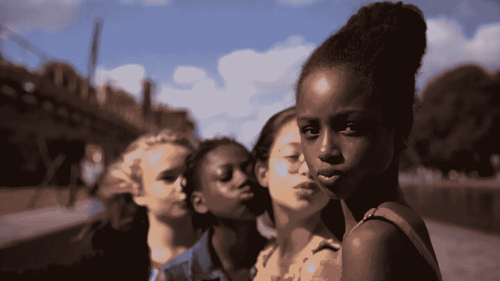

# 网飞的可爱——被误解的，可怕的，必要的

> 原文：<https://medium.datadriveninvestor.com/netflixs-cuties-misunderstood-scary-necessary-7d41c7b7df49?source=collection_archive---------13----------------------->

当 *Cuties* 在 [2020 年圣丹斯电影节](https://www.sundance.org/pdf/film-guide/SFF20_PPG.pdf)播出时，没有人能预料到它会像现在这样引发巨大的互联网辩论海啸。在电影首映前不久，网飞购买了电影的发行权。尽管电影评审团给予了积极的评价，但《T4 宝贝》、《T5》和《T7》还是引起了观众的分歧。这部法国独立电影于 9 月 9 日在美国网飞上映后，迅速成为文化战争的话题。这部电影目前在烂番茄的影评评分为 91%，尽管观众评分只有 11%。

为什么？

是因为普通大众太愚蠢而不能理解多面艺术吗？得分的巨大差异是因为《脸书邮报》读者的愤怒吗？因为在互联网时代，人类在不了解事物全部范围的情况下做出反应？因为我们很快就扣动了字面和比喻的扳机？或许是镜头和角度简直**太变态**？或者，可能是所有东西的混合？

*小可爱们*解决繁琐的问题。它对观众的道德以及整个社会提出了挑战。看着可爱的小东西令人不安，因为这个世界是一个令人不安的地方。

我在社交媒体上找到的关于*小可爱*的一致词汇是“恋童癖”。无论是预测电影未来的武器化，还是其不正当的可能性。这个术语被随意使用，尽管它在上下文中是有效的。

# 可爱剧情简介

*小可爱*讲述了艾米的成长故事。一个 11 岁的女孩，艾米是塞内加尔穆斯林移民的女儿。这部电影描绘了主人公在两个世界共存中的挣扎。艾米是一名空中飞人，在 21 世纪的法国，她在虔诚的信仰和宗教责任与作为一名青春期女性的压力和影响之间周旋。

为了反叛和追求个性，艾米加入了当地的一个舞蹈团体——可爱。以组长安吉莉卡为首，小组全是女性。这些女孩的穿着和舞蹈令人反感——这是她们在屏幕上看到的世界的副产品。

受广告和音乐视频中女性物化的影响，艾米和蔡斯的其他可爱的人在没有意识到的情况下感知到了成年。女孩们还年轻，她们对世界的理解还不成熟。

作为观众，我支持艾米。不是因为富有表现力的露脐装或紧身裤或舞蹈比赛，而是因为她逃离了远离可爱的队友时所面临的屏幕混乱。艾米在追求一种控制感——控制她周围的世界和她的命运。然而，在没有意识到的情况下，艾米的追求将她拉进了一个个人很少拥有控制权的世界。

# 争论

我的简短描述几乎不会引起负面反应。这听起来像是一个鼓舞人心的故事。那么，为什么会有争议呢？

导演兼编剧 mamouna dou couré用激进的镜头描绘了一幅更大的画面。虽然这部电影在露骨的画面方面相当保守，但它经常包含年轻女孩跳舞的特写镜头。鉴于他们成人风格的服装和毫不掩饰的舞蹈编排，这些连续的镜头令人不安。

它们让观看者感到肮脏。我发现在这样的场景中，我将目光投向模糊的外墙和背景，以保护我的灵魂。有一个早期的场景，一个不知名的女舞者在一个抖音风格的剪辑中暴露了她的乳房。她的年龄和身份不得而知，尽管人们认为她也是一名青少年。

# 意见分歧

这些时刻是观众分裂的地方。对许多人来说，这些暗示性的镜头太多了，不值得观看。他们引发了“取消网飞”的标签。密苏里州参议员乔希·霍利写了一封信[，要求从](https://dailycaller.com/2020/09/11/josh-hawley-netflix-cuties/)[网飞的平台](https://thenerdstash.com/the-haunting-of-bly-manor-drops-on-netflix-this-october/)上删除这部电影。

忽视这种观点是不负责任的。在杰弗里·爱泼斯坦的争论中，可爱的小家伙们在网飞首次亮相。在期待已久的“我也是”时代。在电影上映前的几周里，几次警方行动成功地在美国找回了许多被绑架的儿童。还有所谓的 Wayfair 丑闻。

不假思索的反应是有效的。了解这个世界需要强大的胃。目睹由儿童主演的电影所描绘的世界的邪恶是一项挑战。然而，正是因为这个原因，尽管存在分歧，但《可爱的 T10》还是成功了。

在令人心痛的特写镜头和再熟悉不过的环境背后，有一个精心编织的故事，讲述了年轻人，尤其是年轻女性也遭受的不幸真相。

艾米和其他小可爱们通过舞蹈来寻求名声和地位。他们是拥抱扭曲世界的孩子。媒体和流行文化用粗糙的画笔描绘，女孩们成了它的猎物。

有一个场景，艾米拍了一张清晰的照片——谢天谢地，观众没有看到图像。另一个时刻的特点是一个应受谴责的保安。这一特殊场景凸显了全世界男女不公平的社会结构。巡警抓住了闯入大楼的女孩，但是因为一个孩子和他调情而放了她们。场景结束时，另一名警官表示厌恶。

# 更大的影响

*小可爱们*完成了一件伟大的事情。每一个憎恶的时刻都会开启一段对话。这种令人深恶痛绝的现象让我们得以一瞥我们经常选择忽视的现实。

不应该以任何可以想象的方式剥削儿童。他们不应该转变成[父权制](https://thenerdstash.com/the-gaming-journey-of-twitch-streamer-batgirl1314/)。但是那些抨击*的可爱们*是混乱的一部分的人，忽略了他们是机器中的齿轮。不幸的是，这种愤怒是因为这部电影通过地球上最受欢迎的流媒体服务获得了恶名。如果这部电影停留在独立领域，没有人会在意。

*小可爱*和 Doucouré [创造对话](https://www.msn.com/en-gb/entertainment/movies/cuties-review-e2-80-93-netflixs-controversial-child-exploitation-film-is-bold-flawed-and-misunderstood/ar-BB191fKz)。一个关于掠夺行为的邪恶。一个关于媒体和互联网。另一个关于自我和内省思维。关于虔诚的信仰和个人主义。

尽管它的角度和方向令人不快，但《可爱的人》对世界的贡献远远大于对它的负面影响。它让我们所有人，尤其是当权者，对我们的胡说八道和虚伪感到震惊。揭露各种媒体造成的危险后果。它强调有形的家庭联系的重要性，以及我们都经历的不断的灵魂探索。

总之， *Cuties* 是一部非常值得一看的电影。你有时会不确定。你会问问题。我对艺术的目的有了自己的看法，几个小时后我发现自己在权衡艺术与人性。这样的故事应该用童星来讲吗？他们会因为这个项目而面临风险吗？风险是对抗邪恶的一部分吗？

你会留下足够多的想法，持续一生。