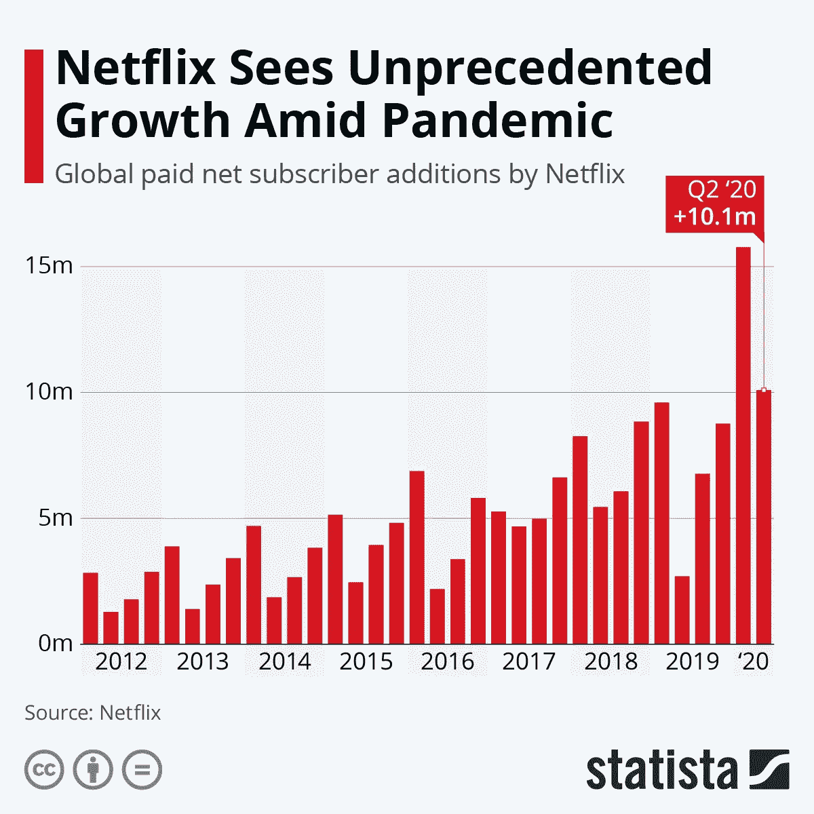
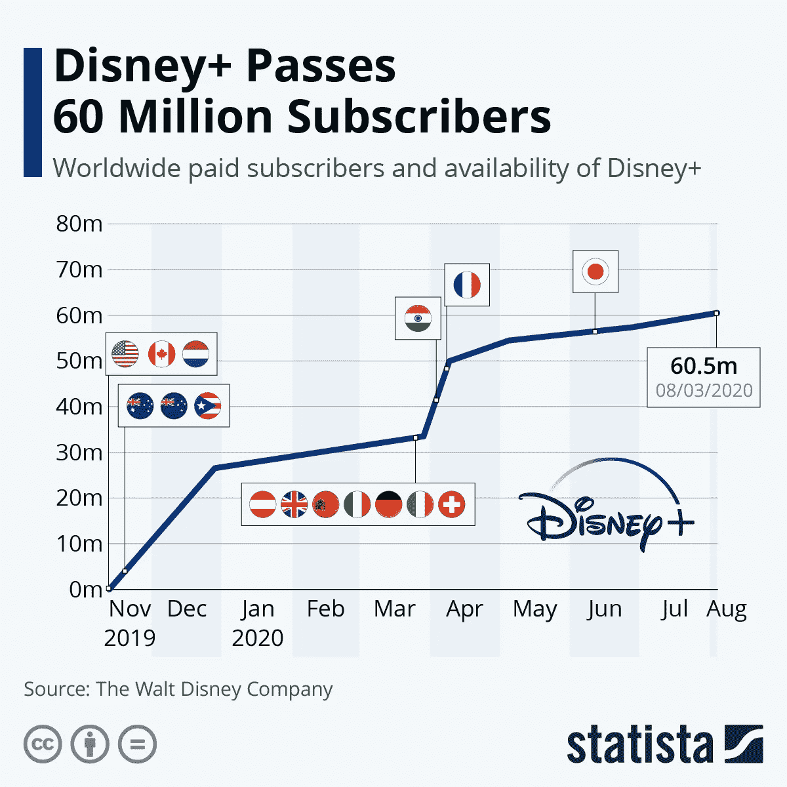

# 网飞股票+迪斯尼股票=疫情订户

> 原文：<https://medium.datadriveninvestor.com/netflixs-pandemic-subscribers-38fcda0205ba?source=collection_archive---------21----------------------->

## 在新冠肺炎期间，有多少新用户加入了像网飞和迪斯尼这样的流媒体公司？

Photo by [Charles Deluvio](https://unsplash.com/@charlesdeluvio?utm_source=medium&utm_medium=referral) on [Unsplash](https://unsplash.com?utm_source=medium&utm_medium=referral)

网飞的股票上涨了。迪士尼的股票上涨了。由于新订户的激增，股票正在回升。 *本文是系列文章的第二部分，记录了 COVID 疫情期间消费者对家庭娱乐的需求。*

*第一部——“新冠肺炎电子游戏热潮”*

*第二部分，我们将评估媒体流，如网飞和迪士尼加。*

etflix 已经升级了它的游戏。我的家人无法停止观看他们的真实犯罪系列纪录片。我们深陷的调查/法庭秀是制造谋杀。我们已经花了好几个星期看这个系列——试图把自己限制在一个晚上一集。

对于那些不熟悉这部剧的人来说，这是一个关于史蒂文·艾弗里和他侄子布伦丹·达塞的故事。他们目前在监狱里——因谋杀罪服刑。作为观众，你扮演首席侦探、辩护律师、法官和陪审团。你必须决定谁是无辜的，谁是有罪的，谁是荒谬的。

如果你想知道一个更敏锐的概要，我会推荐喜剧演员汤姆·赛格拉:

(3 分钟短片)

YouTube — Making a Murder | Tom Segura | Animated by: Tony Celano & Eric Freedman

平心而论，该系列比汤姆的描述要好。第一季设定了背景，讲述了史蒂文和布兰登的故事，而第二季解决了一些遗留问题，让你更好地了解谁犯了罪。如果你想找一些刺激的东西看，制造谋杀案是值得考虑的。

这带来了一些有趣的观点:

*   人们在寻找新的节目/电影吗？
*   这导致了飘带生意的繁荣吗？
*   网飞和迪士尼+有多少新用户？
*   增长趋势是加速还是减速？

在本文中，我们将试图通过检查华特·迪士尼公司网飞和 Statista 提供的数据和分析来解决这些问题。

没有进一步的延迟，表演开始了:

# 开场序列:网飞

Data: Netflix, Chart: Statista

自 2012 年以来，网飞的用户数量有所增加。他们的增长每年都超过前一年。奇怪的是，新客户的需求在新年前后出现，但在第二季度下降。这张图表显示人们最有可能在一年的前三个月注册。

尽管有这种趋势，网飞的新用户还没有达到 1000 万大关。今年，他们打破了这个先例。在 2020 年的前几个月，该公司突破了 1000 万的阻力线，甚至成功突破了 1500 万大关。随后，网飞在 2020 年第二季度新增全球用户高达 1010 万。

网飞 2020 年成功故事中最引人注目的部分是它的撤退。每年第二季度，网飞都会经历新用户数量的下降。2020 年也不例外。Q2 的新用户数量有所回落，但仍保持在 1，000 万的阻力线以上。这可能意味着上升轨迹是真实的！

由于它的成功，华尔街给了这家媒体公司丰厚的回报。从 3 月 16 日股价触及每股 298.84 美元的 2020 年低点开始，该股大幅上涨，于 6 月 10 日达到每股 548.73 美元的峰值。短短几个月内，估值就上涨了 83.6%。

**换句话说(和数字)**

*   如果你在三月份投资 10，000 美元在网飞股票上
*   你的投资在 6 月份会增加到 18，360 美元

网飞能保持增长吗？我猜是的！只要柯维德·疫情还在，人们(全世界)就会寻找室内活动。他们可能会首先搜查网飞。

# 第二幕:迪士尼+

Data: The Walt Disney Company, Chart: Statista

网飞图表记录了这家媒体公司在过去八年中的新订户数量。但是网飞总共有多少用户呢？答案是 2020 年用户总数为 7290 万。

哪家流媒体公司积累了 7290 万的近 83%？如果你猜是 Disney+，那么你可能看了上面的图表。向你致敬！

自成立以来的十个月里，Disney+服务已经积累了 6250 万付费用户。与网飞不同的是，迪士尼在 Q2 没有出现下滑，并且全年都保持着自己的基础。迪士尼观众的这种投入程度是值得注意的，因为大多数彩带都是按月发放的。

自 3 月份以来，迪士尼的股票也一直是赢家。该股票在 3 月 23 日跌至 85.76 美元的低点，目前为 128.79 美元。自 3 月份触底以来，该公司的估值已经上涨了 33%。

**在投资方面**

*   如果你在三月份投资了 10，000 美元
*   你现在的余额是 13，300 美元

不算太寒酸！但是，哪个更好呢？你决定吧。

# 文章结尾:网飞队 vs 迪斯尼队

Photo by [Glenn Carstens-Peters](https://unsplash.com/@glenncarstenspeters?utm_source=medium&utm_medium=referral) on [Unsplash](https://unsplash.com?utm_source=medium&utm_medium=referral)

你更喜欢哪个平台？

你是:

*   网飞队？
*   迪士尼团队？
*   或者 Disn-Flix 团队！

不管你选择了哪一个平台，你可能都会同意这两家公司都取得了令人印象深刻的增长。他们客户的需求不太可能动摇，他们的未来看起来很光明——无论是订户还是股票。

*披露:作者不拥有也没有“卖空”任何网飞股票(NFLX)或华特·迪士尼公司股票(DIS)。没有财务利益冲突需要披露。*

**阅读更多来自 KR 的文章**

 [## 新冠肺炎电子游戏热潮

### 疫情期间，视频游戏制造商赚了多少钱？

medium.com](https://medium.com/datadriveninvestor/the-covid-19-video-game-boom-a3707498981b)  [## 在 33 分钟内了解经济如何运转

### 你将做的最好的半小时投资！

medium.com](https://medium.com/datadriveninvestor/learn-the-economy-in-33-minutes-67510b3abecf)