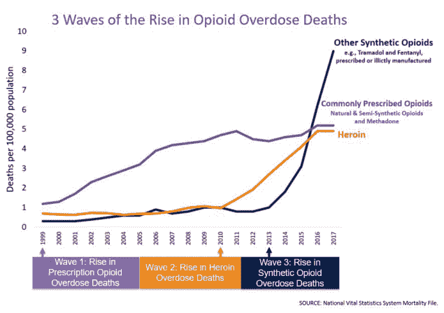

# 网飞的《药剂师&关于阿片类药物危机的 25 个事实》

> 原文：<https://medium.datadriveninvestor.com/netflixs-the-pharmacist-25-facts-about-the-opioid-crisis-4e27c7888b99?source=collection_archive---------5----------------------->

在过去的几天里，我看了网飞的新电视剧《药剂师》。说实话，在收听之前，我以为自己对阿片类药物的流行有相当多的了解。虽然我知道普渡制药公司对这次危机的爆发负有很大责任，但我不知道他们的贪婪和恶心行为有多深。丹·施纳德揭露了这一点，揭露了深藏在新奥尔良圣伯纳教区的腐败现象，是一个英雄。

和大多数人一样，我认识一个和我很亲近的人，他和阿片类药物进行了长期艰苦的斗争。就我的好朋友而言，他能够战胜这场战斗。他现在已经戒了一年多了。

 [## 保护主义、政治和经济动荡|数据驱动的投资者

### 美国股市昨日出现 400 多点的大幅反转，为未来的事情发出了警告信号。市场…

www.datadriveninvestor.com](https://www.datadriveninvestor.com/2018/06/28/protectionism-politics-economic-turmoil/) 

不是每个人都像我的朋友。我们的许多亲人没能活着走出这场成瘾的战斗。阿片类药物危机已经夺走了许多我们关心的人的生命。这种形式的成瘾没有社会经济、种族、年龄或其他界限。正如统计数据所证明的，阿片类药物成瘾的易感性跨越了我们社会的整个范围。

虽然*药剂师*在强调阿片类药物危机已经变得多么糟糕方面做了大量工作，但我想通过展示这些令人瞠目结舌的事实来更进一步。

## 在美国，每 11 分钟就有一人死于阿片类药物过量。

## 每天有 130 名美国人死于阿片类药物过量。这包括处方药和非法阿片类药物。

## # 3 1999 年至 2017 年间，近 [40 万人死于阿片类药物过量](https://www.cdc.gov/drugoverdose/epidemic/index.html)

## # 4 2017 年，与阿片类药物有关的用药过量死亡人数[比 1999 年](https://www.cdc.gov/drugoverdose/epidemic/index.html)高出 6 倍。

## #5 从 2016 年到 2017 年，[药物过量死亡增加了惊人的 9.6%](https://www.cdc.gov/drugoverdose/data/statedeaths.html) 。疾病预防控制中心指出，阿片类药物是这一增长的主要驱动力。

## # 6 2011 年至 2015 年间，[美国阿片类药物过量死亡人数增加了两倍](https://www.mentalhealthfirstaid.org/2019/03/5-surprising-facts-about-opioid-use/)。

## # 7 2013 年，美国占全球羟考酮消费量的 [78%。](https://www.incb.org/documents/Narcotic-Drugs/Technical-Publications/2014/Narcotic_Drugs_Report_2014.pdf)

## #8 在 2012 年，每 25 分钟就有一名婴儿出生[，该婴儿正遭受阿片类药物戒断](https://www.ncbi.nlm.nih.gov/pmc/articles/PMC4520760/)。

## # 9[2016 年，年轻成人死亡中有五分之一](https://jamanetwork.com/journals/jamanetworkopen/fullarticle/2682878)与阿片类药物有关。

## # 10 2017 年，超过 10 万名青少年患有[阿片类药物使用障碍](https://www.samhsa.gov/data/sites/default/files/cbhsq-reports/NSDUHFFR2017/NSDUHFFR2017.htm#sud10)。

## 21%到 29%的处方阿片类药物被滥用。

## #12 滥用处方阿片类药物的人中有 4%到 6%会转变为海洛因。

## #13 大约 80%的海洛因吸食者第一次滥用处方阿片类药物。

## # 14 2012 年，医疗保健提供者开出了惊人的[2 . 59 亿张阿片类止痛药处方](https://www.cdc.gov/mmwr/pdf/wk/mm6326.pdf)。这个数字足够当年每个美国成年人配药。

## #15 在 2017 年，每天估计有[1300 名成年人首次误用阿片类药物处方](https://www.samhsa.gov/data/report/2017-nsduh-annual-national-report)。

## #16 随着美国预期寿命的下降，[阿片类药物死亡率上升](https://www.cdc.gov/nchs/data/nvsr/nvsr67/nvsr67_05.pdf)。

## 阿片类药物危机估计每年给美国经济造成 780 亿美元的损失。

尽管上述 17 项统计描绘了一幅绝望的画面，但仍有理由抱有希望。随着新的

## #18 截至 2019 年 4 月， [162 名被告被指控](https://www.hhs.gov/sites/default/files/opioids-infographic-april-2019.pdf)分销和开阿片类药物以及其他危险药物。这是有史以来最大的医疗欺诈抓捕日的一部分。

## #19 从 2017 年 1 月到 2019 年 2 月，药房每月发放的阿片类药物总量减少了 [34%。](https://www.hhs.gov/sites/default/files/opioids-infographic-april-2019.pdf)

## #20 截至 2019 年 4 月，与一年前结束的 12 个月相比，临时用药过量死亡人数下降了 [3.3%。](https://www.hhs.gov/about/news/2019/04/24/hhs-fact-sheet-combating-the-opioid-crisis.html)

## #21 在 2012 年达到每 100 人 81 份处方的峰值后，[截至 2017 年，阿片类药物处方的可获得性下降](https://www.cdc.gov/drugoverdose/maps/rxrate-maps.html)至每 100 人 59 份。

## #22 在报告机构寻求阿片类药物滥用治疗的人数已经超过寻求酒精滥用治疗的人数。

## #23 在 210 万报告滥用海洛因止痛药的人中，约有 32%在 2017 年寻求治疗。

## #24 许多医生现在选择不开阿片类药物。遵守新法规被认为是医生不敢这样做的主要原因。

## #25 截至 2019 年 6 月， [48 个州起诉了奥施康定制造商普渡制药](https://www.cnbc.com/2019/06/04/nearly-every-us-state-is-now-suing-oxycontin-maker-purdue-pharma.html)。

尽管阿片类药物危机夺去了如此多的生命，证明了美国经济的高昂代价，并显示了资本主义贪婪的最恶劣的一面，但采取的大大小小的行动正开始产生影响。虽然像疾病预防控制中心和 HHS 这样的大型政府机构已经开始着手解决这个问题，但是像药剂师丹·施伦德这样的英雄已经向我们表明，我们的行动也不是没有效果。