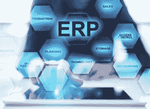
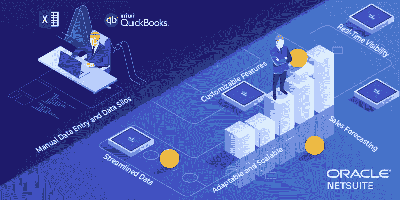

# 顶级 NetSuite ERP 软件模块:成长型企业的最佳云 ERP 解决方案[系列 1]

> 原文：<https://medium.datadriveninvestor.com/netsuite-erp-software-modules-the-best-cloud-erp-solution-for-growing-businesses-series-1-af548cd9cea?source=collection_archive---------6----------------------->

自动化就在我们身边。无论规模大小，大多数企业都在采用自动化工具来简化运营，并减少执行基于规则的工作所需的时间。随着工业 4.0 革命和数字化转型的快速发展，您的企业应该凭借独特的功能和优势在市场中脱颖而出。企业资源规划(ERP)软件是一个热门词汇，旨在快速有效地简化关键任务操作。

然而，企业家和企业主在选择内部 ERP 还是云 ERP 解决方案时总是有一个问题。简而言之，云 ERP 软件解决方案易于设置，不需要基础架构维护，灵活、安全且可扩展。本文将讨论业界领先的云 ERP 解决方案 Oracle NetSuite 的顶级模块。

无论是初创企业、小型企业、中型企业还是老牌企业，NetSuite 都是通过技术推动增长的最佳定制 ERP 解决方案。Amzur 是一家领先且值得信赖的 NetSuite 实施合作伙伴,位于佛罗里达州坦帕市，过去 15 年来一直提供最佳服务。

我们列出了 NetSuite ERP 的顶级模块，以便您轻松选择。看一看。

**NetSuite CRM & ERP:**

这是 NetSuite ERP 软件的基本模块，能够实现对客户的完整实时 360 度视图，并提供跨所有流程的无缝信息流，以了解和丰富客户体验。

**财务管理:**

实现财务运营的自动化，确保各部门之间的灵活性和高透明度，将推动更好的决策制定，从而带来真正的竞争优势。NetSuite 财务管理可以与所有 NetSuite 订单管理、库存、CRM 和电子商务功能集成，以简化关键业务流程。

 [## 不管准备好了没有，革命就在我们面前|数据驱动的投资者

### “对于技术如何影响我们的生活和重塑经济，我们必须形成全面的全球共识……

www.datadriveninvestor.com](https://www.datadriveninvestor.com/2019/02/12/ready-or-not-the-revolution-is-upon-us/) 

**理财规划:**

Oracle NetSuite ERP 软件提供了与 Microsoft Office 工具相集成的全面财务规划解决方案，可在旅途中提供更大的灵活性。它支持对资本支出及其对总体支出和财务报表的影响进行管理、优先排序和规划。

**订单管理:**

NetSuite 提供全渠道订单管理，通过消除账单错误并最大限度地减少重要客户的工作量，简化了从请求报价到开账单再到每次交付正确产品的所有操作。

**生产管理:**

Oracle 的 NetSuite production management 使制造业能够从销售订单、工作订单处理、路由、调度、订单执行和产品成本计算开始，实现流程自动化。

**需求计划:**

NetSuite 的需求规划模块使采购和库存经理能够根据以前的历史数据预测需求。这将有助于相应的经理计划采购和工作订单，以满足需求。

**供应链管理:**

Netsuite 的供应链管理(SCM)配备了先进的库存管理和需求规划技术，帮助您做出正确的决策。不管你的产品在哪里生产或储存，你都可以对供应链进行前所未有的控制。

**仓库管理:**

NetSuite Warehouse Management System(WMS)旨在通过移动射频扫描提高仓库利用率、生产和运输准确性以及效率。NetSuite WMS 建兴模块是小型仓库和库房的理想选择。

**采购管理:**

NetSuite ERP 软件提出了一个智能的集成解决方案，通过一些预先批准简化了采购流程(从采购到支付)。NetSuite 的采购管理有助于公司及时以最佳成本进行采购。

**人力资源管理解决方案:**

NetSuite 对动态变化的人力资源趋势有着深刻的理解，并通过简化招聘、入职、薪资和其他核心人力资源操作来适应新时代的流程。NetSuite 的 SuitePeople 是领先的人力资源云应用程序，可以轻松简化经理和人力资源操作。

**工资管理:**

薪资管理是一项关键的业务功能，需要尽可能高效地运行。NetSuite 工资管理模块通过消除繁琐的文书工作来确保准确性。你再也不需要准备或邮寄工资税表格了。

**激励薪酬:**

NetSuite ERP 软件的激励薪酬模块是一个易于使用的流程，它通过多个佣金计划来跟踪和补偿销售团队。它确保销售团队了解他们的动机，并与业务目标保持一致。

**高级软件模块:**

NetSuite 高级软件模块与 NetSuite CRM 集成，帮助软件和互联网公司快速跟踪缺陷并解决问题。因此，它减少了不可预见的停机时间。

请继续关注我们的下一系列 NetSuite ERP best 模块。

您是否计划将您的传统业务运营迁移到云中？立即联系我们的 NetSuite 实施专家。我们行之有效的 NetSuite 实施和定制方法已经帮助许多组织减少了管理费用和维护时间，并推动了显著增长。

我们的成功案例: [AMT 案例研究](https://amzur.com/netsuite/casestudy/amt-case-study/)点击此处下载