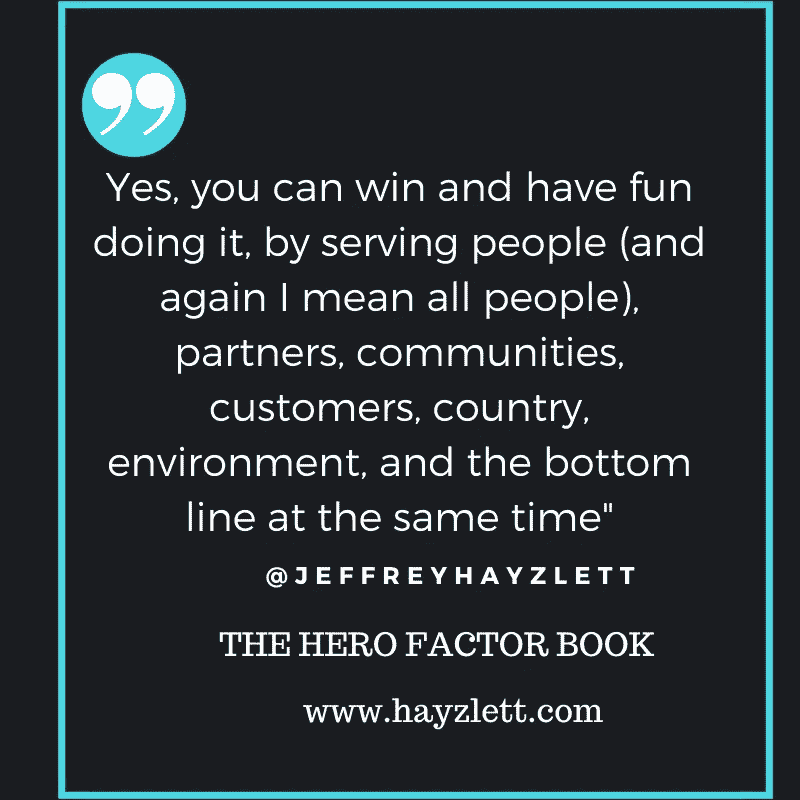
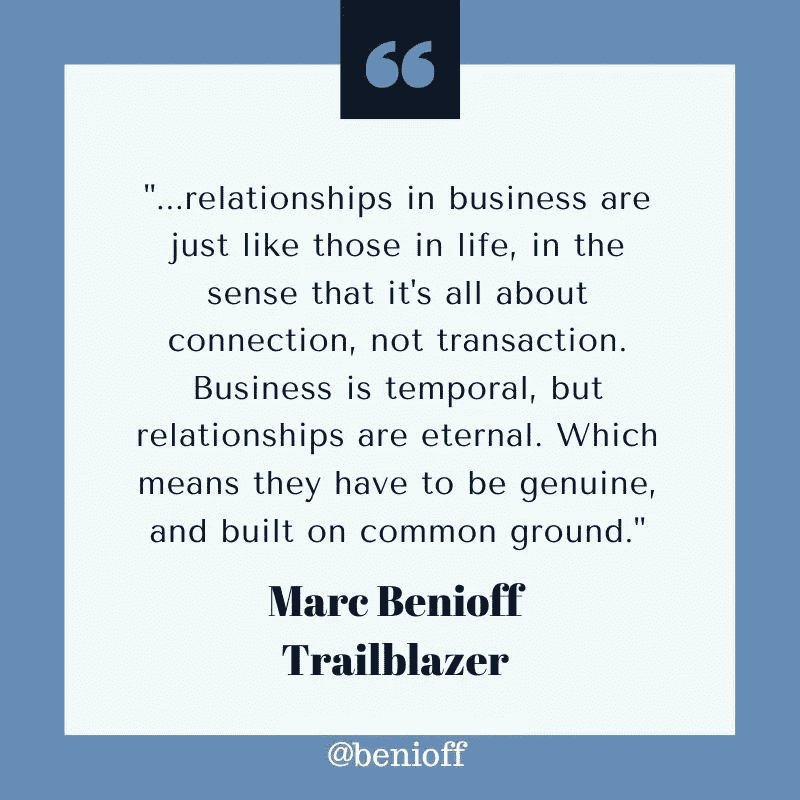
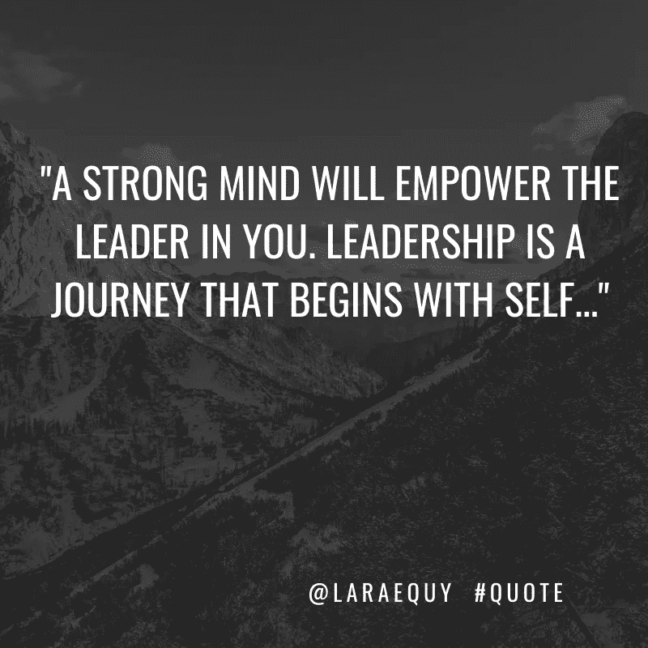
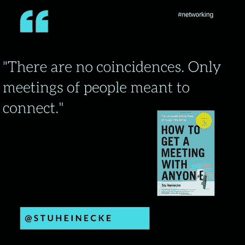

# 当你尽最大努力时，关系网就会扩大

> 原文：<https://medium.datadriveninvestor.com/networks-grow-when-you-give-your-best-c6fc1918ed1a?source=collection_archive---------2----------------------->

Modoulamin and his family of Gambia, West Africa, are among many beneficiaries of social networking.

工作关系和建立关系不会凭空发生。把熟人变成长久的友谊，需要各方的努力和付出。

[社交媒体审查员](https://twitter.com/smexaminer)的珍·科尔帮助将互动变成了一种有益的商业模式。

“我们真的努力尽可能及时地回应每一个评论或提及，”她说。“我们喜欢尽可能保持联系。”

这就是精通社交媒体从业者的生活，比如数字营销顾问杰夫·希恩和数字营销专家马达琳·斯克拉。他们谈到了成功的关系建立，尤其是在 Twitter 上。

“最好能联系到每一个评论和提及，”Sklar 说。"我总是建议人们每天多次查看自己的通知."

即使没有面对面的交流，网上交流也会产生一些基本的事实

“人们从他们认识、喜欢和信任的人那里买东西，”希恩说。“社交媒体有助于促进所有这些领域的发展。

“与没有社交媒体的世界相比，结识他人和发展关系要容易得多，”他说。"如果使用得当，上网是一种很好的生产力提升方式."

 [## 了解、喜欢和信任推动转化和销售

### 赚钱不是社交媒体的首要目标，但这是可以做到的。只要使用机智和明智的方法。

blog.markgrowth.com](https://blog.markgrowth.com/know-like-and-trust-drive-conversion-and-sales-51c791e7c6b6) 

人际关系原则同样适用于个人和职业。

“由于知名度和参与度，社交媒体为你和你的企业提供了竞争优势，”希恩说。“销售漏斗已经改变——翻转——社交媒体关系是解决‘漏斗’交叉点的巨大贡献者。”"

根据 Sprout Social 的调查，76%的受访者更有可能从他们在社交媒体上觉得有联系的品牌购买商品，而不是竞争对手。

# **改变人生的体验**

希恩说:“通过你的转发、评论和其他回复提供的支持，你可能会帮助改变某人的生活。”。“同样，你也可以通过帮助促进他们的事业来帮助人们和他们的家人生存，比如西非冈比亚的 Modoulamin。

希恩说:“你可以通过推特认识在此之前你永远无法‘接触’到的人——从柬埔寨到好莱坞山的那些遥远的国家。”。

他补充说，新的机会“可以根据你发展的关系，为合作、对你的想法或业务的反馈而出现。”

 [## 关系是你最大的投资回报

### 忠诚、推荐和分享体现了关系。它们带来的回报相当于——也许比——金钱更好……

medium.com](https://medium.com/datadriveninvestor/relationships-are-your-greatest-return-on-investment-8b0c254281b5) 

Sklar 强调不要忽视社交媒体的最初目的。

“这是为了社交，”她说。“如果你没有利用这些平台作为与他人交往和建立新关系的机会，你真的会错失良机。

“通过建立关系，你可以发展自己的品牌，为你所做的工作赢得更多关注，”她说。"这些关系可以为你的业务、合作、友谊等带来潜在客户."

与其他场所相比，Twitter 是一个建立网络和建立关系的理想平台。

“Twitter 为各行各业的几乎所有人提供了访问途径，”希恩说。“世界是你在 Twitter 上的网络。它是实时和互动的。你可以通过他们的励志名言来提升他人，比如与[莎拉·克罗斯曼·沙利文](https://twitter.com/SarahCrossmanSu)

希恩通过链接到[他们的 TEDx 演讲](https://www.youtube.com/watch?v=Fe1z22_Qd9E)来宣传其他人，比如[Darria Long Gillespie](https://twitter.com/DrDarria/)博士，并引用了 [Jeffrey Hayzlett](https://twitter.com/JeffreyHayzlett/) 的书，以及他们与商业和大学演讲的链接，包括[生活方式医学](https://www.youtube.com/watch?v=aSv6-jvT02M#TwitterSmarter)先驱[Beth Frates 博士](https://twitter.com/BethFratesMD)。

# **休闲和高效**

“Twitter 是一个理想的网络平台，因为在那里开始对话非常容易，”Sklar 说。“人们乐于与他人交往。如果你加入到别人的谈话中，这很酷。此外，实时聊天在这个平台上毫不费力地进行。”

从一开始，就与你的目标受众建立关系网。具体来说，希恩推荐那些活跃在 Twitter 上的人。

“与你所在行业、目标市场或你有兴趣学习新事物的领域的思想领袖或有影响力的人联系，”他说。“找到你感兴趣的人。

“这些人是你遇到过的，你知道你可能会帮助他们，”希恩说。“通过评论他们的推文、转发等方式在推特上传播他们的信息。”

由此，Sklar 建议拓宽视野。

“和你感兴趣的人交往，”她说。“如果有人在分享精彩的内容，而你喜欢他们正在做的工作，不要害怕伸出手去和他们打招呼。”

 [## 像对待比萨饼一样重视内容

### 无论是在她的数字营销机构高层发号施令，还是权衡比萨饼的优点，杰西卡·菲格罗亚…

medium.com](https://medium.com/datadriveninvestor/value-content-as-you-would-a-pizza-7b2111b67640) 

这个简单的行为在 Twitter 上开启了巨大的社交机会。

“研究与你的目标受众相关的标签，加入‘对话’，”希恩说。“从你读过的书中贴出有意义的引文，这些引文来自你想了解的作者以及你的读者可能会感兴趣的人。以[销售团队](https://twitter.com/salesforce/)的[马克·贝尼奥夫](https://twitter.com/Benioff/)为例

希恩还有其他社交提示:

*   通过 Twitter 感谢某人在 LinkedIn 上的支持、推荐或联系。
*   加入 Twitter 聊天，与志同道合的人交流。
*   追随同行业其他人的追随者。这些人通常对你的产品或服务感兴趣。

Sklar 说:“参与 Twitter 聊天是一种很棒的开始社交的方式。“这些聊天将世界各地志同道合的人聚集在一起，他们乐于与他人交流。太完美了。”

# **评估你的进度**

如果你是营销人员，你会想衡量你的网络活动的成功。

“寻求与人接触，”希恩说。注意你网站的点击。发展超越交易的关系。你实际上成为了一个真正的朋友。”

有计划地参加活动。

Sklar 说:“为你所做的人际交往设定目标。“一旦你知道你希望实现什么，你就可以相应地跟踪指标。

她说:“观察人们回应的频率会有所帮助。”。"注意这些人是否追随你，或者最终通过加入你的名单或购买某些东西而改变信仰."

 [## 疯狂设定目标背后是有方法的

### 目标设定、目标努力和目标实现让你的事业和个人生活走上成功之路。

blog.markgrowth.com](https://blog.markgrowth.com/theres-method-behind-goal-setting-madness-9a8ba0a96ee1) 

成功的网络需要培育。

“宣传他人和他们的活动，”希恩说。“例如，我会尽最大努力宣传我的同事和演讲者，比如前联邦调查局反间谍官员拉莱·库伊(LaRae Quy)等。”

成为偶遇的火花。

“把志同道合的人介绍给彼此，不管他们可能在哪里，”希恩说。“转发你网络中的人的帖子，并对他们的帖子添加实质性的评论。

“提供符合你的目标受众和网络的内容，”他说。"创建一个“认可”名单，列出那些追随你的人，那些有所作为的人或者你推荐的人."

 [## 伟大的内容走向本土

### 内容营销和原生广告是企业家们的基石，他们想把这个词说出来，并把…

medium.com](https://medium.com/datadriveninvestor/great-content-goes-native-13da8a7ed453) 

齐心协力不做缺席的房东。

Sklar 说:“如果你想培养你的 Twitter 网络，*就在这里。“如果你忽视这个平台，你就没有机会建立这些关系。现身说法，坚持发帖，优先与他人交流。”*

有经验的参与者有效地让他们的网络对他们的内容做出反应。

希恩说:“提供有用的、信息丰富的内容，帮助你的人际网络中的人学习新东西。”“通过发表鼓舞人心、激励人心或信息丰富的名言来激励人们。

“在一致的基础上让人们参与进来，”他说。“在合理的范围内，为对他们有帮助的内容或你发布的内容中提到的人贴上标签。”

# **寻找并找到金块**

害羞是人际交往的祸根。

Sklar 说:“当你想为你的内容生成更多的回复时，只需*问*就没什么坏处了。”“鼓励人们用一个简单的行动号召来回应，要求他们分享他们的想法和意见。

“一旦你收到人们的回复，不要忽视它，”她说。“确保你花时间回复，因为这有助于培养这些关系。这也向人们表明，你真的在倾听，你在乎。”

Sklar 有基本的网络指南:

*   持续发帖以保持你的账户活跃。它让人们有更多的机会接触你的内容。
*   寻找感兴趣的客户并开始对话。不要等他们来找你。
*   不要忽视你收到的回复。花时间和那些给你写信的人交流。
*   不要安排内容然后走开。全天检查，寻找建立联系的新机会。

过度思考会阻碍互动。

“让联系发生，”希恩说。“这可能是天意。你永远不知道。斯图·海内克说得很有道理。

希恩建议将 Twitter 对话转移到 LinkedIn、电子邮件、电话、虚拟会面或面对面会议。

“知道你为什么，”他说。“你是谁？你给你的观众提供了什么价值？确保你的“为什么”清楚地反映在一份包含照片的强有力的简介中。描述你做什么，链接到一个网站或 LinkedIn 个人资料和城市信息。

“对你在 Twitter 上做的事情有一个策略和计划，”希恩说。"如果你不小心的话，它可能会成为一台‘无处可去的跑步机’。"

 [## 慷慨的礼物不断给予

### 一个简单的善举可以给另一个人带来巨大的快乐。培养人们的慷慨精神…

medium.com](https://medium.com/datadriveninvestor/generositys-gift-keeps-giving-155adfc5dd54) 

感恩对于任何社交策略都是必不可少的。

“记住那些过去帮助过你的人，”希恩说。“在社交媒体上支持和认可他们。无论你做什么，不要忽视或保持沉默。

“感谢人们的评论，喜欢和其他，”他说。“要真诚。如果可能的话，加入个人评论。个性化是关键，即使只是问他们住的地方怎么样。“在‘说话’之前先听，就像你在销售情况下会做的那样。”

除了推特，希恩还在 T2 的 LinkedIn 和 Instagram 上建立联系和网络。

**关于作者**

吉姆·卡扎曼是拉戈金融服务公司的经理，曾在空军和联邦政府的公共事务部门工作。你可以在[推特](https://twitter.com/JKatzaman)、[脸书](https://www.facebook.com/jim.katzaman)和 [LinkedIn](https://www.linkedin.com/in/jim-katzaman-33641b21/) 上和他联系。