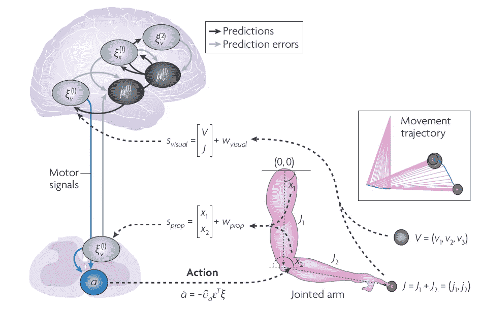

# 神经进化和达尔文主义

> 原文：<https://medium.datadriveninvestor.com/neural-evolution-and-darwinism-ae061aee22d9?source=collection_archive---------26----------------------->

如果进化不是我们作为人类文明在自然界中经历和发现的现象，我也不会写这篇文章。我相信这个星球上最复杂的算法是进化，它没有明确的目标，但仍然在进步，创造新的生物，给生态系统带来新的变化。这可能与肯尼斯·斯坦利的开放结尾算法的工作有关，即[诗人](https://eng.uber.com/enhanced-poet-machine-learning/)。

同样，我们也有神经进化的理论。大脑的内部模型如何随着环境的相互作用而进化，并学会成为自身的 2.0 版本。这就像神经 CI-CD 管道或神经 DevOps。

[理论中所发生的**神经元群选择**](https://onlinelibrary.wiley.com/doi/pdf/10.1111/j.1469-8749.2000.tb00687.x#:~:text=Edelman%20recently%20developed%20a%20new,(NGST)24%E2%80%9326.&text=NGST%20states%20that%20development%20starts,consisting%20of%20multiple%20neuronal%20groups.) ，神经元集合体就形成了。该理论有四个要素:表观遗传机制创建了神经元连接的初级库，这些初级库通过经验依赖的可塑性进行精炼，以产生次级神经元群。这些子群利用[重入信号](https://en.wikipedia.org/wiki/Reentry_(neural_circuitry))纠缠和维持。因此，发生的是神经认知触发，将有一个神经元群的子群被触发来处理特定的刺激，哪个子群被触发是基于被称为[神经调节递质系统](https://en.wikipedia.org/wiki/Neuromodulation)的概念，由价值函数驱动。

## 神经达尔文主义

它奠定了神经元群的元选择机制，这非常类似于剪枝方法之后网络中网络的概念，剪枝方法在被称为[彩票假设](https://arxiv.org/pdf/1803.03635.pdf)的论文中被广泛探索。亚神经群的选择高度依赖于自然选择或选择压力。这一理论，尤其是价值相关学习，与工程中的强化学习和相关方法有着深刻的联系，如[时间差异模型](https://deepmind.com/blog/article/Dopamine-and-temporal-difference-learning-A-fruitful-relationship-between-neuroscience-and-AI)。这是因为神经价值系统加强了与自身的联系，从而使大脑能够将一种感官状态标记为有价值，当且仅当它导致另一种有价值的状态。这意味着神经元亚群的选择只能在渐进状态下进行。**因此，大脑试图移动到最小感知惊讶的状态，这与自由能原理的优化有关。**

神经达尔文主义和自由能原理都试图在进化的背景下理解个体的身体变化:神经达尔文主义诉诸于选择性过程，而自由能公式从熵和惊奇的角度考虑总体或群体动态的优化。

## 适应性大脑——自由能原理

价值是基于强化学习和最佳控制的大脑功能的核心。这种行为可以在计算神经科学、时间差异机器学习中找到，在经济学领域被称为效用理论。成本是一个关键的标准，它规定了与遵循特定政策的代理人所钦佩的状态之间的距离。策略的优化降低了代理的实际状态与代理的理想状态之间的距离，优化过程由最优控制理论形成，即[贝尔曼方程](https://towardsdatascience.com/the-bellman-equation-59258a0d3fa7)。

由自由能定义的自由能是最优策略成本的上限，该最优策略用于执行使回报最大化的行动。就感觉状态而言，最佳策略可以由对感觉状态运动的预先期望来规定。这些先验构成了局部最小值，代理可能会被卡住。

最优控制和决策(博弈)理论从成本或效用的概念开始，并试图构建状态的价值函数，该函数随后指导行动。自由能公式始于对状态值的自由能限制，这是由隐藏环境状态的运动先验确定的。这些先验可以包含任何代价函数，以确保避免代价高昂的状态。具有最小成本的状态可以根据对运动和随之而来的吸引子的先验期望来设置(通过学习或进化)。

> 在环境中寻找稀疏回报的问题是自然对如何最小化代理状态的熵(平均惊喜或自由能)的问题的解决方案:通过确保它们占据一小组吸引(即回报)状态。

## 适应性感官行为的一个例子

在上面的设置中，手臂由两个关节 J1 和 J2 表示，其中两个关节的连接点是点 x2，它连接到一个动作感觉单元 **a.** 手指的当前单位是 J1 和 J2 的矢量和。因果状态，即引起感觉的物体，目标的位置和亮度，即由具有 3 个分量 v1、v2 和 v3 的 V 表示的绿色球。手臂遵循牛顿力学来展示它的运动。Sprop 是大脑隐藏的感觉输入，即发出关节角度位置信号的本体感受器。视觉传感器输入中的视觉，即关节和 V 矢量。感官错误被传递到更高的大脑水平，以优化隐藏状态(关节)和因果状态(目标)的条件预期，即目标应该距离关节多远，作为赞赏的输出。感官预测也根据能量潜力更新其自身的内部表示，能量潜力由黑线和灰线描绘。蓝线代表来自感觉预测误差单元的运动控制信号，它与动作部件相连。当看着空间中的物体 V 时，关节的运动是有先验的，也就是说，它应该试图拿起它的方式与它在历史上举起物体的方式不同。这些先前的反应定义了对预期的感觉输入的整体功能，而不是导致运动神经元被触发的随意优化。

这将我们带到大脑理论之旅的终点，我们从[自由能原理](https://amit02093.medium.com/mathematical-modelling-of-consciousness-free-energy-principle-b3cbb90f8541)、[贝叶斯大脑假说](https://amit02093.medium.com/bayesian-brain-hypothesis-3554540132d0)、[神经突触信息编码](https://medium.com/datadriveninvestor/neuro-syntapic-efficient-encoding-the-infomax-principle-431d3597f4a2)即 Infomax 原理和[细胞组装理论](https://amit02093.medium.com/neurosynaptic-plasticity-the-cell-assembly-theory-d9a02b706cb)开始。

总的来说，所有的神经功能定理都表明，通过将内部感觉状态更新为导致自由能原理最小化的状态，可以优化对偶然状态的感知，从而精确地模拟具有最小感觉表征的偶然状态。

> **自然是一种令人费解的优化现象，人类是一个有形的梯度向量，沿着进化功能丧失的梯度移动，其全局最小值在永恒深度的超空间中移动。**

## 承认

[https://www . research gate . net/publication/41001209 _ frist on _ KJ _ The _ free-energy _ principle _ a _ unified _ brain _ theory _ Nat _ Rev _ neuro sci _ 11 _ 127-138](https://www.researchgate.net/publication/41001209_Friston_KJ_The_free-energy_principle_a_unified_brain_theory_Nat_Rev_Neurosci_11_127-138)